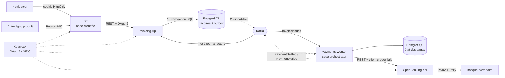

# Forterro Business Services

Plateforme de **services métiers mutualisés** — facturation, open banking, paiements — construite comme un système distribué en .NET 9.

Ce dépôt est un projet de démonstration technique : il implémente de bout en bout, avec du code qui compile, tourne et est testé, l'ensemble des compétences attendues sur un poste de **Senior Software Engineer / Dev Lead** en environnement microservices .NET.

---

## Le problème résolu

Trois services autonomes coopèrent autour d'un processus transactionnel réel :

1. Un client émet une **facture** → l'événement `InvoiceIssued` est publié.
2. Une **saga de paiement** s'ouvre, appelle la banque via une API PSD2, gère les échecs et les reprises.
3. Le résultat (`PaymentSettled` / `PaymentFailed`) remonte et met la facture à jour.

C'est délibérément un domaine où l'à-peu-près coûte cher : un double débit, une facture payée deux fois ou une numérotation avec un trou sont des incidents réels, pas des bugs cosmétiques. Chaque choix d'architecture du dépôt répond à l'un de ces risques.



**Le point clé** : entre l'étape 1 et l'étape 2, il n'y a pas de transaction distribuée. C'est le **pattern Outbox** qui garantit qu'on ne peut jamais annoncer un événement qui n'a pas eu lieu, ni perdre un événement qui a eu lieu.

**Le second point clé** : le BFF fait cohabiter deux publics qui n'ont pas les mêmes menaces. Un écran reçoit un cookie `HttpOnly` — aucun jeton n'atteint le JavaScript, donc une faille XSS n'en vole aucun. Une autre ligne produit envoie son jeton porteur, qui est propagé tel quel avec ses scopes. Voir [ADR 0006](docs/adr/0006-bff-porte-d-entree.md).

### Machine à états de la saga de paiement

```
Started ──▶ AwaitingBank ──▶ Settled
   │             │
   │             ├──▶ AwaitingRetry ──▶ (retour à AwaitingBank)
   │             └──▶ Failed
   └──▶ Aborted (facture annulée avant transmission)
```

### Répartition des bases

| Service | Base | Schéma |
|---|---|---|
| Invoicing.Api | `forterro_invoicing` | `invoicing` |
| Payments.Worker | `forterro_payments` | `payments` |
| OpenBanking.Api | *(aucune — sans état)* | — |
| Intelligence.Api | *(aucune — sans état)* | — |

---

## Couverture des compétences

| Compétence | Où la voir dans le code |
|---|---|
| **C# / .NET 9** | Records, pattern matching, `required`, primary constructors, `IExceptionHandler`, endpoint filters — dans tout le dépôt |
| **Microservices distribués** | 3 services, bases séparées, communication asynchrone par événements |
| **APIs REST sécurisées** | [InvoiceEndpoints.cs](src/Services/Invoicing/Forterro.Invoicing.Api/Endpoints/InvoiceEndpoints.cs), Minimal APIs, ProblemDetails RFC 7807 |
| **Passerelle / BFF** | [Forterro.Bff](src/Gateway/Forterro.Bff/) : YARP, session serveur, agrégation, limitation de débit par appelant |
| **OAuth 2.0 / OpenID Connect** | [OidcAuthenticationExtensions.cs](src/BuildingBlocks/Forterro.BuildingBlocks/Security/OidcAuthenticationExtensions.cs), autorisation par scopes, [Client Credentials](src/Services/Payments/Forterro.Payments.Worker/Infrastructure/ClientCredentialsTokenHandler.cs), [Authorization Code + PKCE](src/Gateway/Forterro.Bff/Authentication/BffAuthentication.cs) |
| **Serveur d'autorisation** | [Realm Keycloak](deploy/keycloak/forterro-realm.json) : scopes, audience, PKCE, service accounts |
| **PostgreSQL** | EF Core 9, `xmin` en concurrence optimiste, index partiels, pagination keyset, SQL brut pour la numérotation |
| **CI/CD GitHub Actions** | [ci.yml](.github/workflows/ci.yml) et [release.yml](.github/workflows/release.yml) : build, tests, audit CVE, CodeQL, Trivy, GitOps |
| **Kubernetes / ArgoCD** | [deploy/k8s/](deploy/k8s/), probes, PDB, HPA, NetworkPolicy, [Ingress + cert-manager](deploy/k8s/base/ingress.yaml), [Application ArgoCD](deploy/argocd/application.yaml) |
| **Composants réutilisables (NuGet)** | **7 paquets** versionnés indépendamment, licence MIT. Trois n'ont **aucune dépendance** ; `Forterro.Contracts` est passé de 67 paquets transitifs à 0. Compatibilité binaire préservée par [TypeForwards.cs](src/BuildingBlocks/Forterro.BuildingBlocks/TypeForwards.cs) |
| **IA — intégration, inférence, orchestration** | [Forterro.Intelligence.Api](src/Services/Intelligence/Forterro.Intelligence.Api/) : couche anti-corruption devant les modèles, **modèle ouvert auto-hébergé** (Apache-2.0), sortie contrainte par schéma JSON, validation métier post-inférence, routage par confiance. Bascule simulateur ↔ modèle réel **par configuration** |
| **Domaines transactionnels** | Facturation EN 16931, IBAN mod-97, PSD2/SEPA, codes de rejet ISO 20022 |

---

## Démarrage

**Prérequis** : .NET 9 SDK, Docker.

```bash
# Toute la pile : PostgreSQL, Kafka (KRaft), Keycloak, Jaeger + les 3 services
docker compose -f deploy/docker-compose.yml up --build
```

| Service | URL |
|---|---|
| **BFF — porte d'entrée** | http://localhost:5000 |
| Invoicing API (Swagger) | http://localhost:5001/swagger |
| Open Banking API | http://localhost:5002/swagger |
| Payments Worker (santé) | http://localhost:5003/health/ready |
| Intelligence API (extraction) | http://localhost:5004/health/ready |
| Keycloak | http://localhost:8080 — `admin` / `admin` |
| Jaeger (traces distribuées) | http://localhost:16686 |

En production, seul le BFF est exposé ; les ports 5001-5003 n'existent ici que pour observer les services individuellement.

### Scénario de bout en bout

Sous Windows, [scripts/e2e.ps1](scripts/e2e.ps1) déroule tout ce qui suit sans `jq` ni `uuidgen`.

```bash
# 1. Obtenir un jeton (flow client credentials, machine à machine).
#    erp-product-line, et non payments-worker : c'est ce client qui porte les scopes
#    invoicing:*. Un jeton payments-worker reçoit un 403 sur les factures — c'est
#    exactement le cloisonnement décrit dans l'ADR 0005.
TOKEN=$(curl -s -X POST http://localhost:8080/realms/forterro/protocol/openid-connect/token \
  -d grant_type=client_credentials \
  -d client_id=erp-product-line \
  -d client_secret=erp-product-line-secret | jq -r .access_token)

# 2. Créer une facture — via le BFF, comme le ferait une autre ligne produit
INVOICE=$(curl -s -X POST http://localhost:5000/api/v1/invoices \
  -H "Authorization: Bearer $TOKEN" \
  -H "Content-Type: application/json" \
  -H "Idempotency-Key: $(uuidgen)" \
  -d '{
    "seller":  {"name":"Forterro France","vatId":"FR12345678901","countryCode":"FR"},
    "buyer":   {"name":"Manufacture Dupont","vatId":"FR98765432109","countryCode":"FR"},
    "currency":"EUR",
    "debtorIban":"FR7630006000011234567890189",
    "dueDate":"2026-12-31",
    "lines":[{"description":"Licence ERP","quantity":2,"unitPriceExclTax":500,"vatRate":0.20}]
  }')

# 3. L'émettre → déclenche toute la chaîne asynchrone
curl -X POST "http://localhost:5000/api/v1/invoices/$(echo $INVOICE | jq -r .id)/issue" \
  -H "Authorization: Bearer $TOKEN"

# 4. Quelques secondes plus tard : facture ET avancement du paiement en UN appel
curl "http://localhost:5000/bff/invoices/$(echo $INVOICE | jq -r .id)/overview" \
  -H "Authorization: Bearer $TOKEN" | jq '{status, paymentAvailability}'
```

Le champ `status` de la réponse est une phrase composée à partir des deux services. `paymentAvailability` vaut ici `forbidden` : `erp-product-line` n'a pas le scope `payments:read`, et l'agrégation le dit au lieu d'échouer.

### Le chemin navigateur

```
http://localhost:5000/bff/login    →  Keycloak (demo / demo)  →  retour avec un cookie de session
http://localhost:5000/bff/me       →  identité et scopes, jamais de jeton
```

Inspectez le cookie dans les outils de développement : il est `HttpOnly`, illisible par `document.cookie`, et ne contient qu'une clé opaque. Les jetons restent côté serveur. Une écriture depuis ce chemin exige l'en-tête `X-Forterro-Csrf` — sans lui, la réponse est un 403.

Ouvrez ensuite **Jaeger** : la trace couvre l'appel HTTP, l'écriture dans l'outbox, la publication Kafka, la saga et l'appel bancaire — un seul `traceId` traverse les trois services.

**IBAN réservés du simulateur** — tous valides au modulo 97, ils testent les chemins d'échec *métier*, pas la validation de format :

| IBAN débiteur | Comportement |
|---|---|
| `FR7630006000011234567890189` | Virement exécuté → facture `paid` |
| `FR7630004000031234567890143` | Provision insuffisante (ISO 20022 `AM04`) → rejet définitif, facture `paymentFailed` |
| `FR1420041010050500013M02606` | Banque indisponible (503) → **la saga replanifie** avec backoff exponentiel |

Les trois sont définis dans [SimulatedBankConnector](src/Services/OpenBanking/Forterro.OpenBanking.Api/Bank/SimulatedBankConnector.cs). Le comportement dépend de l'IBAN et non d'un tirage aléatoire : les scénarios sont reproductibles.

---

## Tests

```bash
dotnet test
```

**107 tests**, dont 16 tests d'intégration sur un **vrai PostgreSQL** lancé par Testcontainers — pas de provider InMemory, qui ne connaît ni les transactions, ni les contraintes d'unicité, ni `xmin`.

Ce que les tests verrouillent réellement :

- l'événement `InvoiceIssued` atterrit dans l'outbox **dans la même transaction** que le changement d'état ;
- une clé d'idempotence rejouée renvoie la première réponse, et une clé réutilisée avec un corps différent est refusée ;
- la numérotation des factures est **continue, sans trou** (exigence légale) ;
- deux tentatives de paiement n'utilisent jamais la même clé d'idempotence bancaire, mais une tentative rejouée conserve la sienne ;
- une saga ne rejoue pas indéfiniment : au-delà du plafond, elle échoue visiblement ;
- une annulation après transmission de l'ordre exige une intervention humaine — et le dit ;
- une écriture par cookie sans en-tête anti-CSRF est refusée, alors qu'un appel machine par jeton porteur n'a pas à en fournir ;
- un `returnUrl` pointant hors du site est ignoré : le BFF ne sert pas de tremplin à une redirection ouverte ;
- l'agrégation reste exploitable quand le service de paiement est en panne ou hors des droits de l'appelant.

---

## Structure

```
src/
├── Gateway/Forterro.Bff/                     → porte d'entrée unique
│   ├── Authentication/  cookie + PKCE, session serveur, rafraîchissement
│   ├── Endpoints/       login/logout/me, agrégation
│   ├── Proxy/           transformations YARP, propagation du jeton
│   ├── RateLimiting/    quotas par client_id ou par session
│   └── Security/        anti-CSRF
├── BuildingBlocks/                           → 6 paquets NuGet, versionnés séparément
│   ├── Forterro.Messaging.Abstractions/  contrats de messagerie      0 dépendance
│   ├── Forterro.Diagnostics/             ActivitySource, métriques   0 dépendance
│   ├── Forterro.Banking/                 IBAN mod-97                 0 dépendance
│   ├── Forterro.Messaging.Kafka/         producteur, consommateur
│   ├── Forterro.Outbox.EntityFrameworkCore/  écriture transactionnelle, dispatcher
│   └── Forterro.BuildingBlocks/          métapaquet + Api, Observability,
│                                         Persistence, Resilience, Security
├── Contracts/Forterro.Contracts/             → événements versionnés (NuGet)
└── Services/
    ├── Invoicing/      API REST, domaine facturation, outbox
    ├── OpenBanking/    passerelle PSD2, résilience
    ├── Payments/       saga de paiement (orchestration)
    └── Intelligence/   extraction de factures par modèle ouvert, auto-hébergé

tests/     unitaires + intégration Testcontainers
deploy/    docker-compose, Keycloak, Kubernetes, ArgoCD
docs/adr/  décisions d'architecture et leurs raisons
```

---

## Décisions d'architecture

Les choix structurants sont documentés — avec leurs contreparties, pas seulement leurs avantages :

- [ADR 0001 — Pattern Outbox plutôt que publication directe](docs/adr/0001-pattern-outbox.md)
- [ADR 0002 — Saga orchestrée plutôt que chorégraphiée](docs/adr/0002-saga-orchestree.md)
- [ADR 0003 — Une base de données par service](docs/adr/0003-base-par-service.md)
- [ADR 0004 — Contrats partagés dans un paquet versionné](docs/adr/0004-contrats-partages.md)
- [ADR 0005 — Autorisation par scopes OAuth 2.0](docs/adr/0005-autorisation-par-scopes.md)
- [ADR 0006 — Un BFF comme porte d'entrée, avec deux schémas d'authentification](docs/adr/0006-bff-porte-d-entree.md)
- [ADR 0007 — Logs centralisés dans Elastic, corrélés par trace](docs/adr/0007-logs-centralises-elk.md)
- [ADR 0008 — Extraction de factures par modèle, derrière une couche anti-corruption](docs/adr/0008-extraction-de-factures-par-modele.md)

---

## Ce que ce projet ne fait pas

Par honnêteté technique, les limites assumées :

- **Pas de schema registry** (Avro/Protobuf). Les contrats sont en JSON avec un nom logique versionné. Pour un vrai déploiement multi-équipes, un registre avec vérification de compatibilité serait la suite logique.
- **La compensation d'un virement exécuté n'est pas automatique.** Un virement SEPA parti ne s'annule pas unilatéralement : la saga marque `compensation_required` et exige une intervention. C'est la réalité du domaine, pas une lacune du code.
- **La banque est simulée.** Le connecteur HTTP suit le dialecte Berlin Group, mais aucune intégration réelle n'est branchée.
- **Facturation électronique** : le modèle est aligné EN 16931, mais la génération Factur-X et l'émission Peppol ne sont pas implémentées.
- **Aucun frontal.** Le chemin navigateur du BFF est complet et testé, mais rien ne le consomme : il se vérifie au navigateur ou au client HTTP, pas dans une application.
- **Le BFF a besoin de Redis en production.** Sessions et clés de protection des données. En développement il se rabat sur la mémoire, ce qui ne tient pas au-delà d'un seul process.
- **Pas de déconnexion propagée (back-channel logout).** Fermer la session Keycloak depuis un autre client ne ferme pas celle du BFF avant l'expiration du jeton.
- **Le rafraîchissement concurrent n'est pas verrouillé.** Sans risque avec le réglage Keycloak par défaut ; activer la rotation des refresh tokens exigerait un verrou distribué.
