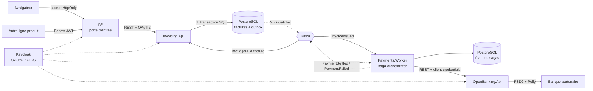

# Forterro Business Services — Le système complet

> Document unique et autonome. Il regroupe **toute** la documentation du dépôt
> (README, 8 ADR, environnement local GitOps, architecture, déploiement, tests)
> **et l'intégralité du code source**.
> Généré depuis le dépôt `forterro-test` — .NET 9.

---

## Sommaire

**Partie I — Le système**
1. [Le problème résolu](#le-problème-résolu)
2. [Couverture des compétences](#couverture-des-compétences)
3. [Démarrage](#démarrage)
4. [Tests](#tests)
5. [Structure](#structure)
6. [Décisions d'architecture](#décisions-darchitecture)
7. [Ce que ce projet ne fait pas](#ce-que-ce-projet-ne-fait-pas)
8. [Défauts connus, révélés par un déploiement réel](#défauts-connus-révélés-par-un-déploiement-réel)

**Partie II — Décisions d'architecture (ADR intégrés)**
9. [ADR 0001 — Pattern Outbox plutôt que publication directe](#adr-0001--pattern-outbox-plutôt-que-publication-directe)
10. [ADR 0002 — Saga orchestrée plutôt que chorégraphiée](#adr-0002--saga-orchestrée-plutôt-que-chorégraphiée)
11. [ADR 0003 — Une base de données par service](#adr-0003--une-base-de-données-par-service)
12. [ADR 0004 — Contrats partagés dans un paquet versionné](#adr-0004--contrats-partagés-dans-un-paquet-versionné)
13. [ADR 0005 — Autorisation par scopes OAuth 2.0](#adr-0005--autorisation-par-scopes-oauth-20)
14. [ADR 0006 — Un BFF comme porte d'entrée, avec deux schémas d'authentification](#adr-0006--un-bff-comme-porte-dentrée-avec-deux-schémas-dauthentification)
15. [ADR 0007 — Logs centralisés dans Elastic, corrélés par trace](#adr-0007--logs-centralisés-dans-elastic-corrélés-par-trace)
16. [ADR 0008 — Extraction de factures par modèle, derrière une couche anti-corruption](#adr-0008--extraction-de-factures-par-modèle-derrière-une-couche-anti-corruption)

**Partie III — Déploiement local : Kubernetes + ArgoCD**
17. [ArgoCD en local (k3d)](#argocd-en-local-k3d) — accès, remontage depuis zéro, boucle GitOps vérifiée, logs centralisés, pièges

**Partie IV — Code source intégral**
18. [Racine de la solution](#racine-de-la-solution)
19. [Contracts — événements versionnés](#contracts--événements-versionnés)
20. [BuildingBlocks — paquet transverse](#buildingblocks--paquet-transverse)
21. [Gateway — Forterro.Bff](#gateway--forterrobff)
22. [Service Invoicing](#service-invoicing)
23. [Service OpenBanking](#service-openbanking)
24. [Service Payments](#service-payments)
25. [Service Intelligence](#service-intelligence)
26. [Tests](#tests-code)
27. [Déploiement](#déploiement)
28. [CI/CD & scripts](#cicd--scripts)

---
---

# Partie I — Le système


Plateforme de **services métiers mutualisés** — facturation, open banking, paiements — construite comme un système distribué en .NET 9.

Ce dépôt est un projet de démonstration technique : il implémente de bout en bout, avec du code qui compile, tourne et est testé, l'ensemble des compétences attendues sur un poste de **Senior Software Engineer / Dev Lead** en environnement microservices .NET.

---

## Le problème résolu

Trois services autonomes coopèrent autour d'un processus transactionnel réel :

1. Un client émet une **facture** → l'événement `InvoiceIssued` est publié.
2. Une **saga de paiement** s'ouvre, appelle la banque via une API PSD2, gère les échecs et les reprises.
3. Le résultat (`PaymentSettled` / `PaymentFailed`) remonte et met la facture à jour.

C'est délibérément un domaine où l'à-peu-près coûte cher : un double débit, une facture payée deux fois ou une numérotation avec un trou sont des incidents réels, pas des bugs cosmétiques. Chaque choix d'architecture du dépôt répond à l'un de ces risques.



**Le point clé** : entre l'étape 1 et l'étape 2, il n'y a pas de transaction distribuée. C'est le **pattern Outbox** qui garantit qu'on ne peut jamais annoncer un événement qui n'a pas eu lieu, ni perdre un événement qui a eu lieu.

**Le second point clé** : le BFF fait cohabiter deux publics qui n'ont pas les mêmes menaces. Un écran reçoit un cookie `HttpOnly` — aucun jeton n'atteint le JavaScript, donc une faille XSS n'en vole aucun. Une autre ligne produit envoie son jeton porteur, qui est propagé tel quel avec ses scopes. Voir [ADR 0006](#adr-0006--un-bff-comme-porte-dentrée-avec-deux-schémas-dauthentification).

### Machine à états de la saga de paiement

```
Started ──▶ AwaitingBank ──▶ Settled
   │             │
   │             ├──▶ AwaitingRetry ──▶ (retour à AwaitingBank)
   │             └──▶ Failed
   └──▶ Aborted (facture annulée avant transmission)
```

### Répartition des bases

| Service | Base | Schéma |
|---|---|---|
| Invoicing.Api | `forterro_invoicing` | `invoicing` |
| Payments.Worker | `forterro_payments` | `payments` |
| OpenBanking.Api | *(aucune — sans état)* | — |
| Intelligence.Api | *(aucune — sans état)* | — |

---

## Couverture des compétences

| Compétence | Où la voir dans le code |
|---|---|
| **C# / .NET 9** | Records, pattern matching, `required`, primary constructors, `IExceptionHandler`, endpoint filters — dans tout le dépôt |
| **Microservices distribués** | 3 services, bases séparées, communication asynchrone par événements |
| **APIs REST sécurisées** | [InvoiceEndpoints.cs](src/Services/Invoicing/Forterro.Invoicing.Api/Endpoints/InvoiceEndpoints.cs), Minimal APIs, ProblemDetails RFC 7807 |
| **Passerelle / BFF** | [Forterro.Bff](src/Gateway/Forterro.Bff/) : YARP, session serveur, agrégation, limitation de débit par appelant |
| **OAuth 2.0 / OpenID Connect** | [OidcAuthenticationExtensions.cs](src/BuildingBlocks/Forterro.BuildingBlocks/Security/OidcAuthenticationExtensions.cs), autorisation par scopes, [Client Credentials](src/Services/Payments/Forterro.Payments.Worker/Infrastructure/ClientCredentialsTokenHandler.cs), [Authorization Code + PKCE](src/Gateway/Forterro.Bff/Authentication/BffAuthentication.cs) |
| **Serveur d'autorisation** | [Realm Keycloak](deploy/keycloak/forterro-realm.json) : scopes, audience, PKCE, service accounts |
| **PostgreSQL** | EF Core 9, `xmin` en concurrence optimiste, index partiels, pagination keyset, SQL brut pour la numérotation |
| **CI/CD GitHub Actions** | [ci.yml](.github/workflows/ci.yml) et [release.yml](.github/workflows/release.yml) : build, tests, audit CVE, CodeQL, Trivy, GitOps |
| **Kubernetes / ArgoCD** | [deploy/k8s/](deploy/k8s/), probes, PDB, HPA, NetworkPolicy, [Ingress + cert-manager](deploy/k8s/base/ingress.yaml), [Application ArgoCD](deploy/argocd/application.yaml) |
| **Composants réutilisables (NuGet)** | **7 paquets** versionnés indépendamment, licence MIT. Trois n'ont **aucune dépendance** ; `Forterro.Contracts` est passé de 67 paquets transitifs à 0. Compatibilité binaire préservée par [TypeForwards.cs](src/BuildingBlocks/Forterro.BuildingBlocks/TypeForwards.cs) |
| **IA — intégration, inférence, orchestration** | [Forterro.Intelligence.Api](src/Services/Intelligence/Forterro.Intelligence.Api/) : couche anti-corruption devant les modèles, **modèle ouvert auto-hébergé** (Apache-2.0), sortie contrainte par schéma JSON, validation métier post-inférence, routage par confiance. Bascule simulateur ↔ modèle réel **par configuration** |
| **Domaines transactionnels** | Facturation EN 16931, IBAN mod-97, PSD2/SEPA, codes de rejet ISO 20022 |

---

## Démarrage

**Prérequis** : .NET 9 SDK, Docker.

```bash
# Toute la pile : PostgreSQL, Kafka (KRaft), Keycloak, Jaeger + les 3 services
docker compose -f deploy/docker-compose.yml up --build
```

| Service | URL |
|---|---|
| **BFF — porte d'entrée** | http://localhost:5000 |
| Invoicing API (Swagger) | http://localhost:5001/swagger |
| Open Banking API | http://localhost:5002/swagger |
| Payments Worker (santé) | http://localhost:5003/health/ready |
| Intelligence API (extraction) | http://localhost:5004/health/ready |
| Keycloak | http://localhost:8080 — `admin` / `admin` |
| Jaeger (traces distribuées) | http://localhost:16686 |

En production, seul le BFF est exposé ; les ports 5001-5003 n'existent ici que pour observer les services individuellement.

### Scénario de bout en bout

Sous Windows, [scripts/e2e.ps1](scripts/e2e.ps1) déroule tout ce qui suit sans `jq` ni `uuidgen`.

```bash
# 1. Obtenir un jeton (flow client credentials, machine à machine).
#    erp-product-line, et non payments-worker : c'est ce client qui porte les scopes
#    invoicing:*. Un jeton payments-worker reçoit un 403 sur les factures — c'est
#    exactement le cloisonnement décrit dans l'ADR 0005.
TOKEN=$(curl -s -X POST http://localhost:8080/realms/forterro/protocol/openid-connect/token \
  -d grant_type=client_credentials \
  -d client_id=erp-product-line \
  -d client_secret=erp-product-line-secret | jq -r .access_token)

# 2. Créer une facture — via le BFF, comme le ferait une autre ligne produit
INVOICE=$(curl -s -X POST http://localhost:5000/api/v1/invoices \
  -H "Authorization: Bearer $TOKEN" \
  -H "Content-Type: application/json" \
  -H "Idempotency-Key: $(uuidgen)" \
  -d '{
    "seller":  {"name":"Forterro France","vatId":"FR12345678901","countryCode":"FR"},
    "buyer":   {"name":"Manufacture Dupont","vatId":"FR98765432109","countryCode":"FR"},
    "currency":"EUR",
    "debtorIban":"FR7630006000011234567890189",
    "dueDate":"2026-12-31",
    "lines":[{"description":"Licence ERP","quantity":2,"unitPriceExclTax":500,"vatRate":0.20}]
  }')

# 3. L'émettre → déclenche toute la chaîne asynchrone
curl -X POST "http://localhost:5000/api/v1/invoices/$(echo $INVOICE | jq -r .id)/issue" \
  -H "Authorization: Bearer $TOKEN"

# 4. Quelques secondes plus tard : facture ET avancement du paiement en UN appel
curl "http://localhost:5000/bff/invoices/$(echo $INVOICE | jq -r .id)/overview" \
  -H "Authorization: Bearer $TOKEN" | jq '{status, paymentAvailability}'
```

Le champ `status` de la réponse est une phrase composée à partir des deux services. `paymentAvailability` vaut ici `forbidden` : `erp-product-line` n'a pas le scope `payments:read`, et l'agrégation le dit au lieu d'échouer.

### Le chemin navigateur

```
http://localhost:5000/bff/login    →  Keycloak (demo / demo)  →  retour avec un cookie de session
http://localhost:5000/bff/me       →  identité et scopes, jamais de jeton
```

Inspectez le cookie dans les outils de développement : il est `HttpOnly`, illisible par `document.cookie`, et ne contient qu'une clé opaque. Les jetons restent côté serveur. Une écriture depuis ce chemin exige l'en-tête `X-Forterro-Csrf` — sans lui, la réponse est un 403.

Ouvrez ensuite **Jaeger** : la trace couvre l'appel HTTP, l'écriture dans l'outbox, la publication Kafka, la saga et l'appel bancaire — un seul `traceId` traverse les trois services.

**IBAN réservés du simulateur** — tous valides au modulo 97, ils testent les chemins d'échec *métier*, pas la validation de format :

| IBAN débiteur | Comportement |
|---|---|
| `FR7630006000011234567890189` | Virement exécuté → facture `paid` |
| `FR7630004000031234567890143` | Provision insuffisante (ISO 20022 `AM04`) → rejet définitif, facture `paymentFailed` |
| `FR1420041010050500013M02606` | Banque indisponible (503) → **la saga replanifie** avec backoff exponentiel |

Les trois sont définis dans [SimulatedBankConnector](src/Services/OpenBanking/Forterro.OpenBanking.Api/Bank/SimulatedBankConnector.cs). Le comportement dépend de l'IBAN et non d'un tirage aléatoire : les scénarios sont reproductibles.

---

## Tests

```bash
dotnet test
```

**107 tests**, dont 16 tests d'intégration sur un **vrai PostgreSQL** lancé par Testcontainers — pas de provider InMemory, qui ne connaît ni les transactions, ni les contraintes d'unicité, ni `xmin`.

Ce que les tests verrouillent réellement :

- l'événement `InvoiceIssued` atterrit dans l'outbox **dans la même transaction** que le changement d'état ;
- une clé d'idempotence rejouée renvoie la première réponse, et une clé réutilisée avec un corps différent est refusée ;
- la numérotation des factures est **continue, sans trou** (exigence légale) ;
- deux tentatives de paiement n'utilisent jamais la même clé d'idempotence bancaire, mais une tentative rejouée conserve la sienne ;
- une saga ne rejoue pas indéfiniment : au-delà du plafond, elle échoue visiblement ;
- une annulation après transmission de l'ordre exige une intervention humaine — et le dit ;
- une écriture par cookie sans en-tête anti-CSRF est refusée, alors qu'un appel machine par jeton porteur n'a pas à en fournir ;
- un `returnUrl` pointant hors du site est ignoré : le BFF ne sert pas de tremplin à une redirection ouverte ;
- l'agrégation reste exploitable quand le service de paiement est en panne ou hors des droits de l'appelant.

---

## Structure

```
src/
├── Gateway/Forterro.Bff/                     → porte d'entrée unique
│   ├── Authentication/  cookie + PKCE, session serveur, rafraîchissement
│   ├── Endpoints/       login/logout/me, agrégation
│   ├── Proxy/           transformations YARP, propagation du jeton
│   ├── RateLimiting/    quotas par client_id ou par session
│   └── Security/        anti-CSRF
├── BuildingBlocks/                           → 6 paquets NuGet, versionnés séparément
│   ├── Forterro.Messaging.Abstractions/  contrats de messagerie      0 dépendance
│   ├── Forterro.Diagnostics/             ActivitySource, métriques   0 dépendance
│   ├── Forterro.Banking/                 IBAN mod-97                 0 dépendance
│   ├── Forterro.Messaging.Kafka/         producteur, consommateur
│   ├── Forterro.Outbox.EntityFrameworkCore/  écriture transactionnelle, dispatcher
│   └── Forterro.BuildingBlocks/          métapaquet + Api, Observability,
│                                         Persistence, Resilience, Security
├── Contracts/Forterro.Contracts/             → événements versionnés (NuGet)
└── Services/
    ├── Invoicing/      API REST, domaine facturation, outbox
    ├── OpenBanking/    passerelle PSD2, résilience
    ├── Payments/       saga de paiement (orchestration)
    └── Intelligence/   extraction de factures par modèle ouvert, auto-hébergé

tests/     unitaires + intégration Testcontainers
deploy/    docker-compose, Keycloak, Kubernetes, ArgoCD
docs/adr/  décisions d'architecture et leurs raisons
```

---

## Décisions d'architecture

Les choix structurants sont documentés — avec leurs contreparties, pas seulement leurs avantages :

- [ADR 0001 — Pattern Outbox plutôt que publication directe](#adr-0001--pattern-outbox-plutôt-que-publication-directe)
- [ADR 0002 — Saga orchestrée plutôt que chorégraphiée](docs/adr/0002-saga-orchestree.md)
- [ADR 0003 — Une base de données par service](docs/adr/0003-base-par-service.md)
- [ADR 0004 — Contrats partagés dans un paquet versionné](docs/adr/0004-contrats-partages.md)
- [ADR 0005 — Autorisation par scopes OAuth 2.0](docs/adr/0005-autorisation-par-scopes.md)
- [ADR 0006 — Un BFF comme porte d'entrée, avec deux schémas d'authentification](#adr-0006--un-bff-comme-porte-dentrée-avec-deux-schémas-dauthentification)
- [ADR 0007 — Logs centralisés dans Elastic, corrélés par trace](docs/adr/0007-logs-centralises-elk.md)
- [ADR 0008 — Extraction de factures par modèle, derrière une couche anti-corruption](docs/adr/0008-extraction-de-factures-par-modele.md)

---

## Ce que ce projet ne fait pas

Par honnêteté technique, les limites assumées :

- **Pas de schema registry** (Avro/Protobuf). Les contrats sont en JSON avec un nom logique versionné. Pour un vrai déploiement multi-équipes, un registre avec vérification de compatibilité serait la suite logique.
- **La compensation d'un virement exécuté n'est pas automatique.** Un virement SEPA parti ne s'annule pas unilatéralement : la saga marque `compensation_required` et exige une intervention. C'est la réalité du domaine, pas une lacune du code.
- **La banque est simulée.** Le connecteur HTTP suit le dialecte Berlin Group, mais aucune intégration réelle n'est branchée.
- **Facturation électronique** : le modèle est aligné EN 16931, mais la génération Factur-X et l'émission Peppol ne sont pas implémentées.
- **Aucun frontal.** Le chemin navigateur du BFF est complet et testé, mais rien ne le consomme : il se vérifie au navigateur ou au client HTTP, pas dans une application.
- **Le BFF a besoin de Redis en production.** Sessions et clés de protection des données. En développement il se rabat sur la mémoire, ce qui ne tient pas au-delà d'un seul process.
- **Pas de déconnexion propagée (back-channel logout).** Fermer la session Keycloak depuis un autre client ne ferme pas celle du BFF avant l'expiration du jeton.
- **Le rafraîchissement concurrent n'est pas verrouillé.** Sans risque avec le réglage Keycloak par défaut ; activer la rotation des refresh tokens exigerait un verrou distribué.
## Défauts connus, révélés par un déploiement réel

Les manifestes Kubernetes n'avaient jamais été exécutés : le développement se fait en `docker compose`, qui fournit une configuration différente. Un déploiement sur un vrai cluster (voir [partie III](#argocd-en-local-k3d)) a fait apparaître deux défauts que le compose masquait entièrement.

**1. `payments-worker` ne pouvait démarrer sur aucun cluster — CORRIGÉ.**

`Program.cs:71` appelle `AddForterroAuthentication`, qui exige `Oidc__Authority` et `Oidc__Audience` (`[Required]` + `ValidateOnStart`). Le `docker-compose.yml` les fournit ; `base/payments-worker.yaml` ne les fournissait pas. `invoicing-api` et `openbanking-api` les avaient — le worker était le seul oublié, parce qu'il est le seul dont l'OIDC ne sert qu'à *un seul* endpoint (`/sagas`, protégé par `payments:read`), facile à oublier en écrivant le manifeste.

Symptôme : `OptionsValidationException` au démarrage, `CrashLoopBackOff`, en production comme ailleurs. Corrigé dans `base/`.

**2. La base `payments` n'est migrée nulle part — NON CORRIGÉ.**

`base/migration-job.yaml` ne déclare un Job PreSync que pour `invoicing`. Or `Payments.Worker/Program.cs:98` ne migre sa base que sous `IsDevelopment()` — comme `Invoicing`, et c'est le bon choix ([ADR 0003](#adr-0003--une-base-de-données-par-service) : migrations par Job, pas au démarrage des pods). Il manque donc simplement le second Job.

Symptôme en production : le worker démarre, puis échoue à **chaque** cycle d'outbox sur `relation "payments.outbox_messages" does not exist`. Le pod reste `Running` — l'erreur est journalisée, pas fatale — donc rien ne remonte au niveau de Kubernetes.

Correction attendue : un `payments-migration` Job symétrique de l'existant, avec une image produite par `dotnet ef migrations bundle`. L'environnement local le contourne en basculant le service en `Development`, ce qui est explicitement **inacceptable en production** : avec N replicas, N pods migreraient en parallèle.


---
---

## ADR 0001 — Pattern Outbox plutôt que publication directe

**Statut** : accepté
**Date** : 2026-07-21

### Contexte

À l'émission d'une facture, deux choses doivent se produire : l'état passe à `Issued` en base, et l'événement `InvoiceIssued` part sur Kafka pour déclencher la saga de paiement.

Ces deux systèmes n'ont pas de transaction commune. Écrire naïvement :

```csharp
await context.SaveChangesAsync();      // (1)
await publisher.PublishAsync(evt);     // (2)
```

expose à deux pannes symétriques et toutes deux inacceptables :

- **(2) échoue après (1)** — la facture est émise, personne ne le sait, elle ne sera jamais payée. Le bug est silencieux : rien dans les logs ne signale une facture orpheline.
- **Ordre inversé, (1) échoue après (2)** — on a annoncé au reste du système une facture qui n'existe pas. La saga ouvre un paiement contre un identifiant introuvable.

Le commit en deux phases (XA) est écarté : Kafka ne le supporte pas correctement, et il introduit un coordinateur qui devient un point de défaillance et de latence.

### Décision

Adopter le **pattern Outbox**.

L'événement est écrit dans une table `messaging.outbox_messages` **de la base du service**, dans la même transaction que le changement métier. Un `OutboxDispatcher` (BackgroundService) relit cette table et publie sur Kafka.

```csharp
outbox.Enqueue(domainEvent);        // INSERT dans outbox_messages
await context.SaveChangesAsync();   // un seul commit : état + événement
```

Concurrence entre réplicas : un bail (`leased_until`) protégé par un jeton de version. Deux réplicas qui visent le même lot se départagent par un `DbUpdateConcurrencyException` — pas de leader election à maintenir.

### Conséquences

**Ce que ça garantit** — l'atomicité. Il devient impossible d'observer une facture émise sans son événement, ou l'inverse.

**Ce que ça coûte** :

- **Livraison at-least-once, pas exactly-once.** Le dispatcher peut publier puis mourir avant de marquer le message traité. Il republiera. C'est pourquoi le pattern **Inbox** (table `processed_events`) est obligatoire côté consommateur, et pourquoi `Invoice.MarkAsPaid` est idempotent. Les deux protections sont volontairement redondantes.
- **Latence supplémentaire** : jusqu'à un cycle de polling (2 s par défaut) entre le commit et la publication. Acceptable ici ; un flux exigeant du temps réel demanderait du Change Data Capture (Debezium) sur le WAL PostgreSQL.
- **Une table qui grossit.** D'où `OutboxCleanupService` : sans purge, la table d'outbox devient le plus gros objet de la base en quelques mois et dégrade la requête du dispatcher, qui la scanne à chaque cycle.

### Alternatives écartées

- **Publication directe** — rejetée, c'est le problème décrit ci-dessus.
- **CDC / Debezium** — meilleure latence et aucun polling, mais ajoute Kafka Connect à exploiter et couple le contrat de messages au schéma physique des tables. Réévaluable si le volume l'impose.
- **Transactions Kafka** — ne couvrent pas l'écriture PostgreSQL, donc ne résolvent pas le problème posé.

---

## ADR 0002 — Saga orchestrée plutôt que chorégraphiée

**Statut** : accepté
**Date** : 2026-07-21

### Contexte

Le paiement d'une facture traverse trois services et un partenaire externe. Le processus n'est pas linéaire : la banque peut être indisponible (rejouable), refuser pour provision insuffisante (définitif), accepter sans exécuter immédiatement (attente), et la facture peut être annulée en cours de route.

Deux modèles s'offraient à nous.

**Chorégraphie** : chaque service réagit aux événements des autres, sans coordinateur. Simple à démarrer, mais la logique « on a tenté 3 fois, la banque est HS, on abandonne et on compense » se retrouve éclatée entre trois bases de code. Personne ne peut répondre à « où en est le paiement de la facture INV-2026-000042 ? » sans corréler trois journaux.

**Orchestration** : un service détient l'état du processus et décide de l'étape suivante.

### Décision

Orchestration, portée par `PaymentSaga` dans `Payments.Worker`.

L'état est **persisté en base**, pas en mémoire : un redémarrage du worker en plein milieu reprend exactement où il en était. La machine à états est explicite :

```
Started ──▶ AwaitingBank ──▶ Settled
   │             │
   │             ├──▶ AwaitingRetry ──▶ (retour à AwaitingBank)
   │             └──▶ Failed
   └──▶ Aborted (facture annulée avant transmission)
```

Deux points de conception non négociables :

1. **La tentative est persistée AVANT l'appel sortant.** Si le worker meurt pendant l'appel bancaire, on sait qu'une tentative était en cours, et la clé d'idempotence associée (`{sagaId}-{attempt}`) est identique à la reprise. Pas de double débit.
2. **Un planificateur de reprise dédié** (`SagaRetryService`). Kafka a déjà commité l'offset : l'événement ne reviendra jamais. Sans ce planificateur, une saga tombée sur une banque indisponible resterait bloquée pour toujours. C'est le point qu'on oublie le plus souvent en passant à l'asynchrone — le broker livre des messages, il ne rejoue pas de la logique métier.

### Conséquences

**Ce que ça apporte** — un seul endroit pour lire, tester et auditer le processus. La table `payment_sagas` répond directement à « où en est ce paiement, combien de tentatives, pourquoi ça a échoué ».

**Ce que ça coûte** :

- **Un point de couplage.** `Payments.Worker` connaît les étapes du processus. C'est assumé : c'est précisément son rôle. Il ne connaît en revanche ni le schéma de facturation, ni le dialecte de la banque.
- **La compensation a une limite réelle.** Si l'ordre est déjà transmis, un virement SEPA ne s'annule pas unilatéralement. La saga marque alors `compensation_required` et exige une intervention humaine. Le code le dit explicitement plutôt que de faire croire à un rollback automatique — un `try/catch` qui « annule » un virement exécuté serait un mensonge.
- **Le worker doit tourner en plusieurs réplicas** sans se marcher dessus. Résolu par la concurrence optimiste sur `xmin` et l'unicité de `invoice_id`.

### Alternatives écartées

- **Chorégraphie pure** — rejetée pour l'auditabilité.
- **MassTransit State Machine (Automatonymous)** — solide et éprouvé, mais fait disparaître la mécanique derrière un framework. Ici l'implémentation manuelle est délibérée : elle rend visible ce que le framework ferait. Sur un projet réel, MassTransit serait un choix parfaitement défendable.
- **Workflow durable (Temporal, Dapr)** — réponse la plus complète au problème, mais ajoute une brique d'infrastructure lourde à exploiter pour un seul processus métier.

---

## ADR 0003 — Une base de données par service

**Statut** : accepté
**Date** : 2026-07-21

### Contexte

Trois services manipulent des données liées : factures, sagas de paiement, ordres bancaires. La tentation d'une base partagée est forte — les jointures seraient immédiates, il n'y aurait aucune duplication, et la cohérence serait garantie par le SGBD.

Elle est écartée pour une raison précise : une base partagée transforme le schéma en API publique implicite. Ajouter une colonne `NOT NULL` dans `invoices` casse alors le service de paiement qui la lisait. Les services deviennent indissociables au déploiement — c'est un monolithe distribué, qui cumule les coûts des microservices sans leurs bénéfices.

### Décision

Chaque service possède **sa propre base**, avec son propre schéma, et personne d'autre n'y accède :

| Service | Base | Schéma |
|---|---|---|
| Invoicing.Api | `forterro_invoicing` | `invoicing` |
| Payments.Worker | `forterro_payments` | `payments` |
| OpenBanking.Api | *(aucune)* | — |

Les tables Outbox et Inbox vivent **dans la base du service**, pas dans une base de messagerie commune. C'est ce qui rend l'écriture transactionnelle possible.

`OpenBanking.Api` est volontairement **sans état** : c'est une couche anti-corruption devant les API bancaires. L'état du processus appartient à la saga, pas à la passerelle. Un service sans état se réplique, se redémarre et se teste sans précaution particulière.

### Conséquences

**Ce que ça apporte** :

- Chaque service migre son schéma indépendamment, sans coordonner de fenêtre de déploiement.
- Le choix technologique reste ouvert : rien n'empêche un futur service d'utiliser autre chose que PostgreSQL.
- Le rayon d'impact d'un incident est borné.

**Ce que ça coûte** :

- **Aucune jointure entre domaines.** Corréler une facture et son paiement demande deux appels ou une projection. C'est le prix de l'indépendance.
- **Cohérence à terme.** Entre l'émission de la facture et sa mise à jour en « payée », le système est temporairement incohérent. Le domaine l'accepte : un virement SEPA n'est de toute façon pas instantané.
- **Duplication assumée.** `PaymentSaga` recopie le montant et l'IBAN au lieu d'interroger la facturation. Ce n'est pas une erreur de normalisation : la saga doit pouvoir fonctionner même si le service de facturation est indisponible, et le montant à débiter est celui qui était valide **au moment de l'émission**, pas celui d'aujourd'hui.
- **Migrations en Job Kubernetes**, pas au démarrage des pods. Avec N réplicas, N pods tenteraient de migrer simultanément. Le hook `PreSync` d'ArgoCD garantit l'ordre. **Un Job par service** : les bases sont indépendantes, leurs migrations aussi, et l'une ne doit pas rester non migrée parce que l'autre a échoué.

### Alternatives écartées

- **Base partagée** — rejetée, cf. contexte.
- **Un schéma par service dans une base unique** — l'isolation logique est réelle, mais le point de défaillance et la contention restent communs. Envisageable en phase de démarrage pour réduire les coûts, à condition de ne jamais écrire une requête inter-schémas.

---

## ADR 0004 — Contrats partagés dans un paquet versionné

**Statut** : accepté
**Date** : 2026-07-21

### Contexte

`Invoicing.Api` publie `InvoiceIssued`, `Payments.Worker` le consomme. Il faut que les deux s'accordent sur la forme du message, le nom du contrat et le topic.

L'école « partagez rien » recommande que chaque consommateur redéfinisse sa propre vue du message. C'est la bonne réponse quand les services appartiennent à des équipes ou des organisations différentes, avec des cycles de livraison indépendants.

Ce n'est pas notre situation : un monorepo, une équipe Business Services, des services livrés ensemble. Ici, la duplication ne protège de rien et garantit surtout qu'un renommage de champ sera oublié dans un consommateur.

### Décision

Un paquet `Forterro.Contracts`, versionné et publié en NuGet, contenant les événements, les noms de contrats et les topics.

Trois règles rendent ce partage sûr :

**1. Le nom logique du contrat n'est pas le nom de type .NET.**

```csharp
registry.Register<InvoiceIssued>("invoicing.invoice-issued.v1", "forterro.invoicing.v1");
```

Le header Kafka transporte `invoicing.invoice-issued.v1`. Renommer la classe C# est un refactoring sans effet sur les consommateurs déployés.

**2. La désérialisation est tolérante.** `UnmappedMemberHandling.Skip` : un producteur plus récent peut ajouter un champ sans casser les consommateurs qui tournent déjà.

**3. Une rupture de contrat crée une V2, elle ne modifie jamais la V1.** Nouveau nom logique, nouveau topic si nécessaire. Les deux coexistent le temps que tous les consommateurs migrent. On ne modifie jamais un contrat en place en production.

### Conséquences

**Ce que ça apporte** — impossible qu'un producteur et un consommateur divergent sur le nom d'un contrat ou d'un topic : `ContractRegistration` est le point unique de déclaration, appelé par les trois services.

**Ce que ça coûte** :

- **Un couplage au moment de la compilation.** Publier une nouvelle version du paquet oblige, à terme, les consommateurs à monter de version. Acceptable dans un monorepo mono-équipe ; ce serait un frein réel entre organisations distinctes.
- **La discipline du versionnage repose sur les personnes.** Rien n'empêche techniquement d'ajouter un champ `required` à un contrat existant et de casser tout le monde. Un **schema registry** (Avro/Protobuf avec vérification de compatibilité) automatiserait ce garde-fou — c'est la suite logique si le nombre de consommateurs augmente.
- **Les contrats doivent rester des DTO purs.** Aucune logique métier, aucune dépendance vers un service : sinon le paquet devient un vecteur de couplage bien plus profond que le simple partage de forme.

### Alternatives écartées

- **Duplication par consommateur** — meilleur découplage, mais garantit la dérive silencieuse dans notre contexte.
- **Schema registry (Confluent + Avro)** — la réponse la plus robuste, écartée pour l'instant au titre du coût d'exploitation. À reconsidérer dès que des équipes externes consomment ces topics.

---

## ADR 0005 — Autorisation par scopes OAuth 2.0

**Statut** : accepté
**Date** : 2026-07-21

### Contexte

Ces APIs sont consommées par plusieurs lignes produit du groupe, chacune avec ses propres besoins : certaines lisent des factures, d'autres en émettent, d'autres encore n'ont accès qu'aux soldes de compte.

Une autorisation fondée sur les **rôles** de l'utilisateur final répond à la mauvaise question. Le rôle dit « qui est cette personne ». Ce dont on a besoin ici, c'est « qu'est-ce que cette application a le droit de faire, en son nom ». Un utilisateur `billing-admin` ne devrait pas donner à *toute* application qui obtient son jeton le droit d'émettre des factures.

### Décision

Autorisation par **scopes OAuth 2.0**, avec les rôles en complément et non en remplacement.

Scopes déclarés : `invoicing:read`, `invoicing:write`, `payments:read`, `payments:write`, `accounts:read`.

```csharp
builder.Services.AddAuthorizationBuilder()
    .AddScopePolicy(Policies.InvoicingRead, "invoicing:read", "invoicing:write")
    .AddScopePolicy(Policies.InvoicingWrite, "invoicing:write");
```

Points d'implémentation qui comptent :

- **Le scope se lit dans la claim `scope`, séparée par des espaces** (RFC 6749). `scp` est également accepté pour les jetons Azure AD. La comparaison est exacte, jamais par préfixe : `invoicing:read` ne satisfait pas `invoicing:read-all`.
- **L'audience est validée.** Un jeton émis pour un autre service est rejeté. Sans cette vérification, tout service du realm pourrait rejouer un jeton contre les APIs de facturation.
- **`ClockSkew` ramené à 30 secondes** au lieu des 5 minutes par défaut. Sur des services internes correctement synchronisés, une tolérance de 5 minutes ne fait que prolonger la validité d'un jeton révoqué.
- **Service à service : Client Credentials.** `Payments.Worker` obtient son propre jeton, avec sa propre identité et ses propres scopes. Le jeton de l'utilisateur final n'est **jamais** propagé : il n'a ni la bonne audience, ni les scopes nécessaires, et le propager étendrait sa portée bien au-delà de ce que l'utilisateur a consenti.
- **Les rôles Keycloak sont aplatis.** Keycloak les imbrique dans `realm_access.roles` et `resource_access.{client}.roles`, que ASP.NET Core ne lit pas nativement : sans aplatissement, `[Authorize(Roles = "...")]` ne matcherait jamais. Un JSON malformé n'échoue pas l'authentification — le principal ressort sans rôle, donc refusé (*fail closed*).

### Conséquences

**Ce que ça apporte** — une granularité alignée sur l'usage réel. Ajouter une ligne produit qui n'a besoin que de lire revient à lui accorder un seul scope, sans toucher au code des APIs.

**Ce que ça coûte** :

- **Le nombre de scopes croît avec les cas d'usage.** Le risque est d'arriver à une trentaine de scopes que plus personne ne sait attribuer correctement. Garde-fou : un scope par couple ressource/verbe, jamais par cas d'usage particulier.
- **Aucune autorisation au niveau de la donnée.** Un client porteur de `invoicing:read` peut lire *toutes* les factures, pas seulement les siennes. Le cloisonnement par locataire serait la couche suivante — probablement une claim `tenant_id` filtrée par un query filter global EF Core.
- **Dépendance forte au serveur d'autorisation.** S'il tombe, plus aucun jeton n'est émis. Mitigé par le cache des clés de signature (JWKS) et le cache de jeton côté service, mais ce n'est pas une élimination du risque.

### Alternatives écartées

- **Rôles uniquement** — insuffisant entre services, cf. contexte.
- **Clés d'API** — simple, mais ni révocation fine, ni expiration, ni granularité, ni traçabilité de l'appelant.
- **ABAC / OPA** — plus expressif, mais ajoute un moteur de politiques à exploiter pour un besoin que les scopes couvrent aujourd'hui. Justifié le jour où l'autorisation dépendra d'attributs de la donnée elle-même.

---

## ADR 0006 — Un BFF comme porte d'entrée, avec deux schémas d'authentification

**Statut** : accepté
**Date** : 2026-07-21

### Contexte

Jusqu'ici les trois services étaient exposés directement : `5001`, `5002`, `5003` en développement, autant de `Service` ClusterIP en Kubernetes. Aucun point d'entrée commun, donc :

- **aucune terminaison TLS ni limitation de débit** mutualisées ;
- **la topologie interne fuit vers les clients.** Un écran de suivi de facture doit savoir que la facture vient d'un service et l'avancement du paiement d'un autre. Découper les services autrement devient un changement cassant pour chaque frontal ;
- **rien pour un navigateur.** Le realm déclare pourtant déjà un client public PKCE (`forterro-swagger`), et un jeton manipulé par du JavaScript est volable par XSS.

Deux publics coexistent et n'ont pas les mêmes contraintes :

| Public | Exemple | Menace principale |
|---|---|---|
| Écran, dans un navigateur | portail de facturation | XSS, CSRF |
| Ligne produit, en machine à machine | `erp-product-line` | ni l'un ni l'autre : pas de navigateur |

### Décision

Un service `Forterro.Bff` (YARP + ASP.NET Core), seul exposé à l'extérieur, qui **fait cohabiter les deux schémas** et choisit par requête.

#### Sélection du schéma

Un en-tête `Authorization: Bearer` explicite désigne un appelant machine — un navigateur ne le pose jamais de lui-même. Sinon, le cookie de session s'applique.

```csharp
options.ForwardDefaultSelector = context =>
    IsMachineRequest(context.Request) ? MachineScheme : SessionScheme;
```

Ce prédicat est **volontairement partagé** avec le filtre anti-CSRF. S'ils divergeaient, une requête authentifiée par cookie pourrait être classée « machine » par le filtre : contournement complet de la protection.

#### Chemin navigateur

- **Authorization code + PKCE**, mené par le BFF, qui est un client confidentiel.
- **Les jetons ne quittent jamais le serveur.** Ils vivent dans le ticket d'authentification, rangé dans un `ITicketStore` adossé à Redis. Le navigateur ne reçoit qu'un cookie `HttpOnly`, `SameSite=Strict`, préfixé `__Host-`, contenant une clé opaque.
- **Révocation immédiate** : supprimer l'entrée du store tue la session partout, y compris pour un cookie exfiltré. Un ticket sérialisé dans le cookie, lui, reste valide jusqu'à expiration quoi qu'on fasse.
- **Anti-CSRF par en-tête applicatif** (`X-Forterro-Csrf`), contrôle d'`Origin`, et `SameSite=Strict`. Trois barrières indépendantes, parce qu'aucune n'est complète seule.
- **Rafraîchissement transparent** du jeton avant expiration : sinon l'utilisateur serait déconnecté toutes les cinq minutes.

#### Chemin machine

Le jeton entrant est validé puis **propagé tel quel**, avec les scopes de l'appelant. Le BFF n'échange pas le jeton contre une identité de service plus large : ce serait le chemin le plus court pour transformer chaque endpoint en escalade de privilèges.

#### Agrégation

`GET /bff/invoices/{id}/overview` appelle la facturation et l'état de la saga **en parallèle**, et compose une réponse taillée pour l'écran — avec une phrase de synthèse déduite des deux états, dont le cas `compensation_required` qui doit appeler un humain plutôt qu'inviter à réessayer.

La facture est la ressource principale : son absence produit un 404. Le paiement est secondaire : son indisponibilité **dégrade** la réponse (`paymentAvailability`) sans la supprimer. Un scope `payments:read` manquant se traduit de la même façon — c'est le cas d'`erp-product-line`, qui n'a que les scopes de facturation.

#### Ce qui reste à l'infrastructure

L'Ingress NGINX assure TLS (certificats cert-manager renouvelés automatiquement), HSTS, limite de débit par IP et plafond de taille de corps. Le BFF fait ce qu'un Ingress ne peut pas faire : il connaît l'identité de l'appelant. Sa limite de débit est donc par `client_id` ou par session, pas par IP — une IP partagée par toute une entreprise ne doit pas être limitée comme un client unique.

### Conséquences

**Ce que ça apporte**

- Un seul point d'entrée à protéger, journaliser et limiter.
- Les jetons hors de portée du JavaScript pour les écrans.
- Les services métier restent de purs serveurs de ressources OAuth, appelables aussi bien par le BFF que par une autre ligne produit. Ils **revalident** jeton, audience et scopes : le BFF n'est pas un point de confiance unique, et le contourner ne donne rien.

**Ce que ça coûte**

- **Un service de plus** à déployer, surveiller et faire évoluer, sur le chemin critique de tout le trafic.
- **Deux surfaces d'authentification à tester.** Le risque n'est pas théorique : le piège est qu'un chemin devienne une porte dérobée de l'autre. D'où le prédicat partagé et les tests qui verrouillent chaque cas.
- **Un état partagé, donc une dépendance à Redis.** Sessions *et* clés de protection des données. Sans clés partagées, un cookie émis par un replica est illisible pour les autres, et l'utilisateur est renvoyé au login une requête sur deux — symptôme intermittent dont la cause n'est pas là où on la cherche.
- **Le rafraîchissement concurrent n'est pas verrouillé.** Bénin avec le réglage Keycloak par défaut (`Revoke Refresh Token` désactivé). Activer la rotation exigerait un verrou distribué, pas un `lock` en mémoire.
- **Un couplage à la configuration du serveur d'autorisation.** Les URL de redirection sont lues dans le document de découverte : Keycloak doit annoncer une adresse frontale joignable par le navigateur (`KC_HOSTNAME` + `KC_HOSTNAME_BACKCHANNEL_DYNAMIC`).

### Alternatives écartées

- **Ingress NGINX seul.** Couvre TLS et le routage, mais ne sait ni agréger, ni tenir une session, ni raisonner sur l'identité de l'appelant. Complémentaire, pas substituable : les deux sont déployés.
- **Passthrough bearer sans session.** Beaucoup plus léger, et suffisant tant qu'aucun navigateur n'appelle. Écarté parce que le realm déclare déjà un client navigateur, et que greffer des sessions sur une passerelle en production revient à réécrire sa couche d'authentification.
- **Jetons dans le `localStorage` du navigateur, BFF simple proxy.** C'est le défaut de beaucoup de SPA, et c'est précisément ce que le BCP « OAuth 2.0 for Browser-Based Apps » déconseille : une seule dépendance npm compromise suffit à exfiltrer les jetons.
- **Échange de jeton (token exchange) vers une identité de service.** Simplifie les appels en aval, mais fait perdre la traçabilité de l'appelant réel et ouvre l'escalade de privilèges.

---

## ADR 0007 — Logs centralisés dans Elastic, corrélés par trace

**Statut** : accepté
**Date** : 2026-07-22

### Contexte

Une requête traverse trois services et un broker. Quand elle échoue, la question n'est jamais « que dit le log de `invoicing-api` ? » mais « que s'est-il passé, dans l'ordre, sur les trois services, pour **cette** requête ? ».

`kubectl logs` ne répond pas à ça. Il faut se souvenir de quels pods interroger, les journaux disparaissent au redémarrage, et rien ne relie une ligne d'`invoicing-api` à la saga qui en découle dans `payments-worker`.

**La corrélation, elle, était déjà résolue.** `RenderedCompactJsonFormatter` écrit `@tr` et `@sp` dans chaque événement dès qu'une `Activity` OpenTelemetry est ouverte — et l'instrumentation ASP.NET Core, HttpClient et Kafka en ouvre une pour tout ce qui compte. Chaque ligne porte donc déjà son `traceId` et son `spanId` :

```json
{"@t":"2026-07-21T21:23:06.80Z","@m":"Health check postgres ...","@l":"Error",
 "@tr":"48da105fc40e00e0175c7a30faca245b","@sp":"c98d2956db6e6db8",
 "service.name":"invoicing-api"}
```

Le problème n'était donc pas d'instrumenter le code, mais de **stocker et interroger** ces lignes. C'est un choix d'infrastructure, pas de développement.

### Décision

**Elastic Stack** : les services écrivent du JSON sur `stdout`, un DaemonSet **Filebeat** le collecte, **Elasticsearch** l'indexe, **Kibana** l'interroge.

#### Ce qui rend la corrélation possible

Elastic suit la norme **ECS**, qui nomme ces champs `trace.id` et `span.id`. Serilog les nomme `@tr` et `@sp`. Filebeat fait la traduction :

```yaml
- rename:
    fields:
      - { from: '@tr', to: 'trace.id' }
      - { from: '@sp', to: 'span.id' }
```

**Sans ce renommage, tout fonctionne en apparence** : les logs arrivent, Kibana les affiche, les recherches plein texte marchent. Seule la corrélation par trace est absente — et rien dans l'interface n'indique pourquoi. C'est le point de cette décision, et le seul qui compte vraiment.

Répondre à « tout ce qui s'est passé pour cette requête » devient alors :

```
trace.id : "48da105fc40e00e0175c7a30faca245b"
```

Trois services, ordonnés dans le temps, une seule requête.

#### Collecteur, et non sink applicatif

`Serilog.Sinks.Elasticsearch` permettrait d'écrire directement depuis les services. Écarté :

- **les événements bufferisés sont perdus quand le process meurt** — c'est-à-dire exactement au moment où on en a besoin. Le crash Redis du BFF est justement le genre de log qu'un sink en mémoire n'aurait jamais transmis ;
- ça couple chaque service au backend et impose d'y distribuer des identifiants ;
- une lenteur d'Elasticsearch devient une latence applicative.

Écrire sur `stdout` déplace la durabilité vers le nœud : les fichiers restent lisibles même si Elasticsearch est indisponible, et Filebeat reprend où il s'était arrêté grâce à son registre.

#### Ce que la centralisation a révélé : la trace cassait à l'Outbox

L'affirmation du README — « un seul `traceId` traverse les trois services » — était **fausse**, et personne ne pouvait s'en apercevoir sans agréger les logs. Mesuré avant correction : une requête d'émission produisait **3 lignes sur 2 services**. `payments-worker` journalisait sous des `traceId` entièrement différents.

La rupture se situait précisément à la frontière que l'[ADR 0001](0001-pattern-outbox.md) rend asynchrone :

| Étape | Comportement |
|---|---|
| `OutboxWriter` | enregistre `TraceParent = Activity.Current?.Id` — le contexte d'origine **est** persisté ✅ |
| `OutboxDispatcher.BuildHeaders` | le publie dans `x-correlation-id`, **pas** dans `traceparent` |
| `KafkaEventPublisher` | remplit `traceparent` depuis sa propre activité — celle d'un `BackgroundService` sans parent, donc une trace neuve |
| `KafkaConsumerService` | lit `traceparent` et rattache la saga… au dispatcher |

Le contexte était donc correctement sauvegardé, puis publié sous un en-tête que personne ne lit pour tracer. Un `BackgroundService` n'hérite d'aucun contexte ambiant : `Activity.Current` y est nulle ou sans rapport avec la requête qui a écrit l'événement. **Le seul lien possible est le contexte persisté en base.**

Correction : `PublishRawAsync` accepte un `parentTraceParent`, et le dispatcher lui passe celui de la ligne d'outbox. Le paramètre a été inséré **avant** `cancellationToken` pour que les appels positionnels existants cessent de compiler plutôt que de se rattacher silencieusement au mauvais argument — le compilateur a d'ailleurs immédiatement signalé les deux autres sites d'appel.

Mesuré après correction, pour la même opération : **21 lignes sur les 4 services**.

C'est l'argument le plus solide en faveur de ce chantier : la centralisation n'a pas seulement rendu les logs consultables, elle a prouvé qu'une propriété que la documentation affirmait n'était pas vraie.

#### Deux changements applicatifs

1. **`CompactJsonFormatter` → `RenderedCompactJsonFormatter`.** Le premier n'écrit que le gabarit (`@mt` : `"Health check {HealthCheckName}"`, placeholders non substitués) ; dans un agrégateur, un message non rendu est illisible et ne se cherche pas. Le regroupement par type d'événement n'est pas perdu pour autant : les deux formats émettent `@i`, l'empreinte du gabarit.

2. **Suppression de la propriété `TraceId`** poussée par `CorrelationIdMiddleware`, redondante avec `@tr` — deux champs pour la même valeur, indexés deux fois, avec le risque qu'un tableau de bord filtre sur celui qui n'est pas alimenté. `CorrelationId` reste : il peut venir du client et relier **plusieurs** traces d'un même parcours, là où `@tr` n'en couvre qu'une.

### Conséquences

**Ce que ça apporte** — une seule recherche répond à « que s'est-il passé pour cette requête », à travers les trois services. Les logs survivent aux pods. La recherche plein texte et les agrégations deviennent possibles sur l'ensemble du parc.

**Ce que ça coûte** :

- **Elasticsearch est lourd.** Conçu pour un cluster de plusieurs nœuds avec 4 à 32 Go de heap ; ici 768 Mo sur un nœud unique. Sur le cluster local, Elasticsearch et Kibana pèsent **plus que les quatre services métier réunis**. C'est le vrai prix de ce choix, et il est payé pour indexer en plein texte des données dont on connaît déjà la clé de recherche.
- **Un prérequis d'hôte invisible** : `vm.max_map_count >= 262144`. En dessous, Elasticsearch refuse de démarrer.
- **Aucune rétention configurée.** ILM est désactivé : l'index grossit indéfiniment. Acceptable pour un environnement jetable, à corriger avant tout usage durable.
- **Sécurité désactivée en local** (`xpack.security.enabled: false`). En production c'est l'inverse qu'il faut : TLS, authentification, et droits par index.
- **Une seconde source de vérité.** Traces dans Jaeger, logs dans Kibana, et le saut de l'une à l'autre reste manuel — on copie un `traceId`. Elastic APM le rendrait cliquable, au prix d'un agent APM dans chaque service.

### Alternatives écartées

- **Grafana Loki + Tempo** — nettement plus léger (Loki n'indexe que des labels), corrélation trace↔logs native et cliquable, et Tempo consomme l'OTLP déjà exporté. **Techniquement le meilleur choix pour un système de cette taille**, et il faut le dire clairement. Écarté ici au profit d'Elastic pour sa cohérence avec un existant d'entreprise et pour la puissance de recherche de Kibana.
- **`kubectl logs` / `stern`** — suffisant pour déboguer un pod, inutilisable pour corréler trois services, et perd tout au redémarrage.
- **Sink Elasticsearch dans l'application** — cf. ci-dessus, perd les logs au crash.
- **OpenSearch** — équivalent fonctionnel sous licence Apache 2.0. Un choix défendable si la licence Elastic pose problème ; aucune différence sur le sujet traité ici.
- **Elastic APM à la place d'OpenTelemetry** — donnerait la corrélation logs↔traces sans effort dans Kibana, mais remplacerait une instrumentation standard et portable par une instrumentation propriétaire. Le coût de sortie n'en vaut pas le confort.

---

## ADR 0008 — Extraction de factures par modèle, derrière une couche anti-corruption

**Statut** : accepté — squelette implémenté, modèle réel non branché
**Date** : 2026-07-22

### Contexte

Il manque à cette plateforme une brique d'intelligence artificielle : intégration d'un fournisseur, inférence, orchestration de modèles.

La façon évidente de cocher la case serait de brancher un assistant conversationnel sur le dépôt. Ce serait un mauvais signal : ça démontrerait qu'on sait câbler un SDK, pas qu'on sait faire de l'ingénierie. Un modèle n'a d'intérêt que là où le déterminisme échoue.

Le besoin réel, dans un ERP, est la **saisie des factures fournisseurs**. Un PDF arrive, quelqu'un retape l'émetteur, l'IBAN, les lignes, la TVA. Volume élevé, valeur ajoutée nulle, taux d'erreur non négligeable. Et surtout : chaque fournisseur a sa propre mise en page, ce qui est précisément le cas où les règles s'effondrent et où l'inférence paie.

Mais c'est aussi le domaine décrit en tête de ce dépôt, celui où l'à-peu-près coûte cher. Une facture enregistrée avec le mauvais IBAN, c'est un virement au mauvais bénéficiaire. **Un modèle peut proposer ; il ne peut pas décider.**

### Décision

> **État d'implémentation.** `Forterro.Intelligence.Api` existe : `IModelConnector`,
> le simulateur déterministe, la validation métier, le routage par confiance,
> l'endpoint et 8 tests. Le modèle réel est **open source et auto-hébergé** —
> `OllamaModelConnector` est écrit et compilé, inactif tant qu'aucun modèle n'est
> configuré. Voir la section « Fournisseur retenu » en fin de document.

Un quatrième service, `Forterro.Intelligence`, sans état, **couche anti-corruption devant les fournisseurs de modèles** — exactement ce que `OpenBanking.Api` est devant les banques ([ADR 0003](0003-base-par-service.md)). Ajouter un fournisseur, c'est écrire une implémentation d'`IModelConnector`, pas modifier le métier.

Huit règles rendent ce choix tenable.

**1. La sortie est contrainte par un schéma JSON**, pas analysée depuis du texte libre. Un modèle à qui on demande « rends-moi du JSON » finit toujours par rendre autre chose.

**2. Le modèle propose, le domaine dispose.** La sortie est traitée comme une **entrée non fiable**, au même titre qu'un formulaire utilisateur : IBAN revalidé au modulo 97 par `Forterro.BuildingBlocks.Banking.Iban`, totaux recalculés, TVA vérifiée, devise contrôlée. Aucune donnée extraite n'entre dans le domaine sans repasser par ses invariants.

**3. Routage par confiance.** En dessous d'un seuil, la facture part en file de revue humaine. Le service ne produit **jamais** qu'un brouillon (`draft`) : l'émission reste un acte humain ou une règle explicite. C'est le même réflexe que `compensation_required` dans la saga — le code dit qu'il faut un humain plutôt que de faire semblant.

**4. La couche anti-corruption est SYNCHRONE ; c'est l'orchestration qui est asynchrone.**

*Corrigé en cours d'implémentation.* La rédaction initiale exigeait un `202` et une
publication par l'Outbox **depuis ce service**. C'était une erreur : elle confondait
« l'utilisateur ne doit pas attendre » et « l'ACL doit être asynchrone », et elle aurait
imposé une base de données à un service explicitement décrit comme sans état.

Le dépôt tranche déjà la question. `OpenBanking.Api` est une ACL **synchrone et sans
état** devant les banques ; c'est `Payments.Worker` — la saga — qui porte l'asynchronisme,
l'état, les reprises et la publication par l'Outbox. La symétrie s'applique telle quelle :
`Intelligence.Api` expose un appel synchrone, et le workflow documentaire qui l'appelle
possède l'état et publie les événements.

Conséquence assumée : **l'appelant bloque pendant l'inférence**. C'est acceptable parce
que cet appelant est un worker de tâche de fond, jamais une requête d'utilisateur — comme
la saga bloque déjà sur l'appel bancaire. Le worker documentaire reste à écrire ; tant
qu'il n'existe pas, il n'y a pas de chemin utilisateur qui attende.

**5. Un connecteur simulé, déterministe, par défaut.** Même principe que les IBAN réservés de `SimulatedBankConnector` : le comportement dépend du contenu du document, pas d'un tirage. **La CI n'appelle jamais un vrai modèle** — ce serait non déterministe *et* facturé.

**6. Le prompt est un contrat versionné**, avec la discipline de l'[ADR 0004](0004-contrats-partages.md) : nom logique, version, et on ne modifie jamais un prompt en production — on crée une V2. Un prompt est une interface, même s'il ressemble à de la prose.

**7. Idempotence par empreinte du document.** Le même PDF soumis deux fois ne déclenche pas deux inférences. C'est une garantie de cohérence *et* une ligne de facture en moins.

**8. Un scope dédié**, `documents:extract`, conforme à la règle de l'[ADR 0005](0005-autorisation-par-scopes.md) : un scope par couple ressource/verbe. Extraire n'est pas écrire une facture.

L'observabilité ne demande aucun travail supplémentaire : les conventions sémantiques GenAI d'OpenTelemetry (modèle, tokens, latence) alimentent Jaeger et Kibana déjà en place ([ADR 0007](0007-logs-centralises-elk.md)).

### Conséquences

**Ce que ça apporte** — la saisie fournisseur cesse d'être manuelle, sans que le système ne fasse jamais confiance au modèle. Changer de fournisseur devient une implémentation, pas une migration.

**Ce que ça coûte** :

- **Le non-déterminisme est irréductible.** Même à température 0, aucun fournisseur ne garantit une sortie identique d'une version de modèle à l'autre. Tout test qui affirme le texte produit finira par casser. On teste donc le comportement de la **couche de validation**, jamais les mots du modèle.
- **Un coût variable au volume**, ce qui n'existe nulle part ailleurs dans ce système. Il faut un plafond de tokens par document, un budget, et un cache par empreinte. Sans ça, une boucle de reprise mal réglée se lit sur une facture fournisseur.
- **Des données qui sortent.** Une facture contient une raison sociale, un IBAN, des montants. Même sous contrat de sous-traitance, les envoyer à un tiers est une décision, pas un réglage. Un modèle auto-hébergé est la seule façon de l'éliminer — au prix de GPU à exploiter.
- **Un modèle se périme.** Les fournisseurs déprécient leurs versions. Épingler une version est obligatoire, et en changer exige de rejouer un corpus de référence. C'est un coût récurrent que la plupart des projets découvrent trop tard.
- **Sans corpus annoté, on ne mesure rien.** Décider si un changement de prompt améliore quoi que ce soit demande un jeu de factures étiquetées. Cette dette-là est le vrai prix d'entrée, bien plus que le code.
- **Un service de plus** à déployer et surveiller.

### Alternatives écartées

- **Un assistant conversationnel sur le dépôt** — sans rapport avec le domaine. Démontre qu'on sait appeler une API.
- **Un modèle pour trier les échecs de paiement dans la saga** — tentant, car ça toucherait le code le plus intéressant. Rejeté : les codes de rejet ISO 20022 forment un ensemble **fini et normalisé**. Une table de correspondance est plus rapide, gratuite, déterministe et auditable. Savoir où ne pas mettre de modèle fait partie de la compétence.
- **OCR classique + règles par fournisseur** — robuste et peu coûteux sur des mises en page stables, s'effondre sur leur variabilité, qui est le problème posé. Reste un complément pertinent en amont, pour fournir du texte propre au modèle.
- **Un service spécialisé document** (Azure Document Intelligence, AWS Textract) — **objectivement meilleur** sur les tableaux et la mise en page qu'un modèle généraliste, et ce serait le choix pragmatique en production. Écarté ici parce qu'il déplace l'essentiel vers un service managé et démontre moins l'orchestration. À reconsidérer sans état d'âme sur un vrai déploiement.
- **Affiner un modèle (fine-tuning)** — prématuré : sans corpus annoté il n'y a rien pour affiner, et sortie structurée plus validation métier couvrent le besoin. À réévaluer quand le jeu d'évaluation existera.
- **Requêtes en langage naturel sur les factures** — extension naturelle, et le vrai sujet d'orchestration (appel d'outils). Volontairement hors de cette décision : traduire du langage naturel en SQL est un piège connu, et la version défendable passe par un DSL de requête contraint. Ce sera l'ADR suivant, s'il a lieu.


### Fournisseur retenu : un modèle ouvert, auto-hébergé

Le choix s'est porté sur un **modèle à poids ouverts servi par Ollama**, plutôt que sur
une API managée.

**Ce que ça règle.** Le coût « des données qui sortent », listé plus haut en
contrepartie, disparaît : une facture porte une raison sociale, un IBAN et des
montants, et rien ne quitte l'infrastructure. Ce n'est plus un contrat de
sous-traitance à négocier, c'est une propriété du déploiement. Le coût variable au
volume disparaît aussi — il devient un coût fixe de GPU.

**Licences — « open source » recouvre des régimes très différents.** Qwen2.5-VL et
Mistral/Pixtral sont sous **Apache 2.0**, compatibles sans réserve avec le MIT du
dépôt. Les poids Llama sont sous *Llama Community License*, qui **n'est pas** une
licence open source au sens OSI et impose des restrictions d'usage. Pour un dépôt qui
publie sept paquets sous MIT, la distinction est structurante.

**Ce que ça coûte en plus, et qui n'était pas dans l'analyse initiale :**

- **Pas de lecture native du PDF.** Une API managée lit un PDF directement ; les
  modèles ouverts prennent des images. Il faut rastériser. `OllamaModelConnector`
  échoue explicitement sur un PDF plutôt que d'envoyer des octets qu'un modèle de
  vision interpréterait en produisant quelque chose de plausible et de faux.
- **Le GPU n'est plus optionnel.** Mesuré sur le poste de développement (Intel Iris Xe,
  pas de CUDA) : une inférence de vision se compte en minutes. Utilisable comme banc
  de vérification, pas comme chaîne de production.
- **Le pipeline de résilience existant est inutilisable.** `AddBankingResilience` fixe
  un délai d'expiration de 8 s par tentative — parfaitement calibré pour une API
  bancaire, et fatal pour une inférence. Le réutiliser tuerait chaque appel, avec un
  symptôme ressemblant à une panne de modèle. Une charge liée à des entrées/sorties
  longues a besoin de son propre pipeline ; il reste à écrire.

**Ce qui ne change pas** : la sortie reste contrainte par un schéma JSON — Ollama
l'accepte dans son champ `format`, vLLM via son décodage guidé. La garantie « la sortie
ne peut pas être malformée » est identique à celle d'une API managée, et c'est elle qui
distingue cette intégration d'un `prompt` suivi d'un `JSON.parse` optimiste.

---

---

# Partie III — Déploiement local : Kubernetes + ArgoCD

Le dépôt décrit un déploiement GitOps (ArgoCD, Kustomize, hooks PreSync) que rien
n'exécutait. Cette partie documente un environnement local complet — cluster k3d,
ArgoCD, dépôt Git servi par Gitea, infrastructure en cluster — sur lequel la boucle
GitOps et le scénario métier de bout en bout ont été **vérifiés**, pas supposés.

C'est ce déploiement qui a révélé les deux défauts de la [section 8](#8--défauts-connus-révélés-par-un-déploiement-réel).

## ArgoCD en local (k3d)

Monte un cluster jetable sur le poste et y fait tourner la boucle GitOps du dépôt :
un commit dans Git, et ArgoCD déploie. Rien ici n'est destiné à la production —
[deploy/argocd/application.yaml](argocd/application.yaml) reste la référence.

### Accès

| Quoi | Où | Identifiants |
|---|---|---|
| **Interface ArgoCD** | http://localhost:8081 | `admin` / voir commande ci-dessous |
| **Gitea** (dépôt source) | http://localhost:3000 | `forterro` / `forterro-local-1` |
| **Kibana** (logs centralisés) | `kubectl -n infra port-forward svc/kibana 5601:5601` | aucun (sécurité désactivée en local) |

```bash
kubectl -n argocd get secret argocd-initial-admin-secret -o jsonpath='{.data.password}' | base64 -d
```

### Ce qui tourne

```
┌─ Docker (hôte) ──────────────────┐     ┌─ cluster k3d 'forterro' ───────────┐
│  forterro-gitea  :3000           │◀────│  argocd  (host.k3d.internal:3000)  │
│    forterro/business-services    │     │     │ applique                     │
└──────────────────────────────────┘     │     ▼                              │
                                         │  namespace business-services       │
   C:\Users\PC\forterro-gitops\work       │   bff, invoicing, openbanking,     │
   ↑ dépôt de travail, push → Gitea      │   payments + NetworkPolicies       │
                                         └────────────────────────────────────┘
                                                  Traefik :8081 → UI ArgoCD
```

`host.k3d.internal` est injecté dans CoreDNS par k3d : c'est ce qui permet à un pod
d'atteindre un service qui tourne sur la machine hôte.

### Remonter la pile depuis zéro

```bash
# 1. Cluster
k3d cluster create forterro --agents 1 -p "8081:80@loadbalancer"
kubectl config set-cluster k3d-forterro --server=https://127.0.0.1:6898   # voir « Pièges »

# 2. ArgoCD  (--server-side : la CRD applicationsets dépasse la limite d'annotation)
kubectl create namespace argocd
kubectl apply -n argocd --server-side=true -f \
  https://raw.githubusercontent.com/argoproj/argo-cd/stable/manifests/install.yaml
kubectl -n argocd patch configmap argocd-cmd-params-cm --type merge -p '{"data":{"server.insecure":"true"}}'
kubectl -n argocd rollout restart deployment argocd-server

# 3. Images : construites en local, importées dans le cluster (pas de registre)
docker compose -f deploy/docker-compose.yml build
docker tag forterro-business-services-bff:latest             ghcr.io/forterro/bff:1.0.0
docker tag forterro-business-services-invoicing-api:latest   ghcr.io/forterro/invoicing-api:1.0.0
docker tag forterro-business-services-openbanking-api:latest ghcr.io/forterro/openbanking-api:1.0.0
docker tag forterro-business-services-payments-worker:latest ghcr.io/forterro/payments-worker:1.0.0
k3d image import -c forterro ghcr.io/forterro/{bff,invoicing-api,openbanking-api,payments-worker}:1.0.0

# 4. Gitea + dépôt source
docker run -d --name forterro-gitea -p 3000:3000 \
  -e GITEA__security__INSTALL_LOCK=true \
  -e GITEA__server__ROOT_URL=http://host.k3d.internal:3000/ gitea/gitea:1.22
docker exec -u git forterro-gitea gitea admin user create --admin \
  --username forterro --password 'forterro-local-1' --email gitops@forterro.local
curl -u forterro:forterro-local-1 -X POST http://localhost:3000/api/v1/user/repos \
  -H 'Content-Type: application/json' \
  -d '{"name":"business-services","private":false,"default_branch":"main"}'

# 5. Webhook Gitea → ArgoCD. Sans lui, un push n'est PAS detecte (voir plus bas).
#    Gitea doit joindre le cluster : on l'attache au reseau docker de k3d.
#    Type « gogs » et non « gitea » : c'est celui qu'ArgoCD sait interpreter.
docker network connect k3d-forterro forterro-gitea
curl -u forterro:forterro-local-1 -X POST \
  http://localhost:3000/api/v1/repos/forterro/business-services/hooks \
  -H 'Content-Type: application/json' \
  -d '{"type":"gogs","active":true,"events":["push"],
       "config":{"url":"http://k3d-forterro-serverlb/api/webhook","content_type":"json"}}'

# 6. L'Application
kubectl apply -f deploy/argocd/application-local.yaml

# 7. UI derrière Traefik
kubectl -n argocd create ingress argocd-server --class=traefik --rule="/*=argocd-server:80"
```

### Vérifier que la boucle marche

**selfHeal** — supprimer une ressource à la main, ArgoCD la recrée (~10 s) :

```bash
kubectl -n business-services delete service openbanking-api
sleep 15 && kubectl -n business-services get service openbanking-api
```

**Commit → déploiement** — modifier l'overlay, pousser, observer :

```bash
cd C:\Users\PC\forterro-gitops\work
# éditer deploy/k8s/overlays/local/kustomization.yaml
git commit -am "change" && git push gitea main
kubectl -n business-services get cm business-services-config -o jsonpath='{.data.frontend-origin}'
```

Mesuré sur cette installation : **37 s** entre le `git push` et la valeur à jour dans le
cluster, sans aucune action manuelle — grâce au webhook (voir étape 5 ci-dessus).

⚠️ **Sans webhook, ne comptez pas sur le polling.** Vérifié ici : après 8 minutes, ArgoCD
rejouait toujours la révision précédente. Le contrôleur rafraîchissait bien toutes les 2
minutes (`comparison expired, expiry: 2m0s` dans ses logs) mais re-servait une résolution
de `main` mise en cache, avec `git_ms: 8` — un cache, pas un `ls-remote`. Le polling est un
filet de sécurité, pas le mécanisme de déclenchement ; en production c'est le webhook qui
fait le travail. Pour forcer la main :

```bash
kubectl -n argocd annotate application business-services argocd.argoproj.io/refresh=hard --overwrite
```

**Ce qui n'est PAS ramené par selfHeal** : le nombre de replicas. C'est délibéré —
`ignoreDifferences: /spec/replicas` existe pour que le HPA puisse faire son travail
sans qu'ArgoCD n'annule chaque montée en charge.

### Ce que l'overlay `local` retire, et pourquoi

Voir [overlays/local/kustomization.yaml](k8s/overlays/local/kustomization.yaml) — chaque
suppression y est commentée.

| Retiré / modifié | Raison |
|---|---|
| `Ingress` (classe nginx) | k3d embarque Traefik, pas ingress-nginx |
| `ClusterIssuer` cert-manager | CRD absente → ArgoCD échoue sur un type inconnu |
| replicas → 1, HPA 1-3 | Deux nœuds k3d n'ont pas la marge de la production |
| `BankApi__UseSimulator` → `true` | La base le fixe à `false` (vraie banque). En local, le simulateur porte les scénarios reproductibles par IBAN. Sans ce patch **toutes les sagas échouent en `not_found`** |

#### Le namespace `infra`

PostgreSQL, Kafka, Keycloak, Redis et Jaeger vivent dans un namespace séparé, déployés par
une **Application ArgoCD distincte**. Deux raisons : `business-services` applique
`pod-security.kubernetes.io/enforce: restricted`, que les images officielles ne respectent
pas — et relâcher cette contrainte sur le namespace applicatif pour y loger de l'infra
affaiblirait la barrière qui protège les services. En production cette infra est managée et
cette Application n'existe pas.

Ajouté : les 4 Secrets que la production tire d'External Secrets Operator, en clair et
assumés — leurs valeurs sont celles du realm de démonstration, déjà publiques dans
[forterro-realm.json](keycloak/forterro-realm.json).

### État actuel : tout est vert, scénario métier compris

Les deux Applications sont `Synced` + `Healthy`, les 4 services et les 5 composants
d'infra sont `Running`, et le scénario de bout en bout passe **en 10 secondes** :

```
Facture creee -> Emission HTTP 200
[5s]  facture=Issued  | saga=<aucune>
[10s] facture=Paid    | saga=Settled att=1 bank=f680cac601d84238aea77ca4e1f2a6e4
```

Soit toute la chaîne : écriture transactionnelle dans l'outbox → dispatcher → Kafka →
saga orchestrée → appel bancaire simulé → événement `PaymentSettled` → mise à jour de
la facture. Sur Kubernetes, pas en docker-compose.

#### Reproduire le scénario

```bash
kubectl -n infra port-forward svc/keycloak 18443:8080 &
kubectl -n business-services port-forward svc/bff 15443:80 &

TOKEN=$(curl -s -X POST http://localhost:18443/realms/forterro/protocol/openid-connect/token \
  -d grant_type=client_credentials -d client_id=erp-product-line \
  -d client_secret=erp-product-line-secret | jq -r .access_token)

# Recuperer l'id par l'en-tete Location, PAS en grepant "id" dans le corps :
# le JSON contient aussi l'id de chaque ligne de facture, et une regex gourmande
# capture le dernier — l'emission repond alors 404 sur un id de ligne.
ID=$(curl -s -D- -o /dev/null -X POST http://localhost:15443/api/v1/invoices \
  -H "Authorization: Bearer $TOKEN" -H "Content-Type: application/json" \
  -H "Idempotency-Key: $(uuidgen)" -d '{...}' \
  | tr -d '\r' | sed -n 's|^location: /api/v1/invoices/||Ip')

curl -X POST "http://localhost:15443/api/v1/invoices/$ID/issue" -H "Authorization: Bearer $TOKEN"
```

Vérifier côté base :

```bash
kubectl -n infra exec deploy/postgres -- \
  psql -U forterro -d forterro_payments -c "select state, attempts, bank_payment_id from payments.payment_sagas;"
```

#### Ce que le port-forward ne couvre pas

Le **chemin navigateur** du BFF (`/bff/login`) ne fonctionne pas depuis l'hôte :
`KC_HOSTNAME` vaut le nom de Service interne, que le navigateur ne résout pas. Le rendre
utilisable demanderait d'exposer Keycloak sur un nom identique dedans et dehors. Le chemin
machine à machine, lui, est complet et c'est celui vérifié ci-dessus.

### Logs centralisés : retrouver une requête à travers les trois services

Elasticsearch, Kibana et un DaemonSet Filebeat tournent dans le namespace `infra`.
Le raisonnement complet est dans l'[ADR 0007](../docs/adr/0007-logs-centralises-elk.md).

```bash
kubectl -n infra port-forward svc/kibana 5601:5601
```

Puis dans Kibana, créer une *data view* sur `forterro-logs-*` (champ temporel `@timestamp`).

**La requête qui justifie tout le dispositif** — prendre le `traceId` d'une réponse
(en-tête `X-Correlation-Id`, ou n'importe quelle ligne de log) et demander :

```
trace.id : "48da105fc40e00e0175c7a30faca245b"
```

Mesuré sur cette installation, pour une émission de facture : **21 documents sur les
4 services** — `payments-worker` (14), `invoicing-api` (4), `bff` (2),
`openbanking-api` (1). L'appel HTTP, l'écriture dans l'outbox, la publication Kafka,
la saga et l'appel bancaire, ordonnés dans le temps. Une seule requête, un seul écran.

⚠️ **Ce chiffre était de 3 documents sur 2 services avant correction.** La trace
cassait à la frontière de l'Outbox — voir [ADR 0007](../docs/adr/0007-logs-centralises-elk.md).
C'est la centralisation elle-même qui a rendu le défaut visible.

`span.id` affine au sein d'une trace ; `service.name` filtre par service ;
`event.code` (l'empreinte `@i` du gabarit Serilog) regroupe toutes les occurrences
d'un **même** événement quelles que soient ses valeurs.

#### Le point qui fait échouer la plupart des intégrations

Elastic suit la norme ECS et attend **`trace.id`** / **`span.id`**. Serilog écrit
**`@tr`** / **`@sp`**. Sans le renommage effectué par Filebeat, tout fonctionne en
apparence — les logs arrivent, Kibana les affiche, la recherche plein texte marche —
mais la corrélation par trace est absente, et rien ne dit pourquoi.

Deux autres pièges traités dans [filebeat.yaml](k8s/overlays/local/infra/filebeat.yaml) :

- `/var/log/containers/*.log` ne contient que des **liens symboliques**. Sans
  `prospector.scanner.symlinks: true`, Filebeat ne lit rien et ne signale rien.
  Il faut aussi monter `/var/log/pods`, la cible des liens.
- **Toutes les lignes ne sont pas du JSON.** Une exception .NET non gérée part sur
  stderr en texte brut. Le traitement CLEF est donc conditionné à la présence de `@t` ;
  sans ce garde-fou, ces lignes arriveraient amputées de leur message — or ce sont
  précisément les plus utiles en incident.

Le DaemonSet n'a **aucun droit RBAC** : le filtrage par namespace se fait sur le nom de
fichier (`*_business-services_*.log`), donc il ne parle jamais à l'API Kubernetes. La
liste blanche de l'AppProject reste stricte.

### Deux défauts de production révélés par ce déploiement

Ils étaient invisibles en `docker compose` et le sont devenus à la première exécution
sur un vrai cluster.

**1. `payments-worker` ne pouvait démarrer sur aucun cluster.** `Program.cs:71` appelle
`AddForterroAuthentication`, qui exige `Oidc__Authority` et `Oidc__Audience`
(`[Required]` + `ValidateOnStart`). Le `docker-compose` les fournit, `base/payments-worker.yaml`
non — `invoicing-api` et `openbanking-api` les avaient, le worker était le seul oublié.
Résultat : `OptionsValidationException` au démarrage, CrashLoopBackOff.
**Corrigé** dans `base/`, pas dans l'overlay : le défaut était en production.

**2. La base `payments` n'était migrée nulle part — CORRIGÉ.** `base/migration-job.yaml`
ne contenait un Job que pour `invoicing`, et `Program.cs:98` ne migre qu'en
`IsDevelopment()`. En production le worker démarrait, puis échouait à **chaque** cycle
d'outbox sur `relation "payments.outbox_messages" does not exist` — sans jamais quitter
l'état `Running`, l'erreur étant journalisée et non fatale.

**Et l'image de migration n'existait pas non plus.** Le Job `invoicing-migration`
référençait `ghcr.io/forterro/invoicing-migrations`, qu'aucun Dockerfile ne produisait et
qu'aucun workflow ne publiait : le Job existant était tout aussi cassé que celui qui
manquait. `ImagePullBackOff` garanti, et un hook PreSync en échec **bloque toute** la
synchronisation.

Corrigé par [deploy/migrations/Dockerfile](migrations/Dockerfile) (`dotnet ef migrations
bundle`), un second Job dans `base/`, et la construction des deux images dans
`release.yml`. Le contournement `ASPNETCORE_ENVIRONMENT=Development` de l'overlay local a
été supprimé : les pods tournent en `Production`, comme en production.

### Après un redémarrage de Docker

Le cluster k3d survit, mais **CoreDNS perd l'entrée `host.k3d.internal`** que k3d injecte
à la création. ArgoCD échoue alors sur
`failed to list refs: dial tcp: lookup host.k3d.internal: no such host`, et plus rien ne
se déploie. À restaurer :

```bash
docker network inspect k3d-forterro --format '{{range .IPAM.Config}}{{.Gateway}}{{end}}'
# puis ajouter « <passerelle> host.k3d.internal » au champ NodeHosts :
kubectl -n kube-system edit configmap coredns
kubectl -n kube-system rollout restart deployment coredns
```

Penser aussi à `docker start forterro-gitea`.

### Pièges rencontrés

- **`host.docker.internal` résout vers l'IP LAN** sur ce poste, pas vers la boucle locale :
  le kubeconfig écrit par k3d est injoignable. Corrigé en pointant le serveur sur
  `https://127.0.0.1:<port>`.
- **`kubectl apply` échoue sur la CRD `applicationsets`** : `metadata.annotations: Too long`.
  Le server-side apply n'écrit pas `last-applied-configuration` et passe.
- **Un serveur Git statique ne suffit pas.** ArgoCD utilise go-git, qui exige le protocole
  HTTP *smart*. Un nginx servant un dépôt bare échoue en `failed to list refs: unexpected EOF`.
  D'où Gitea.
- **Kafka refuse de démarrer à cause d'un Service Kubernetes.** Le Service nommé `kafka`
  fait injecter `KAFKA_PORT=tcp://…` dans le pod (service links, héritage de `docker link`).
  L'image Confluent la lit comme l'ancien paramètre `port`, déprécié et incompatible avec
  KRaft : sortie en erreur juste après `port is deprecated`, sans autre message. Corrigé par
  `enableServiceLinks: false`. Le même broker démarre sans problème en docker-compose, qui
  ne génère pas ces variables.
- **La readiness de Kafka se bloquait elle-même.** `kafka-broker-api-versions` bootstrappe
  sur `localhost` puis se **reconnecte sur l'adresse annoncée**, qui passe par le Service —
  lequel n'a aucun endpoint tant que la sonde échoue. Le broker tournait mais n'était jamais
  `Ready`. Remplacé par une sonde TCP locale.
- **Images non téléchargeables depuis le nœud.** `lookup production.cloudfront.docker.com:
  Try again` sur Kafka et Keycloak. Contourné par `docker pull` sur l'hôte puis
  `k3d image import` — la même méthode que pour les images applicatives.
- **Un exécutable mono-fichier a besoin d'un répertoire inscriptible.** Le bundle EF
  extrait ses bibliothèques natives au démarrage, sous le répertoire personnel de
  l'utilisateur — qui n'existe pas avec `adduser --no-create-home`. L'image se construit
  parfaitement et échoue au **premier lancement** sur « Failure processing application
  bundle ». Corrigé par `DOTNET_BUNDLE_EXTRACT_BASE_DIR=/tmp/efbundle` et un `emptyDir`
  monté sur `/tmp`, compatible avec `readOnlyRootFilesystem`.
- **Une synchronisation sans changement ne rejoue pas les hooks PreSync.** Vérifié : un
  `sync` forcé sur une application déjà `Synced` se termine en « no more tasks » sans
  relancer les Jobs. Le Job de migration s'exécute quand il y a quelque chose à
  déployer, pas à chaque passage d'ArgoCD.
- **Un port occupé silencieusement.** Un processus tiers écoutait déjà sur `0.0.0.0:18080` ;
  le port-forward s'est lié sur `127.0.0.1:18080` sans erreur, et les requêtes atterrissaient
  sur l'autre programme (`Realm does not exist`). Vérifier avec `netstat -ano | grep :PORT`
  avant de conclure à une panne applicative.

### Tout démonter

```bash
k3d cluster delete forterro
docker rm -f forterro-gitea
rm -rf C:\Users\PC\forterro-gitops
```

---

---

# Partie IV — Code source intégral

Chaque fichier du dépôt est reproduit ci-dessous, dans son état exact, précédé de son
chemin relatif à la racine.

**Ne figurent pas ici**, et c'est délibéré :
- `README.md`, `docs/adr/*.md` et `deploy/LOCAL-ARGOCD.md` — leur contenu constitue
  déjà les parties I, II et III ;
- `deploy/k8s/overlays/local/infra/forterro-realm.json` — copie a l'identique de
  `deploy/keycloak/forterro-realm.json`, reproduit plus bas. Kustomize refuse de lire
  un fichier hors de son repertoire racine, d'ou la duplication dans le depot ; la
  reproduire ici n'ajouterait que 418 lignes ;
- `*.Designer.cs` et `*ModelSnapshot.cs` des migrations EF Core — ~1 250 lignes
  générées par l'outillage, redondantes avec le fichier de migration lui-même
  (qui, lui, est inclus) ;
- `bin/`, `obj/`, `.git/`, `.claude/`.

Tout le reste est intégral, sans troncature.


## Racine de la solution

### `global.json`

```json
{
  "sdk": {
    "version": "9.0.100",
    "rollForward": "latestFeature"
  }
}

```

### `Forterro.BusinessServices.sln`

```text

Microsoft Visual Studio Solution File, Format Version 12.00
# Visual Studio Version 17
VisualStudioVersion = 17.0.31903.59
MinimumVisualStudioVersion = 10.0.40219.1
Project("{2150E333-8FDC-42A3-9474-1A3956D46DE8}") = "src", "src", "{827E0CD3-B72D-47B6-A68D-7590B98EB39B}"
EndProject
Project("{2150E333-8FDC-42A3-9474-1A3956D46DE8}") = "BuildingBlocks", "BuildingBlocks", "{90298CBA-BD6F-3A0A-69D5-97CAD7B05E7E}"
EndProject
Project("{FAE04EC0-301F-11D3-BF4B-00C04F79EFBC}") = "Forterro.BuildingBlocks", "src\BuildingBlocks\Forterro.BuildingBlocks\Forterro.BuildingBlocks.csproj", "{06153566-148C-44C2-BA42-93DF4964604A}"
EndProject
Project("{2150E333-8FDC-42A3-9474-1A3956D46DE8}") = "Contracts", "Contracts", "{FFBE31B8-50B9-B415-22BC-2F92C97CADA3}"
EndProject
Project("{FAE04EC0-301F-11D3-BF4B-00C04F79EFBC}") = "Forterro.Contracts", "src\Contracts\Forterro.Contracts\Forterro.Contracts.csproj", "{AFD86E03-BD6E-4770-9AE5-C7A274479629}"
EndProject
Project("{FAE04EC0-301F-11D3-BF4B-00C04F79EFBC}") = "Forterro.Invoicing.Api", "src\Services\Invoicing\Forterro.Invoicing.Api\Forterro.Invoicing.Api.csproj", "{0FAFE277-0FC2-4373-B1FF-768770AAC67E}"
EndProject
Project("{2150E333-8FDC-42A3-9474-1A3956D46DE8}") = "Services", "Services", "{984BB9B3-3FA3-BE33-9484-CAC21695A33C}"
EndProject
Project("{2150E333-8FDC-42A3-9474-1A3956D46DE8}") = "OpenBanking", "OpenBanking", "{DF0AD99B-1A48-4EBB-66B4-4B1BAC47D226}"
EndProject
Project("{FAE04EC0-301F-11D3-BF4B-00C04F79EFBC}") = "Forterro.OpenBanking.Api", "src\Services\OpenBanking\Forterro.OpenBanking.Api\Forterro.OpenBanking.Api.csproj", "{BA65F97F-4B81-4222-9C44-1FA6AF4BF54C}"
EndProject
Project("{2150E333-8FDC-42A3-9474-1A3956D46DE8}") = "Payments", "Payments", "{5D0AC027-C8EE-3244-A029-36278C99F1B8}"
EndProject
Project("{FAE04EC0-301F-11D3-BF4B-00C04F79EFBC}") = "Forterro.Payments.Worker", "src\Services\Payments\Forterro.Payments.Worker\Forterro.Payments.Worker.csproj", "{6D0215F5-13EC-4329-A877-86A1408D3831}"
EndProject
Project("{2150E333-8FDC-42A3-9474-1A3956D46DE8}") = "tests", "tests", "{0AB3BF05-4346-4AA6-1389-037BE0695223}"
EndProject
Project("{FAE04EC0-301F-11D3-BF4B-00C04F79EFBC}") = "Forterro.BuildingBlocks.Tests", "tests\Forterro.BuildingBlocks.Tests\Forterro.BuildingBlocks.Tests.csproj", "{C71ABA54-BA43-433F-AC24-7C1F0558EB49}"
EndProject
Project("{FAE04EC0-301F-11D3-BF4B-00C04F79EFBC}") = "Forterro.Invoicing.Tests", "tests\Forterro.Invoicing.Tests\Forterro.Invoicing.Tests.csproj", "{C593D93E-2421-4567-9549-ED57C776D525}"
EndProject
Project("{FAE04EC0-301F-11D3-BF4B-00C04F79EFBC}") = "Forterro.Payments.Tests", "tests\Forterro.Payments.Tests\Forterro.Payments.Tests.csproj", "{E83F60F4-5953-4E79-B016-3CA556763D95}"
EndProject
Project("{2150E333-8FDC-42A3-9474-1A3956D46DE8}") = "Gateway", "Gateway", "{6306A8FB-679E-111F-6585-8F70E0EE6013}"
EndProject
Project("{FAE04EC0-301F-11D3-BF4B-00C04F79EFBC}") = "Forterro.Bff", "src\Gateway\Forterro.Bff\Forterro.Bff.csproj", "{D6DDB126-DFCA-4BFF-BB02-BE58842ADBC6}"
EndProject
Project("{FAE04EC0-301F-11D3-BF4B-00C04F79EFBC}") = "Forterro.Bff.Tests", "tests\Forterro.Bff.Tests\Forterro.Bff.Tests.csproj", "{DF9493B9-42B7-4188-8611-64738834C053}"
EndProject
Project("{FAE04EC0-301F-11D3-BF4B-00C04F79EFBC}") = "Forterro.Messaging.Abstractions", "src\BuildingBlocks\Forterro.Messaging.Abstractions\Forterro.Messaging.Abstractions.csproj", "{FC001968-48D2-4387-B6C0-3DE4CC91154B}"
EndProject
Project("{FAE04EC0-301F-11D3-BF4B-00C04F79EFBC}") = "Forterro.Banking", "src\BuildingBlocks\Forterro.Banking\Forterro.Banking.csproj", "{76CE6CDD-7C44-4AD7-96C8-99F2F5E5564C}"
EndProject
Project("{FAE04EC0-301F-11D3-BF4B-00C04F79EFBC}") = "Forterro.Diagnostics", "src\BuildingBlocks\Forterro.Diagnostics\Forterro.Diagnostics.csproj", "{676D64C4-2987-4846-B6C6-D96A1A19BD67}"
EndProject
Project("{FAE04EC0-301F-11D3-BF4B-00C04F79EFBC}") = "Forterro.Messaging.Kafka", "src\BuildingBlocks\Forterro.Messaging.Kafka\Forterro.Messaging.Kafka.csproj", "{2BAA829D-8BB1-4F39-B5A7-39EC6EFA13F2}"
EndProject
Project("{FAE04EC0-301F-11D3-BF4B-00C04F79EFBC}") = "Forterro.Outbox.EntityFrameworkCore", "src\BuildingBlocks\Forterro.Outbox.EntityFrameworkCore\Forterro.Outbox.EntityFrameworkCore.csproj", "{EC828AAF-636A-4AD9-9220-1B161E808713}"
EndProject
Project("{FAE04EC0-301F-11D3-BF4B-00C04F79EFBC}") = "Forterro.Intelligence.Api", "src\Services\Intelligence\Forterro.Intelligence.Api\Forterro.Intelligence.Api.csproj", "{AF132CAD-658C-444E-8B48-1EA2D14EB2A4}"
EndProject
Project("{FAE04EC0-301F-11D3-BF4B-00C04F79EFBC}") = "Forterro.Intelligence.Tests", "tests\Forterro.Intelligence.Tests\Forterro.Intelligence.Tests.csproj", "{85F74C39-3BA3-42B5-92BC-2633D0DC802E}"
EndProject
Global
	GlobalSection(SolutionConfigurationPlatforms) = preSolution
		Debug|Any CPU = Debug|Any CPU
		Debug|x64 = Debug|x64
		Debug|x86 = Debug|x86
		Release|Any CPU = Release|Any CPU
		Release|x64 = Release|x64
		Release|x86 = Release|x86
	EndGlobalSection
	GlobalSection(ProjectConfigurationPlatforms) = postSolution
		{06153566-148C-44C2-BA42-93DF4964604A}.Debug|Any CPU.ActiveCfg = Debug|Any CPU
		{06153566-148C-44C2-BA42-93DF4964604A}.Debug|Any CPU.Build.0 = Debug|Any CPU
		{06153566-148C-44C2-BA42-93DF4964604A}.Debug|x64.ActiveCfg = Debug|Any CPU
		{06153566-148C-44C2-BA42-93DF4964604A}.Debug|x64.Build.0 = Debug|Any CPU
		{06153566-148C-44C2-BA42-93DF4964604A}.Debug|x86.ActiveCfg = Debug|Any CPU
		{06153566-148C-44C2-BA42-93DF4964604A}.Debug|x86.Build.0 = Debug|Any CPU
		{06153566-148C-44C2-BA42-93DF4964604A}.Release|Any CPU.ActiveCfg = Release|Any CPU
		{06153566-148C-44C2-BA42-93DF4964604A}.Release|Any CPU.Build.0 = Release|Any CPU
		{06153566-148C-44C2-BA42-93DF4964604A}.Release|x64.ActiveCfg = Release|Any CPU
		{06153566-148C-44C2-BA42-93DF4964604A}.Release|x64.Build.0 = Release|Any CPU
		{06153566-148C-44C2-BA42-93DF4964604A}.Release|x86.ActiveCfg = Release|Any CPU
		{06153566-148C-44C2-BA42-93DF4964604A}.Release|x86.Build.0 = Release|Any CPU
		{AFD86E03-BD6E-4770-9AE5-C7A274479629}.Debug|Any CPU.ActiveCfg = Debug|Any CPU
		{AFD86E03-BD6E-4770-9AE5-C7A274479629}.Debug|Any CPU.Build.0 = Debug|Any CPU
		{AFD86E03-BD6E-4770-9AE5-C7A274479629}.Debug|x64.ActiveCfg = Debug|Any CPU
		{AFD86E03-BD6E-4770-9AE5-C7A274479629}.Debug|x64.Build.0 = Debug|Any CPU
		{AFD86E03-BD6E-4770-9AE5-C7A274479629}.Debug|x86.ActiveCfg = Debug|Any CPU
		{AFD86E03-BD6E-4770-9AE5-C7A274479629}.Debug|x86.Build.0 = Debug|Any CPU
		{AFD86E03-BD6E-4770-9AE5-C7A274479629}.Release|Any CPU.ActiveCfg = Release|Any CPU
		{AFD86E03-BD6E-4770-9AE5-C7A274479629}.Release|Any CPU.Build.0 = Release|Any CPU
		{AFD86E03-BD6E-4770-9AE5-C7A274479629}.Release|x64.ActiveCfg = Release|Any CPU
		{AFD86E03-BD6E-4770-9AE5-C7A274479629}.Release|x64.Build.0 = Release|Any CPU
		{AFD86E03-BD6E-4770-9AE5-C7A274479629}.Release|x86.ActiveCfg = Release|Any CPU
		{AFD86E03-BD6E-4770-9AE5-C7A274479629}.Release|x86.Build.0 = Release|Any CPU
		{0FAFE277-0FC2-4373-B1FF-768770AAC67E}.Debug|Any CPU.ActiveCfg = Debug|Any CPU
		{0FAFE277-0FC2-4373-B1FF-768770AAC67E}.Debug|Any CPU.Build.0 = Debug|Any CPU
		{0FAFE277-0FC2-4373-B1FF-768770AAC67E}.Debug|x64.ActiveCfg = Debug|Any CPU
		{0FAFE277-0FC2-4373-B1FF-768770AAC67E}.Debug|x64.Build.0 = Debug|Any CPU
		{0FAFE277-0FC2-4373-B1FF-768770AAC67E}.Debug|x86.ActiveCfg = Debug|Any CPU
		{0FAFE277-0FC2-4373-B1FF-768770AAC67E}.Debug|x86.Build.0 = Debug|Any CPU
		{0FAFE277-0FC2-4373-B1FF-768770AAC67E}.Release|Any CPU.ActiveCfg = Release|Any CPU
		{0FAFE277-0FC2-4373-B1FF-768770AAC67E}.Release|Any CPU.Build.0 = Release|Any CPU
		{0FAFE277-0FC2-4373-B1FF-768770AAC67E}.Release|x64.ActiveCfg = Release|Any CPU
		{0FAFE277-0FC2-4373-B1FF-768770AAC67E}.Release|x64.Build.0 = Release|Any CPU
		{0FAFE277-0FC2-4373-B1FF-768770AAC67E}.Release|x86.ActiveCfg = Release|Any CPU
		{0FAFE277-0FC2-4373-B1FF-768770AAC67E}.Release|x86.Build.0 = Release|Any CPU
		{BA65F97F-4B81-4222-9C44-1FA6AF4BF54C}.Debug|Any CPU.ActiveCfg = Debug|Any CPU
		{BA65F97F-4B81-4222-9C44-1FA6AF4BF54C}.Debug|Any CPU.Build.0 = Debug|Any CPU
		{BA65F97F-4B81-4222-9C44-1FA6AF4BF54C}.Debug|x64.ActiveCfg = Debug|Any CPU
		{BA65F97F-4B81-4222-9C44-1FA6AF4BF54C}.Debug|x64.Build.0 = Debug|Any CPU
		{BA65F97F-4B81-4222-9C44-1FA6AF4BF54C}.Debug|x86.ActiveCfg = Debug|Any CPU
		{BA65F97F-4B81-4222-9C44-1FA6AF4BF54C}.Debug|x86.Build.0 = Debug|Any CPU
		{BA65F97F-4B81-4222-9C44-1FA6AF4BF54C}.Release|Any CPU.ActiveCfg = Release|Any CPU
		{BA65F97F-4B81-4222-9C44-1FA6AF4BF54C}.Release|Any CPU.Build.0 = Release|Any CPU
		{BA65F97F-4B81-4222-9C44-1FA6AF4BF54C}.Release|x64.ActiveCfg = Release|Any CPU
		{BA65F97F-4B81-4222-9C44-1FA6AF4BF54C}.Release|x64.Build.0 = Release|Any CPU
		{BA65F97F-4B81-4222-9C44-1FA6AF4BF54C}.Release|x86.ActiveCfg = Release|Any CPU
		{BA65F97F-4B81-4222-9C44-1FA6AF4BF54C}.Release|x86.Build.0 = Release|Any CPU
		{6D0215F5-13EC-4329-A877-86A1408D3831}.Debug|Any CPU.ActiveCfg = Debug|Any CPU
		{6D0215F5-13EC-4329-A877-86A1408D3831}.Debug|Any CPU.Build.0 = Debug|Any CPU
		{6D0215F5-13EC-4329-A877-86A1408D3831}.Debug|x64.ActiveCfg = Debug|Any CPU
		{6D0215F5-13EC-4329-A877-86A1408D3831}.Debug|x64.Build.0 = Debug|Any CPU
		{6D0215F5-13EC-4329-A877-86A1408D3831}.Debug|x86.ActiveCfg = Debug|Any CPU
		{6D0215F5-13EC-4329-A877-86A1408D3831}.Debug|x86.Build.0 = Debug|Any CPU
		{6D0215F5-13EC-4329-A877-86A1408D3831}.Release|Any CPU.ActiveCfg = Release|Any CPU
		{6D0215F5-13EC-4329-A877-86A1408D3831}.Release|Any CPU.Build.0 = Release|Any CPU
		{6D0215F5-13EC-4329-A877-86A1408D3831}.Release|x64.ActiveCfg = Release|Any CPU
		{6D0215F5-13EC-4329-A877-86A1408D3831}.Release|x64.Build.0 = Release|Any CPU
		{6D0215F5-13EC-4329-A877-86A1408D3831}.Release|x86.ActiveCfg = Release|Any CPU
		{6D0215F5-13EC-4329-A877-86A1408D3831}.Release|x86.Build.0 = Release|Any CPU
		{C71ABA54-BA43-433F-AC24-7C1F0558EB49}.Debug|Any CPU.ActiveCfg = Debug|Any CPU
		{C71ABA54-BA43-433F-AC24-7C1F0558EB49}.Debug|Any CPU.Build.0 = Debug|Any CPU
		{C71ABA54-BA43-433F-AC24-7C1F0558EB49}.Debug|x64.ActiveCfg = Debug|Any CPU
		{C71ABA54-BA43-433F-AC24-7C1F0558EB49}.Debug|x64.Build.0 = Debug|Any CPU
		{C71ABA54-BA43-433F-AC24-7C1F0558EB49}.Debug|x86.ActiveCfg = Debug|Any CPU
		{C71ABA54-BA43-433F-AC24-7C1F0558EB49}.Debug|x86.Build.0 = Debug|Any CPU
		{C71ABA54-BA43-433F-AC24-7C1F0558EB49}.Release|Any CPU.ActiveCfg = Release|Any CPU
		{C71ABA54-BA43-433F-AC24-7C1F0558EB49}.Release|Any CPU.Build.0 = Release|Any CPU
		{C71ABA54-BA43-433F-AC24-7C1F0558EB49}.Release|x64.ActiveCfg = Release|Any CPU
		{C71ABA54-BA43-433F-AC24-7C1F0558EB49}.Release|x64.Build.0 = Release|Any CPU
		{C71ABA54-BA43-433F-AC24-7C1F0558EB49}.Release|x86.ActiveCfg = Release|Any CPU
		{C71ABA54-BA43-433F-AC24-7C1F0558EB49}.Release|x86.Build.0 = Release|Any CPU
		{C593D93E-2421-4567-9549-ED57C776D525}.Debug|Any CPU.ActiveCfg = Debug|Any CPU
		{C593D93E-2421-4567-9549-ED57C776D525}.Debug|Any CPU.Build.0 = Debug|Any CPU
		{C593D93E-2421-4567-9549-ED57C776D525}.Debug|x64.ActiveCfg = Debug|Any CPU
		{C593D93E-2421-4567-9549-ED57C776D525}.Debug|x64.Build.0 = Debug|Any CPU
		{C593D93E-2421-4567-9549-ED57C776D525}.Debug|x86.ActiveCfg = Debug|Any CPU
		{C593D93E-2421-4567-9549-ED57C776D525}.Debug|x86.Build.0 = Debug|Any CPU
		{C593D93E-2421-4567-9549-ED57C776D525}.Release|Any CPU.ActiveCfg = Release|Any CPU
		{C593D93E-2421-4567-9549-ED57C776D525}.Release|Any CPU.Build.0 = Release|Any CPU
		{C593D93E-2421-4567-9549-ED57C776D525}.Release|x64.ActiveCfg = Release|Any CPU
		{C593D93E-2421-4567-9549-ED57C776D525}.Release|x64.Build.0 = Release|Any CPU
		{C593D93E-2421-4567-9549-ED57C776D525}.Release|x86.ActiveCfg = Release|Any CPU
		{C593D93E-2421-4567-9549-ED57C776D525}.Release|x86.Build.0 = Release|Any CPU
		{E83F60F4-5953-4E79-B016-3CA556763D95}.Debug|Any CPU.ActiveCfg = Debug|Any CPU
		{E83F60F4-5953-4E79-B016-3CA556763D95}.Debug|Any CPU.Build.0 = Debug|Any CPU
		{E83F60F4-5953-4E79-B016-3CA556763D95}.Debug|x64.ActiveCfg = Debug|Any CPU
		{E83F60F4-5953-4E79-B016-3CA556763D95}.Debug|x64.Build.0 = Debug|Any CPU
		{E83F60F4-5953-4E79-B016-3CA556763D95}.Debug|x86.ActiveCfg = Debug|Any CPU
		{E83F60F4-5953-4E79-B016-3CA556763D95}.Debug|x86.Build.0 = Debug|Any CPU
		{E83F60F4-5953-4E79-B016-3CA556763D95}.Release|Any CPU.ActiveCfg = Release|Any CPU
		{E83F60F4-5953-4E79-B016-3CA556763D95}.Release|Any CPU.Build.0 = Release|Any CPU
		{E83F60F4-5953-4E79-B016-3CA556763D95}.Release|x64.ActiveCfg = Release|Any CPU
		{E83F60F4-5953-4E79-B016-3CA556763D95}.Release|x64.Build.0 = Release|Any CPU
		{E83F60F4-5953-4E79-B016-3CA556763D95}.Release|x86.ActiveCfg = Release|Any CPU
		{E83F60F4-5953-4E79-B016-3CA556763D95}.Release|x86.Build.0 = Release|Any CPU
		{D6DDB126-DFCA-4BFF-BB02-BE58842ADBC6}.Debug|Any CPU.ActiveCfg = Debug|Any CPU
		{D6DDB126-DFCA-4BFF-BB02-BE58842ADBC6}.Debug|Any CPU.Build.0 = Debug|Any CPU
		{D6DDB126-DFCA-4BFF-BB02-BE58842ADBC6}.Debug|x64.ActiveCfg = Debug|Any CPU
		{D6DDB126-DFCA-4BFF-BB02-BE58842ADBC6}.Debug|x64.Build.0 = Debug|Any CPU
		{D6DDB126-DFCA-4BFF-BB02-BE58842ADBC6}.Debug|x86.ActiveCfg = Debug|Any CPU
		{D6DDB126-DFCA-4BFF-BB02-BE58842ADBC6}.Debug|x86.Build.0 = Debug|Any CPU
		{D6DDB126-DFCA-4BFF-BB02-BE58842ADBC6}.Release|Any CPU.ActiveCfg = Release|Any CPU
		{D6DDB126-DFCA-4BFF-BB02-BE58842ADBC6}.Release|Any CPU.Build.0 = Release|Any CPU
		{D6DDB126-DFCA-4BFF-BB02-BE58842ADBC6}.Release|x64.ActiveCfg = Release|Any CPU
		{D6DDB126-DFCA-4BFF-BB02-BE58842ADBC6}.Release|x64.Build.0 = Release|Any CPU
		{D6DDB126-DFCA-4BFF-BB02-BE58842ADBC6}.Release|x86.ActiveCfg = Release|Any CPU
		{D6DDB126-DFCA-4BFF-BB02-BE58842ADBC6}.Release|x86.Build.0 = Release|Any CPU
		{DF9493B9-42B7-4188-8611-64738834C053}.Debug|Any CPU.ActiveCfg = Debug|Any CPU
		{DF9493B9-42B7-4188-8611-64738834C053}.Debug|Any CPU.Build.0 = Debug|Any CPU
		{DF9493B9-42B7-4188-8611-64738834C053}.Debug|x64.ActiveCfg = Debug|Any CPU
		{DF9493B9-42B7-4188-8611-64738834C053}.Debug|x64.Build.0 = Debug|Any CPU
		{DF9493B9-42B7-4188-8611-64738834C053}.Debug|x86.ActiveCfg = Debug|Any CPU
		{DF9493B9-42B7-4188-8611-64738834C053}.Debug|x86.Build.0 = Debug|Any CPU
		{DF9493B9-42B7-4188-8611-64738834C053}.Release|Any CPU.ActiveCfg = Release|Any CPU
		{DF9493B9-42B7-4188-8611-64738834C053}.Release|Any CPU.Build.0 = Release|Any CPU
		{DF9493B9-42B7-4188-8611-64738834C053}.Release|x64.ActiveCfg = Release|Any CPU
		{DF9493B9-42B7-4188-8611-64738834C053}.Release|x64.Build.0 = Release|Any CPU
		{DF9493B9-42B7-4188-8611-64738834C053}.Release|x86.ActiveCfg = Release|Any CPU
		{DF9493B9-42B7-4188-8611-64738834C053}.Release|x86.Build.0 = Release|Any CPU
		{FC001968-48D2-4387-B6C0-3DE4CC91154B}.Debug|Any CPU.ActiveCfg = Debug|Any CPU
		{FC001968-48D2-4387-B6C0-3DE4CC91154B}.Debug|Any CPU.Build.0 = Debug|Any CPU
		{FC001968-48D2-4387-B6C0-3DE4CC91154B}.Debug|x64.ActiveCfg = Debug|Any CPU
		{FC001968-48D2-4387-B6C0-3DE4CC91154B}.Debug|x64.Build.0 = Debug|Any CPU
		{FC001968-48D2-4387-B6C0-3DE4CC91154B}.Debug|x86.ActiveCfg = Debug|Any CPU
		{FC001968-48D2-4387-B6C0-3DE4CC91154B}.Debug|x86.Build.0 = Debug|Any CPU
		{FC001968-48D2-4387-B6C0-3DE4CC91154B}.Release|Any CPU.ActiveCfg = Release|Any CPU
		{FC001968-48D2-4387-B6C0-3DE4CC91154B}.Release|Any CPU.Build.0 = Release|Any CPU
		{FC001968-48D2-4387-B6C0-3DE4CC91154B}.Release|x64.ActiveCfg = Release|Any CPU
		{FC001968-48D2-4387-B6C0-3DE4CC91154B}.Release|x64.Build.0 = Release|Any CPU
		{FC001968-48D2-4387-B6C0-3DE4CC91154B}.Release|x86.ActiveCfg = Release|Any CPU
		{FC001968-48D2-4387-B6C0-3DE4CC91154B}.Release|x86.Build.0 = Release|Any CPU
		{76CE6CDD-7C44-4AD7-96C8-99F2F5E5564C}.Debug|Any CPU.ActiveCfg = Debug|Any CPU
		{76CE6CDD-7C44-4AD7-96C8-99F2F5E5564C}.Debug|Any CPU.Build.0 = Debug|Any CPU
		{76CE6CDD-7C44-4AD7-96C8-99F2F5E5564C}.Debug|x64.ActiveCfg = Debug|Any CPU
		{76CE6CDD-7C44-4AD7-96C8-99F2F5E5564C}.Debug|x64.Build.0 = Debug|Any CPU
		{76CE6CDD-7C44-4AD7-96C8-99F2F5E5564C}.Debug|x86.ActiveCfg = Debug|Any CPU
		{76CE6CDD-7C44-4AD7-96C8-99F2F5E5564C}.Debug|x86.Build.0 = Debug|Any CPU
		{76CE6CDD-7C44-4AD7-96C8-99F2F5E5564C}.Release|Any CPU.ActiveCfg = Release|Any CPU
		{76CE6CDD-7C44-4AD7-96C8-99F2F5E5564C}.Release|Any CPU.Build.0 = Release|Any CPU
		{76CE6CDD-7C44-4AD7-96C8-99F2F5E5564C}.Release|x64.ActiveCfg = Release|Any CPU
		{76CE6CDD-7C44-4AD7-96C8-99F2F5E5564C}.Release|x64.Build.0 = Release|Any CPU
		{76CE6CDD-7C44-4AD7-96C8-99F2F5E5564C}.Release|x86.ActiveCfg = Release|Any CPU
		{76CE6CDD-7C44-4AD7-96C8-99F2F5E5564C}.Release|x86.Build.0 = Release|Any CPU
		{676D64C4-2987-4846-B6C6-D96A1A19BD67}.Debug|Any CPU.ActiveCfg = Debug|Any CPU
		{676D64C4-2987-4846-B6C6-D96A1A19BD67}.Debug|Any CPU.Build.0 = Debug|Any CPU
		{676D64C4-2987-4846-B6C6-D96A1A19BD67}.Debug|x64.ActiveCfg = Debug|Any CPU
		{676D64C4-2987-4846-B6C6-D96A1A19BD67}.Debug|x64.Build.0 = Debug|Any CPU
		{676D64C4-2987-4846-B6C6-D96A1A19BD67}.Debug|x86.ActiveCfg = Debug|Any CPU
		{676D64C4-2987-4846-B6C6-D96A1A19BD67}.Debug|x86.Build.0 = Debug|Any CPU
		{676D64C4-2987-4846-B6C6-D96A1A19BD67}.Release|Any CPU.ActiveCfg = Release|Any CPU
		{676D64C4-2987-4846-B6C6-D96A1A19BD67}.Release|Any CPU.Build.0 = Release|Any CPU
		{676D64C4-2987-4846-B6C6-D96A1A19BD67}.Release|x64.ActiveCfg = Release|Any CPU
		{676D64C4-2987-4846-B6C6-D96A1A19BD67}.Release|x64.Build.0 = Release|Any CPU
		{676D64C4-2987-4846-B6C6-D96A1A19BD67}.Release|x86.ActiveCfg = Release|Any CPU
		{676D64C4-2987-4846-B6C6-D96A1A19BD67}.Release|x86.Build.0 = Release|Any CPU
		{2BAA829D-8BB1-4F39-B5A7-39EC6EFA13F2}.Debug|Any CPU.ActiveCfg = Debug|Any CPU
		{2BAA829D-8BB1-4F39-B5A7-39EC6EFA13F2}.Debug|Any CPU.Build.0 = Debug|Any CPU
		{2BAA829D-8BB1-4F39-B5A7-39EC6EFA13F2}.Debug|x64.ActiveCfg = Debug|Any CPU
		{2BAA829D-8BB1-4F39-B5A7-39EC6EFA13F2}.Debug|x64.Build.0 = Debug|Any CPU
		{2BAA829D-8BB1-4F39-B5A7-39EC6EFA13F2}.Debug|x86.ActiveCfg = Debug|Any CPU
		{2BAA829D-8BB1-4F39-B5A7-39EC6EFA13F2}.Debug|x86.Build.0 = Debug|Any CPU
		{2BAA829D-8BB1-4F39-B5A7-39EC6EFA13F2}.Release|Any CPU.ActiveCfg = Release|Any CPU
		{2BAA829D-8BB1-4F39-B5A7-39EC6EFA13F2}.Release|Any CPU.Build.0 = Release|Any CPU
		{2BAA829D-8BB1-4F39-B5A7-39EC6EFA13F2}.Release|x64.ActiveCfg = Release|Any CPU
		{2BAA829D-8BB1-4F39-B5A7-39EC6EFA13F2}.Release|x64.Build.0 = Release|Any CPU
		{2BAA829D-8BB1-4F39-B5A7-39EC6EFA13F2}.Release|x86.ActiveCfg = Release|Any CPU
		{2BAA829D-8BB1-4F39-B5A7-39EC6EFA13F2}.Release|x86.Build.0 = Release|Any CPU
		{EC828AAF-636A-4AD9-9220-1B161E808713}.Debug|Any CPU.ActiveCfg = Debug|Any CPU
		{EC828AAF-636A-4AD9-9220-1B161E808713}.Debug|Any CPU.Build.0 = Debug|Any CPU
		{EC828AAF-636A-4AD9-9220-1B161E808713}.Debug|x64.ActiveCfg = Debug|Any CPU
		{EC828AAF-636A-4AD9-9220-1B161E808713}.Debug|x64.Build.0 = Debug|Any CPU
		{EC828AAF-636A-4AD9-9220-1B161E808713}.Debug|x86.ActiveCfg = Debug|Any CPU
		{EC828AAF-636A-4AD9-9220-1B161E808713}.Debug|x86.Build.0 = Debug|Any CPU
		{EC828AAF-636A-4AD9-9220-1B161E808713}.Release|Any CPU.ActiveCfg = Release|Any CPU
		{EC828AAF-636A-4AD9-9220-1B161E808713}.Release|Any CPU.Build.0 = Release|Any CPU
		{EC828AAF-636A-4AD9-9220-1B161E808713}.Release|x64.ActiveCfg = Release|Any CPU
		{EC828AAF-636A-4AD9-9220-1B161E808713}.Release|x64.Build.0 = Release|Any CPU
		{EC828AAF-636A-4AD9-9220-1B161E808713}.Release|x86.ActiveCfg = Release|Any CPU
		{EC828AAF-636A-4AD9-9220-1B161E808713}.Release|x86.Build.0 = Release|Any CPU
		{AF132CAD-658C-444E-8B48-1EA2D14EB2A4}.Debug|Any CPU.ActiveCfg = Debug|Any CPU
		{AF132CAD-658C-444E-8B48-1EA2D14EB2A4}.Debug|Any CPU.Build.0 = Debug|Any CPU
		{AF132CAD-658C-444E-8B48-1EA2D14EB2A4}.Debug|x64.ActiveCfg = Debug|Any CPU
		{AF132CAD-658C-444E-8B48-1EA2D14EB2A4}.Debug|x64.Build.0 = Debug|Any CPU
		{AF132CAD-658C-444E-8B48-1EA2D14EB2A4}.Debug|x86.ActiveCfg = Debug|Any CPU
		{AF132CAD-658C-444E-8B48-1EA2D14EB2A4}.Debug|x86.Build.0 = Debug|Any CPU
		{AF132CAD-658C-444E-8B48-1EA2D14EB2A4}.Release|Any CPU.ActiveCfg = Release|Any CPU
		{AF132CAD-658C-444E-8B48-1EA2D14EB2A4}.Release|Any CPU.Build.0 = Release|Any CPU
		{AF132CAD-658C-444E-8B48-1EA2D14EB2A4}.Release|x64.ActiveCfg = Release|Any CPU
		{AF132CAD-658C-444E-8B48-1EA2D14EB2A4}.Release|x64.Build.0 = Release|Any CPU
		{AF132CAD-658C-444E-8B48-1EA2D14EB2A4}.Release|x86.ActiveCfg = Release|Any CPU
		{AF132CAD-658C-444E-8B48-1EA2D14EB2A4}.Release|x86.Build.0 = Release|Any CPU
		{85F74C39-3BA3-42B5-92BC-2633D0DC802E}.Debug|Any CPU.ActiveCfg = Debug|Any CPU
		{85F74C39-3BA3-42B5-92BC-2633D0DC802E}.Debug|Any CPU.Build.0 = Debug|Any CPU
		{85F74C39-3BA3-42B5-92BC-2633D0DC802E}.Debug|x64.ActiveCfg = Debug|Any CPU
		{85F74C39-3BA3-42B5-92BC-2633D0DC802E}.Debug|x64.Build.0 = Debug|Any CPU
		{85F74C39-3BA3-42B5-92BC-2633D0DC802E}.Debug|x86.ActiveCfg = Debug|Any CPU
		{85F74C39-3BA3-42B5-92BC-2633D0DC802E}.Debug|x86.Build.0 = Debug|Any CPU
		{85F74C39-3BA3-42B5-92BC-2633D0DC802E}.Release|Any CPU.ActiveCfg = Release|Any CPU
		{85F74C39-3BA3-42B5-92BC-2633D0DC802E}.Release|Any CPU.Build.0 = Release|Any CPU
		{85F74C39-3BA3-42B5-92BC-2633D0DC802E}.Release|x64.ActiveCfg = Release|Any CPU
		{85F74C39-3BA3-42B5-92BC-2633D0DC802E}.Release|x64.Build.0 = Release|Any CPU
		{85F74C39-3BA3-42B5-92BC-2633D0DC802E}.Release|x86.ActiveCfg = Release|Any CPU
		{85F74C39-3BA3-42B5-92BC-2633D0DC802E}.Release|x86.Build.0 = Release|Any CPU
	EndGlobalSection
	GlobalSection(SolutionProperties) = preSolution
		HideSolutionNode = FALSE
	EndGlobalSection
	GlobalSection(NestedProjects) = preSolution
		{90298CBA-BD6F-3A0A-69D5-97CAD7B05E7E} = {827E0CD3-B72D-47B6-A68D-7590B98EB39B}
		{06153566-148C-44C2-BA42-93DF4964604A} = {90298CBA-BD6F-3A0A-69D5-97CAD7B05E7E}
		{FFBE31B8-50B9-B415-22BC-2F92C97CADA3} = {827E0CD3-B72D-47B6-A68D-7590B98EB39B}
		{AFD86E03-BD6E-4770-9AE5-C7A274479629} = {FFBE31B8-50B9-B415-22BC-2F92C97CADA3}
		{0FAFE277-0FC2-4373-B1FF-768770AAC67E} = {FFBE31B8-50B9-B415-22BC-2F92C97CADA3}
		{984BB9B3-3FA3-BE33-9484-CAC21695A33C} = {827E0CD3-B72D-47B6-A68D-7590B98EB39B}
		{DF0AD99B-1A48-4EBB-66B4-4B1BAC47D226} = {984BB9B3-3FA3-BE33-9484-CAC21695A33C}
		{BA65F97F-4B81-4222-9C44-1FA6AF4BF54C} = {DF0AD99B-1A48-4EBB-66B4-4B1BAC47D226}
		{5D0AC027-C8EE-3244-A029-36278C99F1B8} = {984BB9B3-3FA3-BE33-9484-CAC21695A33C}
		{6D0215F5-13EC-4329-A877-86A1408D3831} = {5D0AC027-C8EE-3244-A029-36278C99F1B8}
		{C71ABA54-BA43-433F-AC24-7C1F0558EB49} = {0AB3BF05-4346-4AA6-1389-037BE0695223}
		{C593D93E-2421-4567-9549-ED57C776D525} = {0AB3BF05-4346-4AA6-1389-037BE0695223}
		{E83F60F4-5953-4E79-B016-3CA556763D95} = {0AB3BF05-4346-4AA6-1389-037BE0695223}
		{6306A8FB-679E-111F-6585-8F70E0EE6013} = {827E0CD3-B72D-47B6-A68D-7590B98EB39B}
		{D6DDB126-DFCA-4BFF-BB02-BE58842ADBC6} = {6306A8FB-679E-111F-6585-8F70E0EE6013}
		{DF9493B9-42B7-4188-8611-64738834C053} = {6306A8FB-679E-111F-6585-8F70E0EE6013}
		{FC001968-48D2-4387-B6C0-3DE4CC91154B} = {90298CBA-BD6F-3A0A-69D5-97CAD7B05E7E}
		{76CE6CDD-7C44-4AD7-96C8-99F2F5E5564C} = {90298CBA-BD6F-3A0A-69D5-97CAD7B05E7E}
		{676D64C4-2987-4846-B6C6-D96A1A19BD67} = {90298CBA-BD6F-3A0A-69D5-97CAD7B05E7E}
		{2BAA829D-8BB1-4F39-B5A7-39EC6EFA13F2} = {90298CBA-BD6F-3A0A-69D5-97CAD7B05E7E}
		{EC828AAF-636A-4AD9-9220-1B161E808713} = {90298CBA-BD6F-3A0A-69D5-97CAD7B05E7E}
		{AF132CAD-658C-444E-8B48-1EA2D14EB2A4} = {984BB9B3-3FA3-BE33-9484-CAC21695A33C}
		{85F74C39-3BA3-42B5-92BC-2633D0DC802E} = {0AB3BF05-4346-4AA6-1389-037BE0695223}
	EndGlobalSection
EndGlobal

```

### `Directory.Build.props`

```xml
<Project>

  <PropertyGroup>
    <TargetFramework>net9.0</TargetFramework>
    <LangVersion>latest</LangVersion>
    <ImplicitUsings>enable</ImplicitUsings>
    <Nullable>enable</Nullable>
    <InvariantGlobalization>true</InvariantGlobalization>

    <!-- Qualite : on echoue le build sur un warning. Standard d'equipe, pas une option. -->
    <TreatWarningsAsErrors>true</TreatWarningsAsErrors>
    <EnforceCodeStyleInBuild>true</EnforceCodeStyleInBuild>
    <GenerateDocumentationFile>false</GenerateDocumentationFile>

    <!-- Bruit analyseur non pertinent pour un service applicatif -->
    <NoWarn>$(NoWarn);CA1848;CA2007;CA1031;CA1812;CA1002;CA2227;CA1056;CA1054</NoWarn>
  </PropertyGroup>

  <!--
    Rien n'est publie par defaut : publier est un acte explicite. Les trois projets
    de paquet remettent IsPackable a true, et leur valeur gagne car
    Directory.Build.props est importe AVANT le fichier projet.

    A noter : ce defaut ne supprime PAS l'avertissement « packaging has been
    disabled » que NuGet emet en empaquetant une solution — c'est justement
    IsPackable=false qui le declenche. Cet avertissement n'a aucun code, donc aucun
    NoWarn ne le filtre. La seule facon de l'eviter est d'empaqueter les projets
    publiables un par un, ce que fait release.yml.
  -->
  <PropertyGroup>
    <IsPackable>false</IsPackable>
  </PropertyGroup>

  <!-- Metadonnees communes aux paquets NuGet publies -->
  <PropertyGroup>
    <Company>Forterro</Company>
    <Product>Forterro Business Services</Product>
    <Authors>Forterro Business Services Team</Authors>

    <!--
      PAS de VersionPrefix commun ici : c'est ce qui faisait avancer les paquets au
      pas cadence. Chaque projet publiable porte son propre <Version>, et ne bouge
      que lorsque SON contenu change. L'ADR 0004 fait reposer la surete du partage
      de contrats sur cette independance.
    -->

    <RepositoryType>git</RepositoryType>
    <!--
      RepositoryUrl explicite. PublishRepositoryUrl seul dependait de SourceLink,
      qui ne resout rien hors d'un depot git : le nuspec produit contenait
      « <repository type="git" /> » — sans URL ni commit. Un consommateur ne pouvait
      pas savoir de quel code venait le paquet.
    -->
    <RepositoryUrl>https://github.com/forterro/business-services.git</RepositoryUrl>
    <PackageProjectUrl>https://github.com/forterro/business-services</PackageProjectUrl>
    <PublishRepositoryUrl>true</PublishRepositoryUrl>
    <PackageReadmeFile>README.md</PackageReadmeFile>
    <!--
      Expression SPDX plutot que PackageLicenseFile : elle est lisible par
      l'outillage (audit de licences, scanners de conformite), la ou un fichier
      embarque demande une analyse humaine. Les deux sont mutuellement exclusifs.
      Le fichier LICENSE reste a la racine du depot pour GitHub.
    -->
    <PackageLicenseExpression>MIT</PackageLicenseExpression>
    <PackageRequireLicenseAcceptance>false</PackageRequireLicenseAcceptance>

    <IncludeSymbols>true</IncludeSymbols>
    <SymbolPackageFormat>snupkg</SymbolPackageFormat>
    <ContinuousIntegrationBuild Condition="'$(GITHUB_ACTIONS)' == 'true'">true</ContinuousIntegrationBuild>
  </PropertyGroup>

</Project>

```

### `Directory.Packages.props`

```xml
<Project>

  <!--
    Central Package Management (CPM).
    Une seule source de verite pour les versions : impossible d'avoir deux services
    sur deux versions de Npgsql. C'est ce qu'on attend d'un monorepo de services mutualises.
  -->
  <PropertyGroup>
    <ManagePackageVersionsCentrally>true</ManagePackageVersionsCentrally>
    <CentralPackageTransitivePinningEnabled>true</CentralPackageTransitivePinningEnabled>
  </PropertyGroup>

  <ItemGroup Label="ASP.NET Core / Extensions">
    <PackageVersion Include="Microsoft.AspNetCore.Authentication.JwtBearer" Version="9.0.0" />
    <PackageVersion Include="Microsoft.AspNetCore.Authentication.OpenIdConnect" Version="9.0.0" />
    <PackageVersion Include="Microsoft.AspNetCore.OpenApi" Version="9.0.0" />
    <PackageVersion Include="Microsoft.Extensions.Hosting" Version="9.0.0" />
    <PackageVersion Include="Microsoft.Extensions.Http" Version="9.0.0" />
    <PackageVersion Include="Microsoft.Extensions.Http.Resilience" Version="9.0.0" />
    <PackageVersion Include="Microsoft.Extensions.Diagnostics.HealthChecks" Version="9.0.0" />
    <PackageVersion Include="Microsoft.Extensions.Diagnostics.HealthChecks.EntityFrameworkCore" Version="9.0.0" />
  </ItemGroup>

  <ItemGroup Label="Persistance">
    <PackageVersion Include="Microsoft.EntityFrameworkCore" Version="9.0.0" />
    <PackageVersion Include="Microsoft.EntityFrameworkCore.Design" Version="9.0.0" />
    <PackageVersion Include="Microsoft.EntityFrameworkCore.Relational" Version="9.0.0" />
    <PackageVersion Include="Npgsql.EntityFrameworkCore.PostgreSQL" Version="9.0.2" />
  </ItemGroup>

  <ItemGroup Label="Passerelle">
    <PackageVersion Include="Yarp.ReverseProxy" Version="2.3.0" />
    <PackageVersion Include="Microsoft.Extensions.Caching.StackExchangeRedis" Version="9.0.0" />
    <PackageVersion Include="Microsoft.AspNetCore.DataProtection.StackExchangeRedis" Version="9.0.0" />
  </ItemGroup>

  <ItemGroup Label="Messaging">
    <PackageVersion Include="Confluent.Kafka" Version="2.6.1" />
  </ItemGroup>

  <ItemGroup Label="Observabilite">
    <!-- 1.10.x est expose a GHSA-4625-4j76-fww9 : le build echoue dessus (NU1902). -->
    <PackageVersion Include="OpenTelemetry.Extensions.Hosting" Version="1.17.0" />
    <PackageVersion Include="OpenTelemetry.Instrumentation.AspNetCore" Version="1.17.0" />
    <PackageVersion Include="OpenTelemetry.Instrumentation.Http" Version="1.17.0" />
    <PackageVersion Include="OpenTelemetry.Instrumentation.Runtime" Version="1.17.0" />
    <PackageVersion Include="OpenTelemetry.Exporter.OpenTelemetryProtocol" Version="1.17.0" />
    <PackageVersion Include="Npgsql.OpenTelemetry" Version="9.0.2" />
    <PackageVersion Include="Serilog.AspNetCore" Version="9.0.0" />
    <PackageVersion Include="Serilog.Sinks.Console" Version="6.0.0" />
    <PackageVersion Include="Serilog.Formatting.Compact" Version="3.0.0" />
  </ItemGroup>

  <ItemGroup Label="API / Validation">
    <PackageVersion Include="Swashbuckle.AspNetCore" Version="7.2.0" />
    <PackageVersion Include="Asp.Versioning.Http" Version="8.1.0" />
    <PackageVersion Include="FluentValidation" Version="11.11.0" />
    <PackageVersion Include="FluentValidation.DependencyInjectionExtensions" Version="11.11.0" />
  </ItemGroup>

  <ItemGroup Label="Tests">
    <PackageVersion Include="Microsoft.NET.Test.Sdk" Version="17.12.0" />
    <PackageVersion Include="xunit" Version="2.9.2" />
    <PackageVersion Include="xunit.runner.visualstudio" Version="2.8.2" />
    <PackageVersion Include="FluentAssertions" Version="6.12.2" />
    <PackageVersion Include="NSubstitute" Version="5.3.0" />
    <PackageVersion Include="Microsoft.AspNetCore.Mvc.Testing" Version="9.0.0" />
    <PackageVersion Include="Testcontainers.PostgreSql" Version="4.1.0" />
    <PackageVersion Include="coverlet.collector" Version="6.0.2" />
  </ItemGroup>

</Project>

```

### `.config/dotnet-tools.json`

```json
{
  "version": 1,
  "isRoot": true,
  "tools": {
    "dotnet-ef": {
      "version": "9.0.0",
      "commands": [
        "dotnet-ef"
      ],
      "rollForward": false
    }
  }
}
```

### `.editorconfig`

```text
root = true

[*]
charset = utf-8
end_of_line = lf
insert_final_newline = true
trim_trailing_whitespace = true
indent_style = space
indent_size = 4

[*.{json,yml,yaml,md,csproj,props,targets,xml}]
indent_size = 2

[*.cs]
# --- Usings ---
dotnet_sort_system_directives_first = true
dotnet_separate_import_directive_groups = false
csharp_using_directive_placement = outside_namespace:warning

# --- Style moderne impose ---
csharp_style_namespace_declarations = file_scoped:warning
csharp_style_var_for_built_in_types = false:suggestion
csharp_style_var_when_type_is_apparent = true:suggestion
csharp_prefer_braces = true:warning
csharp_style_prefer_primary_constructors = true:suggestion
csharp_style_expression_bodied_methods = when_on_single_line:silent

# --- Nommage ---
# L'ordre compte : la premiere regle qui correspond gagne. Les constantes et les
# statiques readonly doivent donc etre declarees AVANT la regle generale sur les
# champs prives, sinon elles heriteraient du prefixe '_' au lieu de PascalCase.

dotnet_naming_rule.interfaces_start_with_i.severity = warning
dotnet_naming_rule.interfaces_start_with_i.symbols = interfaces
dotnet_naming_rule.interfaces_start_with_i.style = prefix_i
dotnet_naming_symbols.interfaces.applicable_kinds = interface
dotnet_naming_style.prefix_i.required_prefix = I
dotnet_naming_style.prefix_i.capitalization = pascal_case

# const -> PascalCase (MaxRetries, et non _maxRetries)
dotnet_naming_rule.constants_pascal_case.severity = warning
dotnet_naming_rule.constants_pascal_case.symbols = constant_fields
dotnet_naming_rule.constants_pascal_case.style = pascal
dotnet_naming_symbols.constant_fields.applicable_kinds = field
dotnet_naming_symbols.constant_fields.applicable_accessibilities = *
dotnet_naming_symbols.constant_fields.required_modifiers = const

# static readonly -> PascalCase (ActivitySource, DefaultOptions...)
dotnet_naming_rule.static_readonly_pascal_case.severity = warning
dotnet_naming_rule.static_readonly_pascal_case.symbols = static_readonly_fields
dotnet_naming_rule.static_readonly_pascal_case.style = pascal
dotnet_naming_symbols.static_readonly_fields.applicable_kinds = field
dotnet_naming_symbols.static_readonly_fields.applicable_accessibilities = *
dotnet_naming_symbols.static_readonly_fields.required_modifiers = static,readonly

dotnet_naming_style.pascal.capitalization = pascal_case

# Le reste des champs prives d'instance -> _camelCase
dotnet_naming_rule.private_fields_underscore.severity = warning
dotnet_naming_rule.private_fields_underscore.symbols = private_fields
dotnet_naming_rule.private_fields_underscore.style = underscore_camel
dotnet_naming_symbols.private_fields.applicable_kinds = field
dotnet_naming_symbols.private_fields.applicable_accessibilities = private
dotnet_naming_style.underscore_camel.required_prefix = _
dotnet_naming_style.underscore_camel.capitalization = camel_case

# --- Securite / fiabilite remontees en erreur ---
dotnet_diagnostic.CA2100.severity = error   # SQL injection
dotnet_diagnostic.CA5350.severity = error   # crypto faible
dotnet_diagnostic.CA5351.severity = error   # crypto cassee
dotnet_diagnostic.CA2016.severity = error   # forward CancellationToken

[tests/**/*.cs]
dotnet_diagnostic.CA1707.severity = none    # underscores dans les noms de tests

# Migrations EF : code genere. On ne le reformate pas a la main, il serait
# reecrit au prochain "migrations add". On l'exclut donc des regles de style.
[**/Migrations/*.cs]
generated_code = true
dotnet_diagnostic.IDE0161.severity = none
dotnet_diagnostic.IDE0300.severity = none
dotnet_diagnostic.IDE0090.severity = none
dotnet_diagnostic.CA1861.severity = none

```

### `.dockerignore`

```text
# Sans ce fichier, le contexte de build depasse 500 Mo et il est transfere
# une fois par service. Pire : les obj/ de la machine hote contiennent des
# project.assets.json avec des chemins Windows (C:\Users\...\.nuget\packages),
# qui n'ont aucun sens dans le conteneur Linux et cassent le build.

**/bin/
**/obj/
**/artifacts/
**/TestResults/
**/coverage/

.git/
.github/
.vs/
.vscode/
.idea/

# Les tests ne sont pas necessaires pour publier une image applicative.
tests/

# Le deploiement n'entre pas dans l'image.
deploy/
docs/

**/*.user
**/*.suo
**/.env
**/appsettings.Local.json
**/Dockerfile
**/.dockerignore
README.md

```

### `.gitignore`

```text
bin/
obj/
.vs/
.vscode/
.idea/
*.user
*.suo
artifacts/
TestResults/
coverage/
*.trx
*.coverage
.env
appsettings.Local.json

```


## Contracts — événements versionnés

### `src/Contracts/Forterro.Contracts/ContractRegistration.cs`

```csharp
using Forterro.BuildingBlocks.Messaging;

namespace Forterro.Contracts;

public static class ContractRegistration
{
    /// <summary>
    /// Declaration unique de tous les contrats du domaine.
    /// Chaque service appelle cette methode : impossible qu'un producteur et un consommateur
    /// divergent sur le nom de contrat ou sur le topic.
    /// </summary>
    public static IntegrationEventRegistry AddBusinessServicesContracts(this IntegrationEventRegistry registry)
    {
        ArgumentNullException.ThrowIfNull(registry);

        return registry
            .Register<InvoiceIssued>(ContractNames.InvoiceIssued, Topics.Invoicing)
            .Register<InvoiceCancelled>(ContractNames.InvoiceCancelled, Topics.Invoicing)
            .Register<InvoicePaid>(ContractNames.InvoicePaid, Topics.Invoicing)
            .Register<PaymentSettled>(ContractNames.PaymentSettled, Topics.Payments)
            .Register<PaymentFailed>(ContractNames.PaymentFailed, Topics.Payments);
    }
}

```

### `src/Contracts/Forterro.Contracts/Forterro.Contracts.csproj`

```xml
<Project Sdk="Microsoft.NET.Sdk">

  <PropertyGroup>
    <IsPackable>true</IsPackable>
    <PackageId>Forterro.Contracts</PackageId>
    <!-- MINEURE : les contrats eux-memes n'ont pas bouge d'un octet ; seul le graphe
         de dependances passe de 67 paquets transitifs a zero. Un consommateur qui
         s'appuyait sur une dependance obtenue TRANSITIVEMENT devra la declarer -
         c'est le seul impact, et il est deja une erreur de sa part. -->
    <Version>1.1.0</Version>
    <Description>Contrats d'integration (evenements) des Business Services Forterro. Versionne independamment des services.</Description>
    <PackageTags>forterro;contracts;integration-events</PackageTags>
  </PropertyGroup>

  <ItemGroup>
    <!--
      Abstractions SEULEMENT, jamais Forterro.BuildingBlocks.
      L'ADR 0004 exige que ce paquet reste un porteur de DTO purs. Referencer
      BuildingBlocks le faisait dependre de 67 paquets transitifs (Kafka, EF Core,
      JwtBearer, OpenTelemetry) : la regle etait respectee sur le contenu et violee
      sur les dependances.

      Si cette reference doit un jour pointer ailleurs, c'est le signe qu'un type
      metier a fui dans les contrats.
    -->
    <ProjectReference Include="..\..\BuildingBlocks\Forterro.Messaging.Abstractions\Forterro.Messaging.Abstractions.csproj" />
  </ItemGroup>

</Project>

```

### `src/Contracts/Forterro.Contracts/InvoicingEvents.cs`

```csharp
using Forterro.BuildingBlocks.Messaging;

namespace Forterro.Contracts;

/// <summary>
/// Une facture a ete emise. Declenche la saga de paiement.
///
/// Note de conception : l'evenement porte les donnees dont les consommateurs ont besoin
/// (montant, IBAN, echeance) et pas la facture entiere. Un evenement "gros" couple
/// les consommateurs a la structure interne de l'emetteur.
/// </summary>
public sealed record InvoiceIssued : IntegrationEvent
{
    public required Guid InvoiceId { get; init; }

    public required string InvoiceNumber { get; init; }

    public required string SellerVatId { get; init; }

    public required string BuyerVatId { get; init; }

    /// <summary>IBAN a debiter. Format valide en amont par le service de facturation.</summary>
    public required string DebtorIban { get; init; }

    public required decimal TotalInclTax { get; init; }

    public required string Currency { get; init; }

    public required DateOnly DueDate { get; init; }

    /// <summary>Reference de paiement structuree, reportee sur le virement.</summary>
    public required string PaymentReference { get; init; }

    public override string PartitionKey => InvoiceId.ToString();
}

public sealed record InvoiceCancelled : IntegrationEvent
{
    public required Guid InvoiceId { get; init; }

    public required string InvoiceNumber { get; init; }

    public required string Reason { get; init; }

    public override string PartitionKey => InvoiceId.ToString();
}

public sealed record InvoicePaid : IntegrationEvent
{
    public required Guid InvoiceId { get; init; }

    public required string InvoiceNumber { get; init; }

    public required decimal AmountPaid { get; init; }

    public required string Currency { get; init; }

    public required DateTimeOffset PaidAt { get; init; }

    public override string PartitionKey => InvoiceId.ToString();
}

```

### `src/Contracts/Forterro.Contracts/PaymentEvents.cs`

```csharp
using Forterro.BuildingBlocks.Messaging;

namespace Forterro.Contracts;

/// <summary>Le virement a ete execute et confirme par la banque.</summary>
public sealed record PaymentSettled : IntegrationEvent
{
    public required Guid PaymentId { get; init; }

    public required Guid InvoiceId { get; init; }

    public required decimal Amount { get; init; }

    public required string Currency { get; init; }

    /// <summary>Reference de la banque (end-to-end id PSD2). Piste d'audit.</summary>
    public required string BankReference { get; init; }

    public required DateTimeOffset SettledAt { get; init; }

    // Partitionne sur la facture, pas sur le paiement : garantit que tous les evenements
    // relatifs a une meme facture arrivent dans l'ordre sur la meme partition.
    public override string PartitionKey => InvoiceId.ToString();
}

/// <summary>
/// Le paiement a echoue de maniere definitive (apres retries et compensation).
/// La saga a deja annule ce qu'elle devait annuler avant de publier ceci.
/// </summary>
public sealed record PaymentFailed : IntegrationEvent
{
    public required Guid PaymentId { get; init; }

    public required Guid InvoiceId { get; init; }

    /// <summary>Code stable, exploitable par les consommateurs (pas un message libre).</summary>
    public required string FailureCode { get; init; }

    public required string Reason { get; init; }

    public required bool IsRetryable { get; init; }

    public override string PartitionKey => InvoiceId.ToString();
}

public static class PaymentFailureCodes
{
    public const string InsufficientFunds = "insufficient_funds";
    public const string InvalidIban = "invalid_iban";
    public const string BankUnavailable = "bank_unavailable";
    public const string Rejected = "rejected_by_bank";
    public const string Timeout = "timeout";
}

```

### `src/Contracts/Forterro.Contracts/README.md`

```text
# Forterro.Contracts

Contrats d'intégration des Business Services Forterro : les événements publiés par la
facturation et les paiements, avec leurs noms logiques et leurs topics.

Sa seule dépendance est `Forterro.Messaging.Abstractions`, qui n'en a aucune.

## Les trois règles qui rendent ce partage sûr

**1. Le nom logique du contrat n'est pas le nom de type .NET.**

```csharp
registry.Register<InvoiceIssued>("invoicing.invoice-issued.v1", "forterro.invoicing.v1");
```

Le header Kafka transporte `invoicing.invoice-issued.v1`. Renommer la classe C# est un
refactoring sans effet sur les consommateurs déployés.

**2. La désérialisation est tolérante.** Un producteur plus récent peut ajouter un champ
sans casser les consommateurs qui tournent déjà.

**3. Une rupture crée une V2, elle ne modifie jamais la V1.** Les deux coexistent le temps
que tous les consommateurs migrent. On ne modifie jamais un contrat en place en production.

## Utilisation

```csharp
services.AddIntegrationEvents(r => r.AddBusinessServicesContracts());
```

`ContractRegistration` est le point unique de déclaration, appelé par les trois services :
producteur et consommateur ne peuvent pas diverger sur un nom de contrat ou de topic.

## Ce que ce paquet ne doit jamais contenir

Aucune logique métier, aucune dépendance vers un service. Sinon il devient un vecteur de
couplage bien plus profond que le simple partage de forme — voir ADR 0004.

```

### `src/Contracts/Forterro.Contracts/Topics.cs`

```csharp
namespace Forterro.Contracts;

/// <summary>
/// Topics Kafka. Le numero de version fait partie du nom : une rupture de contrat
/// se materialise par un nouveau topic (.v2) que les consommateurs adoptent a leur rythme,
/// jamais par une modification en place d'un topic en production.
/// </summary>
public static class Topics
{
    public const string Invoicing = "forterro.invoicing.v1";
    public const string Payments = "forterro.payments.v1";
    public const string OpenBanking = "forterro.openbanking.v1";
}

/// <summary>
/// Noms logiques des contrats, transportes dans le header <c>x-contract-name</c>.
/// Decoupler ce nom du nom de classe .NET permet de refactorer le code sans
/// casser les consommateurs deployes.
/// </summary>
public static class ContractNames
{
    public const string InvoiceIssued = "invoicing.invoice-issued.v1";
    public const string InvoiceCancelled = "invoicing.invoice-cancelled.v1";
    public const string InvoicePaid = "invoicing.invoice-paid.v1";

    public const string PaymentSettled = "payments.payment-settled.v1";
    public const string PaymentFailed = "payments.payment-failed.v1";
}

```


## BuildingBlocks — paquet transverse

### `src/BuildingBlocks/Forterro.Banking/Banking/Iban.cs`

```csharp
using System.Globalization;
using System.Numerics;

namespace Forterro.BuildingBlocks.Banking;

/// <summary>
/// Validation IBAN (ISO 13616) par cle de controle modulo 97 (ISO 7064 MOD-97-10).
///
/// Pourquoi le faire soi-meme plutot que de laisser la banque rejeter : un IBAN
/// syntaxiquement faux part en virement, revient en rejet 24 a 48 h plus tard,
/// et il faut alors dedebrouiller une saga a moitie executee. On echoue tot, en 400.
/// </summary>
public static class Iban
{
    private const int MinLength = 15;
    private const int MaxLength = 34;

    /// <summary>Longueurs officielles par pays. Un IBAN FR fait 27 caracteres, pas 26 ni 28.</summary>
    private static readonly Dictionary<string, int> CountryLengths = new(StringComparer.Ordinal)
    {
        ["FR"] = 27,
        ["DE"] = 22,
        ["ES"] = 24,
        ["IT"] = 27,
        ["BE"] = 16,
        ["NL"] = 18,
        ["PT"] = 25,
        ["LU"] = 20,
        ["CH"] = 21,
        ["GB"] = 22,
        ["SE"] = 24,
        ["PL"] = 28,
        ["MA"] = 28,
        ["IE"] = 22,
        ["AT"] = 20,
        ["DK"] = 18,
        ["FI"] = 18,
        ["NO"] = 15,
        ["CZ"] = 24,
        ["RO"] = 24,
    };

    public static string Normalize(string? iban)
        => (iban ?? string.Empty).Replace(" ", string.Empty, StringComparison.Ordinal).ToUpperInvariant();

    public static bool IsValid(string? iban)
    {
        var value = Normalize(iban);

        if (value.Length is < MinLength or > MaxLength)
        {
            return false;
        }

        if (!char.IsAsciiLetterUpper(value[0]) || !char.IsAsciiLetterUpper(value[1])
            || !char.IsAsciiDigit(value[2]) || !char.IsAsciiDigit(value[3]))
        {
            return false;
        }

        var country = value[..2];
        if (CountryLengths.TryGetValue(country, out var expectedLength) && value.Length != expectedLength)
        {
            return false;
        }

        foreach (var c in value)
        {
            if (!char.IsAsciiLetterUpper(c) && !char.IsAsciiDigit(c))
            {
                return false;
            }
        }

        return ComputeMod97(value) == 1;
    }

    /// <summary>Masque l'IBAN pour les logs : FR76 **** **** 1234. Aucun IBAN complet en clair.</summary>
    public static string Mask(string? iban)
    {
        var value = Normalize(iban);

        if (value.Length < 8)
        {
            return "****";
        }

        return string.Create(
            CultureInfo.InvariantCulture,
            $"{value[..4]}{new string('*', value.Length - 8)}{value[^4..]}");
    }

    private static int ComputeMod97(string iban)
    {
        // Les 4 premiers caracteres passent a la fin, puis chaque lettre devient
        // sa position + 9 (A=10 ... Z=35). Le nombre obtenu doit valoir 1 modulo 97.
        var rearranged = string.Concat(iban.AsSpan(4), iban.AsSpan(0, 4));
        var digits = new System.Text.StringBuilder(rearranged.Length * 2);

        foreach (var c in rearranged)
        {
            if (char.IsAsciiDigit(c))
            {
                digits.Append(c);
            }
            else
            {
                digits.Append((c - 'A' + 10).ToString(CultureInfo.InvariantCulture));
            }
        }

        // BigInteger : un IBAN de 34 caracteres depasse largement un ulong.
        var numeric = BigInteger.Parse(digits.ToString(), CultureInfo.InvariantCulture);
        return (int)(numeric % 97);
    }
}

```

### `src/BuildingBlocks/Forterro.Banking/Forterro.Banking.csproj`

```xml
<Project Sdk="Microsoft.NET.Sdk">

  <PropertyGroup>
    <IsPackable>true</IsPackable>
    <PackageId>Forterro.Banking</PackageId>
    <Version>1.0.0</Version>
    <Description>Validation IBAN (mod-97, ISO 13616) pour les Business Services Forterro. Sans dependance.</Description>
    <PackageTags>forterro;iban;banking;validation</PackageTags>
  </PropertyGroup>

</Project>

```

### `src/BuildingBlocks/Forterro.Banking/README.md`

```text
# Forterro.Banking

Validation d'IBAN selon ISO 13616 : longueur par pays, réarrangement, et contrôle
**modulo 97**.

**Aucune dépendance.** Deux `using` du BCL, rien d'autre.

```csharp
if (!Iban.IsValid(iban)) { /* refuser */ }
var normalise = Iban.Normalize(iban);   // sans espaces, en majuscules
```

## Pourquoi un paquet séparé

Un IBAN se valide de la même façon dans une API de facturation, un batch de
rapprochement ou un formulaire. Ce code n'a aucune raison d'imposer Kafka ou Entity
Framework à qui veut simplement vérifier une saisie.

Le contrôle mod-97 rejette les fautes de frappe et les chiffres transposés, pas
l'existence du compte : un IBAN valide peut parfaitement ne correspondre à rien.

```

### `src/BuildingBlocks/Forterro.BuildingBlocks/Api/ApiJson.cs`

```csharp
using System.Text.Json;
using System.Text.Json.Serialization;

namespace Forterro.BuildingBlocks.Api;

/// <summary>Options JSON exposees sur le contrat HTTP public.</summary>
public static class ApiJson
{
    public static readonly JsonSerializerOptions Options = new(JsonSerializerDefaults.Web)
    {
        PropertyNamingPolicy = JsonNamingPolicy.CamelCase,
        DefaultIgnoreCondition = JsonIgnoreCondition.WhenWritingNull,
        Converters = { new JsonStringEnumConverter(JsonNamingPolicy.CamelCase) },
    };
}

```

### `src/BuildingBlocks/Forterro.BuildingBlocks/Api/CorrelationIdMiddleware.cs`

```csharp
using System.Diagnostics;
using Microsoft.AspNetCore.Builder;
using Microsoft.AspNetCore.Http;
using Serilog.Context;

namespace Forterro.BuildingBlocks.Api;

/// <summary>
/// Reprend le X-Correlation-Id du client (ou en cree un), le pousse dans les logs
/// et le renvoie dans la reponse. Sur un appel qui traverse Invoicing -> Kafka -> Payments,
/// c'est ce qui permet au support de tout retrouver a partir d'un seul identifiant.
/// </summary>
public sealed class CorrelationIdMiddleware(RequestDelegate next)
{
    public const string HeaderName = "X-Correlation-Id";

    public async Task InvokeAsync(HttpContext context)
    {
        ArgumentNullException.ThrowIfNull(context);

        var correlationId = context.Request.Headers[HeaderName].FirstOrDefault();

        if (string.IsNullOrWhiteSpace(correlationId))
        {
            correlationId = Activity.Current?.TraceId.ToString() ?? Guid.NewGuid().ToString("N");
        }

        context.Items[HeaderName] = correlationId;
        Activity.Current?.SetTag("forterro.correlation_id", correlationId);

        context.Response.OnStarting(() =>
        {
            context.Response.Headers[HeaderName] = correlationId;
            return Task.CompletedTask;
        });

        // Pas de propriete TraceId ici : le formateur Serilog ecrit deja le TraceId de
        // l'Activity courante dans @tr (et le SpanId dans @sp). L'ajouter en propriete
        // produisait deux champs distincts portant la meme valeur, indexes deux fois,
        // avec le risque qu'un tableau de bord filtre sur celui des deux qui n'est pas
        // alimente quand aucune Activity n'est active.
        //
        // CorrelationId reste : il n'est PAS redondant. Il peut venir du client par
        // l'en-tete X-Correlation-Id et relier plusieurs traces d'un meme parcours
        // fonctionnel, la ou @tr ne couvre qu'une seule trace.
        using (LogContext.PushProperty("CorrelationId", correlationId))
        {
            await next(context);
        }
    }
}

public static class CorrelationIdMiddlewareExtensions
{
    public static IApplicationBuilder UseCorrelationId(this IApplicationBuilder app)
    {
        ArgumentNullException.ThrowIfNull(app);
        return app.UseMiddleware<CorrelationIdMiddleware>();
    }
}

```

### `src/BuildingBlocks/Forterro.BuildingBlocks/Api/ForterroExceptionHandler.cs`

```csharp
using System.Diagnostics;
using Microsoft.AspNetCore.Diagnostics;
using Microsoft.AspNetCore.Http;
using Microsoft.AspNetCore.Mvc;
using Microsoft.Extensions.Hosting;
using Microsoft.Extensions.Logging;

namespace Forterro.BuildingBlocks.Api;

/// <summary>Erreur metier attendue : se traduit en 4xx, pas en 500.</summary>
public class BusinessRuleException(string code, string message) : Exception(message)
{
    public string Code { get; } = code;
}

/// <summary>Ressource absente.</summary>
public sealed class ResourceNotFoundException(string resource, object key)
    : BusinessRuleException("resource_not_found", $"{resource} '{key}' introuvable.");

/// <summary>Transition d'etat interdite (ex : payer une facture annulee).</summary>
public sealed class InvalidStateTransitionException(string message)
    : BusinessRuleException("invalid_state_transition", message);

/// <summary>
/// Handler global : toute exception sort en RFC 7807 (ProblemDetails).
/// On n'expose jamais la stack trace hors developpement, mais on renvoie systematiquement
/// le traceId : le client peut le donner au support, qui retrouve la trace exacte.
/// </summary>
public sealed class ForterroExceptionHandler(
    IHostEnvironment environment,
    ILogger<ForterroExceptionHandler> logger) : IExceptionHandler
{
    /// <summary>499, convention nginx : le client a coupe avant la reponse.</summary>
    private const int ClientClosedRequest = 499;

    public async ValueTask<bool> TryHandleAsync(
        HttpContext httpContext,
        Exception exception,
        CancellationToken cancellationToken)
    {
        ArgumentNullException.ThrowIfNull(httpContext);

        var (status, title, code) = exception switch
        {
            ResourceNotFoundException e => (StatusCodes.Status404NotFound, "Ressource introuvable", e.Code),
            InvalidStateTransitionException e => (StatusCodes.Status409Conflict, "Transition invalide", e.Code),
            BusinessRuleException e => (StatusCodes.Status422UnprocessableEntity, "Regle metier violee", e.Code),
            ArgumentException => (StatusCodes.Status400BadRequest, "Requete invalide", "invalid_argument"),
            OperationCanceledException => (ClientClosedRequest, "Requete annulee", "cancelled"),
            TimeoutException => (StatusCodes.Status504GatewayTimeout, "Delai depasse", "timeout"),
            _ => (StatusCodes.Status500InternalServerError, "Erreur interne", "internal_error"),
        };

        if (status >= StatusCodes.Status500InternalServerError)
        {
            logger.LogError(exception, "Erreur non geree : {Message}", exception.Message);
        }
        else
        {
            logger.LogWarning("Erreur metier {Code} : {Message}", code, exception.Message);
        }

        var problem = new ProblemDetails
        {
            Status = status,
            Title = title,
            Type = $"https://docs.forterro.com/errors/{code}",
            Detail = status >= StatusCodes.Status500InternalServerError && !environment.IsDevelopment()
                ? "Une erreur interne est survenue. Contactez le support avec le traceId."
                : exception.Message,
            Instance = $"{httpContext.Request.Method} {httpContext.Request.Path}",
        };

        problem.Extensions["code"] = code;
        problem.Extensions["traceId"] = Activity.Current?.TraceId.ToString() ?? httpContext.TraceIdentifier;

        if (httpContext.Items.TryGetValue(CorrelationIdMiddleware.HeaderName, out var correlationId))
        {
            problem.Extensions["correlationId"] = correlationId;
        }

        httpContext.Response.StatusCode = status;
        await httpContext.Response.WriteAsJsonAsync(problem, cancellationToken);

        return true;
    }
}

```

### `src/BuildingBlocks/Forterro.BuildingBlocks/Api/Idempotency.cs`

```csharp
using System.Globalization;
using System.Security.Cryptography;
using System.Text;
using System.Text.Json;
using Microsoft.AspNetCore.Http;
using Microsoft.Extensions.Logging;

namespace Forterro.BuildingBlocks.Api;

/// <summary>Reponse memorisee pour une cle d'idempotence.</summary>
public sealed record IdempotentResponse(int StatusCode, string Body, string RequestFingerprint);

public interface IIdempotencyStore
{
    Task<IdempotentResponse?> GetAsync(string key, CancellationToken cancellationToken);

    Task SaveAsync(string key, IdempotentResponse response, CancellationToken cancellationToken);
}

/// <summary>
/// Filtre d'idempotence sur les POST non rejouables (creation de facture, ordre de paiement).
///
/// Cas reel : le client envoie POST /payments, le reseau coupe avant la reponse, il rejoue.
/// Sans cle d'idempotence, le debit part deux fois. Avec, le second appel recoit
/// la reponse du premier, a l'identique.
///
/// L'empreinte du corps est verifiee : reutiliser une cle avec un corps different
/// est une erreur du client (422), pas un cas a servir depuis le cache.
/// </summary>
public sealed class IdempotencyFilter(
    IIdempotencyStore store,
    ILogger<IdempotencyFilter> logger) : IEndpointFilter
{
    public const string HeaderName = "Idempotency-Key";

    public async ValueTask<object?> InvokeAsync(
        EndpointFilterInvocationContext context,
        EndpointFilterDelegate next)
    {
        ArgumentNullException.ThrowIfNull(context);
        ArgumentNullException.ThrowIfNull(next);

        var http = context.HttpContext;
        var key = http.Request.Headers[HeaderName].FirstOrDefault();

        if (string.IsNullOrWhiteSpace(key))
        {
            // Volontairement optionnel : on n'impose pas la cle, on la respecte si elle est fournie.
            return await next(context);
        }

        // La cle est portee par la route : la meme cle sur deux endpoints differents
        // designe deux operations differentes, pas un rejeu.
        var storageKey = BuildStorageKey(key, http.Request.Path);

        var fingerprint = await ComputeFingerprintAsync(http);
        var cached = await store.GetAsync(storageKey, http.RequestAborted);

        if (cached is not null)
        {
            if (!string.Equals(cached.RequestFingerprint, fingerprint, StringComparison.Ordinal))
            {
                throw new BusinessRuleException(
                    "idempotency_key_reuse",
                    $"La cle d'idempotence '{key}' a deja ete utilisee avec un corps de requete different.");
            }

            logger.LogInformation("Rejeu idempotent servi pour la cle {Key}.", key);
            http.Response.Headers["Idempotency-Replayed"] = "true";

            return Results.Content(cached.Body, "application/json", Encoding.UTF8, cached.StatusCode);
        }

        var result = await next(context);

        var (statusCode, body) = await SerializeResultAsync(result, http);

        // On ne memorise que les succes : une erreur 5xx doit pouvoir etre rejouee.
        if (statusCode is >= 200 and < 300)
        {
            await store.SaveAsync(
                storageKey, new IdempotentResponse(statusCode, body, fingerprint), http.RequestAborted);
        }

        return result;
    }

    /// <summary>
    /// Empreinte du corps de la requete. Suppose que
    /// <see cref="RequestBufferingMiddleware"/> a rendu le flux rembobinable :
    /// sans lui, on hacherait un flux deja consomme, donc vide.
    /// </summary>
    private static async Task<string> ComputeFingerprintAsync(HttpContext http)
    {
        var body = http.Request.Body;

        if (!body.CanSeek)
        {
            throw new InvalidOperationException(
                "Le corps de la requete n'est pas rembobinable. Ajoutez app.UseRequestBuffering() "
                + "avant le routage pour utiliser IdempotencyFilter.");
        }

        var originalPosition = body.Position;
        body.Position = 0;

        using var sha = SHA256.Create();
        var hash = await sha.ComputeHashAsync(body, http.RequestAborted);

        body.Position = originalPosition;
        return Convert.ToHexString(hash);
    }

    private static async Task<(int StatusCode, string Body)> SerializeResultAsync(object? result, HttpContext http)
    {
        if (result is IStatusCodeHttpResult { StatusCode: not null } statusResult)
        {
            var value = (result as IValueHttpResult)?.Value;
            return (statusResult.StatusCode.Value, JsonSerializer.Serialize(value, ApiJson.Options));
        }

        if (result is IValueHttpResult valueResult)
        {
            return (StatusCodes.Status200OK, JsonSerializer.Serialize(valueResult.Value, ApiJson.Options));
        }

        await Task.CompletedTask;
        return (http.Response.StatusCode, string.Empty);
    }

    internal static string BuildStorageKey(string key, string route)
        => string.Create(CultureInfo.InvariantCulture, $"{route}|{key}");
}

```

### `src/BuildingBlocks/Forterro.BuildingBlocks/Api/RequestBufferingMiddleware.cs`

```csharp
using Microsoft.AspNetCore.Builder;
using Microsoft.AspNetCore.Http;

namespace Forterro.BuildingBlocks.Api;

/// <summary>
/// Rend le corps des requetes mutantes relisable.
///
/// Pourquoi c'est necessaire : dans les Minimal APIs, un endpoint filter s'execute
/// APRES la liaison des parametres. A ce moment le flux de requete est deja consomme
/// et non rembobinable, donc <see cref="IdempotencyFilter"/> calculerait l'empreinte
/// d'un corps vide — et considererait deux requetes differentes comme identiques.
///
/// On active donc la mise en tampon en amont du routage, uniquement sur les verbes
/// porteurs de corps : inutile de payer ce cout sur les GET.
/// </summary>
public sealed class RequestBufferingMiddleware(RequestDelegate next)
{
    /// <summary>Au-dela, le tampon bascule sur disque plutot que de saturer la memoire.</summary>
    private const int MemoryThresholdBytes = 64 * 1024;

    public async Task InvokeAsync(HttpContext context)
    {
        ArgumentNullException.ThrowIfNull(context);

        if (HttpMethods.IsPost(context.Request.Method)
            || HttpMethods.IsPut(context.Request.Method)
            || HttpMethods.IsPatch(context.Request.Method))
        {
            context.Request.EnableBuffering(MemoryThresholdBytes);
        }

        await next(context);
    }
}

public static class RequestBufferingMiddlewareExtensions
{
    public static IApplicationBuilder UseRequestBuffering(this IApplicationBuilder app)
    {
        ArgumentNullException.ThrowIfNull(app);
        return app.UseMiddleware<RequestBufferingMiddleware>();
    }
}

```

### `src/BuildingBlocks/Forterro.BuildingBlocks/DependencyInjection/MessagingServiceCollectionExtensions.cs`

```csharp
using Forterro.BuildingBlocks.Messaging;
using Forterro.BuildingBlocks.Messaging.Kafka;
using Forterro.BuildingBlocks.Outbox;
using Forterro.BuildingBlocks.Persistence;
using Microsoft.EntityFrameworkCore;
using Microsoft.Extensions.Configuration;
using Microsoft.Extensions.DependencyInjection;

namespace Forterro.BuildingBlocks.DependencyInjection;

public static class MessagingServiceCollectionExtensions
{
    /// <summary>
    /// Enregistre le producteur Kafka et le registre de contrats.
    /// Le registre est explicite : on declare ce qu'on publie et ce qu'on ecoute,
    /// pas de scan d'assembly magique qui abonnerait un service a son insu.
    /// </summary>
    public static IServiceCollection AddForterroMessaging(
        this IServiceCollection services,
        IConfiguration configuration,
        Action<IntegrationEventRegistry> configureContracts)
    {
        ArgumentNullException.ThrowIfNull(services);
        ArgumentNullException.ThrowIfNull(configuration);
        ArgumentNullException.ThrowIfNull(configureContracts);

        services.AddOptions<KafkaOptions>()
            .Bind(configuration.GetSection(KafkaOptions.SectionName))
            .ValidateDataAnnotations()
            .ValidateOnStart();

        var registry = new IntegrationEventRegistry();
        configureContracts(registry);
        services.AddSingleton(registry);

        services.AddSingleton<IEventPublisher, KafkaEventPublisher>();

        return services;
    }

    /// <summary>Active la boucle de consommation Kafka pour ce service.</summary>
    public static IServiceCollection AddForterroConsumer<TContext>(this IServiceCollection services)
        where TContext : DbContext, IInboxDbContext
    {
        ArgumentNullException.ThrowIfNull(services);

        services.AddScoped<IProcessedEventStore, EfProcessedEventStore<TContext>>();
        services.AddHostedService<KafkaConsumerService>();

        return services;
    }

    /// <summary>
    /// Active l'Outbox : ecriture transactionnelle + dispatcher + purge.
    /// </summary>
    public static IServiceCollection AddForterroOutbox<TContext>(
        this IServiceCollection services,
        IConfiguration configuration)
        where TContext : DbContext, IOutboxDbContext
    {
        ArgumentNullException.ThrowIfNull(services);
        ArgumentNullException.ThrowIfNull(configuration);

        services.AddOptions<OutboxOptions>()
            .Bind(configuration.GetSection(OutboxOptions.SectionName));

        services.AddScoped<IOutboxWriter, OutboxWriter<TContext>>();
        services.AddHostedService<OutboxDispatcher<TContext>>();
        services.AddHostedService<OutboxCleanupService<TContext>>();

        return services;
    }

    /// <summary>Abonne un handler a un contrat entrant.</summary>
    public static IServiceCollection AddIntegrationEventHandler<TEvent, THandler>(this IServiceCollection services)
        where TEvent : IntegrationEvent
        where THandler : class, IIntegrationEventHandler<TEvent>
    {
        ArgumentNullException.ThrowIfNull(services);
        services.AddScoped<IIntegrationEventHandler<TEvent>, THandler>();
        return services;
    }
}

```

### `src/BuildingBlocks/Forterro.BuildingBlocks/Forterro.BuildingBlocks.csproj`

```xml
<Project Sdk="Microsoft.NET.Sdk">

  <PropertyGroup>
    <!-- Ce projet est publie comme paquet NuGet consomme par toutes les lignes produit. -->
    <IsPackable>true</IsPackable>
    <PackageId>Forterro.BuildingBlocks</PackageId>
    <!-- MINEURE : six types partent dans Forterro.Messaging.Abstractions, mais le
         paquet les reexporte et TypeForwards.cs preserve la compatibilite binaire.
         Rien ne casse, ni a la compilation ni a l'execution : ce n'est pas une majeure. -->
    <Version>1.1.0</Version>
    <Description>Briques transverses des Business Services Forterro : auth OIDC, messaging Kafka, pattern Outbox, resilience, observabilite.</Description>
    <PackageTags>forterro;microservices;kafka;outbox;oidc;observability</PackageTags>
  </PropertyGroup>

  <ItemGroup>
    <FrameworkReference Include="Microsoft.AspNetCore.App" />
  </ItemGroup>

  <ItemGroup>
    <!--
      Les contrats de messagerie vivent desormais dans un paquet sans dependance.
      BuildingBlocks les REEXPORTE : un consommateur existant qui reference ce seul
      paquet continue de compiler sans modifier une ligne. C'est ce qui rend le
      decoupage non cassant.
    -->
    <ProjectReference Include="..\Forterro.Messaging.Abstractions\Forterro.Messaging.Abstractions.csproj" />
    <ProjectReference Include="..\Forterro.Diagnostics\Forterro.Diagnostics.csproj" />
    <ProjectReference Include="..\Forterro.Banking\Forterro.Banking.csproj" />
    <ProjectReference Include="..\Forterro.Messaging.Kafka\Forterro.Messaging.Kafka.csproj" />
    <ProjectReference Include="..\Forterro.Outbox.EntityFrameworkCore\Forterro.Outbox.EntityFrameworkCore.csproj" />
  </ItemGroup>

  <ItemGroup>
    <InternalsVisibleTo Include="Forterro.BuildingBlocks.Tests" />
  </ItemGroup>

  <ItemGroup>
    <PackageReference Include="Microsoft.AspNetCore.Authentication.JwtBearer" />
    <PackageReference Include="Microsoft.EntityFrameworkCore.Relational" />
    <PackageReference Include="Microsoft.Extensions.Http.Resilience" />
    <PackageReference Include="Confluent.Kafka" />
    <PackageReference Include="OpenTelemetry.Extensions.Hosting" />
    <PackageReference Include="OpenTelemetry.Instrumentation.AspNetCore" />
    <PackageReference Include="OpenTelemetry.Instrumentation.Http" />
    <PackageReference Include="OpenTelemetry.Instrumentation.Runtime" />
    <PackageReference Include="OpenTelemetry.Exporter.OpenTelemetryProtocol" />
    <PackageReference Include="Serilog.AspNetCore" />
    <PackageReference Include="Serilog.Sinks.Console" />
    <PackageReference Include="Serilog.Formatting.Compact" />
  </ItemGroup>

</Project>

```

### `src/BuildingBlocks/Forterro.BuildingBlocks/Observability/ObservabilityExtensions.cs`

```csharp
using Microsoft.Extensions.Configuration;
using Microsoft.Extensions.DependencyInjection;
using Microsoft.Extensions.Hosting;
using OpenTelemetry.Metrics;
using OpenTelemetry.Resources;
using OpenTelemetry.Trace;
using Serilog;
using Serilog.Events;
using Serilog.Formatting.Compact;

namespace Forterro.BuildingBlocks.Observability;

public static class ObservabilityExtensions
{
    /// <summary>
    /// Logs structures (JSON) + traces + metriques, exportes en OTLP.
    ///
    /// Le point cle sur une architecture distribuee : le TraceId est injecte dans les logs.
    /// Un incident se debogue en partant d'une ligne de log vers la trace complete
    /// HTTP -> Outbox -> Kafka -> saga, a travers trois services.
    /// </summary>
    public static IHostApplicationBuilder AddForterroObservability(
        this IHostApplicationBuilder builder,
        string serviceName)
    {
        ArgumentNullException.ThrowIfNull(builder);

        var otlpEndpoint = builder.Configuration["Otlp:Endpoint"];

        builder.Services.AddSerilog((sp, config) => config
            .ReadFrom.Configuration(builder.Configuration)
            .ReadFrom.Services(sp)
            .Enrich.FromLogContext()
            .Enrich.WithProperty("service.name", serviceName)
            .MinimumLevel.Override("Microsoft.AspNetCore", LogEventLevel.Warning)
            .MinimumLevel.Override("Microsoft.EntityFrameworkCore.Database.Command", LogEventLevel.Warning)
            // RenderedCompactJsonFormatter et non CompactJsonFormatter : le premier
            // ecrit le message RENDU dans @m, le second n'ecrit que le gabarit dans @mt
            // (« Health check {HealthCheckName} ... », placeholders non substitues).
            // Dans un agregateur, un message non rendu est illisible et non cherchable.
            //
            // On ne perd pas le regroupement par type d'evenement : les deux formats
            // emettent @i, l'empreinte du gabarit, identique pour toutes les occurrences
            // d'un meme evenement. C'est @i qui repond a « combien de fois CET evenement »,
            // pas le texte du message.
            .WriteTo.Console(new RenderedCompactJsonFormatter()));

        var resource = ResourceBuilder.CreateDefault()
            .AddService(serviceName, serviceNamespace: Telemetry.ServiceNamespace, serviceVersion: "1.0.0")
            .AddAttributes([new KeyValuePair<string, object>("deployment.environment", builder.Environment.EnvironmentName)]);

        builder.Services.AddOpenTelemetry()
            .WithTracing(tracing =>
            {
                tracing
                    .SetResourceBuilder(resource)
                    .AddSource(Telemetry.SourceName)
                    .AddAspNetCoreInstrumentation(o =>
                    {
                        // Les sondes Kubernetes generent 10 traces/seconde de pur bruit.
                        o.Filter = ctx => !ctx.Request.Path.StartsWithSegments("/health");
                        o.RecordException = true;
                    })
                    .AddHttpClientInstrumentation(o => o.RecordException = true);

                if (!string.IsNullOrWhiteSpace(otlpEndpoint))
                {
                    tracing.AddOtlpExporter(o => o.Endpoint = new Uri(otlpEndpoint));
                }
            })
            .WithMetrics(metrics =>
            {
                metrics
                    .SetResourceBuilder(resource)
                    .AddMeter(Telemetry.SourceName)
                    .AddAspNetCoreInstrumentation()
                    .AddHttpClientInstrumentation()
                    .AddRuntimeInstrumentation();

                if (!string.IsNullOrWhiteSpace(otlpEndpoint))
                {
                    metrics.AddOtlpExporter(o => o.Endpoint = new Uri(otlpEndpoint));
                }
            });

        return builder;
    }
}

```

### `src/BuildingBlocks/Forterro.BuildingBlocks/Persistence/MessagingModelBuilderExtensions.cs`

```csharp
using Forterro.BuildingBlocks.Outbox;
using Microsoft.EntityFrameworkCore;

namespace Forterro.BuildingBlocks.Persistence;

public static class MessagingModelBuilderExtensions
{
    /// <summary>
    /// Declare les tables Outbox et Inbox dans le modele du service.
    /// A appeler depuis OnModelCreating : la brique fournit le schema, le service le possede.
    /// </summary>
    public static ModelBuilder ApplyMessagingModel(this ModelBuilder modelBuilder, string schema = "messaging")
    {
        ArgumentNullException.ThrowIfNull(modelBuilder);

        modelBuilder.Entity<OutboxMessage>(b =>
        {
            b.ToTable("outbox_messages", schema);
            b.HasKey(m => m.Id);

            b.Property(m => m.ContractName).HasMaxLength(200).IsRequired();
            b.Property(m => m.Topic).HasMaxLength(200).IsRequired();
            b.Property(m => m.PartitionKey).HasMaxLength(200).IsRequired();
            b.Property(m => m.Payload).IsRequired();
            b.Property(m => m.LeasedBy).HasMaxLength(200);
            b.Property(m => m.LastError).HasMaxLength(2000);
            b.Property(m => m.TraceParent).HasMaxLength(100);

            // Concurrence optimiste : deux replicas ne prennent pas le meme lot.
            b.Property(m => m.Version).IsConcurrencyToken();

            // Index couvrant la requete du dispatcher (filtre partiel : seuls les non publies).
            b.HasIndex(m => new { m.ProcessedAt, m.LeasedUntil, m.OccurredAt })
                .HasDatabaseName("ix_outbox_pending")
                .HasFilter("processed_at IS NULL");
        });

        modelBuilder.Entity<ProcessedEvent>(b =>
        {
            b.ToTable("processed_events", schema);
            b.HasKey(e => e.EventId);
            b.Property(e => e.ContractName).HasMaxLength(200).IsRequired();
            b.HasIndex(e => e.ProcessedAt).HasDatabaseName("ix_processed_events_at");
        });

        return modelBuilder;
    }
}

```

### `src/BuildingBlocks/Forterro.BuildingBlocks/Persistence/ProcessedEvent.cs`

```csharp
using Forterro.BuildingBlocks.Messaging;
using Microsoft.EntityFrameworkCore;

namespace Forterro.BuildingBlocks.Persistence;

/// <summary>Trace d'un evenement deja consomme. Cle primaire = EventId, la dedup est donc gratuite.</summary>
public sealed class ProcessedEvent
{
    public Guid EventId { get; set; }

    public string ContractName { get; set; } = string.Empty;

    public DateTimeOffset ProcessedAt { get; set; }
}

public interface IInboxDbContext
{
    DbSet<ProcessedEvent> ProcessedEvents { get; }
}

public sealed class EfProcessedEventStore<TContext>(TContext context) : IProcessedEventStore
    where TContext : DbContext, IInboxDbContext
{
    public Task<bool> HasBeenProcessedAsync(Guid eventId, CancellationToken cancellationToken)
        => context.ProcessedEvents.AsNoTracking().AnyAsync(e => e.EventId == eventId, cancellationToken);

    public async Task MarkAsProcessedAsync(
        Guid eventId,
        string contractName,
        CancellationToken cancellationToken)
    {
        context.ProcessedEvents.Add(new ProcessedEvent
        {
            EventId = eventId,
            ContractName = contractName,
            ProcessedAt = DateTimeOffset.UtcNow,
        });

        await context.SaveChangesAsync(cancellationToken);
    }
}

```

### `src/BuildingBlocks/Forterro.BuildingBlocks/Persistence/SnakeCaseNamingExtensions.cs`

```csharp
using System.Text;
using Microsoft.EntityFrameworkCore;
using Microsoft.EntityFrameworkCore.Metadata;

namespace Forterro.BuildingBlocks.Persistence;

/// <summary>
/// Conventions PostgreSQL : tout en snake_case.
/// Sans ca, EF genere "OutboxMessages"."ProcessedAt" et chaque requete SQL ecrite a la main
/// (DBA, scripts d'exploitation, dashboards) doit etre truffee de guillemets doubles.
/// </summary>
public static class SnakeCaseNamingExtensions
{
    public static ModelBuilder UseSnakeCaseNames(this ModelBuilder modelBuilder)
    {
        ArgumentNullException.ThrowIfNull(modelBuilder);

        foreach (var entity in modelBuilder.Model.GetEntityTypes())
        {
            var tableName = entity.GetTableName();
            if (tableName is not null)
            {
                entity.SetTableName(ToSnakeCase(tableName));
            }

            var storeObject = StoreObjectIdentifier.Create(entity, StoreObjectType.Table);

            foreach (var property in entity.GetProperties())
            {
                var columnName = storeObject is null
                    ? property.Name
                    : property.GetColumnName(storeObject.Value) ?? property.Name;

                property.SetColumnName(ToSnakeCase(columnName));
            }

            foreach (var key in entity.GetKeys())
            {
                var name = key.GetName();
                if (name is not null)
                {
                    key.SetName(ToSnakeCase(name));
                }
            }

            foreach (var fk in entity.GetForeignKeys())
            {
                var name = fk.GetConstraintName();
                if (name is not null)
                {
                    fk.SetConstraintName(ToSnakeCase(name));
                }
            }

            foreach (var index in entity.GetIndexes())
            {
                var name = index.GetDatabaseName();
                if (name is not null)
                {
                    index.SetDatabaseName(ToSnakeCase(name));
                }
            }
        }

        return modelBuilder;
    }

    internal static string ToSnakeCase(string input)
    {
        if (string.IsNullOrEmpty(input))
        {
            return input;
        }

        var builder = new StringBuilder(input.Length + 8);

        for (var i = 0; i < input.Length; i++)
        {
            var current = input[i];

            if (char.IsUpper(current))
            {
                var isBoundary = i > 0
                    && (!char.IsUpper(input[i - 1])
                        || (i + 1 < input.Length && char.IsLower(input[i + 1])));

                if (isBoundary && builder[^1] != '_')
                {
                    builder.Append('_');
                }

                builder.Append(char.ToLowerInvariant(current));
            }
            else
            {
                builder.Append(current);
            }
        }

        return builder.ToString();
    }
}

```

### `src/BuildingBlocks/Forterro.BuildingBlocks/README.md`

```text
# Forterro.BuildingBlocks

Briques transverses des Business Services Forterro : authentification OIDC, messagerie
Kafka, pattern Outbox, résilience, observabilité, validation IBAN.

## Ce paquet est lourd, et c'est assumé

Il embarque Kafka, Entity Framework, JwtBearer, OpenTelemetry et Serilog. Si vous ne
voulez qu'une partie, prenez le paquet ciblé :

| Besoin | Paquet |
|---|---|
| Consommer les événements des Business Services | `Forterro.Contracts` |
| Publier/consommer, sans implémentation | `Forterro.Messaging.Abstractions` *(zéro dépendance)* |
| Tout le reste | ce paquet |

## Contenu

| Espace de noms | Rôle |
|---|---|
| `Api` | ProblemDetails RFC 7807, corrélation, idempotence |
| `Banking` | Validation IBAN mod-97 |
| `Messaging.Kafka` | Producteur et consommateur |
| `Observability` | OpenTelemetry + Serilog |
| `Outbox` | Écriture transactionnelle, dispatcher, purge |
| `Persistence` | Inbox, conventions snake_case |
| `Resilience` | Pipelines Polly |
| `Security` | OIDC, scopes, rôles Keycloak |

## Compatibilité

Depuis l'extraction de `Forterro.Messaging.Abstractions`, les types de messagerie
vivent dans un autre assembly. Ce paquet les **réexporte** et conserve des redirections
`TypeForwardedTo` : le code source compile sans modification, et les binaires déjà
compilés contre la 1.0.0 continuent de fonctionner sans être recompilés.

## Règle de l'Outbox

`IEventPublisher` ne s'appelle **pas** directement depuis un handler métier : passer par
`IOutboxWriter`, pour que l'événement soit écrit dans la même transaction que le
changement d'état. Voir ADR 0001.

```

### `src/BuildingBlocks/Forterro.BuildingBlocks/Resilience/ResilienceExtensions.cs`

```csharp
using System.Net;
using Microsoft.Extensions.DependencyInjection;
using Polly;
using Polly.CircuitBreaker;
using Polly.Retry;
using Polly.Timeout;

namespace Forterro.BuildingBlocks.Resilience;

public static class ResilienceExtensions
{
    /// <summary>
    /// Pipeline de resilience pour les appels sortants vers un partenaire bancaire.
    ///
    /// Ordre voulu (le plus externe en premier) :
    ///   timeout global -> retry -> circuit breaker -> timeout par tentative
    /// Un retry place a l'exterieur du breaker rejouerait sur un circuit ouvert :
    /// on ferait tomber le partenaire au lieu de le laisser respirer.
    ///
    /// Point critique metier : on ne rejoue JAMAIS un POST d'initiation de paiement
    /// sans cle d'idempotence. La politique de retry ne cible donc que les erreurs
    /// de transport et les 5xx, et le client envoie systematiquement un Idempotency-Key.
    /// </summary>
    public static IHttpClientBuilder AddBankingResilience(this IHttpClientBuilder builder)
    {
        ArgumentNullException.ThrowIfNull(builder);

        builder.AddResilienceHandler("banking", pipeline =>
        {
            pipeline.AddTimeout(new TimeoutStrategyOptions
            {
                Name = "total-timeout",
                Timeout = TimeSpan.FromSeconds(30),
            });

            pipeline.AddRetry(new RetryStrategyOptions<HttpResponseMessage>
            {
                Name = "retry",
                MaxRetryAttempts = 3,
                BackoffType = DelayBackoffType.Exponential,
                UseJitter = true,
                Delay = TimeSpan.FromMilliseconds(300),
                ShouldHandle = new PredicateBuilder<HttpResponseMessage>()
                    .Handle<HttpRequestException>()
                    .Handle<TimeoutRejectedException>()
                    .HandleResult(r => r.StatusCode >= HttpStatusCode.InternalServerError
                                       || r.StatusCode == HttpStatusCode.RequestTimeout
                                       || r.StatusCode == HttpStatusCode.TooManyRequests),
            });

            pipeline.AddCircuitBreaker(new CircuitBreakerStrategyOptions<HttpResponseMessage>
            {
                Name = "circuit-breaker",
                // 50 % d'echec sur une fenetre de 30 s, avec au moins 10 appels :
                // en dessous, un pic de 2 erreurs sur 3 appels ouvrirait le circuit pour rien.
                FailureRatio = 0.5,
                SamplingDuration = TimeSpan.FromSeconds(30),
                MinimumThroughput = 10,
                BreakDuration = TimeSpan.FromSeconds(15),
                ShouldHandle = new PredicateBuilder<HttpResponseMessage>()
                    .Handle<HttpRequestException>()
                    .Handle<TimeoutRejectedException>()
                    .HandleResult(r => r.StatusCode >= HttpStatusCode.InternalServerError),
            });

            pipeline.AddTimeout(new TimeoutStrategyOptions
            {
                Name = "attempt-timeout",
                Timeout = TimeSpan.FromSeconds(8),
            });
        });

        return builder;
    }
}

```

### `src/BuildingBlocks/Forterro.BuildingBlocks/Security/KeycloakClaimsFlattener.cs`

```csharp
using System.Security.Claims;
using System.Text.Json;

namespace Forterro.BuildingBlocks.Security;

/// <summary>
/// Keycloak imbrique les roles dans des objets JSON (<c>realm_access.roles</c>,
/// <c>resource_access.{client}.roles</c>) que ASP.NET Core ne sait pas lire nativement :
/// <c>[Authorize(Roles = "...")]</c> ne matcherait jamais. On les remonte en claims plates.
/// </summary>
public static class KeycloakClaimsFlattener
{
    public const string RealmAccessClaim = "realm_access";
    public const string ResourceAccessClaim = "resource_access";

    public static void Flatten(ClaimsIdentity identity)
    {
        ArgumentNullException.ThrowIfNull(identity);

        AddRolesFrom(identity, identity.FindFirst(RealmAccessClaim)?.Value, nested: false);

        var resourceAccess = identity.FindFirst(ResourceAccessClaim)?.Value;
        if (!string.IsNullOrEmpty(resourceAccess))
        {
            AddRolesFrom(identity, resourceAccess, nested: true);
        }
    }

    private static void AddRolesFrom(ClaimsIdentity identity, string? json, bool nested)
    {
        if (string.IsNullOrEmpty(json))
        {
            return;
        }

        try
        {
            using var document = JsonDocument.Parse(json);

            if (nested)
            {
                foreach (var client in document.RootElement.EnumerateObject())
                {
                    AppendRoles(identity, client.Value);
                }
            }
            else
            {
                AppendRoles(identity, document.RootElement);
            }
        }
        catch (JsonException)
        {
            // Un token mal forme ne doit pas faire tomber l'authentification :
            // il sera simplement depourvu de roles, donc non autorise.
        }
    }

    private static void AppendRoles(ClaimsIdentity identity, JsonElement element)
    {
        if (!element.TryGetProperty("roles", out var roles) || roles.ValueKind != JsonValueKind.Array)
        {
            return;
        }

        foreach (var role in roles.EnumerateArray())
        {
            var value = role.GetString();
            if (!string.IsNullOrEmpty(value))
            {
                identity.AddClaim(new Claim(ClaimTypes.Role, value));
            }
        }
    }
}

```

### `src/BuildingBlocks/Forterro.BuildingBlocks/Security/OidcAuthenticationExtensions.cs`

```csharp
using System.ComponentModel.DataAnnotations;
using System.Security.Claims;
using Microsoft.AspNetCore.Authentication;
using Microsoft.AspNetCore.Authentication.JwtBearer;
using Microsoft.AspNetCore.Authorization;
using Microsoft.Extensions.Configuration;
using Microsoft.Extensions.DependencyInjection;
using Microsoft.Extensions.DependencyInjection.Extensions;
using Microsoft.Extensions.Logging;
using Microsoft.IdentityModel.Tokens;

namespace Forterro.BuildingBlocks.Security;

public sealed class OidcOptions
{
    public const string SectionName = "Oidc";

    /// <summary>URL du serveur d'autorisation (Keycloak realm, Duende, Cognito...).</summary>
    [Required]
    public string Authority { get; set; } = string.Empty;

    /// <summary>
    /// Emetteur attendu dans le token. En conteneur, l'Authority interne
    /// (http://keycloak:8080/...) differe de l'issuer emis (http://localhost:8080/...) :
    /// il faut pouvoir les dissocier, sinon la validation echoue en local.
    /// </summary>
    public string? ValidIssuer { get; set; }

    /// <summary>Audience de cette API. Un token emis pour un autre service doit etre rejete.</summary>
    [Required]
    public string Audience { get; set; } = string.Empty;

    public bool RequireHttpsMetadata { get; set; } = true;

    /// <summary>Tolerance d'horloge. Le defaut de 5 min est trop large pour de l'API interne.</summary>
    public TimeSpan ClockSkew { get; set; } = TimeSpan.FromSeconds(30);
}

public static class OidcAuthenticationExtensions
{
    /// <summary>
    /// Cas courant : un service qui n'accepte que des jetons Bearer.
    /// Le schema JWT devient le schema par defaut.
    /// </summary>
    public static IServiceCollection AddForterroAuthentication(
        this IServiceCollection services,
        IConfiguration configuration)
    {
        ArgumentNullException.ThrowIfNull(services);

        services.AddAuthentication(JwtBearerDefaults.AuthenticationScheme)
            .AddForterroJwtBearer(configuration);

        return services;
    }

    /// <summary>
    /// Enregistre la validation de jeton Forterro sur un schema nomme, sans toucher au
    /// schema par defaut.
    ///
    /// Existe pour le BFF, qui fait cohabiter deux schemas (cookie de session pour les
    /// navigateurs, Bearer pour les appels machine) et choisit lequel appliquer par requete.
    /// Dupliquer <see cref="TokenValidationParameters"/> la-bas aurait cree deux definitions
    /// de "jeton valide" qui divergent au premier changement d'audience.
    /// </summary>
    public static AuthenticationBuilder AddForterroJwtBearer(
        this AuthenticationBuilder builder,
        IConfiguration configuration,
        string scheme = JwtBearerDefaults.AuthenticationScheme)
    {
        ArgumentNullException.ThrowIfNull(builder);
        ArgumentNullException.ThrowIfNull(configuration);

        var services = builder.Services;

        services.AddOptions<OidcOptions>()
            .Bind(configuration.GetSection(OidcOptions.SectionName))
            .ValidateDataAnnotations()
            .ValidateOnStart();

        var oidc = configuration.GetSection(OidcOptions.SectionName).Get<OidcOptions>() ?? new OidcOptions();

        builder
            .AddJwtBearer(scheme, options =>
            {
                options.Authority = oidc.Authority;
                options.Audience = oidc.Audience;
                options.RequireHttpsMetadata = oidc.RequireHttpsMetadata;
                options.MapInboundClaims = false;

                options.TokenValidationParameters = new TokenValidationParameters
                {
                    ValidateIssuer = true,
                    ValidIssuer = oidc.ValidIssuer ?? oidc.Authority,
                    ValidateAudience = true,
                    ValidAudience = oidc.Audience,
                    ValidateLifetime = true,
                    ValidateIssuerSigningKey = true,
                    ClockSkew = oidc.ClockSkew,
                    NameClaimType = "preferred_username",
                    RoleClaimType = ClaimTypes.Role,
                };

                options.Events = new JwtBearerEvents
                {
                    OnAuthenticationFailed = ctx =>
                    {
                        var logger = ctx.HttpContext.RequestServices
                            .GetRequiredService<ILoggerFactory>()
                            .CreateLogger("Forterro.Auth");

                        logger.LogWarning(ctx.Exception, "Validation du jeton en echec.");
                        return Task.CompletedTask;
                    },

                    // Aplatit les roles Keycloak (realm_access.roles) en claims standards.
                    OnTokenValidated = ctx =>
                    {
                        if (ctx.Principal?.Identity is ClaimsIdentity identity)
                        {
                            KeycloakClaimsFlattener.Flatten(identity);
                        }

                        return Task.CompletedTask;
                    },
                };
            });

        // TryAddEnumerable : sur un hote qui enregistre deux schemas JWT, un AddSingleton
        // simple ferait tourner le handler de scopes deux fois par autorisation.
        services.TryAddEnumerable(
            ServiceDescriptor.Singleton<IAuthorizationHandler, ScopeAuthorizationHandler>());

        return builder;
    }

    /// <summary>Declare une politique exigeant l'un des scopes fournis.</summary>
    public static AuthorizationBuilder AddScopePolicy(
        this AuthorizationBuilder builder,
        string policyName,
        params string[] scopes)
    {
        ArgumentNullException.ThrowIfNull(builder);

        return builder.AddPolicy(policyName, policy =>
        {
            policy.RequireAuthenticatedUser();
            policy.AddRequirements(new ScopeRequirement(scopes));
        });
    }
}

```

### `src/BuildingBlocks/Forterro.BuildingBlocks/Security/ScopeAuthorization.cs`

```csharp
using System.Security.Claims;
using Microsoft.AspNetCore.Authorization;

namespace Forterro.BuildingBlocks.Security;

/// <summary>
/// Exigence OAuth 2.0 sur les scopes.
///
/// Un scope n'est pas un role : le role dit "qui est l'utilisateur", le scope dit
/// "ce que le client a le droit de faire en son nom". Sur des services mutualises
/// consommes par plusieurs produits, c'est le scope qui porte l'autorisation.
/// </summary>
public sealed class ScopeRequirement(params string[] requiredScopes) : IAuthorizationRequirement
{
    public IReadOnlyCollection<string> RequiredScopes { get; } = requiredScopes;
}

public sealed class ScopeAuthorizationHandler : AuthorizationHandler<ScopeRequirement>
{
    // RFC 6749 : la claim "scope" est une liste separee par des espaces.
    // Certains AS (Azure AD v1) emettent "scp". On accepte les deux.
    private static readonly string[] ScopeClaimTypes = ["scope", "scp", "http://schemas.microsoft.com/identity/claims/scope"];

    protected override Task HandleRequirementAsync(
        AuthorizationHandlerContext context,
        ScopeRequirement requirement)
    {
        ArgumentNullException.ThrowIfNull(context);
        ArgumentNullException.ThrowIfNull(requirement);

        var granted = ExtractScopes(context.User);

        if (requirement.RequiredScopes.Any(s => granted.Contains(s)))
        {
            context.Succeed(requirement);
        }

        return Task.CompletedTask;
    }

    /// <summary>
    /// Scopes effectivement portes par le principal, toutes conventions d'emetteur confondues.
    /// Public parce que le BFF les renvoie a l'ecran sur /bff/me : une interface doit pouvoir
    /// masquer un bouton que l'utilisateur n'a pas le droit d'actionner, plutot que de lui
    /// laisser decouvrir un 403.
    /// </summary>
    public static HashSet<string> ExtractScopes(ClaimsPrincipal user)
    {
        var scopes = new HashSet<string>(StringComparer.Ordinal);

        foreach (var claimType in ScopeClaimTypes)
        {
            foreach (var claim in user.FindAll(claimType))
            {
                foreach (var scope in claim.Value.Split(' ', StringSplitOptions.RemoveEmptyEntries))
                {
                    scopes.Add(scope);
                }
            }
        }

        return scopes;
    }
}

```

### `src/BuildingBlocks/Forterro.BuildingBlocks/TypeForwards.cs`

```csharp
using System.Runtime.CompilerServices;
using Forterro.BuildingBlocks.Banking;
using Forterro.BuildingBlocks.Messaging;
using Forterro.BuildingBlocks.Messaging.Kafka;
using Forterro.BuildingBlocks.Observability;
using Forterro.BuildingBlocks.Outbox;

// Compatibilite BINAIRE apres l'extraction de Forterro.Messaging.Abstractions.
//
// Ces six types etaient publics dans l'assembly Forterro.BuildingBlocks en 1.0.0.
// Ils vivent desormais dans un autre assembly. Le namespace n'ayant pas bouge, tout
// RECOMPILE sans modification — mais un assembly deja compile contre la 1.0.0 porte
// une reference vers `[Forterro.BuildingBlocks]IEventPublisher`, qui n'existe plus.
// Sans redirection, il leve un TypeLoadException a l'execution, et seulement a
// l'execution : ni le build ni les tests de l'appelant ne le detectent.
//
// TypeForwardedTo inscrit dans l'ancien assembly une redirection vers le nouveau.
// Un binaire de 2024 continue de fonctionner sans etre recompile.
//
// A retirer uniquement lors d'une version MAJEURE assumee, quand on accepte
// d'obliger tous les consommateurs a recompiler.
[assembly: TypeForwardedTo(typeof(IEventPublisher))]
[assembly: TypeForwardedTo(typeof(IIntegrationEventHandler<>))]
[assembly: TypeForwardedTo(typeof(IProcessedEventStore))]
[assembly: TypeForwardedTo(typeof(IntegrationEvent))]
[assembly: TypeForwardedTo(typeof(IntegrationEventRegistry))]
[assembly: TypeForwardedTo(typeof(MessagingJson))]

// Extraction de Forterro.Banking.
[assembly: TypeForwardedTo(typeof(Iban))]

// Extraction de Forterro.Diagnostics.
[assembly: TypeForwardedTo(typeof(Telemetry))]

// Extraction de Forterro.Messaging.Kafka.
[assembly: TypeForwardedTo(typeof(KafkaConsumerService))]
[assembly: TypeForwardedTo(typeof(KafkaEventPublisher))]
[assembly: TypeForwardedTo(typeof(KafkaOptions))]

// Extraction de Forterro.Outbox.EntityFrameworkCore.
[assembly: TypeForwardedTo(typeof(IOutboxWriter))]
[assembly: TypeForwardedTo(typeof(IOutboxDbContext))]
[assembly: TypeForwardedTo(typeof(OutboxMessage))]
[assembly: TypeForwardedTo(typeof(OutboxOptions))]
[assembly: TypeForwardedTo(typeof(OutboxWriter<>))]
[assembly: TypeForwardedTo(typeof(OutboxDispatcher<>))]
[assembly: TypeForwardedTo(typeof(OutboxCleanupService<>))]

```

### `src/BuildingBlocks/Forterro.Diagnostics/Forterro.Diagnostics.csproj`

```xml
<Project Sdk="Microsoft.NET.Sdk">

  <PropertyGroup>
    <IsPackable>true</IsPackable>
    <PackageId>Forterro.Diagnostics</PackageId>
    <Version>1.0.0</Version>
    <Description>Sources de traces et metriques partagees des Business Services Forterro. Sans dependance.</Description>
    <PackageTags>forterro;diagnostics;opentelemetry;activitysource</PackageTags>
  </PropertyGroup>

</Project>

```

### `src/BuildingBlocks/Forterro.Diagnostics/Observability/Telemetry.cs`

```csharp
using System.Diagnostics;
using System.Diagnostics.Metrics;

namespace Forterro.BuildingBlocks.Observability;

/// <summary>Sources de traces et de metriques partagees par tous les Business Services.</summary>
public static class Telemetry
{
    public const string ServiceNamespace = "forterro.business-services";
    public const string SourceName = "Forterro.BusinessServices";

    public static readonly ActivitySource ActivitySource = new(SourceName, "1.0.0");

    public static readonly Meter Meter = new(SourceName, "1.0.0");

    /// <summary>Metrique metier, pas technique : c'est elle qui alerte le support avant le client.</summary>
    public static readonly Counter<long> BusinessEvents =
        Meter.CreateCounter<long>(
            "forterro.business_events",
            unit: "{event}",
            description: "Evenements metier emis, ventiles par contrat et resultat.");

    public static readonly Histogram<double> ExternalCallDuration =
        Meter.CreateHistogram<double>(
            "forterro.external_call.duration",
            unit: "ms",
            description: "Duree des appels sortants vers les partenaires bancaires.");
}

```

### `src/BuildingBlocks/Forterro.Diagnostics/README.md`

```text
# Forterro.Diagnostics

`ActivitySource` et instruments de mesure partagés par tous les Business Services
Forterro.

**Aucune dépendance** — uniquement `System.Diagnostics`. Ni OpenTelemetry, ni Serilog :
la configuration de l'exportation appartient à `Forterro.BuildingBlocks`.

| Membre | Rôle |
|---|---|
| `Telemetry.ActivitySource` | Source de traces commune, celle qui relie les services |
| `Telemetry.BusinessEvents` | Compteur d'événements **métier**, ventilé par contrat et résultat |
| `Telemetry.ExternalCallDuration` | Durée des appels sortants vers les partenaires bancaires |

## Pourquoi ce paquet existe

Produire une trace et savoir l'exporter sont deux choses distinctes. Sans cette
séparation, `Forterro.Messaging.Kafka` — qui a juste besoin d'ouvrir une `Activity` —
traînait toute la pile OpenTelemetry et Serilog.

```

### `src/BuildingBlocks/Forterro.Messaging.Abstractions/Forterro.Messaging.Abstractions.csproj`

```xml
<Project Sdk="Microsoft.NET.Sdk">

  <!--
    Contrat de messagerie, sans implementation.

    Ce paquet n'a AUCUNE dependance tierce, et c'est sa raison d'etre. Il est
    consomme par Forterro.Contracts, lui-meme consomme par toute equipe qui ecoute
    les evenements des Business Services. Avant ce decoupage, ces equipes heritaient
    de 67 paquets transitifs — Confluent.Kafka, EF Core, JwtBearer, OpenTelemetry —
    pour desserialiser un DTO.

    REGLE : si une PackageReference devient necessaire ici, c'est que le type n'a
    rien a y faire. L'implementation va dans Forterro.BuildingBlocks.

    Le namespace reste Forterro.BuildingBlocks.Messaging : une frontiere d'assemblage
    n'est pas une frontiere de namespace, et c'est le namespace que les consommateurs
    ont dans leurs `using`. Le deplacer aurait casse 13 fichiers pour un gain nul.
  -->

  <PropertyGroup>
    <IsPackable>true</IsPackable>
    <PackageId>Forterro.Messaging.Abstractions</PackageId>
    <!-- Premiere publication : ces types existaient en 1.0.0 dans BuildingBlocks,
         ils arrivent ici sans modification. Meme version, aucune surprise. -->
    <Version>1.0.0</Version>
    <Description>Contrats de messagerie des Business Services Forterro : evenement d'integration, publication, consommation, registre. Sans dependance.</Description>
    <PackageTags>forterro;messaging;integration-events;abstractions</PackageTags>
  </PropertyGroup>

  <ItemGroup>
    <InternalsVisibleTo Include="Forterro.BuildingBlocks.Tests" />
  </ItemGroup>

</Project>

```

### `src/BuildingBlocks/Forterro.Messaging.Abstractions/Messaging/IEventPublisher.cs`

```csharp
namespace Forterro.BuildingBlocks.Messaging;

/// <summary>
/// Publication directe sur le broker.
/// ATTENTION : dans un handler metier on ne l'appelle pas directement, on passe par
/// l'Outbox (<see cref="Outbox.IOutboxWriter"/>) pour rester atomique avec le commit SQL.
/// Ce contrat est destine au dispatcher d'Outbox et aux tests.
/// </summary>
public interface IEventPublisher
{
    Task PublishAsync(IntegrationEvent @event, CancellationToken cancellationToken = default);

    /// <param name="parentTraceParent">
    /// Contexte de trace W3C de l'operation qui a PRODUIT l'evenement, au format
    /// traceparent. Indispensable depuis l'Outbox : le dispatcher publie dans une boucle
    /// de fond, des secondes apres la requete d'origine et sans aucun lien avec elle.
    /// Sans ce parent, la trace repart de zero a la publication et le consommateur est
    /// rattache au dispatcher au lieu de l'appel utilisateur.
    /// </param>
    Task PublishRawAsync(
        string topic,
        string contractName,
        string partitionKey,
        string payloadJson,
        IReadOnlyDictionary<string, string>? headers = null,
        string? parentTraceParent = null,
        CancellationToken cancellationToken = default);
}

/// <summary>Traitement d'un evenement entrant. Implemente par chaque service consommateur.</summary>
public interface IIntegrationEventHandler<in TEvent>
    where TEvent : IntegrationEvent
{
    Task HandleAsync(TEvent @event, CancellationToken cancellationToken);
}

```

### `src/BuildingBlocks/Forterro.Messaging.Abstractions/Messaging/IProcessedEventStore.cs`

```csharp
namespace Forterro.BuildingBlocks.Messaging;

/// <summary>
/// Pattern Inbox. Kafka garantit at-least-once : un evenement PEUT etre relivre
/// (rebalance, redemarrage avant commit d'offset). Sur un flux de paiement,
/// rejouer deux fois "debiter 1 200 EUR" n'est pas une option.
/// On enregistre donc l'EventId consomme dans la MEME transaction que l'effet metier.
/// </summary>
public interface IProcessedEventStore
{
    /// <summary>Retourne true si l'evenement a deja ete traite avec succes.</summary>
    Task<bool> HasBeenProcessedAsync(Guid eventId, CancellationToken cancellationToken);

    /// <summary>Marque l'evenement comme traite. Doit etre commite avec l'effet metier.</summary>
    Task MarkAsProcessedAsync(Guid eventId, string contractName, CancellationToken cancellationToken);
}

```

### `src/BuildingBlocks/Forterro.Messaging.Abstractions/Messaging/IntegrationEvent.cs`

```csharp
using System.Text.Json.Serialization;

namespace Forterro.BuildingBlocks.Messaging;

/// <summary>
/// Contrat de base de tout evenement publie sur le bus.
/// Immuable, versionne, porteur de son identite : c'est ce qui rend l'idempotence
/// possible cote consommateur (dedup sur <see cref="EventId"/>).
/// </summary>
public abstract record IntegrationEvent
{
    /// <summary>Identifiant unique de l'evenement. Cle de deduplication cote consommateur.</summary>
    public Guid EventId { get; init; } = Guid.NewGuid();

    /// <summary>Horodatage de production (UTC).</summary>
    public DateTimeOffset OccurredAt { get; init; } = DateTimeOffset.UtcNow;

    /// <summary>
    /// Version du schema. On ne casse jamais un contrat : on publie une V2 en parallele
    /// et on retire la V1 quand tous les consommateurs ont migre.
    /// </summary>
    public int SchemaVersion { get; init; } = 1;

    /// <summary>Cle de partitionnement Kafka. Garantit l'ordre par agregat.</summary>
    [JsonIgnore]
    public abstract string PartitionKey { get; }
}

```

### `src/BuildingBlocks/Forterro.Messaging.Abstractions/Messaging/IntegrationEventRegistry.cs`

```csharp
using System.Diagnostics.CodeAnalysis;

namespace Forterro.BuildingBlocks.Messaging;

/// <summary>
/// Table de correspondance "nom logique du contrat" -> type CLR + topic.
/// On ne serialise JAMAIS le nom de type .NET dans le message : un renommage de classe
/// casserait tous les consommateurs. Le nom logique est le contrat public.
/// </summary>
public sealed class IntegrationEventRegistry
{
    private readonly Dictionary<string, Type> _byName = new(StringComparer.Ordinal);
    private readonly Dictionary<Type, string> _byType = [];
    private readonly Dictionary<Type, string> _topics = [];

    public IntegrationEventRegistry Register<TEvent>(string contractName, string topic)
        where TEvent : IntegrationEvent
    {
        ArgumentException.ThrowIfNullOrWhiteSpace(contractName);
        ArgumentException.ThrowIfNullOrWhiteSpace(topic);

        _byName[contractName] = typeof(TEvent);
        _byType[typeof(TEvent)] = contractName;
        _topics[typeof(TEvent)] = topic;
        return this;
    }

    public bool TryResolve(string contractName, [NotNullWhen(true)] out Type? eventType)
        => _byName.TryGetValue(contractName, out eventType);

    public string GetContractName(Type eventType)
        => _byType.TryGetValue(eventType, out var name)
            ? name
            : throw new InvalidOperationException(
                $"Le type {eventType.Name} n'est pas enregistre dans l'IntegrationEventRegistry.");

    public string GetTopic(Type eventType)
        => _topics.TryGetValue(eventType, out var topic)
            ? topic
            : throw new InvalidOperationException(
                $"Aucun topic declare pour {eventType.Name}.");

    public IReadOnlyCollection<string> AllTopics => [.. _topics.Values.Distinct(StringComparer.Ordinal)];
}

```

### `src/BuildingBlocks/Forterro.Messaging.Abstractions/Messaging/MessagingHeaders.cs`

```csharp
namespace Forterro.BuildingBlocks.Messaging;

/// <summary>
/// Noms des en-tetes de message, independants du transport.
///
/// Ils vivaient dans KafkaEventPublisher, ce qui obligeait l'Outbox — pourtant
/// agnostique du transport, il ne connait que <see cref="IEventPublisher"/> — a
/// referencer l'implementation Kafka pour ecrire « x-event-id ». Une inversion de
/// couche : la brique generique dependait de la brique specialisee.
///
/// Ces noms n'ont rien de propre a Kafka. « traceparent » vient du W3C Trace Context,
/// les autres sont des conventions maison. Un transport RabbitMQ ou Azure Service Bus
/// utiliserait exactement les memes.
/// </summary>
public static class MessagingHeaders
{
    /// <summary>Nom logique et versionne du contrat, ex. « invoicing.invoice-issued.v1 ».</summary>
    public const string ContractName = "x-contract-name";

    /// <summary>Identifiant de l'evenement, cle de deduplication cote Inbox.</summary>
    public const string EventId = "x-event-id";

    /// <summary>Contexte de trace W3C, ce qui relie le producteur au consommateur.</summary>
    public const string TraceParent = "traceparent";

    /// <summary>Correlation fonctionnelle, potentiellement fournie par l'appelant.</summary>
    public const string Correlation = "x-correlation-id";
}

```

### `src/BuildingBlocks/Forterro.Messaging.Abstractions/Messaging/MessagingJson.cs`

```csharp
using System.Text.Json;
using System.Text.Json.Serialization;

namespace Forterro.BuildingBlocks.Messaging;

/// <summary>
/// Serialisation figee pour les contrats inter-services.
/// Volontairement isolee des options JSON de l'API HTTP : les deux evoluent
/// independamment et un changement d'API ne doit pas modifier le format sur le bus.
/// </summary>
public static class MessagingJson
{
    public static readonly JsonSerializerOptions Options = new(JsonSerializerDefaults.Web)
    {
        PropertyNamingPolicy = JsonNamingPolicy.CamelCase,
        DefaultIgnoreCondition = JsonIgnoreCondition.WhenWritingNull,
        // Tolerant a la lecture : un producteur plus recent peut ajouter un champ
        // sans casser les consommateurs deja deployes (compatibilite ascendante).
        UnmappedMemberHandling = JsonUnmappedMemberHandling.Skip,
        Converters = { new JsonStringEnumConverter() },
    };
}

```

### `src/BuildingBlocks/Forterro.Messaging.Abstractions/README.md`

```text
# Forterro.Messaging.Abstractions

Contrats de messagerie des Business Services Forterro : événement d'intégration,
publication, consommation, registre de contrats.

**Ce paquet n'a aucune dépendance tierce**, et c'est sa raison d'être. Référencez-le
si vous consommez les événements des Business Services sans vouloir hériter de Kafka,
Entity Framework ou OpenTelemetry.

## Contenu

| Type | Rôle |
|---|---|
| `IntegrationEvent` | Classe de base des événements — identifiant, horodatage, contexte de trace |
| `IEventPublisher` | Publication. **Depuis un handler métier, ne pas l'appeler directement** : passer par l'Outbox pour rester atomique avec le commit SQL |
| `IIntegrationEventHandler<T>` | Consommation |
| `IntegrationEventRegistry` | Association nom logique de contrat ↔ type .NET ↔ topic |
| `IProcessedEventStore` | Inbox — déduplication en livraison at-least-once |
| `MessagingJson` | Options de sérialisation, désérialisation tolérante aux champs inconnus |

## Règle de conception

Si une `PackageReference` devient nécessaire ici, c'est que le type n'a rien à y faire :
l'implémentation appartient à `Forterro.BuildingBlocks`.

## Namespace

`Forterro.BuildingBlocks.Messaging` — inchangé depuis la 1.0.0. Une frontière
d'assembly n'est pas une frontière de namespace : le code existant compile sans
modification, et `Forterro.BuildingBlocks` conserve des redirections de type
(`TypeForwardedTo`) pour les binaires déjà compilés.

```

### `src/BuildingBlocks/Forterro.Messaging.Kafka/Forterro.Messaging.Kafka.csproj`

```xml
<Project Sdk="Microsoft.NET.Sdk">

  <PropertyGroup>
    <IsPackable>true</IsPackable>
    <PackageId>Forterro.Messaging.Kafka</PackageId>
    <Version>1.0.0</Version>
    <Description>Producteur et consommateur Kafka des Business Services Forterro : publication idempotente, propagation du contexte de trace W3C, deduplication par Inbox.</Description>
    <PackageTags>forterro;kafka;messaging;integration-events</PackageTags>
  </PropertyGroup>

  <ItemGroup>
    <ProjectReference Include="..\Forterro.Messaging.Abstractions\Forterro.Messaging.Abstractions.csproj" />
    <!-- Pour l'ActivitySource partagee uniquement : ce paquet ne tire NI OpenTelemetry
         NI Serilog, qui restent dans Forterro.BuildingBlocks. -->
    <ProjectReference Include="..\Forterro.Diagnostics\Forterro.Diagnostics.csproj" />
  </ItemGroup>

  <ItemGroup>
    <PackageReference Include="Confluent.Kafka" />
    <PackageReference Include="Microsoft.Extensions.Hosting" />
  </ItemGroup>

</Project>

```

### `src/BuildingBlocks/Forterro.Messaging.Kafka/Messaging/Kafka/KafkaConsumerService.cs`

```csharp
using System.Diagnostics;
using System.Globalization;
using System.Text;
using System.Text.Json;
using Confluent.Kafka;
using Forterro.BuildingBlocks.Observability;
using Microsoft.Extensions.DependencyInjection;
using Microsoft.Extensions.Hosting;
using Microsoft.Extensions.Logging;
using Microsoft.Extensions.Options;

namespace Forterro.BuildingBlocks.Messaging.Kafka;

/// <summary>
/// Boucle de consommation Kafka.
///
/// Choix structurants :
///  - commit MANUEL de l'offset, apres traitement reussi (at-least-once assume) ;
///  - deduplication via <see cref="IProcessedEventStore"/> (inbox) ;
///  - retry en memoire avec backoff exponentiel, puis dead-letter topic ;
///  - un scope DI par message (comme une requete HTTP) : le DbContext est bien isole.
/// </summary>
public sealed class KafkaConsumerService(
    IOptions<KafkaOptions> options,
    IntegrationEventRegistry registry,
    IServiceScopeFactory scopeFactory,
    IEventPublisher publisher,
    ILogger<KafkaConsumerService> logger) : BackgroundService
{
    private readonly KafkaOptions _options = options.Value;

    protected override async Task ExecuteAsync(CancellationToken stoppingToken)
    {
        // Le broker n'est pas forcement pret au demarrage du pod : on sort du chemin critique.
        await Task.Yield();

        var config = new ConsumerConfig
        {
            BootstrapServers = _options.BootstrapServers,
            GroupId = _options.ConsumerGroupId,
            AutoOffsetReset = AutoOffsetReset.Earliest,
            EnableAutoCommit = false,
            EnableAutoOffsetStore = false,
            SessionTimeoutMs = 45_000,
            MaxPollIntervalMs = 300_000,
        };
        KafkaEventPublisher.ApplySecurity(config, _options);

        using var consumer = new ConsumerBuilder<string, byte[]>(config)
            .SetErrorHandler((_, e) => logger.LogError("Erreur Kafka : {Reason}", e.Reason))
            .SetPartitionsAssignedHandler((_, parts) =>
                logger.LogInformation("Partitions assignees : {Partitions}", string.Join(", ", parts)))
            .Build();

        var topics = _options.Topics.Count > 0 ? _options.Topics : [.. registry.AllTopics];
        consumer.Subscribe(topics);
        logger.LogInformation(
            "Consommateur {Group} abonne a {Topics}", _options.ConsumerGroupId, string.Join(", ", topics));

        try
        {
            while (!stoppingToken.IsCancellationRequested)
            {
                ConsumeResult<string, byte[]>? result;
                try
                {
                    result = consumer.Consume(stoppingToken);
                }
                catch (ConsumeException ex)
                {
                    logger.LogError(ex, "Echec de consommation, poursuite de la boucle.");
                    continue;
                }

                if (result?.Message is null)
                {
                    continue;
                }

                await ProcessWithRetryAsync(result, stoppingToken);

                // On ne commite QU'APRES traitement (ou mise en DLQ) : pas de perte silencieuse.
                consumer.StoreOffset(result);
                consumer.Commit(result);
            }
        }
        catch (OperationCanceledException)
        {
            logger.LogInformation("Arret propre du consommateur {Group}.", _options.ConsumerGroupId);
        }
        finally
        {
            consumer.Close();
        }
    }

    private async Task ProcessWithRetryAsync(
        ConsumeResult<string, byte[]> result,
        CancellationToken cancellationToken)
    {
        var contractName = ReadHeader(result.Message.Headers, KafkaEventPublisher.ContractHeader);
        var payload = Encoding.UTF8.GetString(result.Message.Value);

        if (contractName is null || !registry.TryResolve(contractName, out var eventType))
        {
            // Contrat inconnu : ce n'est pas une erreur, un autre service peut etre le destinataire.
            logger.LogDebug("Contrat {Contract} ignore (non enregistre ici).", contractName);
            return;
        }

        for (var attempt = 1; attempt <= _options.MaxDeliveryAttempts; attempt++)
        {
            try
            {
                await DispatchAsync(eventType, contractName, payload, result, cancellationToken);
                return;
            }
            catch (Exception ex) when (ex is not OperationCanceledException)
            {
                if (attempt == _options.MaxDeliveryAttempts)
                {
                    logger.LogError(
                        ex,
                        "Contrat {Contract} en echec definitif apres {Attempts} tentatives -> dead-letter.",
                        contractName, attempt);

                    await SendToDeadLetterAsync(result, contractName, payload, ex, cancellationToken);
                    return;
                }

                var delay = TimeSpan.FromMilliseconds(200 * Math.Pow(2, attempt - 1));
                logger.LogWarning(
                    ex,
                    "Tentative {Attempt}/{Max} en echec pour {Contract}, nouvelle tentative dans {Delay}ms.",
                    attempt, _options.MaxDeliveryAttempts, contractName, delay.TotalMilliseconds);

                await Task.Delay(delay, cancellationToken);
            }
        }
    }

    private async Task DispatchAsync(
        Type eventType,
        string contractName,
        string payload,
        ConsumeResult<string, byte[]> result,
        CancellationToken cancellationToken)
    {
        using var activity = Telemetry.ActivitySource.StartActivity(
            $"{result.Topic} process",
            ActivityKind.Consumer,
            parentId: ReadHeader(result.Message.Headers, KafkaEventPublisher.TraceParentHeader));

        activity?.SetTag("messaging.system", "kafka");
        activity?.SetTag("messaging.source.name", result.Topic);
        activity?.SetTag("forterro.contract", contractName);

        if (JsonSerializer.Deserialize(payload, eventType, MessagingJson.Options)
            is not IntegrationEvent @event)
        {
            throw new InvalidOperationException(
                $"Payload illisible pour le contrat {contractName}.");
        }

        await using var scope = scopeFactory.CreateAsyncScope();
        var sp = scope.ServiceProvider;

        var inbox = sp.GetService<IProcessedEventStore>();
        if (inbox is not null && await inbox.HasBeenProcessedAsync(@event.EventId, cancellationToken))
        {
            logger.LogDebug("Evenement {EventId} deja traite, ignore (inbox).", @event.EventId);
            return;
        }

        var handlerType = typeof(IIntegrationEventHandler<>).MakeGenericType(eventType);
        var handlers = sp.GetServices(handlerType).Where(h => h is not null).ToList();

        if (handlers.Count == 0)
        {
            logger.LogDebug("Aucun handler pour {Contract} dans ce service.", contractName);
            return;
        }

        var method = handlerType.GetMethod(nameof(IIntegrationEventHandler<IntegrationEvent>.HandleAsync))!;
        foreach (var handler in handlers)
        {
            await (Task)method.Invoke(handler, [@event, cancellationToken])!;
        }

        if (inbox is not null)
        {
            await inbox.MarkAsProcessedAsync(@event.EventId, contractName, cancellationToken);
        }
    }

    private async Task SendToDeadLetterAsync(
        ConsumeResult<string, byte[]> result,
        string contractName,
        string payload,
        Exception exception,
        CancellationToken cancellationToken)
    {
        try
        {
            await publisher.PublishRawAsync(
                result.Topic + _options.DeadLetterTopicSuffix,
                contractName,
                result.Message.Key ?? string.Empty,
                payload,
                new Dictionary<string, string>(StringComparer.Ordinal)
                {
                    ["x-dlq-reason"] = exception.Message,
                    ["x-dlq-source-topic"] = result.Topic,
                    ["x-dlq-source-offset"] = result.Offset.Value.ToString(CultureInfo.InvariantCulture),
                },
                // Mise en DLQ : on est dans l'activite de consommation, qui porte deja
                // le contexte du message d'origine.
                parentTraceParent: null,
                cancellationToken: cancellationToken);
        }
        catch (Exception dlqEx)
        {
            // Perdre le message serait pire que bruyant : on le trace explicitement.
            logger.LogCritical(
                dlqEx,
                "Impossible d'ecrire en dead-letter. Message PERDU : topic={Topic} offset={Offset} payload={Payload}",
                result.Topic, result.Offset.Value, payload);
        }
    }

    private static string? ReadHeader(Headers? headers, string key)
    {
        if (headers is not null && headers.TryGetLastBytes(key, out var bytes))
        {
            return Encoding.UTF8.GetString(bytes);
        }

        return null;
    }
}

```

### `src/BuildingBlocks/Forterro.Messaging.Kafka/Messaging/Kafka/KafkaEventPublisher.cs`

```csharp
using System.Diagnostics;
using System.Text;
using System.Text.Json;
using Confluent.Kafka;
using Forterro.BuildingBlocks.Observability;
using Microsoft.Extensions.Logging;
using Microsoft.Extensions.Options;

namespace Forterro.BuildingBlocks.Messaging.Kafka;

/// <summary>
/// Producteur Kafka idempotent. Le contexte de trace (W3C traceparent) est propage
/// dans les headers : une trace distribuee traverse HTTP -> Outbox -> Kafka -> consommateur.
/// </summary>
public sealed class KafkaEventPublisher : IEventPublisher, IDisposable
{
    // Les valeurs vivent desormais dans MessagingHeaders, cote abstractions : ce sont
    // des noms d'en-tete neutres du transport, et l'Outbox en a besoin sans devoir
    // referencer Kafka. Ces alias restent pour ne casser aucun appelant existant.
    public const string ContractHeader = MessagingHeaders.ContractName;
    public const string EventIdHeader = MessagingHeaders.EventId;
    public const string TraceParentHeader = MessagingHeaders.TraceParent;
    public const string CorrelationHeader = MessagingHeaders.Correlation;

    private readonly IProducer<string, byte[]> _producer;
    private readonly IntegrationEventRegistry _registry;
    private readonly ILogger<KafkaEventPublisher> _logger;

    public KafkaEventPublisher(
        IOptions<KafkaOptions> options,
        IntegrationEventRegistry registry,
        ILogger<KafkaEventPublisher> logger)
    {
        ArgumentNullException.ThrowIfNull(options);
        _registry = registry;
        _logger = logger;

        var o = options.Value;
        var config = new ProducerConfig
        {
            BootstrapServers = o.BootstrapServers,
            EnableIdempotence = o.EnableIdempotence,
            Acks = Acks.All,
            MessageSendMaxRetries = 10,
            RetryBackoffMs = 200,
            // Requis pour garantir l'ordre avec l'idempotence activee.
            MaxInFlight = 5,
            CompressionType = CompressionType.Snappy,
            LingerMs = 5,
        };

        ApplySecurity(config, o);
        _producer = new ProducerBuilder<string, byte[]>(config).Build();
    }

    internal static void ApplySecurity(ClientConfig config, KafkaOptions o)
    {
        if (string.IsNullOrWhiteSpace(o.SecurityProtocol))
        {
            return;
        }

        config.SecurityProtocol = Enum.Parse<SecurityProtocol>(o.SecurityProtocol, ignoreCase: true);

        if (!string.IsNullOrWhiteSpace(o.SaslMechanism))
        {
            config.SaslMechanism = Enum.Parse<SaslMechanism>(o.SaslMechanism, ignoreCase: true);
            config.SaslUsername = o.SaslUsername;
            config.SaslPassword = o.SaslPassword;
        }
    }

    public Task PublishAsync(IntegrationEvent @event, CancellationToken cancellationToken = default)
    {
        ArgumentNullException.ThrowIfNull(@event);

        var type = @event.GetType();
        var payload = JsonSerializer.Serialize(@event, type, MessagingJson.Options);

        return PublishRawAsync(
            _registry.GetTopic(type),
            _registry.GetContractName(type),
            @event.PartitionKey,
            payload,
            headers: new Dictionary<string, string>(StringComparer.Ordinal)
            {
                [EventIdHeader] = @event.EventId.ToString(),
            },
            // Publication directe : on est deja dans le contexte de l'appelant,
            // Activity.Current suffit a rattacher la trace.
            parentTraceParent: null,
            cancellationToken: cancellationToken);
    }

    public async Task PublishRawAsync(
        string topic,
        string contractName,
        string partitionKey,
        string payloadJson,
        IReadOnlyDictionary<string, string>? headers = null,
        string? parentTraceParent = null,
        CancellationToken cancellationToken = default)
    {
        // Rattachement explicite au contexte de l'operation d'origine quand il est fourni.
        //
        // Depuis l'Outbox c'est la SEULE facon de conserver la trace : le dispatcher tourne
        // dans un BackgroundService, donc Activity.Current y est nulle ou sans rapport avec
        // la requete qui a ecrit l'evenement. En repartant du traceparent persiste, la trace
        // de l'appel HTTP se prolonge dans la publication Kafka puis chez le consommateur.
        using var activity = string.IsNullOrEmpty(parentTraceParent)
            ? Telemetry.ActivitySource.StartActivity($"{topic} publish", ActivityKind.Producer)
            : Telemetry.ActivitySource.StartActivity(
                $"{topic} publish", ActivityKind.Producer, parentId: parentTraceParent);
        activity?.SetTag("messaging.system", "kafka");
        activity?.SetTag("messaging.destination.name", topic);
        activity?.SetTag("forterro.contract", contractName);

        var kafkaHeaders = new Headers
        {
            { ContractHeader, Encoding.UTF8.GetBytes(contractName) },
        };

        var traceParent = activity?.Id ?? Activity.Current?.Id;
        if (!string.IsNullOrEmpty(traceParent))
        {
            kafkaHeaders.Add(TraceParentHeader, Encoding.UTF8.GetBytes(traceParent));
        }

        if (headers is not null)
        {
            foreach (var (key, value) in headers)
            {
                kafkaHeaders.Add(key, Encoding.UTF8.GetBytes(value));
            }
        }

        var message = new Message<string, byte[]>
        {
            Key = partitionKey,
            Value = Encoding.UTF8.GetBytes(payloadJson),
            Headers = kafkaHeaders,
        };

        var result = await _producer.ProduceAsync(topic, message, cancellationToken);

        _logger.LogInformation(
            "Evenement {Contract} publie sur {Topic}[{Partition}]@{Offset}",
            contractName, topic, result.Partition.Value, result.Offset.Value);
    }

    public void Dispose()
    {
        _producer.Flush(TimeSpan.FromSeconds(10));
        _producer.Dispose();
    }
}

```

### `src/BuildingBlocks/Forterro.Messaging.Kafka/Messaging/Kafka/KafkaOptions.cs`

```csharp
using System.ComponentModel.DataAnnotations;

namespace Forterro.BuildingBlocks.Messaging.Kafka;

public sealed class KafkaOptions
{
    public const string SectionName = "Kafka";

    [Required]
    public string BootstrapServers { get; set; } = string.Empty;

    /// <summary>Groupe de consommation. Un groupe par service, jamais partage.</summary>
    public string ConsumerGroupId { get; set; } = string.Empty;

    /// <summary>Topics ecoutes par ce service.</summary>
    public IList<string> Topics { get; } = [];

    /// <summary>
    /// acks=all + idempotence producteur : pas de perte, pas de doublon cote broker.
    /// C'est le minimum sur un flux de facturation.
    /// </summary>
    public bool EnableIdempotence { get; set; } = true;

    /// <summary>Nombre de tentatives avant bascule en dead-letter.</summary>
    public int MaxDeliveryAttempts { get; set; } = 5;

    public string DeadLetterTopicSuffix { get; set; } = ".dlq";

    /// <summary>SASL/SSL en production (MSK, Confluent Cloud). Vide en local.</summary>
    public string? SecurityProtocol { get; set; }

    public string? SaslMechanism { get; set; }

    public string? SaslUsername { get; set; }

    public string? SaslPassword { get; set; }
}

```

### `src/BuildingBlocks/Forterro.Messaging.Kafka/README.md`

```text
# Forterro.Messaging.Kafka

Producteur et consommateur Kafka des Business Services Forterro.

- **Publication idempotente**, pour qu'un retour en erreur réseau ne duplique pas le message.
- **Contexte de trace W3C propagé** dans les en-têtes : une trace unique traverse
  HTTP → Outbox → Kafka → consommateur.
- **Déduplication par Inbox** côté consommateur, obligatoire en livraison *at-least-once*.

## Ne l'appelez pas directement depuis un handler métier

`IEventPublisher` publie immédiatement. Un événement publié puis un commit SQL en échec
annonce au reste du système quelque chose qui n'a pas eu lieu. Passez par
`Forterro.Outbox.EntityFrameworkCore`, qui écrit l'événement **dans la même transaction**
que le changement d'état. Voir ADR 0001.

## Dépendances

`Confluent.Kafka`, `Forterro.Messaging.Abstractions`, `Forterro.Diagnostics`. Ni
OpenTelemetry ni Serilog.

```

### `src/BuildingBlocks/Forterro.Outbox.EntityFrameworkCore/Forterro.Outbox.EntityFrameworkCore.csproj`

```xml
<Project Sdk="Microsoft.NET.Sdk">

  <PropertyGroup>
    <IsPackable>true</IsPackable>
    <PackageId>Forterro.Outbox.EntityFrameworkCore</PackageId>
    <Version>1.0.0</Version>
    <Description>Pattern Outbox sur Entity Framework Core : ecriture transactionnelle de l'evenement avec le changement d'etat, dispatcher avec bail, purge.</Description>
    <PackageTags>forterro;outbox;entityframeworkcore;transactional-messaging</PackageTags>
  </PropertyGroup>

  <ItemGroup>
    <!-- Abstractions SEULEMENT. Ce paquet ne connait aucun transport : il publie via
         IEventPublisher. Il referencait auparavant Kafka pour des noms d'en-tete,
         desormais dans MessagingHeaders. -->
    <ProjectReference Include="..\Forterro.Messaging.Abstractions\Forterro.Messaging.Abstractions.csproj" />
  </ItemGroup>

  <ItemGroup>
    <PackageReference Include="Microsoft.EntityFrameworkCore.Relational" />
    <PackageReference Include="Microsoft.Extensions.Hosting" />
  </ItemGroup>

</Project>

```

### `src/BuildingBlocks/Forterro.Outbox.EntityFrameworkCore/Outbox/IOutboxWriter.cs`

```csharp
using Forterro.BuildingBlocks.Messaging;
using Microsoft.EntityFrameworkCore;

namespace Forterro.BuildingBlocks.Outbox;

/// <summary>
/// Ecriture d'un evenement dans l'Outbox. Appele DEPUIS le handler metier,
/// avant le SaveChanges : l'evenement et l'effet metier partagent la transaction.
/// </summary>
public interface IOutboxWriter
{
    void Enqueue(IntegrationEvent @event);
}

/// <summary>
/// Implemente par le DbContext de chaque service. C'est le seul couplage impose
/// par la brique Outbox : la table vit dans la base du service, jamais ailleurs.
/// </summary>
public interface IOutboxDbContext
{
    DbSet<OutboxMessage> OutboxMessages { get; }
}

```

### `src/BuildingBlocks/Forterro.Outbox.EntityFrameworkCore/Outbox/OutboxCleanupService.cs`

```csharp
using Microsoft.EntityFrameworkCore;
using Microsoft.Extensions.DependencyInjection;
using Microsoft.Extensions.Hosting;
using Microsoft.Extensions.Logging;
using Microsoft.Extensions.Options;

namespace Forterro.BuildingBlocks.Outbox;

/// <summary>
/// Purge des messages publies au-dela de la retention.
/// Sans ca, la table Outbox devient le plus gros objet de la base en quelques mois
/// et degrade la requete de dispatch (qui la scanne a chaque cycle).
/// </summary>
public sealed class OutboxCleanupService<TContext>(
    IServiceScopeFactory scopeFactory,
    IOptions<OutboxOptions> options,
    ILogger<OutboxCleanupService<TContext>> logger) : BackgroundService
    where TContext : DbContext, IOutboxDbContext
{
    private static readonly TimeSpan Interval = TimeSpan.FromHours(1);

    protected override async Task ExecuteAsync(CancellationToken stoppingToken)
    {
        using var timer = new PeriodicTimer(Interval);

        while (await SafeWaitAsync(timer, stoppingToken))
        {
            try
            {
                await using var scope = scopeFactory.CreateAsyncScope();
                var db = scope.ServiceProvider.GetRequiredService<TContext>();

                var threshold = DateTimeOffset.UtcNow - options.Value.Retention;
                var deleted = await db.OutboxMessages
                    .Where(m => m.ProcessedAt != null && m.ProcessedAt < threshold)
                    .ExecuteDeleteAsync(stoppingToken);

                if (deleted > 0)
                {
                    logger.LogInformation("{Count} messages Outbox purges.", deleted);
                }
            }
            catch (Exception ex) when (ex is not OperationCanceledException)
            {
                logger.LogError(ex, "Purge de l'Outbox en echec.");
            }
        }
    }

    private static async Task<bool> SafeWaitAsync(PeriodicTimer timer, CancellationToken token)
    {
        try
        {
            return await timer.WaitForNextTickAsync(token);
        }
        catch (OperationCanceledException)
        {
            return false;
        }
    }
}

```

### `src/BuildingBlocks/Forterro.Outbox.EntityFrameworkCore/Outbox/OutboxDispatcher.cs`

```csharp
using Forterro.BuildingBlocks.Messaging;
using Microsoft.EntityFrameworkCore;
using Microsoft.Extensions.DependencyInjection;
using Microsoft.Extensions.Hosting;
using Microsoft.Extensions.Logging;
using Microsoft.Extensions.Options;

namespace Forterro.BuildingBlocks.Outbox;

public sealed class OutboxOptions
{
    public const string SectionName = "Outbox";

    public TimeSpan PollingInterval { get; set; } = TimeSpan.FromSeconds(2);

    public int BatchSize { get; set; } = 50;

    /// <summary>Duree du bail pose sur un lot. Doit couvrir le temps de publication.</summary>
    public TimeSpan LeaseDuration { get; set; } = TimeSpan.FromSeconds(30);

    public int MaxAttempts { get; set; } = 10;

    /// <summary>Retention des messages publies, pour l'audit et le rejeu.</summary>
    public TimeSpan Retention { get; set; } = TimeSpan.FromDays(7);
}

/// <summary>
/// Relais Outbox -> Kafka.
///
/// Tourne dans chaque replica du service. La concurrence est geree par un bail
/// (<c>LeasedUntil</c>) protege par un jeton de version : si deux replicas tentent
/// de prendre le meme lot, l'un des deux se prend un <see cref="DbUpdateConcurrencyException"/>
/// et repasse au tour suivant. Pas de "leader election" a maintenir.
/// </summary>
public sealed class OutboxDispatcher<TContext>(
    IServiceScopeFactory scopeFactory,
    IOptions<OutboxOptions> options,
    ILogger<OutboxDispatcher<TContext>> logger) : BackgroundService
    where TContext : DbContext, IOutboxDbContext
{
    private readonly OutboxOptions _options = options.Value;
    private readonly string _instanceId = $"{Environment.MachineName}:{Environment.ProcessId}";

    protected override async Task ExecuteAsync(CancellationToken stoppingToken)
    {
        await Task.Yield();

        while (!stoppingToken.IsCancellationRequested)
        {
            try
            {
                var published = await DispatchBatchAsync(stoppingToken);

                // Lot plein : il reste probablement du travail, on enchaine sans attendre.
                if (published >= _options.BatchSize)
                {
                    continue;
                }
            }
            catch (OperationCanceledException) when (stoppingToken.IsCancellationRequested)
            {
                break;
            }
            catch (Exception ex)
            {
                logger.LogError(ex, "Cycle de dispatch Outbox en echec, nouvelle tentative.");
            }

            await Task.Delay(_options.PollingInterval, stoppingToken);
        }
    }

    private async Task<int> DispatchBatchAsync(CancellationToken cancellationToken)
    {
        await using var scope = scopeFactory.CreateAsyncScope();
        var db = scope.ServiceProvider.GetRequiredService<TContext>();
        var publisher = scope.ServiceProvider.GetRequiredService<IEventPublisher>();

        var now = DateTimeOffset.UtcNow;

        var batch = await db.OutboxMessages
            .Where(m => m.ProcessedAt == null
                        && m.Attempts < _options.MaxAttempts
                        && (m.LeasedUntil == null || m.LeasedUntil < now))
            .OrderBy(m => m.OccurredAt)
            .Take(_options.BatchSize)
            .ToListAsync(cancellationToken);

        if (batch.Count == 0)
        {
            return 0;
        }

        foreach (var message in batch)
        {
            message.LeasedUntil = now.Add(_options.LeaseDuration);
            message.LeasedBy = _instanceId;
            message.Version++;
        }

        try
        {
            await db.SaveChangesAsync(cancellationToken);
        }
        catch (DbUpdateConcurrencyException)
        {
            // Un autre replica a pris le lot. Comportement nominal, pas une erreur.
            logger.LogDebug("Lot Outbox deja pris par une autre instance, on passe.");
            return 0;
        }

        var published = 0;
        foreach (var message in batch)
        {
            try
            {
                await publisher.PublishRawAsync(
                    message.Topic,
                    message.ContractName,
                    message.PartitionKey,
                    message.Payload,
                    BuildHeaders(message),
                    // Le contexte de trace capture a l'ECRITURE, pas celui de cette boucle
                    // de fond : c'est ce qui relie la saga a l'appel HTTP d'origine.
                    parentTraceParent: message.TraceParent,
                    cancellationToken: cancellationToken);

                message.ProcessedAt = DateTimeOffset.UtcNow;
                message.LastError = null;
                published++;
            }
            catch (Exception ex) when (ex is not OperationCanceledException)
            {
                message.Attempts++;
                message.LastError = ex.Message;
                message.LeasedUntil = null;
                message.LeasedBy = null;

                logger.LogError(
                    ex,
                    "Publication de {MessageId} ({Contract}) en echec, tentative {Attempts}/{Max}.",
                    message.Id, message.ContractName, message.Attempts, _options.MaxAttempts);
            }

            message.Version++;
        }

        await db.SaveChangesAsync(cancellationToken);
        return published;
    }

    private static Dictionary<string, string> BuildHeaders(OutboxMessage message)
    {
        var headers = new Dictionary<string, string>(StringComparer.Ordinal)
        {
            [MessagingHeaders.EventId] = message.Id.ToString(),
        };

        if (!string.IsNullOrEmpty(message.TraceParent))
        {
            headers[MessagingHeaders.Correlation] = message.TraceParent;
        }

        return headers;
    }
}

```

### `src/BuildingBlocks/Forterro.Outbox.EntityFrameworkCore/Outbox/OutboxMessage.cs`

```csharp
namespace Forterro.BuildingBlocks.Outbox;

/// <summary>
/// Message en attente de publication.
///
/// Le probleme resolu : "j'ecris la facture en base ET je publie sur Kafka" ne peut pas
/// etre atomique (deux systemes, pas de transaction distribuee). Si on publie d'abord et
/// que le commit SQL echoue, on a annonce un evenement qui n'a jamais eu lieu.
/// Solution : on ecrit l'evenement dans CETTE table, dans la meme transaction que le metier.
/// Un dispatcher le relaie ensuite vers le broker (at-least-once, l'inbox gere le doublon).
/// </summary>
public sealed class OutboxMessage
{
    public Guid Id { get; set; }

    /// <summary>Nom logique du contrat (pas le nom de type .NET).</summary>
    public string ContractName { get; set; } = string.Empty;

    public string Topic { get; set; } = string.Empty;

    public string PartitionKey { get; set; } = string.Empty;

    public string Payload { get; set; } = string.Empty;

    public DateTimeOffset OccurredAt { get; set; }

    public DateTimeOffset? ProcessedAt { get; set; }

    public int Attempts { get; set; }

    public string? LastError { get; set; }

    /// <summary>Bail pose par une instance du dispatcher. Evite le double envoi entre replicas.</summary>
    public DateTimeOffset? LeasedUntil { get; set; }

    public string? LeasedBy { get; set; }

    /// <summary>Jeton de concurrence optimiste : deux replicas ne peuvent pas prendre le meme lot.</summary>
    public int Version { get; set; }

    /// <summary>Contexte de trace W3C, pour rattacher la publication a la requete d'origine.</summary>
    public string? TraceParent { get; set; }
}

```

### `src/BuildingBlocks/Forterro.Outbox.EntityFrameworkCore/Outbox/OutboxWriter.cs`

```csharp
using System.Diagnostics;
using System.Text.Json;
using Forterro.BuildingBlocks.Messaging;

namespace Forterro.BuildingBlocks.Outbox;

public sealed class OutboxWriter<TContext>(TContext context, IntegrationEventRegistry registry) : IOutboxWriter
    where TContext : IOutboxDbContext
{
    public void Enqueue(IntegrationEvent @event)
    {
        ArgumentNullException.ThrowIfNull(@event);

        var type = @event.GetType();

        context.OutboxMessages.Add(new OutboxMessage
        {
            Id = @event.EventId,
            ContractName = registry.GetContractName(type),
            Topic = registry.GetTopic(type),
            PartitionKey = @event.PartitionKey,
            Payload = JsonSerializer.Serialize(@event, type, MessagingJson.Options),
            OccurredAt = @event.OccurredAt,
            TraceParent = Activity.Current?.Id,
        });
    }
}

```

### `src/BuildingBlocks/Forterro.Outbox.EntityFrameworkCore/README.md`

```text
# Forterro.Outbox.EntityFrameworkCore

Pattern Outbox sur Entity Framework Core.

## Le problème résolu

« J'écris la facture en base **et** je publie l'événement » ne peut pas être atomique :
PostgreSQL et Kafka n'ont pas de transaction commune. Les deux pannes possibles sont
aussi inacceptables l'une que l'autre — une facture émise que personne ne connaît, ou un
événement annonçant une facture qui n'existe pas.

```csharp
outbox.Enqueue(domainEvent);        // INSERT dans messaging.outbox_messages
await context.SaveChangesAsync();   // un seul commit : etat + evenement
```

Un `OutboxDispatcher` relit la table et publie via `IEventPublisher`.

## Ce que ça implique

Livraison **at-least-once**, pas exactly-once : le dispatcher peut publier puis mourir
avant de marquer le message traité. La déduplication côté consommateur (Inbox) est donc
**obligatoire**, pas optionnelle.

Concurrence entre réplicas gérée par un bail (`leased_until`) protégé par un jeton de
version — pas d'élection de leader à maintenir.

## Dépendances

Entity Framework Core et `Forterro.Messaging.Abstractions`. **Aucun transport** : ce
paquet ne connaît pas Kafka, il publie via `IEventPublisher`.

```


## Gateway — Forterro.Bff

### `src/Gateway/Forterro.Bff/Authentication/BffAuthentication.cs`

```csharp
using System.Net.Mime;
using System.Security.Claims;
using Forterro.BuildingBlocks.Security;
using Microsoft.AspNetCore.Authentication;
using Microsoft.AspNetCore.Authentication.Cookies;
using Microsoft.AspNetCore.Authentication.JwtBearer;
using Microsoft.AspNetCore.Authentication.OpenIdConnect;
using Microsoft.Extensions.Options;
using Microsoft.IdentityModel.Protocols.OpenIdConnect;

namespace Forterro.Bff.Authentication;

/// <summary>
/// Les deux publics du BFF et le schema d'authentification de chacun.
///
/// Une plateforme de services mutualises est appelee de deux facons qui n'ont pas les memes
/// contraintes de securite :
///
/// - un ECRAN, dans un navigateur, expose au XSS. Les jetons ne doivent jamais atteindre le
///   JavaScript : session serveur, cookie HttpOnly (<see cref="SessionScheme"/>).
/// - une AUTRE LIGNE PRODUIT, en machine a machine. Il n'y a ni navigateur ni JavaScript, donc
///   ni XSS ni CSRF : le jeton porteur suffit (<see cref="MachineScheme"/>).
///
/// Les deux cohabitent, et c'est <see cref="SelectorScheme"/> qui tranche par requete.
/// </summary>
internal static class BffAuthentication
{
    /// <summary>Schema par defaut : ne valide rien lui-meme, il delegue.</summary>
    public const string SelectorScheme = "forterro";

    /// <summary>Cookie de session navigateur. Ne contient qu'une cle vers le store serveur.</summary>
    public const string SessionScheme = "bff-session";

    /// <summary>Flow authorization code + PKCE. N'intervient que sur /bff/login et le callback.</summary>
    public const string OidcScheme = "bff-oidc";

    /// <summary>Jeton porteur, pour les appels machine a machine.</summary>
    public const string MachineScheme = JwtBearerDefaults.AuthenticationScheme;

    /// <summary>Client HTTP du back-channel. Nomme pour ne pas heriter d'un handler d'auth.</summary>
    public const string TokenHttpClient = "bff-token";

    public static IServiceCollection AddBffAuthentication(
        this IServiceCollection services,
        IConfiguration configuration)
    {
        services.AddOptions<BffOptions>()
            .Bind(configuration.GetSection(BffOptions.SectionName))
            .ValidateDataAnnotations()
            .ValidateOnStart();

        services.AddSingleton<ITicketStore, DistributedTicketStore>();
        services.AddScoped<SessionTokenRefresher>();
        services.AddHttpClient(TokenHttpClient);

        services.AddAuthentication(SelectorScheme)
            .AddPolicyScheme(SelectorScheme, "Cookie de session ou jeton porteur", options =>
            {
                // Un en-tete Authorization explicite designe sans ambiguite un appelant machine :
                // un navigateur ne le pose jamais tout seul. Le cookie, lui, est ambiant — c'est
                // exactement ce qui rend le CSRF possible, et pourquoi seul le chemin cookie
                // exige un jeton anti-CSRF (voir AntiForgeryMiddleware).
                options.ForwardDefaultSelector = context =>
                    IsMachineRequest(context.Request) ? MachineScheme : SessionScheme;
            })
            .AddCookie(SessionScheme)
            .AddOpenIdConnect(OidcScheme, _ => { })
            .AddForterroJwtBearer(configuration, MachineScheme);

        // Les deux schemas sont configures PAR INJECTION, pas en lisant IConfiguration ici.
        // Lire la configuration au moment de l'enregistrement fige les valeurs presentes a cet
        // instant : toute source ajoutee ensuite — un fournisseur de secrets, la surcharge d'un
        // hote de test — est ignoree en silence, et le service demarre avec un ClientId vide.
        services.AddOptions<CookieAuthenticationOptions>(SessionScheme)
            .Configure<ITicketStore, IOptions<BffOptions>>((options, store, bff) =>
            {
                options.SessionStore = store;
                ConfigureSessionCookie(options, bff.Value);
            });

        services.AddOptions<OpenIdConnectOptions>(OidcScheme)
            .Configure<IOptions<BffOptions>>((options, bff) => ConfigureOidc(options, bff.Value));

        return services;
    }

    /// <summary>
    /// Distingue un appel machine d'un appel navigateur.
    ///
    /// Volontairement expose : la selection du schema d'authentification et la protection
    /// anti-CSRF doivent partager exactement le meme critere. Si les deux divergeaient un jour,
    /// on obtiendrait une requete authentifiee par cookie mais consideree "machine" par le
    /// filtre CSRF — c'est-a-dire un contournement complet de la protection.
    /// </summary>
    public static bool IsMachineRequest(HttpRequest request)
    {
        ArgumentNullException.ThrowIfNull(request);

        return request.Headers.Authorization.Any(
            value => value?.StartsWith("Bearer ", StringComparison.Ordinal) == true);
    }

    private static void ConfigureSessionCookie(CookieAuthenticationOptions options, BffOptions bff)
    {
        // Le prefixe __Host- est une instruction au navigateur : refuse ce cookie s'il n'est
        // pas Secure, pas en Path=/, ou s'il porte un Domain. Il neutralise le "cookie tossing"
        // depuis un sous-domaine compromis. Il exige https, donc pas de prefixe en dev local.
        options.Cookie.Name = bff.RequireSecureCookie ? "__Host-forterro.session" : "forterro.session";
        options.Cookie.HttpOnly = true;
        options.Cookie.SameSite = SameSiteMode.Strict;
        options.Cookie.SecurePolicy = bff.RequireSecureCookie
            ? CookieSecurePolicy.Always
            : CookieSecurePolicy.SameAsRequest;
        options.Cookie.Path = "/";

        options.ExpireTimeSpan = bff.SessionLifetime;
        options.SlidingExpiration = true;

        options.Events.OnValidatePrincipal = context =>
            context.HttpContext.RequestServices
                .GetRequiredService<SessionTokenRefresher>()
                .ValidateAsync(context);

        // Un appel d'API non authentifie doit recevoir 401, pas une redirection 302 vers
        // Keycloak : une redirection dans un fetch() se solde par une erreur CORS opaque
        // cote client, qui masque completement la vraie cause.
        options.Events.OnRedirectToLogin = context => WriteStatus(context, StatusCodes.Status401Unauthorized);
        options.Events.OnRedirectToAccessDenied = context => WriteStatus(context, StatusCodes.Status403Forbidden);
    }

    private static void ConfigureOidc(OpenIdConnectOptions options, BffOptions bff)
    {
        options.Authority = bff.Authority;
        options.ClientId = bff.ClientId;
        options.ClientSecret = bff.ClientSecret;
        options.RequireHttpsMetadata = bff.RequireSecureCookie;

        // Authorization code + PKCE. Le BFF est un client confidentiel : le secret suffirait
        // formellement, mais PKCE ferme en plus l'interception du code sur le canal frontal.
        options.ResponseType = OpenIdConnectResponseType.Code;
        options.ResponseMode = OpenIdConnectResponseMode.Query;
        options.UsePkce = true;

        // LE point du pattern : les jetons sont ranges dans le ticket, donc dans le store
        // serveur. Le navigateur n'en voit aucun.
        options.SaveTokens = true;
        options.GetClaimsFromUserInfoEndpoint = false;
        options.MapInboundClaims = false;

        options.SignInScheme = SessionScheme;
        options.CallbackPath = "/bff/callback";
        options.SignedOutCallbackPath = "/bff/signout-callback";
        options.SignedOutRedirectUri = bff.DefaultReturnPath;

        options.Scope.Clear();
        options.Scope.Add("openid");
        options.Scope.Add("profile");
        options.Scope.Add("email");

        foreach (var scope in bff.Scopes)
        {
            options.Scope.Add(scope);
        }

        // Les cookies de correlation et de nonce voyagent sur le retour depuis Keycloak, qui
        // est une navigation de premier niveau venant d'un AUTRE site. En SameSite=Strict ils
        // ne seraient pas renvoyes et chaque login echouerait sur "Correlation failed" — l'un
        // des messages les plus opaques d'ASP.NET Core. Lax est le reglage correct ici : le
        // cookie de SESSION, lui, reste en Strict.
        options.CorrelationCookie.SameSite = SameSiteMode.Lax;
        options.NonceCookie.SameSite = SameSiteMode.Lax;
        options.CorrelationCookie.SecurePolicy = bff.RequireSecureCookie
            ? CookieSecurePolicy.Always
            : CookieSecurePolicy.SameAsRequest;
        options.NonceCookie.SecurePolicy = options.CorrelationCookie.SecurePolicy;

        options.TokenValidationParameters.NameClaimType = "preferred_username";
        options.TokenValidationParameters.RoleClaimType = ClaimTypes.Role;

        options.Events.OnTokenValidated = context =>
        {
            if (context.Principal?.Identity is ClaimsIdentity identity)
            {
                KeycloakClaimsFlattener.Flatten(identity);
            }

            return Task.CompletedTask;
        };

        options.Events.OnRemoteFailure = context =>
        {
            var logger = context.HttpContext.RequestServices
                .GetRequiredService<ILoggerFactory>()
                .CreateLogger("Forterro.Bff.Oidc");

            logger.LogWarning(context.Failure, "Echec du retour d'authentification.");

            // Sans ce HandleResponse, l'echec remonte en 500 avec une trace complete :
            // un utilisateur qui annule sur l'ecran Keycloak n'est pas une erreur serveur.
            context.HandleResponse();
            context.Response.Redirect("/bff/login-failed");

            return Task.CompletedTask;
        };
    }

    private static Task WriteStatus<TOptions>(RedirectContext<TOptions> context, int statusCode)
        where TOptions : AuthenticationSchemeOptions
    {
        context.Response.StatusCode = statusCode;
        context.Response.ContentType = MediaTypeNames.Application.Json;

        return context.Response.WriteAsync(
            $"{{\"type\":\"about:blank\",\"title\":\"Session absente ou expiree\",\"status\":{statusCode}}}");
    }
}

```

### `src/Gateway/Forterro.Bff/Authentication/BffOptions.cs`

```csharp
using System.ComponentModel.DataAnnotations;

namespace Forterro.Bff.Authentication;

/// <summary>
/// Configuration du chemin navigateur : le BFF est lui-meme un client OAuth confidentiel.
///
/// A ne pas confondre avec la section <c>Oidc</c>, qui decrit comment le BFF *valide* les
/// jetons entrants (role de serveur de ressources). Ici on decrit comment il en *obtient*
/// (role de client). Les deux coexistent et ne portent pas les memes secrets.
/// </summary>
public sealed class BffOptions
{
    public const string SectionName = "Bff";

    /// <summary>
    /// URL du realm, cote reseau interne : c'est de la que le document de decouverte est lu.
    ///
    /// Les URL de redirection du navigateur (authorization_endpoint, end_session_endpoint) ne
    /// sont PAS derivees d'ici mais lues dans ce document. Le serveur d'autorisation doit donc
    /// annoncer une adresse frontale joignable depuis le poste de l'utilisateur — sur Keycloak,
    /// <c>KC_HOSTNAME</c> avec <c>KC_HOSTNAME_BACKCHANNEL_DYNAMIC=true</c>. Sans cela, le login
    /// redirige le navigateur vers <c>http://keycloak:8080</c>, qui n'existe que dans le reseau
    /// Docker, et l'utilisateur voit une page blanche sans le moindre log cote serveur.
    /// </summary>
    [Required]
    public string Authority { get; set; } = string.Empty;

    [Required]
    public string ClientId { get; set; } = string.Empty;

    [Required]
    public string ClientSecret { get; set; } = string.Empty;

    /// <summary>Scopes demandes au nom de l'utilisateur, en plus de openid/profile/email.</summary>
    public IList<string> Scopes { get; } = [];

    /// <summary>
    /// Origines autorisees a appeler le BFF avec le cookie de session.
    /// Vide = aucune requete cross-origin acceptee, ce qui est le bon defaut.
    /// </summary>
    public IList<string> AllowedOrigins { get; } = [];

    /// <summary>Duree de vie de la session serveur. Glissante : prolongee a chaque requete.</summary>
    public TimeSpan SessionLifetime { get; set; } = TimeSpan.FromHours(8);

    /// <summary>
    /// Marge de renouvellement du jeton d'acces. On rafraichit avant l'expiration reelle,
    /// sinon une requete partie juste avant l'echeance arrive expiree en aval.
    /// </summary>
    public TimeSpan RefreshThreshold { get; set; } = TimeSpan.FromMinutes(2);

    /// <summary>
    /// Faux uniquement en developpement local sur http. Un cookie <c>Secure</c> n'est jamais
    /// renvoye par le navigateur sur http://, ce qui produit une boucle de login infinie
    /// impossible a diagnostiquer depuis les logs serveur.
    /// </summary>
    public bool RequireSecureCookie { get; set; } = true;

    /// <summary>Ou renvoyer le navigateur apres login/logout si aucun retour n'est fourni.</summary>
    public string DefaultReturnPath { get; set; } = "/";
}

```

### `src/Gateway/Forterro.Bff/Authentication/DistributedTicketStore.cs`

```csharp
using Microsoft.AspNetCore.Authentication;
using Microsoft.AspNetCore.Authentication.Cookies;
using Microsoft.Extensions.Caching.Distributed;

namespace Forterro.Bff.Authentication;

/// <summary>
/// Garde le ticket d'authentification cote serveur ; le navigateur ne recoit qu'une cle opaque.
///
/// C'est ce qui fait du BFF autre chose qu'un proxy : sans ce store, ASP.NET Core serialise le
/// ticket — jetons d'acces et de rafraichissement compris — dans le cookie lui-meme. Le cookie
/// est chiffre, donc illisible pour le navigateur, mais il pose deux problemes reels :
///
/// 1. Il ne peut pas etre revoque. Un logout efface le cookie du navigateur, mais une copie
///    exfiltree reste valide jusqu'a son expiration. Ici, supprimer l'entree du cache tue la
///    session immediatement, partout.
/// 2. Il grossit. Un jeton Keycloak avec roles et scopes depasse vite 4 Ko a lui seul ; le
///    cookie est alors decoupe en morceaux et certains proxies rejettent l'en-tete.
///
/// En production, l'implementation d'<see cref="IDistributedCache"/> doit etre Redis : avec le
/// cache memoire, deux replicas du BFF ne partagent pas les sessions et l'utilisateur est
/// deconnecte a chaque fois que le load balancer change de pod.
/// </summary>
internal sealed class DistributedTicketStore(
    IDistributedCache cache,
    ILogger<DistributedTicketStore> logger) : ITicketStore
{
    private const string KeyPrefix = "bff:session:";

    private static readonly TicketSerializer Serializer = TicketSerializer.Default;

    public async Task<string> StoreAsync(AuthenticationTicket ticket)
    {
        ArgumentNullException.ThrowIfNull(ticket);

        // Guid v4 : 122 bits d'entropie, non devinable. Le prefixe n'est la que pour
        // rendre les cles lisibles dans un redis-cli.
        var key = $"{KeyPrefix}{Guid.NewGuid():N}";
        await RenewAsync(key, ticket);

        return key;
    }

    public async Task RenewAsync(string key, AuthenticationTicket ticket)
    {
        ArgumentNullException.ThrowIfNull(ticket);

        var expiresAt = ticket.Properties.ExpiresUtc ?? DateTimeOffset.UtcNow.AddHours(8);

        await cache.SetAsync(
            key,
            Serializer.Serialize(ticket),
            new DistributedCacheEntryOptions { AbsoluteExpiration = expiresAt });
    }

    public async Task<AuthenticationTicket?> RetrieveAsync(string key)
    {
        var payload = await cache.GetAsync(key);

        if (payload is null)
        {
            // Cas normal, pas une anomalie : session expiree, revoquee, ou emise par un
            // BFF dont le cache a redemarre. L'utilisateur repasse par /bff/login.
            logger.LogDebug("Session {Key} absente du store.", key);
            return null;
        }

        return Serializer.Deserialize(payload);
    }

    public Task RemoveAsync(string key) => cache.RemoveAsync(key);
}

```

### `src/Gateway/Forterro.Bff/Authentication/SessionTokenRefresher.cs`

```csharp
using System.Globalization;
using System.Net.Http.Json;
using System.Text.Json.Serialization;
using Microsoft.AspNetCore.Authentication;
using Microsoft.AspNetCore.Authentication.Cookies;
using Microsoft.AspNetCore.Authentication.OpenIdConnect;
using Microsoft.Extensions.Options;

namespace Forterro.Bff.Authentication;

/// <summary>
/// Renouvelle le jeton d'acces d'une session navigateur avant qu'il n'expire.
///
/// Un jeton Keycloak vit 5 minutes par defaut ; une session utilisateur en dure 8. Sans
/// rafraichissement, l'utilisateur serait deconnecte toutes les 5 minutes — ou pire, ses
/// requetes remonteraient un 401 depuis un service en aval, sans qu'il puisse comprendre
/// pourquoi. Le rafraichissement se fait ici, une seule fois, avant que la requete ne parte.
/// </summary>
internal sealed class SessionTokenRefresher(
    IHttpClientFactory httpClientFactory,
    IOptionsMonitor<OpenIdConnectOptions> oidcOptions,
    IOptions<BffOptions> bffOptions,
    ILogger<SessionTokenRefresher> logger)
{
    public async Task ValidateAsync(CookieValidatePrincipalContext context)
    {
        ArgumentNullException.ThrowIfNull(context);

        var options = bffOptions.Value;
        var expiresAt = context.Properties.GetTokenValue("expires_at");

        if (expiresAt is null
            || !DateTimeOffset.TryParse(expiresAt, CultureInfo.InvariantCulture, DateTimeStyles.RoundtripKind, out var expiry))
        {
            return;
        }

        if (expiry - DateTimeOffset.UtcNow > options.RefreshThreshold)
        {
            return;
        }

        var refreshToken = context.Properties.GetTokenValue("refresh_token");

        if (string.IsNullOrEmpty(refreshToken))
        {
            logger.LogInformation("Jeton d'acces expire et aucun refresh_token : la session est fermee.");
            await RejectAsync(context);
            return;
        }

        // Aucun verrou ici. Deux requetes paralleles de la meme session peuvent rafraichir
        // en meme temps : c'est benin tant que la rotation des refresh tokens est desactivee
        // (defaut Keycloak, "Revoke Refresh Token" a Off), les deux appels reussissent.
        // Si vous activez la rotation, il faut un verrou DISTRIBUE — un lock en memoire ne
        // suffirait pas avec plusieurs replicas du BFF, et le perdant se retrouverait
        // deconnecte avec un refresh token deja consomme.
        var refreshed = await TryRefreshAsync(refreshToken, context.HttpContext.RequestAborted);

        if (refreshed is null)
        {
            await RejectAsync(context);
            return;
        }

        context.Properties.StoreTokens(
        [
            new AuthenticationToken { Name = "access_token", Value = refreshed.AccessToken },
            new AuthenticationToken { Name = "refresh_token", Value = refreshed.RefreshToken ?? refreshToken },
            new AuthenticationToken
            {
                Name = "expires_at",
                Value = DateTimeOffset.UtcNow
                    .AddSeconds(refreshed.ExpiresIn)
                    .ToString("o", CultureInfo.InvariantCulture),
            },
        ]);

        // Declenche RenewAsync sur le ticket store : sans ca, les nouveaux jetons
        // ne survivent pas a la requete en cours.
        context.ShouldRenew = true;

        logger.LogDebug("Jeton d'acces renouvele pour la session en cours.");
    }

    private async Task<TokenResponse?> TryRefreshAsync(string refreshToken, CancellationToken cancellationToken)
    {
        var options = bffOptions.Value;

        try
        {
            // Le point de terminaison vient du document de decouverte, pas d'une URL en dur :
            // le chemin /protocol/openid-connect/token est propre a Keycloak.
            var oidc = oidcOptions.Get(BffAuthentication.OidcScheme);
            var configuration = await oidc.ConfigurationManager!.GetConfigurationAsync(cancellationToken);

            using var client = httpClientFactory.CreateClient(BffAuthentication.TokenHttpClient);
            using var response = await client.PostAsync(
                new Uri(configuration.TokenEndpoint),
                new FormUrlEncodedContent(new Dictionary<string, string>
                {
                    ["grant_type"] = "refresh_token",
                    ["refresh_token"] = refreshToken,
                    ["client_id"] = options.ClientId,
                    ["client_secret"] = options.ClientSecret,
                }),
                cancellationToken);

            if (!response.IsSuccessStatusCode)
            {
                // Cas nominal d'une session trop vieille : le refresh token a expire cote
                // Keycloak. On journalise en Information, pas en Error : ce n'est pas un incident.
                logger.LogInformation(
                    "Rafraichissement refuse par le serveur d'autorisation ({Status}).",
                    (int)response.StatusCode);
                return null;
            }

            return await response.Content.ReadFromJsonAsync<TokenResponse>(cancellationToken);
        }
        catch (HttpRequestException ex)
        {
            logger.LogError(ex, "Serveur d'autorisation injoignable pendant le rafraichissement.");
            return null;
        }
        catch (TaskCanceledException ex)
        {
            logger.LogError(ex, "Delai depasse pendant le rafraichissement.");
            return null;
        }
    }

    private static async Task RejectAsync(CookieValidatePrincipalContext context)
    {
        context.RejectPrincipal();
        await context.HttpContext.SignOutAsync(BffAuthentication.SessionScheme);
    }

    private sealed record TokenResponse
    {
        [JsonPropertyName("access_token")]
        public required string AccessToken { get; init; }

        [JsonPropertyName("refresh_token")]
        public string? RefreshToken { get; init; }

        [JsonPropertyName("expires_in")]
        public int ExpiresIn { get; init; }
    }
}

```

### `src/Gateway/Forterro.Bff/Dockerfile`

```dockerfile
# syntax=docker/dockerfile:1.7
# Contexte de build attendu : la racine du depot.
#   docker build -f src/Gateway/Forterro.Bff/Dockerfile .

FROM mcr.microsoft.com/dotnet/sdk:9.0-alpine AS build
WORKDIR /src

COPY Directory.Build.props Directory.Packages.props global.json ./
COPY src/BuildingBlocks/Forterro.BuildingBlocks/*.csproj src/BuildingBlocks/Forterro.BuildingBlocks/
COPY src/Gateway/Forterro.Bff/*.csproj src/Gateway/Forterro.Bff/

RUN --mount=type=cache,id=nuget,target=/root/.nuget/packages,sharing=locked \
    dotnet restore src/Gateway/Forterro.Bff/Forterro.Bff.csproj

COPY src/ src/

RUN --mount=type=cache,id=nuget,target=/root/.nuget/packages,sharing=locked \
    dotnet publish src/Gateway/Forterro.Bff/Forterro.Bff.csproj \
        -c Release -o /app/publish --no-restore

FROM mcr.microsoft.com/dotnet/aspnet:9.0-alpine AS final
WORKDIR /app

RUN adduser --disabled-password --no-create-home --uid 10001 forterro
USER 10001

COPY --from=build --chown=10001:10001 /app/publish .

ENV ASPNETCORE_HTTP_PORTS=8080 \
    DOTNET_gcServer=1 \
    DOTNET_TieredPGO=1

EXPOSE 8080

HEALTHCHECK --interval=15s --timeout=3s --start-period=20s --retries=3 \
    CMD wget --spider -q http://localhost:8080/health/live || exit 1

ENTRYPOINT ["dotnet", "Forterro.Bff.dll"]

```

### `src/Gateway/Forterro.Bff/Endpoints/OverviewEndpoints.cs`

```csharp
using System.Text.Json;
using System.Text.Json.Serialization;
using Forterro.Bff.Infrastructure;

namespace Forterro.Bff.Endpoints;

/// <summary>
/// La raison d'etre applicative du BFF : composer une reponse pour un ECRAN, pas pour un
/// service.
///
/// L'ecran "suivi de facture" a besoin de la facture ET de l'avancement du paiement. Ces deux
/// informations vivent dans deux services differents, et c'est correct : ce sont deux domaines
/// avec deux cycles de vie. Faire porter la jointure au client aurait trois consequences
/// concretes — deux allers-retours reseau depuis un navigateur mobile, une regle metier
/// ("emise depuis 10 minutes sans saga = anomalie") dupliquee dans chaque frontal, et un
/// couplage de l'ecran a la topologie interne des services.
/// </summary>
internal static class OverviewEndpoints
{
    public static IEndpointRouteBuilder MapOverviewEndpoints(this IEndpointRouteBuilder app)
    {
        app.MapGet("/bff/invoices/{id:guid}/overview", GetOverviewAsync)
            .WithTags("Agregation")
            .WithSummary("Facture et avancement du paiement en un seul appel.")
            .Produces<InvoiceOverview>()
            .Produces(StatusCodes.Status404NotFound);

        return app;
    }

    private static async Task<IResult> GetOverviewAsync(
        Guid id,
        InvoicingClient invoicing,
        PaymentsClient payments,
        CancellationToken cancellationToken)
    {
        // Les deux appels partent EN MEME TEMPS. Les enchainer doublerait la latence percue
        // sans rien apporter : ils sont independants.
        var invoiceTask = invoicing.GetInvoiceAsync(id, cancellationToken);
        var sagaTask = payments.GetSagaByInvoiceAsync(id, cancellationToken);

        await Task.WhenAll(invoiceTask, sagaTask);

        var invoice = await invoiceTask;

        // La facture est la ressource principale : sans elle il n'y a rien a afficher.
        if (invoice.Outcome is not DownstreamOutcome.Ok)
        {
            return invoice.Outcome switch
            {
                DownstreamOutcome.NotFound => Results.Problem(
                    title: "Facture introuvable",
                    statusCode: StatusCodes.Status404NotFound),
                DownstreamOutcome.Forbidden => Results.Problem(
                    title: "Acces refuse",
                    detail: "Le scope invoicing:read est requis.",
                    statusCode: StatusCodes.Status403Forbidden),
                _ => Results.Problem(
                    title: "Service de facturation indisponible",
                    statusCode: StatusCodes.Status503ServiceUnavailable),
            };
        }

        var saga = await sagaTask;

        // Le paiement, lui, est secondaire : son indisponibilite degrade la reponse, elle ne la
        // supprime pas. Renvoyer 503 pour toute la page parce qu'un bloc secondaire est en
        // panne, c'est propager la panne au lieu de la contenir.
        return Results.Ok(new InvoiceOverview
        {
            Invoice = invoice.Value,
            Payment = saga.Outcome is DownstreamOutcome.Ok ? saga.Value : null,
            PaymentAvailability = Describe(saga.Outcome),
            Status = Summarize(invoice.Value, saga),
        });
    }

    private static PaymentAvailability Describe(DownstreamOutcome outcome) => outcome switch
    {
        DownstreamOutcome.Ok => PaymentAvailability.Available,
        DownstreamOutcome.NotFound => PaymentAvailability.NotStarted,
        DownstreamOutcome.Forbidden => PaymentAvailability.Forbidden,
        _ => PaymentAvailability.Unavailable,
    };

    /// <summary>
    /// Traduit deux etats techniques en une seule phrase affichable.
    ///
    /// C'est typiquement ce qui n'a pas sa place dans un service metier — la facturation n'a
    /// pas a connaitre les etats de saga — ni dans le frontal, ou la regle serait reecrite
    /// pour chaque ecran et divergerait.
    /// </summary>
    private static string Summarize(JsonElement invoice, DownstreamResult<JsonElement> saga)
    {
        var invoiceStatus = invoice.TryGetProperty("status", out var status)
            ? status.GetString()
            : null;

        if (invoiceStatus is "paid")
        {
            return "Facture reglee.";
        }

        if (saga.Outcome is DownstreamOutcome.Forbidden)
        {
            return "Avancement du paiement non visible avec les droits actuels.";
        }

        if (saga.Outcome is DownstreamOutcome.Unavailable)
        {
            return "Avancement du paiement temporairement indisponible.";
        }

        if (saga.Outcome is DownstreamOutcome.NotFound)
        {
            return invoiceStatus is "issued"
                ? "Facture emise, paiement pas encore pris en charge."
                : "Aucun paiement en cours.";
        }

        var sagaState = saga.Value.TryGetProperty("state", out var state) ? state.GetString() : null;

        return sagaState switch
        {
            "started" => "Paiement pris en charge.",
            "awaitingBank" => "Ordre transmis a la banque, en attente de confirmation.",
            "awaitingRetry" => FormatRetry(saga.Value),
            "settled" => "Virement execute.",
            "failed" => FormatFailure(saga.Value),
            "aborted" => "Paiement annule avant execution.",
            _ => "Etat du paiement inconnu.",
        };
    }

    private static string FormatRetry(JsonElement saga)
    {
        var reason = saga.TryGetProperty("failureReason", out var value) ? value.GetString() : null;

        return reason is null
            ? "Nouvelle tentative planifiee."
            : $"Nouvelle tentative planifiee ({reason}).";
    }

    private static string FormatFailure(JsonElement saga)
    {
        var code = saga.TryGetProperty("failureCode", out var value) ? value.GetString() : null;

        // Le seul cas ou l'ecran doit appeler un humain plutot qu'inviter a reessayer.
        return code is "compensation_required"
            ? "Virement parti puis facture annulee : intervention manuelle requise."
            : "Paiement en echec definitif.";
    }
}

[JsonConverter(typeof(JsonStringEnumConverter<PaymentAvailability>))]
public enum PaymentAvailability
{
    Available,
    NotStarted,
    Forbidden,
    Unavailable,
}

public sealed record InvoiceOverview
{
    /// <summary>
    /// Charge utile de la facture transmise telle quelle. Le BFF ne redefinit pas le contrat
    /// de facturation : le recopier dans un DTO local garantirait qu'il diverge au premier
    /// champ ajoute en amont, sans qu'aucun test ne le signale.
    /// </summary>
    public required JsonElement Invoice { get; init; }

    public JsonElement? Payment { get; init; }

    public required PaymentAvailability PaymentAvailability { get; init; }

    /// <summary>Phrase prete a afficher, deduite des deux etats.</summary>
    public required string Status { get; init; }
}

```

### `src/Gateway/Forterro.Bff/Endpoints/SessionEndpoints.cs`

```csharp
using System.Security.Claims;
using Forterro.Bff.Authentication;
using Forterro.BuildingBlocks.Security;
using Microsoft.AspNetCore.Authentication;
using Microsoft.Extensions.Options;
using Microsoft.IdentityModel.JsonWebTokens;

namespace Forterro.Bff.Endpoints;

/// <summary>Cycle de vie de la session navigateur : ouvrir, decrire, fermer.</summary>
internal static class SessionEndpoints
{
    public static IEndpointRouteBuilder MapSessionEndpoints(this IEndpointRouteBuilder app)
    {
        var group = app.MapGroup("/bff").WithTags("Session");

        group.MapGet("/login", Login)
            .AllowAnonymous()
            .WithSummary("Ouvre le flow authorization code + PKCE.");

        group.MapPost("/logout", LogoutAsync)
            .WithSummary("Ferme la session locale et celle du serveur d'autorisation.");

        group.MapGet("/me", MeAsync)
            .WithSummary("Decrit la session en cours. Ne renvoie jamais de jeton.");

        group.MapGet("/login-failed", () => Results.Problem(
                title: "Authentification interrompue",
                detail: "Le retour du serveur d'autorisation n'a pas abouti. Relancez /bff/login.",
                statusCode: StatusCodes.Status401Unauthorized))
            .AllowAnonymous()
            .ExcludeFromDescription();

        return app;
    }

    private static IResult Login(HttpContext context, IOptions<BffOptions> options, string? returnUrl)
        => Results.Challenge(
            new AuthenticationProperties { RedirectUri = SafeReturnUrl(returnUrl, options.Value) },
            [BffAuthentication.OidcScheme]);

    private static async Task<IResult> LogoutAsync(
        HttpContext context,
        IOptions<BffOptions> options,
        string? returnUrl)
    {
        var properties = new AuthenticationProperties { RedirectUri = SafeReturnUrl(returnUrl, options.Value) };

        // Les DEUX comptent. Ne fermer que la session locale laisse la session Keycloak ouverte :
        // le prochain /bff/login reconnecte silencieusement l'utilisateur, qui croit s'etre
        // deconnecte. Sur un poste partage, c'est un vrai probleme, pas un detail d'UX.
        await context.SignOutAsync(BffAuthentication.SessionScheme, properties);
        await context.SignOutAsync(BffAuthentication.OidcScheme, properties);

        // La suppression cote store est faite par le handler de cookie via ITicketStore.RemoveAsync :
        // la session serveur disparait, un cookie exfiltre devient inutilisable immediatement.
        return Results.Empty;
    }

    private static async Task<IResult> MeAsync(HttpContext context, ClaimsPrincipal user) => Results.Ok(new
    {
        subject = user.FindFirstValue("sub"),
        name = user.Identity?.Name,
        email = user.FindFirstValue("email"),
        scopes = await ResolveScopesAsync(context, user),
        roles = user.FindAll(ClaimTypes.Role).Select(c => c.Value).OrderBy(r => r, StringComparer.Ordinal),
    });

    /// <summary>
    /// Les scopes qui comptent sont ceux du JETON D'ACCES, pas ceux du principal.
    ///
    /// Sur le chemin navigateur, le principal est construit a partir de l'ID token, qui decrit
    /// QUI est l'utilisateur et ne porte pas de claim <c>scope</c>. Lire les scopes la
    /// renverrait systematiquement une liste vide, et une interface qui s'y fierait masquerait
    /// toutes ses actions. Ce sont les scopes du jeton envoye en aval qui determinent ce que
    /// l'appel obtiendra reellement.
    ///
    /// Sur le chemin machine, principal et jeton d'acces sont une seule et meme chose.
    /// </summary>
    private static async Task<IEnumerable<string>> ResolveScopesAsync(HttpContext context, ClaimsPrincipal user)
    {
        if (BffAuthentication.IsMachineRequest(context.Request))
        {
            return ScopeAuthorizationHandler.ExtractScopes(user).Order(StringComparer.Ordinal);
        }

        var accessToken = await context.GetTokenAsync(BffAuthentication.SessionScheme, "access_token");

        if (accessToken is null || !new JsonWebTokenHandler().CanReadToken(accessToken))
        {
            return [];
        }

        // Lecture sans validation, assumee : ce jeton vient de notre propre store, il a deja
        // ete valide a l'emission, et on ne s'en sert ici que pour informer l'affichage.
        // Aucune decision d'autorisation ne repose dessus.
        var token = new JsonWebTokenHandler().ReadJsonWebToken(accessToken);

        return token.Claims
            .Where(c => c.Type is "scope" or "scp")
            .SelectMany(c => c.Value.Split(' ', StringSplitOptions.RemoveEmptyEntries))
            .Distinct(StringComparer.Ordinal)
            .Order(StringComparer.Ordinal);
    }

    /// <summary>
    /// N'accepte qu'un chemin local.
    ///
    /// Sans ce filtre, <c>/bff/login?returnUrl=https://evil.example</c> transforme le BFF en
    /// tremplin : l'utilisateur s'authentifie sur un domaine qu'il reconnait, puis atterrit sur
    /// une copie de la page de login qui lui redemande ses identifiants. C'est la faille de
    /// redirection ouverte, et un parametre de retour en est le vecteur classique.
    /// </summary>
    internal static string SafeReturnUrl(string? candidate, BffOptions options)
        => !string.IsNullOrEmpty(candidate)
            && Uri.IsWellFormedUriString(candidate, UriKind.Relative)
            && candidate.StartsWith('/')
            && !candidate.StartsWith("//", StringComparison.Ordinal)
                ? candidate
                : options.DefaultReturnPath;
}

```

### `src/Gateway/Forterro.Bff/Forterro.Bff.csproj`

```xml
<Project Sdk="Microsoft.NET.Sdk.Web">

  <PropertyGroup>
    <UserSecretsId>forterro-bff</UserSecretsId>
    <IsPackable>false</IsPackable>
  </PropertyGroup>

  <ItemGroup>
    <PackageReference Include="Yarp.ReverseProxy" />
    <PackageReference Include="Microsoft.AspNetCore.Authentication.OpenIdConnect" />
    <PackageReference Include="Microsoft.Extensions.Http.Resilience" />
    <PackageReference Include="Microsoft.Extensions.Caching.StackExchangeRedis" />
    <PackageReference Include="Microsoft.AspNetCore.DataProtection.StackExchangeRedis" />
  </ItemGroup>

  <ItemGroup>
    <ProjectReference Include="..\..\BuildingBlocks\Forterro.BuildingBlocks\Forterro.BuildingBlocks.csproj" />
  </ItemGroup>

  <ItemGroup>
    <InternalsVisibleTo Include="Forterro.Bff.Tests" />
  </ItemGroup>

</Project>

```

### `src/Gateway/Forterro.Bff/Infrastructure/DownstreamClients.cs`

```csharp
using System.Net;
using System.Text.Json;

namespace Forterro.Bff.Infrastructure;

/// <summary>
/// Resultat d'un appel en aval, avec la distinction dont l'agregation a besoin :
/// "pas trouve", "pas le droit" et "en panne" ne se presentent pas de la meme facon a l'ecran.
/// </summary>
internal enum DownstreamOutcome
{
    Ok,
    NotFound,
    Forbidden,
    Unavailable,
}

internal sealed record DownstreamResult<T>(DownstreamOutcome Outcome, T? Value)
{
    public static DownstreamResult<T> Ok(T value) => new(DownstreamOutcome.Ok, value);

    public static DownstreamResult<T> Failure(DownstreamOutcome outcome) => new(outcome, default);
}

/// <summary>
/// Base des clients en aval : traduit les issues HTTP en <see cref="DownstreamOutcome"/>.
///
/// Aucune exception ne remonte de ces appels. Une agregation doit pouvoir livrer une reponse
/// partielle ; si un client en aval levait, le premier service en panne emporterait la reponse
/// entiere — et le BFF deviendrait le point qui propage les pannes au lieu de les contenir.
/// </summary>
internal abstract class DownstreamClientBase(HttpClient httpClient, ILogger logger)
{
    protected async Task<DownstreamResult<JsonElement>> GetJsonAsync(
        string path,
        CancellationToken cancellationToken)
    {
        try
        {
            using var response = await httpClient.GetAsync(new Uri(path, UriKind.Relative), cancellationToken);

            switch (response.StatusCode)
            {
                case HttpStatusCode.NotFound:
                    return DownstreamResult<JsonElement>.Failure(DownstreamOutcome.NotFound);

                // 403 n'est pas une panne : c'est un appelant dont le jeton ne porte pas le
                // scope. L'agregation doit pouvoir le dire a l'ecran plutot que d'echouer.
                case HttpStatusCode.Forbidden or HttpStatusCode.Unauthorized:
                    return DownstreamResult<JsonElement>.Failure(DownstreamOutcome.Forbidden);
            }

            if (!response.IsSuccessStatusCode)
            {
                logger.LogWarning("Reponse {Status} de {Path}.", (int)response.StatusCode, path);
                return DownstreamResult<JsonElement>.Failure(DownstreamOutcome.Unavailable);
            }

            return DownstreamResult<JsonElement>.Ok(
                await response.Content.ReadFromJsonAsync<JsonElement>(cancellationToken));
        }
        catch (Exception ex) when (ex is HttpRequestException or TaskCanceledException or JsonException)
        {
            logger.LogWarning(ex, "Appel en aval {Path} en echec.", path);
            return DownstreamResult<JsonElement>.Failure(DownstreamOutcome.Unavailable);
        }
    }
}

/// <summary>Client de l'API de facturation.</summary>
internal sealed class InvoicingClient(HttpClient httpClient, ILogger<InvoicingClient> logger)
    : DownstreamClientBase(httpClient, logger)
{
    public Task<DownstreamResult<JsonElement>> GetInvoiceAsync(Guid id, CancellationToken cancellationToken)
        => GetJsonAsync($"api/v1/invoices/{id}", cancellationToken);
}

/// <summary>Client de lecture des sagas de paiement.</summary>
internal sealed class PaymentsClient(HttpClient httpClient, ILogger<PaymentsClient> logger)
    : DownstreamClientBase(httpClient, logger)
{
    public Task<DownstreamResult<JsonElement>> GetSagaByInvoiceAsync(Guid invoiceId, CancellationToken cancellationToken)
        => GetJsonAsync($"api/v1/payment-sagas/by-invoice/{invoiceId}", cancellationToken);
}

```

### `src/Gateway/Forterro.Bff/Infrastructure/OutboundTokenHandler.cs`

```csharp
using Forterro.Bff.Proxy;
using Forterro.BuildingBlocks.Api;

namespace Forterro.Bff.Infrastructure;

/// <summary>
/// Pose le jeton de l'appelant sur les appels sortants de l'agregation.
///
/// Le proxy YARP a son propre transform ; ce handler couvre l'autre moitie du BFF, celle ou le
/// BFF appelle lui-meme plusieurs services. Les deux resolvent le jeton par le meme chemin
/// (<see cref="OutboundToken"/>) : deux logiques de propagation qui divergent, c'est la
/// garantie qu'un jour l'une des deux transmettra les mauvais droits.
/// </summary>
internal sealed class OutboundTokenHandler(IHttpContextAccessor accessor) : DelegatingHandler
{
    protected override async Task<HttpResponseMessage> SendAsync(
        HttpRequestMessage request,
        CancellationToken cancellationToken)
    {
        ArgumentNullException.ThrowIfNull(request);

        var context = accessor.HttpContext;

        if (context is not null)
        {
            request.Headers.Authorization = await OutboundToken.ResolveAsync(context);

            // On lit l'identifiant depuis Items, pas depuis l'en-tete entrant : le middleware
            // en a genere un si l'appelant n'en fournissait pas. Sans cette propagation, le
            // support ne peut pas relier les deux appels agreges a la requete d'origine.
            if (context.Items.TryGetValue(CorrelationIdMiddleware.HeaderName, out var correlationId)
                && correlationId is string value)
            {
                request.Headers.TryAddWithoutValidation(CorrelationIdMiddleware.HeaderName, value);
            }
        }

        return await base.SendAsync(request, cancellationToken);
    }
}

```

### `src/Gateway/Forterro.Bff/Program.cs`

```csharp
using Forterro.Bff.Authentication;
using Forterro.Bff.Endpoints;
using Forterro.Bff.Infrastructure;
using Forterro.Bff.Proxy;
using Forterro.Bff.RateLimiting;
using Forterro.Bff.Security;
using Forterro.BuildingBlocks.Api;
using Forterro.BuildingBlocks.Observability;
using Microsoft.AspNetCore.Authorization;
using Microsoft.AspNetCore.DataProtection;
using Microsoft.AspNetCore.Diagnostics.HealthChecks;

const string ServiceName = "bff";
const string CorsPolicy = "bff-frontend";

var builder = WebApplication.CreateBuilder(args);

builder.AddForterroObservability(ServiceName);

var bffOptions = builder.Configuration.GetSection(BffOptions.SectionName).Get<BffOptions>() ?? new BffOptions();

// --- Sessions ------------------------------------------------------------
// Le store de sessions suit la topologie : avec plusieurs replicas et un cache local, une
// session ouverte sur le pod A est inconnue du pod B, et l'utilisateur est deconnecte des
// que le load balancer change d'avis. Le repli en memoire ne vaut que pour un seul process.
var redisConnectionString = builder.Configuration.GetConnectionString("Redis");

if (string.IsNullOrWhiteSpace(redisConnectionString))
{
    builder.Services.AddDistributedMemoryCache();
}
else
{
    builder.Services.AddStackExchangeRedisCache(options =>
    {
        options.Configuration = redisConnectionString;
        options.InstanceName = "forterro-bff:";
    });

    // Les cles de protection des donnees doivent etre partagees elles aussi. Le cookie de
    // session ne contient qu'une reference, mais il est chiffre : si chaque replica genere
    // son propre trousseau, un cookie emis par le pod A est illisible pour le pod B, et
    // l'utilisateur est renvoye au login une requete sur deux. Le symptome est intermittent
    // et pointe vers l'authentification, alors que la cause est le stockage des cles.
    builder.Services
        .AddDataProtection()
        .SetApplicationName("forterro-bff")
        .PersistKeysToStackExchangeRedis(
            StackExchange.Redis.ConnectionMultiplexer.Connect(redisConnectionString),
            "forterro-bff:data-protection-keys");
}

builder.Services.AddHttpContextAccessor();
builder.Services.AddBffAuthentication(builder.Configuration);

// Tout est ferme par defaut. Un endpoint nouvellement ajoute est protege sans que son auteur
// ait a y penser ; l'ouvrir demande un AllowAnonymous explicite, donc visible en revue.
builder.Services.AddAuthorizationBuilder()
    .SetFallbackPolicy(new AuthorizationPolicyBuilder().RequireAuthenticatedUser().Build());

builder.Services.AddBffRateLimiting(builder.Configuration);

// --- Appels sortants -----------------------------------------------------
builder.Services.AddTransient<OutboundTokenHandler>();

AddDownstreamClient<InvoicingClient>(builder, "Downstream:Invoicing");
AddDownstreamClient<PaymentsClient>(builder, "Downstream:Payments");

// --- Proxy ---------------------------------------------------------------
builder.Services.AddReverseProxy()
    .LoadFromConfig(builder.Configuration.GetSection("ReverseProxy"))
    .AddTransforms<SessionTokenTransformProvider>();

// --- API -----------------------------------------------------------------
builder.Services.AddProblemDetails();
builder.Services.AddExceptionHandler<ForterroExceptionHandler>();
builder.Services.ConfigureHttpJsonOptions(options =>
{
    options.SerializerOptions.PropertyNamingPolicy = ApiJson.Options.PropertyNamingPolicy;
    options.SerializerOptions.DefaultIgnoreCondition = ApiJson.Options.DefaultIgnoreCondition;

    foreach (var converter in ApiJson.Options.Converters)
    {
        options.SerializerOptions.Converters.Add(converter);
    }
});

if (bffOptions.AllowedOrigins.Count > 0)
{
    // AllowCredentials est indispensable pour que le navigateur joigne le cookie de session,
    // et c'est precisement pour cela que la liste d'origines doit rester explicite :
    // AllowAnyOrigin est d'ailleurs interdit par la specification en presence de credentials.
    builder.Services.AddCors(options => options.AddPolicy(CorsPolicy, policy => policy
        .WithOrigins([.. bffOptions.AllowedOrigins])
        .AllowCredentials()
        .AllowAnyHeader()
        .AllowAnyMethod()));
}

builder.Services.AddHealthChecks();

var app = builder.Build();

app.UseExceptionHandler();
app.UseCorrelationId();

if (bffOptions.AllowedOrigins.Count > 0)
{
    app.UseCors(CorsPolicy);
}

app.UseAuthentication();

// APRES l'authentification : le filtre doit savoir si la requete s'appuie sur le cookie.
// AVANT l'autorisation et le proxy : une requete forgee ne doit jamais atteindre l'aval.
app.UseMiddleware<AntiForgeryMiddleware>();

app.UseAuthorization();
app.UseRateLimiter();

app.MapSessionEndpoints();
app.MapOverviewEndpoints();

// Le proxy en dernier : ses routes sont des catch-all et masqueraient les endpoints du BFF.
app.MapReverseProxy();

app.MapHealthChecks("/health/live", new HealthCheckOptions { Predicate = _ => false })
    .AllowAnonymous();
app.MapHealthChecks("/health/ready").AllowAnonymous();

await app.RunAsync();

static void AddDownstreamClient<TClient>(WebApplicationBuilder builder, string configurationKey)
    where TClient : class
{
    var baseAddress = builder.Configuration[$"{configurationKey}:BaseUrl"]
        ?? throw new InvalidOperationException($"{configurationKey}:BaseUrl est absent de la configuration.");

    builder.Services.AddHttpClient<TClient>(client =>
    {
        client.BaseAddress = new Uri(baseAddress);

        // Garde-fou : le detail des delais est gere par le pipeline de resilience.
        client.Timeout = TimeSpan.FromSeconds(15);
    })
    .AddHttpMessageHandler<OutboundTokenHandler>()
    .AddStandardResilienceHandler();
}

/// <summary>Point d'entree expose aux tests d'integration.</summary>
public partial class Program;

```

### `src/Gateway/Forterro.Bff/Proxy/OutboundToken.cs`

```csharp
using System.Net.Http.Headers;
using Forterro.Bff.Authentication;
using Microsoft.AspNetCore.Authentication;

namespace Forterro.Bff.Proxy;

/// <summary>
/// Determine quel jeton porter vers les services en aval.
///
/// Le BFF ne fabrique pas d'identite : il transmet celle de l'appelant, avec ses scopes. Les
/// services metier revalident jeton, audience et scopes de leur cote — le BFF n'est pas un
/// point de confiance unique, et un attaquant qui le contournerait pour atteindre directement
/// un service se heurterait aux memes controles. C'est la difference entre defense en
/// profondeur et simple perimetre.
///
/// Ce qu'on ne fait PAS ici : elargir les droits. Il serait techniquement simple de troquer le
/// jeton de l'appelant contre un jeton de service tout-puissant ; ce serait aussi le moyen le
/// plus court de transformer chaque endpoint du BFF en escalade de privileges.
/// </summary>
internal static class OutboundToken
{
    public static async Task<AuthenticationHeaderValue?> ResolveAsync(HttpContext context)
    {
        ArgumentNullException.ThrowIfNull(context);

        // Chemin machine : l'en-tete d'origine est deja le bon jeton, avec les scopes de la
        // ligne produit appelante. On le transmet tel quel.
        if (BffAuthentication.IsMachineRequest(context.Request))
        {
            return AuthenticationHeaderValue.TryParse(context.Request.Headers.Authorization, out var incoming)
                ? incoming
                : null;
        }

        // Chemin navigateur : le jeton sort de la session serveur, jamais du client.
        var accessToken = await context.GetTokenAsync(BffAuthentication.SessionScheme, "access_token");

        return accessToken is null ? null : new AuthenticationHeaderValue("Bearer", accessToken);
    }
}

```

### `src/Gateway/Forterro.Bff/Proxy/SessionTokenTransformProvider.cs`

```csharp
using Forterro.Bff.Security;
using Yarp.ReverseProxy.Transforms;
using Yarp.ReverseProxy.Transforms.Builder;

namespace Forterro.Bff.Proxy;

/// <summary>
/// Transforme la requete sortante : le cookie devient un jeton porteur.
///
/// C'est la charniere du BFF. Cote navigateur entre un cookie opaque ; cote service sort un
/// <c>Authorization: Bearer</c> standard. Les services metier n'ont donc rien a savoir des
/// sessions : ils restent de purs serveurs de ressources OAuth, appelables aussi bien par le
/// BFF que par une autre ligne produit.
/// </summary>
internal sealed class SessionTokenTransformProvider : ITransformProvider
{
    public void ValidateRoute(TransformRouteValidationContext context)
    {
    }

    public void ValidateCluster(TransformClusterValidationContext context)
    {
    }

    public void Apply(TransformBuilderContext context)
    {
        ArgumentNullException.ThrowIfNull(context);

        context.AddRequestTransform(async transform =>
        {
            // Le cookie de session n'a aucun sens en aval et ne doit pas y parvenir : un service
            // metier qui le journaliserait ecrirait de quoi rejouer la session dans ses logs.
            transform.ProxyRequest.Headers.Remove("Cookie");
            transform.ProxyRequest.Headers.Remove(AntiForgeryMiddleware.HeaderName);

            transform.ProxyRequest.Headers.Authorization =
                await OutboundToken.ResolveAsync(transform.HttpContext);
        });
    }
}

```

### `src/Gateway/Forterro.Bff/RateLimiting/BffRateLimiting.cs`

```csharp
using System.Globalization;
using System.Security.Claims;
using System.Threading.RateLimiting;
using Microsoft.AspNetCore.RateLimiting;
using Microsoft.Extensions.Options;

namespace Forterro.Bff.RateLimiting;

public sealed class RateLimitOptions
{
    public const string SectionName = "RateLimiting";

    /// <summary>Requetes par fenetre pour une ligne produit (appel machine).</summary>
    public int MachinePermitLimit { get; set; } = 600;

    /// <summary>Requetes par fenetre pour une session navigateur. Un humain clique moins vite.</summary>
    public int SessionPermitLimit { get; set; } = 120;

    /// <summary>Requetes par fenetre pour un appelant non authentifie, par adresse IP.</summary>
    public int AnonymousPermitLimit { get; set; } = 30;

    public TimeSpan Window { get; set; } = TimeSpan.FromMinutes(1);
}

/// <summary>
/// Limitation de debit a la porte d'entree.
///
/// Le decoupage se fait par APPELANT, pas globalement : une limite globale transforme
/// n'importe quel client trop bavard en panne generale pour tous les autres. Ici, une ligne
/// produit qui part en boucle epuise son propre quota et personne d'autre ne le remarque.
/// </summary>
internal static class BffRateLimiting
{
    public static IServiceCollection AddBffRateLimiting(
        this IServiceCollection services,
        IConfiguration configuration)
    {
        services.AddOptions<RateLimitOptions>()
            .Bind(configuration.GetSection(RateLimitOptions.SectionName));

        services.AddRateLimiter(options =>
        {
            options.GlobalLimiter = PartitionedRateLimiter.Create<HttpContext, string>(context =>
            {
                // Resolu par requete, jamais capture a l'enregistrement : une valeur lue trop
                // tot fige la configuration presente a cet instant et ignore les sources
                // ajoutees ensuite. Ici, cela ferait tourner la production avec les quotas
                // par defaut sans qu'aucune erreur ne le signale.
                var limits = context.RequestServices.GetRequiredService<IOptions<RateLimitOptions>>().Value;
                var (partition, permits) = Classify(context, limits);

                return RateLimitPartition.GetFixedWindowLimiter(partition, _ => new FixedWindowRateLimiterOptions
                {
                    PermitLimit = permits,
                    Window = limits.Window,
                    // File d'attente a zero : on refuse tout de suite plutot que de retenir la
                    // requete. Un appelant qui attend derriere une file finit en timeout et
                    // rejoue, ce qui aggrave la charge exactement quand il ne faut pas.
                    QueueLimit = 0,
                });
            });

            options.OnRejected = async (context, cancellationToken) =>
            {
                var limits = context.HttpContext.RequestServices
                    .GetRequiredService<IOptions<RateLimitOptions>>().Value;

                // Retry-After transforme un refus en information exploitable : sans lui, un
                // client bien ecrit n'a aucun moyen de savoir quand reessayer et boucle.
                context.HttpContext.Response.Headers.RetryAfter =
                    ((int)limits.Window.TotalSeconds).ToString(CultureInfo.InvariantCulture);

                context.HttpContext.Response.StatusCode = StatusCodes.Status429TooManyRequests;

                await context.HttpContext.Response.WriteAsJsonAsync(
                    new
                    {
                        type = "https://forterro.dev/problems/rate-limit",
                        title = "Trop de requetes",
                        status = StatusCodes.Status429TooManyRequests,
                    },
                    cancellationToken);
            };
        });

        return services;
    }

    private static (string Partition, int Permits) Classify(HttpContext context, RateLimitOptions limits)
    {
        if (context.User.Identity?.IsAuthenticated != true)
        {
            var ip = context.Connection.RemoteIpAddress?.ToString() ?? "inconnu";
            return ($"anon:{ip}", limits.AnonymousPermitLimit);
        }

        // azp (authorized party) identifie le CLIENT OAuth, pas l'utilisateur. C'est la bonne
        // maille pour une ligne produit : son service account a un sub unique, mais c'est le
        // client qu'on veut limiter, meme s'il obtient plusieurs jetons.
        var clientId = context.User.FindFirstValue("azp") ?? context.User.FindFirstValue("client_id");
        var subject = context.User.FindFirstValue("sub");

        return Authentication.BffAuthentication.IsMachineRequest(context.Request)
            ? ($"machine:{clientId ?? subject}", limits.MachinePermitLimit)
            : ($"session:{subject}", limits.SessionPermitLimit);
    }
}

```

### `src/Gateway/Forterro.Bff/Security/AntiForgeryMiddleware.cs`

```csharp
using Forterro.Bff.Authentication;
using Microsoft.Extensions.Options;

namespace Forterro.Bff.Security;

/// <summary>
/// Protection CSRF du chemin navigateur.
///
/// Le probleme, en une phrase : le cookie de session est AMBIANT. Le navigateur l'attache tout
/// seul a une requete vers le BFF, meme si cette requete a ete declenchee par un formulaire
/// heberge sur un site tiers. Sans garde, evil.example peut faire emettre une facture au nom
/// d'un utilisateur simplement connecte dans un autre onglet.
///
/// La defense repose sur un en-tete applicatif que le navigateur refuse d'envoyer en
/// cross-origin sans autorisation prealable : toute requete portant un en-tete personnalise
/// declenche un preflight OPTIONS, que le BFF ne valide pour aucune origine tierce. Un
/// formulaire HTML, lui, ne peut poser aucun en-tete. L'en-tete est donc une preuve que la
/// requete vient de code que nous avons servi.
///
/// S'y ajoute le controle d'<c>Origin</c>, et en amont <c>SameSite=Strict</c> sur le cookie.
/// Trois barrieres independantes, parce qu'aucune n'est parfaite seule : SameSite depend du
/// navigateur, et Origin est absent de certaines requetes anciennes.
///
/// Ne s'applique JAMAIS au chemin machine : un jeton porteur n'est pas ambiant, l'appelant doit
/// le poser explicitement. Exiger un en-tete anti-CSRF d'un worker serait de la ceremonie.
/// </summary>
internal sealed class AntiForgeryMiddleware(RequestDelegate next, IOptions<BffOptions> options)
{
    public const string HeaderName = "X-Forterro-Csrf";

    private static readonly string[] SafeMethods = ["GET", "HEAD", "OPTIONS", "TRACE"];

    public async Task InvokeAsync(HttpContext context)
    {
        ArgumentNullException.ThrowIfNull(context);

        if (RequiresProtection(context) && !IsTrustworthy(context))
        {
            context.Response.StatusCode = StatusCodes.Status403Forbidden;
            await context.Response.WriteAsJsonAsync(new
            {
                type = "https://forterro.dev/problems/csrf",
                title = "Requete rejetee",
                status = StatusCodes.Status403Forbidden,
                detail = $"L'en-tete {HeaderName} est obligatoire sur les requetes de session.",
            });

            return;
        }

        await next(context);
    }

    private static bool RequiresProtection(HttpContext context)
    {
        if (SafeMethods.Contains(context.Request.Method, StringComparer.OrdinalIgnoreCase))
        {
            return false;
        }

        // Meme critere que la selection de schema, volontairement : voir IsMachineRequest.
        return !BffAuthentication.IsMachineRequest(context.Request);
    }

    private bool IsTrustworthy(HttpContext context)
    {
        if (!context.Request.Headers.ContainsKey(HeaderName))
        {
            return false;
        }

        var origin = context.Request.Headers.Origin.ToString();

        if (string.IsNullOrEmpty(origin))
        {
            // Absent sur les navigations de premier niveau anciennes. L'en-tete personnalise
            // a deja fait son office ; on ne durcit pas au point de casser des clients valides.
            return true;
        }

        return options.Value.AllowedOrigins.Contains(origin, StringComparer.OrdinalIgnoreCase)
            || string.Equals(origin, $"{context.Request.Scheme}://{context.Request.Host}", StringComparison.OrdinalIgnoreCase);
    }
}

```

### `src/Gateway/Forterro.Bff/appsettings.Development.json`

```json
{
  "Logging": {
    "LogLevel": {
      "Forterro": "Debug",
      "Microsoft.AspNetCore.Authentication": "Debug"
    }
  },

  "Bff": {
    // http en local : un cookie Secure ne serait jamais renvoye par le navigateur,
    // ce qui produit une boucle de login qu'aucun log serveur n'explique.
    "RequireSecureCookie": false,
    "Authority": "http://localhost:8080/realms/forterro",
    "ClientId": "forterro-bff",
    "ClientSecret": "forterro-bff-secret",
    "AllowedOrigins": []
  },

  "Oidc": {
    "Authority": "http://localhost:8080/realms/forterro",
    "Audience": "forterro-business-services",
    "RequireHttpsMetadata": false
  }
}

```

### `src/Gateway/Forterro.Bff/appsettings.json`

```json
{
  "Logging": {
    "LogLevel": {
      "Default": "Information",
      "Microsoft.AspNetCore": "Warning",
      "Yarp": "Warning"
    }
  },

  "AllowedHosts": "*",

  "Bff": {
    "SessionLifetime": "08:00:00",
    "RefreshThreshold": "00:02:00",
    "RequireSecureCookie": true,
    "DefaultReturnPath": "/",
    "Scopes": [
      "invoicing:read",
      "invoicing:write",
      "payments:read"
    ]
  },

  "RateLimiting": {
    "MachinePermitLimit": 600,
    "SessionPermitLimit": 120,
    "AnonymousPermitLimit": 30,
    "Window": "00:01:00"
  },

  "ReverseProxy": {
    "Routes": {
      "invoicing": {
        "ClusterId": "invoicing",
        "Match": { "Path": "/api/v1/invoices/{**catch-all}" }
      },
      "invoicing-root": {
        "ClusterId": "invoicing",
        "Match": { "Path": "/api/v1/invoices" }
      },
      "payment-sagas": {
        "ClusterId": "payments",
        "Match": { "Path": "/api/v1/payment-sagas/{**catch-all}" }
      },
      "bank-payments": {
        "ClusterId": "openbanking",
        "Match": { "Path": "/api/v1/payments/{**catch-all}" }
      },
      "bank-payments-root": {
        "ClusterId": "openbanking",
        "Match": { "Path": "/api/v1/payments" }
      },
      "bank-accounts": {
        "ClusterId": "openbanking",
        "Match": { "Path": "/api/v1/accounts/{**catch-all}" }
      }
    },

    "Clusters": {
      "invoicing": {
        "Destinations": {
          "primary": { "Address": "http://localhost:5001/" }
        },
        "HealthCheck": {
          "Active": {
            "Enabled": true,
            "Interval": "00:00:15",
            "Timeout": "00:00:05",
            "Path": "/health/ready"
          }
        }
      },
      "payments": {
        "Destinations": {
          "primary": { "Address": "http://localhost:5003/" }
        },
        "HealthCheck": {
          "Active": {
            "Enabled": true,
            "Interval": "00:00:15",
            "Timeout": "00:00:05",
            "Path": "/health/ready"
          }
        }
      },
      "openbanking": {
        "Destinations": {
          "primary": { "Address": "http://localhost:5002/" }
        },
        "HealthCheck": {
          "Active": {
            "Enabled": true,
            "Interval": "00:00:15",
            "Timeout": "00:00:05",
            "Path": "/health/ready"
          }
        }
      }
    }
  },

  "Downstream": {
    "Invoicing": { "BaseUrl": "http://localhost:5001/" },
    "Payments": { "BaseUrl": "http://localhost:5003/" }
  }
}

```


## Service Invoicing

### `src/Services/Invoicing/Forterro.Invoicing.Api/Application/CreateInvoiceValidator.cs`

```csharp
using FluentValidation;
using Forterro.BuildingBlocks.Banking;

namespace Forterro.Invoicing.Api.Application;

/// <summary>
/// Validation de forme, en amont du domaine.
/// Elle repond "cette requete est-elle bien formee ?", pas "cette operation est-elle permise ?" :
/// la seconde question appartient a l'agregat et n'est pas dupliquee ici.
/// </summary>
public sealed class CreateInvoiceValidator : AbstractValidator<CreateInvoiceRequest>
{
    public CreateInvoiceValidator()
    {
        RuleFor(x => x.Seller).NotNull().SetValidator(new PartyValidator());
        RuleFor(x => x.Buyer).NotNull().SetValidator(new PartyValidator());

        RuleFor(x => x.Currency)
            .NotEmpty()
            .Length(3)
            .Matches("^[A-Za-z]{3}$")
            .WithMessage("La devise doit etre un code ISO 4217 (ex : EUR).");

        RuleFor(x => x.DebtorIban)
            .NotEmpty()
            .Must(Iban.IsValid)
            .WithMessage("IBAN invalide (cle de controle modulo 97 incorrecte).");

        RuleFor(x => x.DueDate)
            .GreaterThanOrEqualTo(_ => DateOnly.FromDateTime(DateTime.UtcNow))
            .WithMessage("L'echeance ne peut pas etre dans le passe.");

        // Cascade Stop : sans elle, un corps sans "lines" passe le NotEmpty en echec mais
        // enchaine quand meme sur le Must, qui dereference une liste nulle. Le client recoit
        // alors 500 la ou la requete est simplement invalide.
        RuleFor(x => x.Lines)
            .Cascade(CascadeMode.Stop)
            .NotEmpty().WithMessage("Une facture doit comporter au moins une ligne.")
            .Must(l => l.Count <= 500).WithMessage("500 lignes maximum par facture.");

        RuleForEach(x => x.Lines).SetValidator(new InvoiceLineValidator());
    }
}

public sealed class PartyValidator : AbstractValidator<PartyDto>
{
    public PartyValidator()
    {
        RuleFor(x => x.Name).NotEmpty().MaximumLength(200);
        RuleFor(x => x.CountryCode).NotEmpty().Length(2);
        RuleFor(x => x.VatId)
            .NotEmpty()
            .Matches("^[A-Za-z]{2}[A-Za-z0-9]{2,13}$")
            .WithMessage("Numero de TVA intracommunautaire mal forme (ex : FR12345678901).");
    }
}

public sealed class InvoiceLineValidator : AbstractValidator<InvoiceLineDto>
{
    public InvoiceLineValidator()
    {
        RuleFor(x => x.Description).NotEmpty().MaximumLength(500);
        RuleFor(x => x.Quantity).GreaterThan(0);
        RuleFor(x => x.UnitPriceExclTax).GreaterThanOrEqualTo(0);
        RuleFor(x => x.VatRate)
            .InclusiveBetween(0m, 1m)
            .WithMessage("Le taux de TVA s'exprime en fraction : 0.20 pour 20 %.");
    }
}

public sealed class CancelInvoiceValidator : AbstractValidator<CancelInvoiceRequest>
{
    public CancelInvoiceValidator()
    {
        RuleFor(x => x.Reason).NotEmpty().MaximumLength(500);
    }
}

```

### `src/Services/Invoicing/Forterro.Invoicing.Api/Application/EventHandlers/PaymentEventHandlers.cs`

```csharp
using Forterro.BuildingBlocks.Messaging;
using Forterro.BuildingBlocks.Outbox;
using Forterro.Contracts;
using Forterro.Invoicing.Api.Infrastructure;
using Microsoft.EntityFrameworkCore;

namespace Forterro.Invoicing.Api.Application.EventHandlers;

/// <summary>
/// Boucle de retour de la saga : le paiement a abouti, la facture passe a "payee".
///
/// Deux protections contre le rejeu (Kafka est at-least-once) :
///  1. l'inbox filtre les EventId deja vus ;
///  2. <see cref="Domain.Invoice.MarkAsPaid"/> est de toute facon idempotent.
/// La seconde couvre le cas ou l'inbox n'aurait pas ete commitee.
/// </summary>
public sealed class PaymentSettledHandler(
    InvoicingDbContext context,
    IOutboxWriter outbox,
    ILogger<PaymentSettledHandler> logger) : IIntegrationEventHandler<PaymentSettled>
{
    public async Task HandleAsync(PaymentSettled @event, CancellationToken cancellationToken)
    {
        ArgumentNullException.ThrowIfNull(@event);

        var invoice = await context.Invoices
            .FirstOrDefaultAsync(i => i.Id == @event.InvoiceId, cancellationToken);

        if (invoice is null)
        {
            // Ni une erreur ni un cas a ignorer silencieusement : un paiement sans facture
            // est une anomalie de rapprochement qui doit remonter en supervision.
            logger.LogError(
                "PaymentSettled recu pour une facture inconnue {InvoiceId} (paiement {PaymentId}).",
                @event.InvoiceId, @event.PaymentId);
            return;
        }

        invoice.MarkAsPaid(@event.Amount, @event.SettledAt);

        foreach (var domainEvent in invoice.DomainEvents)
        {
            outbox.Enqueue(domainEvent);
        }

        invoice.ClearDomainEvents();

        await context.SaveChangesAsync(cancellationToken);

        logger.LogInformation(
            "Facture {Number} encaissee, reference bancaire {BankRef}.",
            invoice.Number, @event.BankReference);
    }
}

public sealed class PaymentFailedHandler(
    InvoicingDbContext context,
    ILogger<PaymentFailedHandler> logger) : IIntegrationEventHandler<PaymentFailed>
{
    public async Task HandleAsync(PaymentFailed @event, CancellationToken cancellationToken)
    {
        ArgumentNullException.ThrowIfNull(@event);

        var invoice = await context.Invoices
            .FirstOrDefaultAsync(i => i.Id == @event.InvoiceId, cancellationToken);

        if (invoice is null)
        {
            logger.LogError("PaymentFailed recu pour une facture inconnue {InvoiceId}.", @event.InvoiceId);
            return;
        }

        // La facture n'est PAS annulee : la creance existe toujours,
        // elle bascule en relance. C'est une decision metier, pas un fallback technique.
        invoice.MarkPaymentFailed(@event.FailureCode);

        await context.SaveChangesAsync(cancellationToken);

        logger.LogWarning(
            "Paiement en echec pour la facture {Number} : {Code} ({Reason}).",
            invoice.Number, @event.FailureCode, @event.Reason);
    }
}

```

### `src/Services/Invoicing/Forterro.Invoicing.Api/Application/InvoiceDtos.cs`

```csharp
using Forterro.Invoicing.Api.Domain;

namespace Forterro.Invoicing.Api.Application;

public sealed record PartyDto(
    string Name,
    string VatId,
    string CountryCode,
    string? AddressLine = null,
    string? PostalCode = null,
    string? City = null);

public sealed record InvoiceLineDto(
    string Description,
    decimal Quantity,
    decimal UnitPriceExclTax,
    decimal VatRate);

public sealed record CreateInvoiceRequest(
    PartyDto Seller,
    PartyDto Buyer,
    string Currency,
    string DebtorIban,
    DateOnly DueDate,
    IReadOnlyList<InvoiceLineDto> Lines);

public sealed record CancelInvoiceRequest(string Reason);

public sealed record InvoiceLineResponse(
    Guid Id,
    string Description,
    decimal Quantity,
    decimal UnitPriceExclTax,
    decimal VatRate,
    decimal AmountExclTax,
    decimal TaxAmount,
    decimal AmountInclTax);

public sealed record InvoiceResponse(
    Guid Id,
    string? Number,
    InvoiceStatus Status,
    PartyDto Seller,
    PartyDto Buyer,
    string Currency,
    string DebtorIban,
    DateOnly DueDate,
    decimal TotalExclTax,
    decimal TotalTax,
    decimal TotalInclTax,
    string PaymentReference,
    DateTimeOffset CreatedAt,
    DateTimeOffset? IssuedAt,
    DateTimeOffset? PaidAt,
    string? LastFailureCode,
    IReadOnlyList<InvoiceLineResponse> Lines);

/// <summary>Page de resultats. Pagination par curseur seek, pas par OFFSET.</summary>
public sealed record PagedResult<T>(IReadOnlyList<T> Items, string? NextCursor, int PageSize);

public static class InvoiceMapper
{
    public static InvoiceResponse ToResponse(this Invoice invoice)
    {
        ArgumentNullException.ThrowIfNull(invoice);

        return new InvoiceResponse(
            invoice.Id,
            invoice.Number,
            invoice.Status,
            ToDto(invoice.Seller),
            ToDto(invoice.Buyer),
            invoice.Currency,
            // Jamais l'IBAN complet dans une reponse d'API : masque par defaut.
            BuildingBlocks.Banking.Iban.Mask(invoice.DebtorIban),
            invoice.DueDate,
            invoice.TotalExclTax,
            invoice.TotalTax,
            invoice.TotalInclTax,
            invoice.PaymentReference,
            invoice.CreatedAt,
            invoice.IssuedAt,
            invoice.PaidAt,
            invoice.LastFailureCode,
            [.. invoice.Lines.Select(l => new InvoiceLineResponse(
                l.Id, l.Description, l.Quantity, l.UnitPriceExclTax, l.VatRate,
                l.AmountExclTax, l.TaxAmount, l.AmountInclTax))]);
    }

    private static PartyDto ToDto(Party party)
        => new(party.Name, party.VatId, party.CountryCode, party.AddressLine, party.PostalCode, party.City);

    public static Party ToDomain(this PartyDto dto)
    {
        ArgumentNullException.ThrowIfNull(dto);

        return new Party
        {
            Name = dto.Name,
            VatId = dto.VatId.ToUpperInvariant(),
            CountryCode = dto.CountryCode.ToUpperInvariant(),
            AddressLine = dto.AddressLine,
            PostalCode = dto.PostalCode,
            City = dto.City,
        };
    }
}

```

### `src/Services/Invoicing/Forterro.Invoicing.Api/Application/InvoiceService.cs`

```csharp
using System.Diagnostics;
using Forterro.BuildingBlocks.Api;
using Forterro.BuildingBlocks.Observability;
using Forterro.BuildingBlocks.Outbox;
using Forterro.Invoicing.Api.Domain;
using Forterro.Invoicing.Api.Infrastructure;
using Microsoft.EntityFrameworkCore;

namespace Forterro.Invoicing.Api.Application;

public interface IInvoiceService
{
    Task<InvoiceResponse> CreateDraftAsync(CreateInvoiceRequest request, CancellationToken cancellationToken);

    Task<InvoiceResponse> IssueAsync(Guid invoiceId, CancellationToken cancellationToken);

    Task<InvoiceResponse> CancelAsync(Guid invoiceId, string reason, CancellationToken cancellationToken);

    Task<InvoiceResponse> GetAsync(Guid invoiceId, CancellationToken cancellationToken);

    Task<PagedResult<InvoiceResponse>> ListAsync(
        InvoiceStatus? status, int pageSize, string? cursor, CancellationToken cancellationToken);
}

public sealed class InvoiceService(
    InvoicingDbContext context,
    IInvoiceNumberGenerator numberGenerator,
    IOutboxWriter outbox,
    ILogger<InvoiceService> logger) : IInvoiceService
{
    private const int MaxPageSize = 200;

    public async Task<InvoiceResponse> CreateDraftAsync(
        CreateInvoiceRequest request,
        CancellationToken cancellationToken)
    {
        ArgumentNullException.ThrowIfNull(request);

        var invoice = Invoice.CreateDraft(
            request.Seller.ToDomain(),
            request.Buyer.ToDomain(),
            request.Currency,
            request.DebtorIban,
            request.DueDate);

        foreach (var line in request.Lines)
        {
            invoice.AddLine(line.Description, line.Quantity, line.UnitPriceExclTax, line.VatRate);
        }

        context.Invoices.Add(invoice);
        await context.SaveChangesAsync(cancellationToken);

        logger.LogInformation(
            "Brouillon {InvoiceId} cree pour {BuyerVat}, total {Total} {Currency}.",
            invoice.Id, invoice.Buyer.VatId, invoice.TotalInclTax, invoice.Currency);

        return invoice.ToResponse();
    }

    /// <summary>
    /// Emission de la facture.
    ///
    /// Point central de tout le systeme : la numerotation legale, le changement d'etat
    /// et l'ecriture de l'evenement dans l'Outbox sont dans UNE transaction.
    /// Soit la facture existe avec son numero et l'evenement partira, soit rien ne s'est passe.
    /// Aucun etat intermediaire n'est observable.
    /// </summary>
    public async Task<InvoiceResponse> IssueAsync(Guid invoiceId, CancellationToken cancellationToken)
    {
        using var activity = Telemetry.ActivitySource.StartActivity("invoice.issue");
        activity?.SetTag("forterro.invoice_id", invoiceId);

        // EnableRetryOnFailure est actif sur ce DbContext : ouvrir une transaction
        // directement leverait "the configured execution strategy does not support
        // user-initiated transactions". La strategie doit englober TOUTE la transaction,
        // sinon un retour arriere ne rejouerait qu'une partie des operations.
        var strategy = context.Database.CreateExecutionStrategy();

        var invoice = await strategy.ExecuteAsync(async () =>
        {
            await using var transaction = await context.Database.BeginTransactionAsync(cancellationToken);

            // Rechargement a l'interieur de la strategie : en cas de rejeu, on repart
            // d'un etat propre plutot que d'une entite deja modifiee par la tentative precedente.
            context.ChangeTracker.Clear();

            var loaded = await LoadAsync(invoiceId, cancellationToken);

            var number = await numberGenerator.NextAsync(loaded.Seller.VatId, cancellationToken);
            loaded.Issue(number);

            PublishDomainEvents(loaded);

            await context.SaveChangesAsync(cancellationToken);
            await transaction.CommitAsync(cancellationToken);

            return loaded;
        });

        Telemetry.BusinessEvents.Add(1,
            new KeyValuePair<string, object?>("contract", "invoice-issued"),
            new KeyValuePair<string, object?>("outcome", "success"));

        logger.LogInformation("Facture {Number} emise ({InvoiceId}).", invoice.Number, invoiceId);

        return invoice.ToResponse();
    }

    public async Task<InvoiceResponse> CancelAsync(
        Guid invoiceId,
        string reason,
        CancellationToken cancellationToken)
    {
        var invoice = await LoadAsync(invoiceId, cancellationToken);

        invoice.Cancel(reason);
        PublishDomainEvents(invoice);

        await context.SaveChangesAsync(cancellationToken);

        logger.LogInformation("Facture {InvoiceId} annulee : {Reason}", invoiceId, reason);

        return invoice.ToResponse();
    }

    public async Task<InvoiceResponse> GetAsync(Guid invoiceId, CancellationToken cancellationToken)
    {
        var invoice = await context.Invoices
            .AsNoTracking()
            .FirstOrDefaultAsync(i => i.Id == invoiceId, cancellationToken)
            ?? throw new ResourceNotFoundException("Facture", invoiceId);

        return invoice.ToResponse();
    }

    /// <summary>
    /// Pagination par curseur (keyset) et non par OFFSET : sur une table de facturation
    /// qui grossit en continu, OFFSET 50000 fait scanner 50 000 lignes a chaque page
    /// et decale les resultats des qu'une facture est inseree entre deux appels.
    /// </summary>
    public async Task<PagedResult<InvoiceResponse>> ListAsync(
        InvoiceStatus? status,
        int pageSize,
        string? cursor,
        CancellationToken cancellationToken)
    {
        pageSize = Math.Clamp(pageSize, 1, MaxPageSize);

        var query = context.Invoices.AsNoTracking().AsQueryable();

        if (status is not null)
        {
            query = query.Where(i => i.Status == status);
        }

        if (TryDecodeCursor(cursor, out var afterCreatedAt, out var afterId))
        {
            query = query.Where(i =>
                i.CreatedAt < afterCreatedAt || (i.CreatedAt == afterCreatedAt && i.Id < afterId));
        }

        var items = await query
            .OrderByDescending(i => i.CreatedAt)
            .ThenByDescending(i => i.Id)
            .Take(pageSize + 1)
            .ToListAsync(cancellationToken);

        // On demande un element de plus : sa presence indique qu'il reste une page.
        string? nextCursor = null;
        if (items.Count > pageSize)
        {
            items.RemoveAt(pageSize);
            var last = items[^1];
            nextCursor = EncodeCursor(last.CreatedAt, last.Id);
        }

        return new PagedResult<InvoiceResponse>([.. items.Select(i => i.ToResponse())], nextCursor, pageSize);
    }

    private async Task<Invoice> LoadAsync(Guid invoiceId, CancellationToken cancellationToken)
        => await context.Invoices.FirstOrDefaultAsync(i => i.Id == invoiceId, cancellationToken)
           ?? throw new ResourceNotFoundException("Facture", invoiceId);

    private void PublishDomainEvents(Invoice invoice)
    {
        foreach (var domainEvent in invoice.DomainEvents)
        {
            outbox.Enqueue(domainEvent);
        }

        invoice.ClearDomainEvents();
    }

    internal static string EncodeCursor(DateTimeOffset createdAt, Guid id)
        => Convert.ToBase64String(
            System.Text.Encoding.UTF8.GetBytes($"{createdAt.UtcTicks}:{id}"));

    internal static bool TryDecodeCursor(string? cursor, out DateTimeOffset createdAt, out Guid id)
    {
        createdAt = default;
        id = default;

        if (string.IsNullOrWhiteSpace(cursor))
        {
            return false;
        }

        try
        {
            var raw = System.Text.Encoding.UTF8.GetString(Convert.FromBase64String(cursor));
            var parts = raw.Split(':', 2);

            if (parts.Length != 2 || !long.TryParse(parts[0], out var ticks) || !Guid.TryParse(parts[1], out id))
            {
                return false;
            }

            createdAt = new DateTimeOffset(ticks, TimeSpan.Zero);
            return true;
        }
        catch (FormatException)
        {
            // Curseur forge ou tronque : on repart du debut plutot que de renvoyer une 500.
            return false;
        }
    }
}

```

### `src/Services/Invoicing/Forterro.Invoicing.Api/Dockerfile`

```dockerfile
# syntax=docker/dockerfile:1.7
# Contexte de build attendu : la racine du depot.
#   docker build -f src/Services/Invoicing/Forterro.Invoicing.Api/Dockerfile .

FROM mcr.microsoft.com/dotnet/sdk:9.0-alpine AS build
WORKDIR /src

# Les fichiers de projet d'abord : tant qu'aucune dependance ne change,
# le restore reste en cache meme si tout le code source a change.
COPY Directory.Build.props Directory.Packages.props global.json ./
COPY src/BuildingBlocks/Forterro.BuildingBlocks/*.csproj src/BuildingBlocks/Forterro.BuildingBlocks/
COPY src/Contracts/Forterro.Contracts/*.csproj src/Contracts/Forterro.Contracts/
COPY src/Services/Invoicing/Forterro.Invoicing.Api/*.csproj src/Services/Invoicing/Forterro.Invoicing.Api/

# sharing=locked : les trois services se construisent en parallele et partagent
# ce cache. Sans verrou, deux restores concurrents se marchent dessus pendant
# l'extraction des paquets et l'un des deux echoue sur un fichier temporaire
# disparu ("Could not find file '/root/.nuget/packages/<pkg>/<version>/xxxx.yyy'").
RUN --mount=type=cache,id=nuget,target=/root/.nuget/packages,sharing=locked \
    dotnet restore src/Services/Invoicing/Forterro.Invoicing.Api/Forterro.Invoicing.Api.csproj

COPY src/ src/

RUN --mount=type=cache,id=nuget,target=/root/.nuget/packages,sharing=locked \
    dotnet publish src/Services/Invoicing/Forterro.Invoicing.Api/Forterro.Invoicing.Api.csproj \
        -c Release -o /app/publish --no-restore

FROM mcr.microsoft.com/dotnet/aspnet:9.0-alpine AS final
WORKDIR /app

# Utilisateur non root : une CVE d'execution de code arbitraire ne donne pas root
# dans le conteneur. Exige par la plupart des Pod Security Standards.
RUN adduser --disabled-password --no-create-home --uid 10001 forterro
USER 10001

COPY --from=build --chown=10001:10001 /app/publish .

ENV ASPNETCORE_HTTP_PORTS=8080 \
    DOTNET_gcServer=1 \
    DOTNET_TieredPGO=1

EXPOSE 8080

# Sonde de secours pour docker-compose ; en Kubernetes ce sont les probes
# du manifest qui font foi.
HEALTHCHECK --interval=15s --timeout=3s --start-period=20s --retries=3 \
    CMD wget --spider -q http://localhost:8080/health/live || exit 1

ENTRYPOINT ["dotnet", "Forterro.Invoicing.Api.dll"]

```

### `src/Services/Invoicing/Forterro.Invoicing.Api/Domain/Invoice.cs`

```csharp
using System.Globalization;
using Forterro.BuildingBlocks.Api;
using Forterro.BuildingBlocks.Banking;
using Forterro.BuildingBlocks.Messaging;
using Forterro.Contracts;

namespace Forterro.Invoicing.Api.Domain;

public enum InvoiceStatus
{
    Draft = 0,
    Issued = 1,
    Paid = 2,
    Cancelled = 3,
    PaymentFailed = 4,
}

/// <summary>
/// Racine d'agregat Facture.
///
/// Toutes les transitions passent par des methodes qui verifient l'invariant : il est
/// impossible de mettre une facture dans un etat incoherent en manipulant les proprietes.
/// Les evenements d'integration sont accumules ici et convertis en messages Outbox
/// par la couche applicative, dans la meme transaction que la persistance.
/// </summary>
public sealed class Invoice
{
    private readonly List<InvoiceLine> _lines = [];
    private readonly List<IntegrationEvent> _domainEvents = [];

    private Invoice()
    {
    }

    private Invoice(Party seller, Party buyer, string currency, string debtorIban, DateOnly dueDate)
    {
        Id = Guid.NewGuid();
        Seller = seller;
        Buyer = buyer;
        Currency = currency;
        DebtorIban = debtorIban;
        DueDate = dueDate;
        Status = InvoiceStatus.Draft;
        CreatedAt = DateTimeOffset.UtcNow;
    }

    public Guid Id { get; private set; }

    /// <summary>Numero legal, attribue seulement a l'emission (sequence sans trou).</summary>
    public string? Number { get; private set; }

    public InvoiceStatus Status { get; private set; }

    public Party Seller { get; private set; } = null!;

    public Party Buyer { get; private set; } = null!;

    /// <summary>Code devise ISO 4217.</summary>
    public string Currency { get; private set; } = "EUR";

    public string DebtorIban { get; private set; } = string.Empty;

    public DateOnly DueDate { get; private set; }

    public DateTimeOffset CreatedAt { get; private set; }

    public DateTimeOffset? IssuedAt { get; private set; }

    public DateTimeOffset? PaidAt { get; private set; }

    public string? CancellationReason { get; private set; }

    public string? LastFailureCode { get; private set; }

    public IReadOnlyList<InvoiceLine> Lines => _lines;

    public IReadOnlyList<IntegrationEvent> DomainEvents => _domainEvents;

    /// <summary>Jeton de concurrence optimiste (xmin PostgreSQL, gere par la base).</summary>
    public uint RowVersion { get; private set; }

    public decimal TotalExclTax => _lines.Sum(l => l.AmountExclTax);

    public decimal TotalTax => _lines.Sum(l => l.TaxAmount);

    public decimal TotalInclTax => TotalExclTax + TotalTax;

    /// <summary>Reference de paiement structuree reportee sur le virement.</summary>
    public string PaymentReference => $"RF{Id.ToString("N")[..16].ToUpperInvariant()}";

    public static Invoice CreateDraft(
        Party seller,
        Party buyer,
        string currency,
        string debtorIban,
        DateOnly dueDate)
    {
        ArgumentNullException.ThrowIfNull(seller);
        ArgumentNullException.ThrowIfNull(buyer);

        if (!Party.IsWellFormedVatId(seller.VatId))
        {
            throw new BusinessRuleException("invalid_seller_vat", $"Numero de TVA vendeur invalide : '{seller.VatId}'.");
        }

        if (!Party.IsWellFormedVatId(buyer.VatId))
        {
            throw new BusinessRuleException("invalid_buyer_vat", $"Numero de TVA acheteur invalide : '{buyer.VatId}'.");
        }

        if (string.IsNullOrWhiteSpace(currency) || currency.Length != 3)
        {
            throw new BusinessRuleException("invalid_currency", "La devise doit etre un code ISO 4217 a 3 lettres.");
        }

        if (!Iban.IsValid(debtorIban))
        {
            throw new BusinessRuleException("invalid_iban", $"IBAN debiteur invalide : '{debtorIban}'.");
        }

        if (dueDate < DateOnly.FromDateTime(DateTime.UtcNow))
        {
            throw new BusinessRuleException("due_date_in_past", "L'echeance ne peut pas etre dans le passe.");
        }

        return new Invoice(seller, buyer, currency.ToUpperInvariant(), Iban.Normalize(debtorIban), dueDate);
    }

    public InvoiceLine AddLine(string description, decimal quantity, decimal unitPriceExclTax, decimal vatRate)
    {
        RequireStatus(InvoiceStatus.Draft, "Seule une facture en brouillon peut etre modifiee.");

        var line = new InvoiceLine(description, quantity, unitPriceExclTax, vatRate);
        _lines.Add(line);
        return line;
    }

    public void RemoveLine(Guid lineId)
    {
        RequireStatus(InvoiceStatus.Draft, "Seule une facture en brouillon peut etre modifiee.");

        var line = _lines.FirstOrDefault(l => l.Id == lineId)
            ?? throw new ResourceNotFoundException("Ligne de facture", lineId);

        _lines.Remove(line);
    }

    /// <summary>
    /// Emission : la facture devient un document legal. Irreversible
    /// (on annule par avoir, on ne repasse jamais en brouillon).
    /// </summary>
    public void Issue(string invoiceNumber)
    {
        RequireStatus(InvoiceStatus.Draft, "Cette facture a deja ete emise.");

        if (_lines.Count == 0)
        {
            throw new BusinessRuleException("empty_invoice", "Une facture sans ligne ne peut pas etre emise.");
        }

        if (TotalInclTax <= 0)
        {
            throw new BusinessRuleException("non_positive_total", "Le total d'une facture emise doit etre strictement positif.");
        }

        Number = invoiceNumber;
        Status = InvoiceStatus.Issued;
        IssuedAt = DateTimeOffset.UtcNow;

        _domainEvents.Add(new InvoiceIssued
        {
            InvoiceId = Id,
            InvoiceNumber = invoiceNumber,
            SellerVatId = Seller.VatId,
            BuyerVatId = Buyer.VatId,
            DebtorIban = DebtorIban,
            TotalInclTax = TotalInclTax,
            Currency = Currency,
            DueDate = DueDate,
            PaymentReference = PaymentReference,
        });
    }

    /// <summary>
    /// Encaissement confirme par la saga de paiement.
    /// Idempotent : rejouer <see cref="PaymentSettled"/> ne reemet pas d'evenement.
    /// </summary>
    public void MarkAsPaid(decimal amountPaid, DateTimeOffset paidAt)
    {
        if (Status == InvoiceStatus.Paid)
        {
            return;
        }

        if (Status is not (InvoiceStatus.Issued or InvoiceStatus.PaymentFailed))
        {
            throw new InvalidStateTransitionException(
                $"Une facture au statut {Status} ne peut pas etre marquee payee.");
        }

        if (amountPaid != TotalInclTax)
        {
            throw new BusinessRuleException(
                "amount_mismatch",
                string.Create(
                    CultureInfo.InvariantCulture,
                    $"Montant encaisse {amountPaid} different du total facture {TotalInclTax}."));
        }

        Status = InvoiceStatus.Paid;
        PaidAt = paidAt;
        LastFailureCode = null;

        _domainEvents.Add(new InvoicePaid
        {
            InvoiceId = Id,
            InvoiceNumber = Number!,
            AmountPaid = amountPaid,
            Currency = Currency,
            PaidAt = paidAt,
        });
    }

    /// <summary>
    /// Echec definitif du paiement. La facture reste due : on ne l'annule pas,
    /// on la marque pour relance. C'est une decision metier, pas technique.
    /// </summary>
    public void MarkPaymentFailed(string failureCode)
    {
        if (Status is InvoiceStatus.Paid or InvoiceStatus.Cancelled)
        {
            return;
        }

        Status = InvoiceStatus.PaymentFailed;
        LastFailureCode = failureCode;
    }

    public void Cancel(string reason)
    {
        if (Status == InvoiceStatus.Paid)
        {
            throw new InvalidStateTransitionException(
                "Une facture payee ne s'annule pas : il faut emettre un avoir.");
        }

        if (Status == InvoiceStatus.Cancelled)
        {
            return;
        }

        var wasIssued = Status == InvoiceStatus.Issued || Status == InvoiceStatus.PaymentFailed;

        Status = InvoiceStatus.Cancelled;
        CancellationReason = reason;

        // On ne notifie que si la facture avait ete rendue publique.
        if (wasIssued)
        {
            _domainEvents.Add(new InvoiceCancelled
            {
                InvoiceId = Id,
                InvoiceNumber = Number!,
                Reason = reason,
            });
        }
    }

    public void ClearDomainEvents() => _domainEvents.Clear();

    private void RequireStatus(InvoiceStatus expected, string message)
    {
        if (Status != expected)
        {
            throw new InvalidStateTransitionException($"{message} (statut actuel : {Status})");
        }
    }
}

```

### `src/Services/Invoicing/Forterro.Invoicing.Api/Domain/InvoiceLine.cs`

```csharp
namespace Forterro.Invoicing.Api.Domain;

/// <summary>Ligne de facture. Entite enfant : n'existe pas hors de son agregat.</summary>
public sealed class InvoiceLine
{
    // ctor prive : EF Core materialise, le metier passe par Invoice.AddLine.
    private InvoiceLine()
    {
    }

    internal InvoiceLine(string description, decimal quantity, decimal unitPriceExclTax, decimal vatRate)
    {
        if (string.IsNullOrWhiteSpace(description))
        {
            throw new ArgumentException("La description de ligne est obligatoire.", nameof(description));
        }

        if (quantity <= 0)
        {
            throw new ArgumentOutOfRangeException(nameof(quantity), "La quantite doit etre strictement positive.");
        }

        if (unitPriceExclTax < 0)
        {
            throw new ArgumentOutOfRangeException(nameof(unitPriceExclTax), "Le prix unitaire ne peut pas etre negatif.");
        }

        if (vatRate is < 0 or > 1)
        {
            throw new ArgumentOutOfRangeException(nameof(vatRate), "Le taux de TVA s'exprime en fraction (0.20 pour 20 %).");
        }

        Id = Guid.NewGuid();
        Description = description;
        Quantity = quantity;
        UnitPriceExclTax = unitPriceExclTax;
        VatRate = vatRate;
    }

    public Guid Id { get; private set; }

    public string Description { get; private set; } = string.Empty;

    public decimal Quantity { get; private set; }

    public decimal UnitPriceExclTax { get; private set; }

    /// <summary>Taux de TVA en fraction : 0.20 pour 20 %.</summary>
    public decimal VatRate { get; private set; }

    /// <summary>
    /// Arrondi au centime a la ligne (comptable, MidpointRounding.AwayFromZero).
    /// Le defaut .NET est ToEven ("arrondi du banquier") : sur une facture,
    /// il produit un total qui ne correspond pas a l'addition manuelle des lignes.
    /// </summary>
    public decimal AmountExclTax => Math.Round(Quantity * UnitPriceExclTax, 2, MidpointRounding.AwayFromZero);

    public decimal TaxAmount => Math.Round(AmountExclTax * VatRate, 2, MidpointRounding.AwayFromZero);

    public decimal AmountInclTax => AmountExclTax + TaxAmount;
}

```

### `src/Services/Invoicing/Forterro.Invoicing.Api/Domain/Party.cs`

```csharp
using System.Text.RegularExpressions;

namespace Forterro.Invoicing.Api.Domain;

/// <summary>
/// Partie a la transaction (vendeur ou acheteur).
/// Champs alignes sur EN 16931 (norme europeenne de facturation electronique) :
/// c'est ce socle qui permet de generer ensuite du Factur-X ou d'emettre via Peppol.
/// </summary>
public sealed partial record Party
{
    public required string Name { get; init; }

    /// <summary>Numero de TVA intracommunautaire (BT-31 / BT-48).</summary>
    public required string VatId { get; init; }

    public required string CountryCode { get; init; }

    public string? AddressLine { get; init; }

    public string? PostalCode { get; init; }

    public string? City { get; init; }

    /// <summary>
    /// Validation de forme du numero de TVA intracommunautaire.
    /// Volontairement syntaxique : la validation d'existence passe par VIES,
    /// un appel externe qui n'a pas sa place dans l'invariant d'un agregat.
    /// </summary>
    public static bool IsWellFormedVatId(string? vatId)
        => !string.IsNullOrWhiteSpace(vatId) && VatIdPattern().IsMatch(vatId);

    [GeneratedRegex("^[A-Z]{2}[A-Z0-9]{2,13}$", RegexOptions.CultureInvariant)]
    private static partial Regex VatIdPattern();
}

```

### `src/Services/Invoicing/Forterro.Invoicing.Api/Endpoints/InvoiceEndpoints.cs`

```csharp
using FluentValidation;
using Forterro.BuildingBlocks.Api;
using Forterro.Invoicing.Api.Application;
using Forterro.Invoicing.Api.Domain;
using Microsoft.AspNetCore.Mvc;

namespace Forterro.Invoicing.Api.Endpoints;

public static class InvoiceEndpoints
{
    public static IEndpointRouteBuilder MapInvoiceEndpoints(this IEndpointRouteBuilder app)
    {
        ArgumentNullException.ThrowIfNull(app);

        var group = app.MapGroup("/api/v1/invoices")
            .WithTags("Invoices")
            .RequireAuthorization()
            .ProducesProblem(StatusCodes.Status401Unauthorized)
            .ProducesProblem(StatusCodes.Status403Forbidden);

        group.MapPost("/", CreateDraftAsync)
            .WithName("CreateInvoiceDraft")
            .WithSummary("Cree une facture en brouillon.")
            .AddEndpointFilter<IdempotencyFilter>()
            .RequireAuthorization(Policies.InvoicingWrite)
            .Produces<InvoiceResponse>(StatusCodes.Status201Created)
            .ProducesValidationProblem();

        group.MapPost("/{id:guid}/issue", IssueAsync)
            .WithName("IssueInvoice")
            .WithSummary("Emet la facture : numerotation legale et publication de InvoiceIssued.")
            .AddEndpointFilter<IdempotencyFilter>()
            .RequireAuthorization(Policies.InvoicingWrite)
            .Produces<InvoiceResponse>()
            .ProducesProblem(StatusCodes.Status404NotFound)
            .ProducesProblem(StatusCodes.Status409Conflict);

        group.MapPost("/{id:guid}/cancel", CancelAsync)
            .WithName("CancelInvoice")
            .WithSummary("Annule une facture non payee.")
            .RequireAuthorization(Policies.InvoicingWrite)
            .Produces<InvoiceResponse>()
            .ProducesProblem(StatusCodes.Status409Conflict);

        group.MapGet("/{id:guid}", GetAsync)
            .WithName("GetInvoice")
            .WithSummary("Recupere une facture par identifiant.")
            .RequireAuthorization(Policies.InvoicingRead)
            .Produces<InvoiceResponse>()
            .ProducesProblem(StatusCodes.Status404NotFound);

        group.MapGet("/", ListAsync)
            .WithName("ListInvoices")
            .WithSummary("Liste paginee (curseur seek) des factures.")
            .RequireAuthorization(Policies.InvoicingRead)
            .Produces<PagedResult<InvoiceResponse>>();

        return app;
    }

    private static async Task<IResult> CreateDraftAsync(
        CreateInvoiceRequest request,
        IValidator<CreateInvoiceRequest> validator,
        IInvoiceService service,
        CancellationToken cancellationToken)
    {
        var validation = await validator.ValidateAsync(request, cancellationToken);
        if (!validation.IsValid)
        {
            return Results.ValidationProblem(validation.ToDictionary());
        }

        var invoice = await service.CreateDraftAsync(request, cancellationToken);

        return Results.Created($"/api/v1/invoices/{invoice.Id}", invoice);
    }

    private static async Task<IResult> IssueAsync(
        Guid id,
        IInvoiceService service,
        CancellationToken cancellationToken)
        => Results.Ok(await service.IssueAsync(id, cancellationToken));

    private static async Task<IResult> CancelAsync(
        Guid id,
        CancelInvoiceRequest request,
        IValidator<CancelInvoiceRequest> validator,
        IInvoiceService service,
        CancellationToken cancellationToken)
    {
        var validation = await validator.ValidateAsync(request, cancellationToken);
        if (!validation.IsValid)
        {
            return Results.ValidationProblem(validation.ToDictionary());
        }

        return Results.Ok(await service.CancelAsync(id, request.Reason, cancellationToken));
    }

    private static async Task<IResult> GetAsync(
        Guid id,
        IInvoiceService service,
        CancellationToken cancellationToken)
        => Results.Ok(await service.GetAsync(id, cancellationToken));

    private static async Task<IResult> ListAsync(
        IInvoiceService service,
        CancellationToken cancellationToken,
        [FromQuery] InvoiceStatus? status = null,
        [FromQuery] int pageSize = 50,
        [FromQuery] string? cursor = null)
        => Results.Ok(await service.ListAsync(status, pageSize, cursor, cancellationToken));
}

public static class Policies
{
    public const string InvoicingRead = "invoicing:read";
    public const string InvoicingWrite = "invoicing:write";
}

```

### `src/Services/Invoicing/Forterro.Invoicing.Api/Forterro.Invoicing.Api.csproj`

```xml
<Project Sdk="Microsoft.NET.Sdk.Web">

  <PropertyGroup>
    <UserSecretsId>forterro-invoicing-api</UserSecretsId>
    <IsPackable>false</IsPackable>
  </PropertyGroup>

  <ItemGroup>
    <PackageReference Include="Microsoft.EntityFrameworkCore" />
    <PackageReference Include="Microsoft.EntityFrameworkCore.Design">
      <PrivateAssets>all</PrivateAssets>
      <IncludeAssets>runtime; build; native; contentfiles; analyzers; buildtransitive</IncludeAssets>
    </PackageReference>
    <PackageReference Include="Npgsql.EntityFrameworkCore.PostgreSQL" />
    <PackageReference Include="Npgsql.OpenTelemetry" />
    <PackageReference Include="Swashbuckle.AspNetCore" />
    <PackageReference Include="FluentValidation" />
    <PackageReference Include="FluentValidation.DependencyInjectionExtensions" />
    <PackageReference Include="Microsoft.Extensions.Diagnostics.HealthChecks.EntityFrameworkCore" />
  </ItemGroup>

  <ItemGroup>
    <ProjectReference Include="..\..\..\BuildingBlocks\Forterro.BuildingBlocks\Forterro.BuildingBlocks.csproj" />
    <ProjectReference Include="..\..\..\Contracts\Forterro.Contracts\Forterro.Contracts.csproj" />
  </ItemGroup>

  <ItemGroup>
    <!-- Rend les internals visibles aux tests d'integration du meme service. -->
    <InternalsVisibleTo Include="Forterro.Invoicing.Tests" />
  </ItemGroup>

</Project>

```

### `src/Services/Invoicing/Forterro.Invoicing.Api/Infrastructure/Configurations/InvoiceConfiguration.cs`

```csharp
using Forterro.Invoicing.Api.Domain;
using Microsoft.EntityFrameworkCore;
using Microsoft.EntityFrameworkCore.Metadata.Builders;

namespace Forterro.Invoicing.Api.Infrastructure.Configurations;

public sealed class InvoiceConfiguration : IEntityTypeConfiguration<Invoice>
{
    public void Configure(EntityTypeBuilder<Invoice> builder)
    {
        ArgumentNullException.ThrowIfNull(builder);

        builder.ToTable("invoices");
        builder.HasKey(i => i.Id);

        // Concurrence optimiste via xmin, la colonne systeme de PostgreSQL :
        // aucune colonne applicative a maintenir, aucun incrementeur a ne pas oublier.
        // Deux encaissements simultanes sur la meme facture -> le second leve
        // DbUpdateConcurrencyException au lieu d'ecraser le premier.
        //
        // Attention : IsRowVersion() seul (reflexe SQL Server) creerait une vraie
        // colonne "row_version" NOT NULL sans valeur par defaut, et tout INSERT echouerait.
        builder.Property(i => i.RowVersion)
            .HasColumnName("xmin")
            .HasColumnType("xid")
            .ValueGeneratedOnAddOrUpdate()
            .IsConcurrencyToken();

        builder.Property(i => i.Number).HasMaxLength(32);
        builder.HasIndex(i => i.Number).IsUnique().HasDatabaseName("ux_invoices_number");

        builder.Property(i => i.Status).HasConversion<string>().HasMaxLength(20).IsRequired();
        builder.Property(i => i.Currency).HasMaxLength(3).IsRequired();
        builder.Property(i => i.DebtorIban).HasMaxLength(34).IsRequired();
        builder.Property(i => i.CancellationReason).HasMaxLength(500);
        builder.Property(i => i.LastFailureCode).HasMaxLength(50);

        builder.ComplexProperty(i => i.Seller, p =>
        {
            p.Property(x => x.Name).HasColumnName("seller_name").HasMaxLength(200).IsRequired();
            p.Property(x => x.VatId).HasColumnName("seller_vat_id").HasMaxLength(20).IsRequired();
            p.Property(x => x.CountryCode).HasColumnName("seller_country").HasMaxLength(2).IsRequired();
            p.Property(x => x.AddressLine).HasColumnName("seller_address").HasMaxLength(200);
            p.Property(x => x.PostalCode).HasColumnName("seller_postal_code").HasMaxLength(20);
            p.Property(x => x.City).HasColumnName("seller_city").HasMaxLength(100);
        });

        builder.ComplexProperty(i => i.Buyer, p =>
        {
            p.Property(x => x.Name).HasColumnName("buyer_name").HasMaxLength(200).IsRequired();
            p.Property(x => x.VatId).HasColumnName("buyer_vat_id").HasMaxLength(20).IsRequired();
            p.Property(x => x.CountryCode).HasColumnName("buyer_country").HasMaxLength(2).IsRequired();
            p.Property(x => x.AddressLine).HasColumnName("buyer_address").HasMaxLength(200);
            p.Property(x => x.PostalCode).HasColumnName("buyer_postal_code").HasMaxLength(20);
            p.Property(x => x.City).HasColumnName("buyer_city").HasMaxLength(100);
        });

        // Les lignes appartiennent a la facture : owned collection, pas d'agregat separe.
        // Elles n'ont pas de cycle de vie propre et ne se referencent pas de l'exterieur.
        builder.OwnsMany(i => i.Lines, lines =>
        {
            lines.ToTable("invoice_lines");
            lines.WithOwner();
            lines.HasKey(l => l.Id);

            lines.Property(l => l.Description).HasMaxLength(500).IsRequired();
            lines.Property(l => l.Quantity).HasPrecision(18, 4);
            lines.Property(l => l.UnitPriceExclTax).HasPrecision(18, 4);
            lines.Property(l => l.VatRate).HasPrecision(5, 4);

            // Les montants de ligne sont calcules : ils ne sont pas persistes,
            // sinon ils peuvent diverger du prix unitaire apres une correction.
            lines.Ignore(l => l.AmountExclTax);
            lines.Ignore(l => l.TaxAmount);
            lines.Ignore(l => l.AmountInclTax);
        });

        // La collection est exposee en lecture seule : EF ecrit dans le champ, pas dans la propriete.
        builder.Navigation(i => i.Lines).UsePropertyAccessMode(PropertyAccessMode.Field);

        // Proprietes calculees : hors du modele relationnel.
        builder.Ignore(i => i.DomainEvents);
        builder.Ignore(i => i.TotalExclTax);
        builder.Ignore(i => i.TotalTax);
        builder.Ignore(i => i.TotalInclTax);
        builder.Ignore(i => i.PaymentReference);

        builder.HasIndex(i => new { i.Status, i.DueDate }).HasDatabaseName("ix_invoices_status_due");
    }
}

public sealed class InvoiceSequenceConfiguration : IEntityTypeConfiguration<InvoiceSequence>
{
    public void Configure(EntityTypeBuilder<InvoiceSequence> builder)
    {
        ArgumentNullException.ThrowIfNull(builder);

        builder.ToTable("invoice_sequences");
        builder.HasKey(s => new { s.SellerVatId, s.Year });
        builder.Property(s => s.SellerVatId).HasMaxLength(20);
    }
}

```

### `src/Services/Invoicing/Forterro.Invoicing.Api/Infrastructure/DatabaseMigrationExtensions.cs`

```csharp
using Microsoft.EntityFrameworkCore;

namespace Forterro.Invoicing.Api.Infrastructure;

public static class DatabaseMigrationExtensions
{
    /// <summary>
    /// Migration au demarrage : pratique en developpement et pour la demo docker-compose.
    ///
    /// En production on ne fait PAS ca : avec N replicas, N pods tentent de migrer en meme temps,
    /// et un rollback applicatif laisse un schema deja migre. Les migrations passent par un
    /// Job Kubernetes dedie, execute avant le rollout (cf. deploy/k8s/migration-job.yaml).
    /// </summary>
    public static async Task MigrateDatabaseAsync(this IHost host)
    {
        ArgumentNullException.ThrowIfNull(host);

        await using var scope = host.Services.CreateAsyncScope();
        var context = scope.ServiceProvider.GetRequiredService<InvoicingDbContext>();
        var logger = scope.ServiceProvider.GetRequiredService<ILogger<InvoicingDbContext>>();

        logger.LogInformation("Application des migrations en attente...");
        await context.Database.MigrateAsync();
        logger.LogInformation("Schema a jour.");
    }
}

```

### `src/Services/Invoicing/Forterro.Invoicing.Api/Infrastructure/EfIdempotencyStore.cs`

```csharp
using Forterro.BuildingBlocks.Api;
using Microsoft.EntityFrameworkCore;
using Microsoft.EntityFrameworkCore.Metadata.Builders;

namespace Forterro.Invoicing.Api.Infrastructure;

public sealed class IdempotencyRecord
{
    public required string Key { get; set; }

    public required int StatusCode { get; set; }

    public required string Body { get; set; }

    public required string RequestFingerprint { get; set; }

    public DateTimeOffset CreatedAt { get; set; }
}

public sealed class IdempotencyRecordConfiguration : IEntityTypeConfiguration<IdempotencyRecord>
{
    public void Configure(EntityTypeBuilder<IdempotencyRecord> builder)
    {
        ArgumentNullException.ThrowIfNull(builder);

        builder.ToTable("idempotency_records");
        builder.HasKey(r => r.Key);
        builder.Property(r => r.Key).HasMaxLength(200);
        builder.Property(r => r.RequestFingerprint).HasMaxLength(64).IsRequired();
        builder.HasIndex(r => r.CreatedAt).HasDatabaseName("ix_idempotency_created_at");
    }
}

/// <summary>
/// Stockage des reponses idempotentes en base plutot qu'en cache distribue :
/// la garantie doit survivre a un redemarrage de Redis, sinon un rejeu apres incident
/// refait le POST. Sur de la facturation, on prefere payer un aller-retour SQL.
/// </summary>
public sealed class EfIdempotencyStore(InvoicingDbContext context) : IIdempotencyStore
{
    public async Task<IdempotentResponse?> GetAsync(string key, CancellationToken cancellationToken)
    {
        var record = await context.IdempotencyRecords
            .AsNoTracking()
            .FirstOrDefaultAsync(r => r.Key == key, cancellationToken);

        return record is null
            ? null
            : new IdempotentResponse(record.StatusCode, record.Body, record.RequestFingerprint);
    }

    public async Task SaveAsync(string key, IdempotentResponse response, CancellationToken cancellationToken)
    {
        ArgumentNullException.ThrowIfNull(response);

        context.IdempotencyRecords.Add(new IdempotencyRecord
        {
            Key = key,
            StatusCode = response.StatusCode,
            Body = response.Body,
            RequestFingerprint = response.RequestFingerprint,
            CreatedAt = DateTimeOffset.UtcNow,
        });

        try
        {
            await context.SaveChangesAsync(cancellationToken);
        }
        catch (DbUpdateException)
        {
            // Course entre deux requetes portant la meme cle : la contrainte d'unicite
            // a fait son travail, la premiere a gagne. Rien a corriger.
            context.ChangeTracker.Clear();
        }
    }
}

```

### `src/Services/Invoicing/Forterro.Invoicing.Api/Infrastructure/InvoiceSequence.cs`

```csharp
using System.Globalization;
using Microsoft.EntityFrameworkCore;

namespace Forterro.Invoicing.Api.Infrastructure;

/// <summary>Compteur de numerotation, une ligne par (vendeur, annee).</summary>
public sealed class InvoiceSequence
{
    public required string SellerVatId { get; set; }

    public required int Year { get; set; }

    public long LastValue { get; set; }
}

public interface IInvoiceNumberGenerator
{
    Task<string> NextAsync(string sellerVatId, CancellationToken cancellationToken);
}

/// <summary>
/// Numerotation legale : sequence continue, sans trou, par vendeur et par annee.
///
/// Pourquoi pas une SEQUENCE PostgreSQL : une sequence n'est pas transactionnelle,
/// un rollback consomme quand meme la valeur et cree un trou. L'administration fiscale
/// n'accepte pas de trou dans la numerotation.
///
/// Donc : verrou pessimiste (FOR UPDATE) sur la ligne du compteur. Il serialise les
/// emissions d'un meme vendeur, ce qui est exactement la garantie recherchee.
/// </summary>
public sealed class InvoiceNumberGenerator(InvoicingDbContext context) : IInvoiceNumberGenerator
{
    public async Task<string> NextAsync(string sellerVatId, CancellationToken cancellationToken)
    {
        var year = DateTime.UtcNow.Year;

        // UPDATE ... RETURNING : atomique, un seul aller-retour, verrou tenu
        // jusqu'au commit de la transaction ambiante.
        var next = await context.Database
            .SqlQuery<long>($"""
                INSERT INTO invoicing.invoice_sequences (seller_vat_id, year, last_value)
                VALUES ({sellerVatId}, {year}, 1)
                ON CONFLICT (seller_vat_id, year)
                DO UPDATE SET last_value = invoicing.invoice_sequences.last_value + 1
                RETURNING last_value
                """)
            .ToListAsync(cancellationToken);

        var value = next[0];

        return string.Create(CultureInfo.InvariantCulture, $"INV-{year}-{value:D6}");
    }
}

```

### `src/Services/Invoicing/Forterro.Invoicing.Api/Infrastructure/InvoicingDbContext.cs`

```csharp
using Forterro.BuildingBlocks.Outbox;
using Forterro.BuildingBlocks.Persistence;
using Forterro.Invoicing.Api.Domain;
using Microsoft.EntityFrameworkCore;

namespace Forterro.Invoicing.Api.Infrastructure;

public sealed class InvoicingDbContext(DbContextOptions<InvoicingDbContext> options)
    : DbContext(options), IOutboxDbContext, IInboxDbContext
{
    public DbSet<Invoice> Invoices => Set<Invoice>();

    public DbSet<InvoiceSequence> InvoiceSequences => Set<InvoiceSequence>();

    public DbSet<IdempotencyRecord> IdempotencyRecords => Set<IdempotencyRecord>();

    public DbSet<OutboxMessage> OutboxMessages => Set<OutboxMessage>();

    public DbSet<ProcessedEvent> ProcessedEvents => Set<ProcessedEvent>();

    protected override void OnModelCreating(ModelBuilder modelBuilder)
    {
        ArgumentNullException.ThrowIfNull(modelBuilder);

        modelBuilder.HasDefaultSchema("invoicing");
        modelBuilder.ApplyConfigurationsFromAssembly(typeof(InvoicingDbContext).Assembly);

        // Tables Outbox / Inbox fournies par la brique partagee.
        modelBuilder.ApplyMessagingModel(schema: "invoicing");

        // Applique en dernier : convertit tout le modele en snake_case.
        modelBuilder.UseSnakeCaseNames();
    }
}

```

### `src/Services/Invoicing/Forterro.Invoicing.Api/Infrastructure/Migrations/20260721124701_InitialSchema.cs`

```csharp
using System;
using Microsoft.EntityFrameworkCore.Migrations;

#nullable disable

namespace Forterro.Invoicing.Api.Infrastructure.Migrations
{
    /// <inheritdoc />
    public partial class InitialSchema : Migration
    {
        /// <inheritdoc />
        protected override void Up(MigrationBuilder migrationBuilder)
        {
            migrationBuilder.EnsureSchema(
                name: "invoicing");

            migrationBuilder.CreateTable(
                name: "idempotency_records",
                schema: "invoicing",
                columns: table => new
                {
                    key = table.Column<string>(type: "character varying(200)", maxLength: 200, nullable: false),
                    status_code = table.Column<int>(type: "integer", nullable: false),
                    body = table.Column<string>(type: "text", nullable: false),
                    request_fingerprint = table.Column<string>(type: "character varying(64)", maxLength: 64, nullable: false),
                    created_at = table.Column<DateTimeOffset>(type: "timestamp with time zone", nullable: false)
                },
                constraints: table =>
                {
                    table.PrimaryKey("pk_idempotency_records", x => x.key);
                });

            migrationBuilder.CreateTable(
                name: "invoice_sequences",
                schema: "invoicing",
                columns: table => new
                {
                    seller_vat_id = table.Column<string>(type: "character varying(20)", maxLength: 20, nullable: false),
                    year = table.Column<int>(type: "integer", nullable: false),
                    last_value = table.Column<long>(type: "bigint", nullable: false)
                },
                constraints: table =>
                {
                    table.PrimaryKey("pk_invoice_sequences", x => new { x.seller_vat_id, x.year });
                });

            migrationBuilder.CreateTable(
                name: "invoices",
                schema: "invoicing",
                columns: table => new
                {
                    id = table.Column<Guid>(type: "uuid", nullable: false),
                    number = table.Column<string>(type: "character varying(32)", maxLength: 32, nullable: true),
                    status = table.Column<string>(type: "character varying(20)", maxLength: 20, nullable: false),
                    currency = table.Column<string>(type: "character varying(3)", maxLength: 3, nullable: false),
                    debtor_iban = table.Column<string>(type: "character varying(34)", maxLength: 34, nullable: false),
                    due_date = table.Column<DateOnly>(type: "date", nullable: false),
                    created_at = table.Column<DateTimeOffset>(type: "timestamp with time zone", nullable: false),
                    issued_at = table.Column<DateTimeOffset>(type: "timestamp with time zone", nullable: true),
                    paid_at = table.Column<DateTimeOffset>(type: "timestamp with time zone", nullable: true),
                    cancellation_reason = table.Column<string>(type: "character varying(500)", maxLength: 500, nullable: true),
                    last_failure_code = table.Column<string>(type: "character varying(50)", maxLength: 50, nullable: true),
                    xmin = table.Column<uint>(type: "xid", rowVersion: true, nullable: false),
                    buyer_address = table.Column<string>(type: "character varying(200)", maxLength: 200, nullable: true),
                    buyer_city = table.Column<string>(type: "character varying(100)", maxLength: 100, nullable: true),
                    buyer_country = table.Column<string>(type: "character varying(2)", maxLength: 2, nullable: false),
                    buyer_name = table.Column<string>(type: "character varying(200)", maxLength: 200, nullable: false),
                    buyer_postal_code = table.Column<string>(type: "character varying(20)", maxLength: 20, nullable: true),
                    buyer_vat_id = table.Column<string>(type: "character varying(20)", maxLength: 20, nullable: false),
                    seller_address = table.Column<string>(type: "character varying(200)", maxLength: 200, nullable: true),
                    seller_city = table.Column<string>(type: "character varying(100)", maxLength: 100, nullable: true),
                    seller_country = table.Column<string>(type: "character varying(2)", maxLength: 2, nullable: false),
                    seller_name = table.Column<string>(type: "character varying(200)", maxLength: 200, nullable: false),
                    seller_postal_code = table.Column<string>(type: "character varying(20)", maxLength: 20, nullable: true),
                    seller_vat_id = table.Column<string>(type: "character varying(20)", maxLength: 20, nullable: false)
                },
                constraints: table =>
                {
                    table.PrimaryKey("pk_invoices", x => x.id);
                });

            migrationBuilder.CreateTable(
                name: "outbox_messages",
                schema: "invoicing",
                columns: table => new
                {
                    id = table.Column<Guid>(type: "uuid", nullable: false),
                    contract_name = table.Column<string>(type: "character varying(200)", maxLength: 200, nullable: false),
                    topic = table.Column<string>(type: "character varying(200)", maxLength: 200, nullable: false),
                    partition_key = table.Column<string>(type: "character varying(200)", maxLength: 200, nullable: false),
                    payload = table.Column<string>(type: "text", nullable: false),
                    occurred_at = table.Column<DateTimeOffset>(type: "timestamp with time zone", nullable: false),
                    processed_at = table.Column<DateTimeOffset>(type: "timestamp with time zone", nullable: true),
                    attempts = table.Column<int>(type: "integer", nullable: false),
                    last_error = table.Column<string>(type: "character varying(2000)", maxLength: 2000, nullable: true),
                    leased_until = table.Column<DateTimeOffset>(type: "timestamp with time zone", nullable: true),
                    leased_by = table.Column<string>(type: "character varying(200)", maxLength: 200, nullable: true),
                    version = table.Column<int>(type: "integer", nullable: false),
                    trace_parent = table.Column<string>(type: "character varying(100)", maxLength: 100, nullable: true)
                },
                constraints: table =>
                {
                    table.PrimaryKey("pk_outbox_messages", x => x.id);
                });

            migrationBuilder.CreateTable(
                name: "processed_events",
                schema: "invoicing",
                columns: table => new
                {
                    event_id = table.Column<Guid>(type: "uuid", nullable: false),
                    contract_name = table.Column<string>(type: "character varying(200)", maxLength: 200, nullable: false),
                    processed_at = table.Column<DateTimeOffset>(type: "timestamp with time zone", nullable: false)
                },
                constraints: table =>
                {
                    table.PrimaryKey("pk_processed_events", x => x.event_id);
                });

            migrationBuilder.CreateTable(
                name: "invoice_lines",
                schema: "invoicing",
                columns: table => new
                {
                    id = table.Column<Guid>(type: "uuid", nullable: false),
                    description = table.Column<string>(type: "character varying(500)", maxLength: 500, nullable: false),
                    quantity = table.Column<decimal>(type: "numeric(18,4)", precision: 18, scale: 4, nullable: false),
                    unit_price_excl_tax = table.Column<decimal>(type: "numeric(18,4)", precision: 18, scale: 4, nullable: false),
                    vat_rate = table.Column<decimal>(type: "numeric(5,4)", precision: 5, scale: 4, nullable: false),
                    invoice_id = table.Column<Guid>(type: "uuid", nullable: false)
                },
                constraints: table =>
                {
                    table.PrimaryKey("pk_invoice_lines", x => x.id);
                    table.ForeignKey(
                        name: "fk_invoice_lines_invoices_invoice_id",
                        column: x => x.invoice_id,
                        principalSchema: "invoicing",
                        principalTable: "invoices",
                        principalColumn: "id",
                        onDelete: ReferentialAction.Cascade);
                });

            migrationBuilder.CreateIndex(
                name: "ix_idempotency_created_at",
                schema: "invoicing",
                table: "idempotency_records",
                column: "created_at");

            migrationBuilder.CreateIndex(
                name: "ix_invoice_lines_invoice_id",
                schema: "invoicing",
                table: "invoice_lines",
                column: "invoice_id");

            migrationBuilder.CreateIndex(
                name: "ix_invoices_status_due",
                schema: "invoicing",
                table: "invoices",
                columns: new[] { "status", "due_date" });

            migrationBuilder.CreateIndex(
                name: "ux_invoices_number",
                schema: "invoicing",
                table: "invoices",
                column: "number",
                unique: true);

            migrationBuilder.CreateIndex(
                name: "ix_outbox_pending",
                schema: "invoicing",
                table: "outbox_messages",
                columns: new[] { "processed_at", "leased_until", "occurred_at" },
                filter: "processed_at IS NULL");

            migrationBuilder.CreateIndex(
                name: "ix_processed_events_at",
                schema: "invoicing",
                table: "processed_events",
                column: "processed_at");
        }

        /// <inheritdoc />
        protected override void Down(MigrationBuilder migrationBuilder)
        {
            migrationBuilder.DropTable(
                name: "idempotency_records",
                schema: "invoicing");

            migrationBuilder.DropTable(
                name: "invoice_lines",
                schema: "invoicing");

            migrationBuilder.DropTable(
                name: "invoice_sequences",
                schema: "invoicing");

            migrationBuilder.DropTable(
                name: "outbox_messages",
                schema: "invoicing");

            migrationBuilder.DropTable(
                name: "processed_events",
                schema: "invoicing");

            migrationBuilder.DropTable(
                name: "invoices",
                schema: "invoicing");
        }
    }
}

```

### `src/Services/Invoicing/Forterro.Invoicing.Api/Program.cs`

```csharp
using FluentValidation;
using Forterro.BuildingBlocks.Api;
using Forterro.BuildingBlocks.DependencyInjection;
using Forterro.BuildingBlocks.Observability;
using Forterro.BuildingBlocks.Security;
using Forterro.Contracts;
using Forterro.Invoicing.Api;
using Forterro.Invoicing.Api.Application;
using Forterro.Invoicing.Api.Application.EventHandlers;
using Forterro.Invoicing.Api.Endpoints;
using Forterro.Invoicing.Api.Infrastructure;
using Microsoft.AspNetCore.Diagnostics.HealthChecks;
using Microsoft.EntityFrameworkCore;
using Microsoft.Extensions.Diagnostics.HealthChecks;

const string ServiceName = "invoicing-api";

var builder = WebApplication.CreateBuilder(args);

builder.AddForterroObservability(ServiceName);

// --- Persistance ---------------------------------------------------------
builder.Services.AddDbContext<InvoicingDbContext>((sp, options) =>
{
    options.UseNpgsql(
        builder.Configuration.GetConnectionString("Invoicing"),
        npgsql =>
        {
            npgsql.MigrationsHistoryTable("__ef_migrations_history", "invoicing");
            // Rejeu automatique sur erreur transitoire (bascule de primaire RDS, coupure reseau).
            npgsql.EnableRetryOnFailure(maxRetryCount: 3, TimeSpan.FromSeconds(5), null);
        });

    if (builder.Environment.IsDevelopment())
    {
        options.EnableDetailedErrors();
        // Jamais active hors developpement : expose les valeurs de parametres dans les logs.
        options.EnableSensitiveDataLogging();
    }
});

// --- Securite : OAuth 2.0 / OpenID Connect -------------------------------
builder.Services.AddForterroAuthentication(builder.Configuration);
builder.Services.AddAuthorizationBuilder()
    .AddScopePolicy(Policies.InvoicingRead, "invoicing:read", "invoicing:write")
    .AddScopePolicy(Policies.InvoicingWrite, "invoicing:write");

// --- Messaging : contrats, Outbox, consommation --------------------------
builder.Services.AddForterroMessaging(
    builder.Configuration,
    registry => registry.AddBusinessServicesContracts());

builder.Services.AddForterroOutbox<InvoicingDbContext>(builder.Configuration);
builder.Services.AddForterroConsumer<InvoicingDbContext>();
builder.Services.AddIntegrationEventHandler<PaymentSettled, PaymentSettledHandler>();
builder.Services.AddIntegrationEventHandler<PaymentFailed, PaymentFailedHandler>();

// --- Applicatif ----------------------------------------------------------
builder.Services.AddScoped<IInvoiceService, InvoiceService>();
builder.Services.AddScoped<IInvoiceNumberGenerator, InvoiceNumberGenerator>();
builder.Services.AddScoped<IIdempotencyStore, EfIdempotencyStore>();
builder.Services.AddScoped<IdempotencyFilter>();
builder.Services.AddValidatorsFromAssemblyContaining<CreateInvoiceValidator>();

// --- API -----------------------------------------------------------------
builder.Services.AddProblemDetails();
builder.Services.AddExceptionHandler<ForterroExceptionHandler>();
builder.Services.ConfigureHttpJsonOptions(options =>
{
    options.SerializerOptions.PropertyNamingPolicy = ApiJson.Options.PropertyNamingPolicy;
    options.SerializerOptions.DefaultIgnoreCondition = ApiJson.Options.DefaultIgnoreCondition;

    foreach (var converter in ApiJson.Options.Converters)
    {
        options.SerializerOptions.Converters.Add(converter);
    }
});

builder.Services.AddEndpointsApiExplorer();
builder.Services.AddSwaggerGen(SwaggerConfiguration.Configure);

builder.Services.AddHealthChecks()
    .AddDbContextCheck<InvoicingDbContext>("postgres", tags: ["ready"]);

var app = builder.Build();

app.UseExceptionHandler();
app.UseCorrelationId();

// Doit venir avant le routage : c'est ce qui permet a IdempotencyFilter
// de relire le corps apres la liaison des parametres.
app.UseRequestBuffering();

if (app.Environment.IsDevelopment())
{
    app.UseSwagger();
    app.UseSwaggerUI(o => o.OAuthClientId("forterro-swagger"));
    await app.MigrateDatabaseAsync();
}

app.UseAuthentication();
app.UseAuthorization();

app.MapInvoiceEndpoints();

// Liveness : le process repond. Ne touche PAS la base, sinon une base lente
// fait redemarrer en boucle des pods parfaitement sains.
app.MapHealthChecks("/health/live", new HealthCheckOptions { Predicate = _ => false })
    .AllowAnonymous();

// Readiness : le service peut reellement traiter du trafic.
app.MapHealthChecks("/health/ready", new HealthCheckOptions
{
    Predicate = check => check.Tags.Contains("ready"),
}).AllowAnonymous();

await app.RunAsync();

/// <summary>Point d'entree expose aux tests d'integration (WebApplicationFactory).</summary>
public partial class Program;

```

### `src/Services/Invoicing/Forterro.Invoicing.Api/SwaggerConfiguration.cs`

```csharp
using Microsoft.OpenApi.Models;
using Swashbuckle.AspNetCore.SwaggerGen;

namespace Forterro.Invoicing.Api;

public static class SwaggerConfiguration
{
    /// <summary>
    /// Documente le flux OAuth 2.0 Authorization Code + PKCE dans l'OpenAPI.
    /// Un consommateur voit immediatement quels scopes demander : sans ca,
    /// chaque integration d'une nouvelle ligne produit part en aller-retours par mail.
    /// </summary>
    public static void Configure(SwaggerGenOptions options)
    {
        ArgumentNullException.ThrowIfNull(options);

        options.SwaggerDoc("v1", new OpenApiInfo
        {
            Title = "Forterro Invoicing API",
            Version = "v1",
            Description = "Service mutualise de facturation. Contrats EN 16931, publication d'evenements sur Kafka.",
            Contact = new OpenApiContact { Name = "Business Services", Email = "business-services@forterro.example" },
        });

        var authorityBase = "http://localhost:8080/realms/forterro";

        options.AddSecurityDefinition("oauth2", new OpenApiSecurityScheme
        {
            Type = SecuritySchemeType.OAuth2,
            Description = "OAuth 2.0 / OpenID Connect via Keycloak.",
            Flows = new OpenApiOAuthFlows
            {
                // PKCE obligatoire : le flow implicite est deprecie (OAuth 2.1) et
                // le client secret n'a rien a faire dans un navigateur.
                AuthorizationCode = new OpenApiOAuthFlow
                {
                    AuthorizationUrl = new Uri($"{authorityBase}/protocol/openid-connect/auth"),
                    TokenUrl = new Uri($"{authorityBase}/protocol/openid-connect/token"),
                    Scopes = new Dictionary<string, string>(StringComparer.Ordinal)
                    {
                        ["invoicing:read"] = "Lecture des factures",
                        ["invoicing:write"] = "Creation, emission et annulation de factures",
                    },
                },

                // Machine a machine : c'est ce flow qu'utilisent les autres lignes produit.
                ClientCredentials = new OpenApiOAuthFlow
                {
                    TokenUrl = new Uri($"{authorityBase}/protocol/openid-connect/token"),
                    Scopes = new Dictionary<string, string>(StringComparer.Ordinal)
                    {
                        ["invoicing:read"] = "Lecture des factures",
                        ["invoicing:write"] = "Creation, emission et annulation de factures",
                    },
                },
            },
        });

        options.AddSecurityRequirement(new OpenApiSecurityRequirement
        {
            [new OpenApiSecurityScheme
            {
                Reference = new OpenApiReference { Type = ReferenceType.SecurityScheme, Id = "oauth2" },
            }] = ["invoicing:read", "invoicing:write"],
        });
    }
}

```

### `src/Services/Invoicing/Forterro.Invoicing.Api/appsettings.Development.json`

```json
{
  "Otlp": {
    "Endpoint": "http://localhost:4317"
  },
  "Serilog": {
    "MinimumLevel": {
      "Default": "Debug"
    }
  }
}

```

### `src/Services/Invoicing/Forterro.Invoicing.Api/appsettings.json`

```json
{
  "ConnectionStrings": {
    "Invoicing": "Host=localhost;Port=5432;Database=forterro_invoicing;Username=forterro;Password=forterro;Include Error Detail=true"
  },
  "Oidc": {
    "Authority": "http://localhost:8080/realms/forterro",
    "ValidIssuer": "http://localhost:8080/realms/forterro",
    "Audience": "forterro-business-services",
    "RequireHttpsMetadata": false
  },
  "Kafka": {
    "BootstrapServers": "localhost:9092",
    "ConsumerGroupId": "invoicing-api",
    "Topics": [ "forterro.payments.v1" ],
    "EnableIdempotence": true,
    "MaxDeliveryAttempts": 5
  },
  "Outbox": {
    "PollingInterval": "00:00:02",
    "BatchSize": 50,
    "LeaseDuration": "00:00:30",
    "MaxAttempts": 10,
    "Retention": "7.00:00:00"
  },
  "Otlp": {
    "Endpoint": ""
  },
  "Serilog": {
    "MinimumLevel": {
      "Default": "Information",
      "Override": {
        "Microsoft": "Warning",
        "System": "Warning"
      }
    }
  },
  "AllowedHosts": "*"
}

```


## Service OpenBanking

### `src/Services/OpenBanking/Forterro.OpenBanking.Api/Bank/BankModels.cs`

```csharp
namespace Forterro.OpenBanking.Api.Bank;

/// <summary>
/// Statuts de paiement ISO 20022, tels que remontes par les API PSD2.
/// On garde la nomenclature de la norme plutot qu'un enum maison : les equipes
/// bancaires et les logs partenaires parlent ce vocabulaire.
/// </summary>
public enum PaymentStatus
{
    /// <summary>Received — l'ordre est accepte par la banque, pas encore execute.</summary>
    Received,

    /// <summary>PendingSca — en attente d'authentification forte du client (PSD2 art. 97).</summary>
    PendingSca,

    /// <summary>AcceptedSettlementInProcess — execution en cours.</summary>
    InProgress,

    /// <summary>AcceptedSettlementCompleted — fonds transferes.</summary>
    Settled,

    /// <summary>Rejected — refus definitif.</summary>
    Rejected,
}

/// <summary>Ordre de virement SEPA (PSD2 Payment Initiation Service).</summary>
public sealed record PaymentInitiation
{
    public required string DebtorIban { get; init; }

    public required string CreditorIban { get; init; }

    public required string CreditorName { get; init; }

    public required decimal Amount { get; init; }

    public required string Currency { get; init; }

    /// <summary>
    /// Reference de bout en bout, transmise telle quelle par la banque.
    /// C'est elle qui permet le rapprochement automatique avec la facture.
    /// </summary>
    public required string EndToEndId { get; init; }

    /// <summary>Libelle porte sur le releve du beneficiaire (140 caracteres max, norme SEPA).</summary>
    public string? RemittanceInformation { get; init; }
}

public sealed record PaymentResult(
    string BankPaymentId,
    PaymentStatus Status,
    string? BankReference,
    DateTimeOffset? SettledAt,
    string? RejectionCode,
    string? RejectionReason);

public sealed record AccountBalance(
    string Iban,
    decimal Available,
    decimal Booked,
    string Currency,
    DateTimeOffset AsOf);

/// <summary>
/// Erreur remontee par la banque, avec l'information cle : est-ce rejouable ?
/// Un timeout se rejoue, un "compte cloture" jamais.
/// </summary>
public sealed class BankException(string code, string message, bool isRetryable)
    : Exception(message)
{
    public string Code { get; } = code;

    public bool IsRetryable { get; } = isRetryable;
}

```

### `src/Services/OpenBanking/Forterro.OpenBanking.Api/Bank/HttpBankConnector.cs`

```csharp
using System.Diagnostics;
using System.Net;
using System.Net.Http.Json;
using System.Text.Json.Serialization;
using Forterro.BuildingBlocks.Banking;
using Forterro.BuildingBlocks.Observability;

namespace Forterro.OpenBanking.Api.Bank;

public sealed class BankApiOptions
{
    public const string SectionName = "BankApi";

    public string BaseUrl { get; set; } = string.Empty;

    /// <summary>Identifiant du TPP (Third Party Provider) enregistre aupres de la banque.</summary>
    public string ClientId { get; set; } = string.Empty;

    public string ClientSecret { get; set; } = string.Empty;

    /// <summary>Passe en mode simule (aucun appel reseau) pour la demo et les tests.</summary>
    public bool UseSimulator { get; set; }
}

/// <summary>
/// Implementation HTTP d'une API PSD2 de type Berlin Group.
/// La resilience (retry, circuit breaker, timeouts) n'est PAS ici : elle est declaree
/// sur le HttpClient dans Program.cs, ce qui garde ce connecteur lisible et testable.
/// </summary>
public sealed class HttpBankConnector(HttpClient httpClient, ILogger<HttpBankConnector> logger) : IBankConnector
{
    public async Task<PaymentResult> InitiatePaymentAsync(
        PaymentInitiation initiation,
        string idempotencyKey,
        CancellationToken cancellationToken)
    {
        ArgumentNullException.ThrowIfNull(initiation);
        ArgumentException.ThrowIfNullOrWhiteSpace(idempotencyKey);

        using var activity = Telemetry.ActivitySource.StartActivity("bank.initiate_payment", ActivityKind.Client);
        activity?.SetTag("forterro.end_to_end_id", initiation.EndToEndId);
        // On trace l'IBAN masque : une trace part chez un fournisseur d'APM tiers.
        activity?.SetTag("forterro.debtor_iban", Iban.Mask(initiation.DebtorIban));

        var stopwatch = Stopwatch.StartNew();

        using var request = new HttpRequestMessage(HttpMethod.Post, "v1/payments/sepa-credit-transfers")
        {
            Content = JsonContent.Create(new BankPaymentRequest(
                new BankAccountRef(initiation.DebtorIban),
                new BankAccountRef(initiation.CreditorIban),
                initiation.CreditorName,
                new BankAmount(initiation.Currency, initiation.Amount),
                initiation.EndToEndId,
                initiation.RemittanceInformation)),
        };

        // X-Request-ID est la cle d'idempotence de la norme Berlin Group.
        request.Headers.Add("X-Request-ID", idempotencyKey);

        using var response = await httpClient.SendAsync(request, cancellationToken);

        stopwatch.Stop();
        Telemetry.ExternalCallDuration.Record(
            stopwatch.Elapsed.TotalMilliseconds,
            new KeyValuePair<string, object?>("operation", "initiate_payment"),
            new KeyValuePair<string, object?>("status_code", (int)response.StatusCode));

        await EnsureSuccessAsync(response, cancellationToken);

        var payload = await response.Content.ReadFromJsonAsync<BankPaymentResponse>(cancellationToken)
            ?? throw new BankException("empty_response", "Reponse vide de la banque.", isRetryable: true);

        logger.LogInformation(
            "Virement {EndToEndId} initie, statut banque {Status}.",
            initiation.EndToEndId, payload.TransactionStatus);

        return Map(payload);
    }

    public async Task<PaymentResult> GetPaymentStatusAsync(
        string bankPaymentId,
        CancellationToken cancellationToken)
    {
        using var response = await httpClient.GetAsync(
            new Uri($"v1/payments/sepa-credit-transfers/{bankPaymentId}/status", UriKind.Relative),
            cancellationToken);

        await EnsureSuccessAsync(response, cancellationToken);

        var payload = await response.Content.ReadFromJsonAsync<BankPaymentResponse>(cancellationToken)
            ?? throw new BankException("empty_response", "Reponse vide de la banque.", isRetryable: true);

        return Map(payload);
    }

    public async Task<AccountBalance> GetBalanceAsync(string iban, CancellationToken cancellationToken)
    {
        using var response = await httpClient.GetAsync(
            new Uri($"v1/accounts/{Iban.Normalize(iban)}/balances", UriKind.Relative),
            cancellationToken);

        await EnsureSuccessAsync(response, cancellationToken);

        var payload = await response.Content.ReadFromJsonAsync<BankBalanceResponse>(cancellationToken)
            ?? throw new BankException("empty_response", "Reponse vide de la banque.", isRetryable: true);

        return new AccountBalance(
            iban,
            payload.Available.Amount,
            payload.Booked.Amount,
            payload.Available.Currency,
            payload.AsOf);
    }

    /// <summary>
    /// Traduit le code HTTP en exception metier en qualifiant le caractere rejouable.
    /// C'est cette information que la saga utilise pour decider entre nouvelle tentative
    /// et compensation definitive.
    /// </summary>
    private static async Task EnsureSuccessAsync(HttpResponseMessage response, CancellationToken cancellationToken)
    {
        if (response.IsSuccessStatusCode)
        {
            return;
        }

        var body = await response.Content.ReadAsStringAsync(cancellationToken);

        throw response.StatusCode switch
        {
            HttpStatusCode.BadRequest => new BankException("invalid_request", body, isRetryable: false),
            HttpStatusCode.Unauthorized or HttpStatusCode.Forbidden
                => new BankException("tpp_not_authorized", body, isRetryable: false),
            HttpStatusCode.NotFound => new BankException("not_found", body, isRetryable: false),
            HttpStatusCode.Conflict => new BankException("conflict", body, isRetryable: false),
            HttpStatusCode.TooManyRequests => new BankException("rate_limited", body, isRetryable: true),
            _ when (int)response.StatusCode >= 500
                => new BankException("bank_unavailable", body, isRetryable: true),
            _ => new BankException("unexpected", body, isRetryable: false),
        };
    }

    private static PaymentResult Map(BankPaymentResponse payload)
    {
        var status = payload.TransactionStatus switch
        {
            "RCVD" => PaymentStatus.Received,
            "ACTC" or "ACCP" => PaymentStatus.InProgress,
            "ACSP" => PaymentStatus.InProgress,
            "ACSC" => PaymentStatus.Settled,
            "RJCT" => PaymentStatus.Rejected,
            "PDNG" => PaymentStatus.PendingSca,
            _ => PaymentStatus.Received,
        };

        return new PaymentResult(
            payload.PaymentId,
            status,
            payload.EndToEndId,
            status == PaymentStatus.Settled ? payload.LastUpdated : null,
            payload.RejectionCode,
            payload.RejectionReason);
    }

    // --- DTO du dialecte Berlin Group ------------------------------------
    private sealed record BankAccountRef([property: JsonPropertyName("iban")] string Iban);

    private sealed record BankAmount(
        [property: JsonPropertyName("currency")] string Currency,
        [property: JsonPropertyName("amount")] decimal Amount);

    private sealed record BankPaymentRequest(
        [property: JsonPropertyName("debtorAccount")] BankAccountRef DebtorAccount,
        [property: JsonPropertyName("creditorAccount")] BankAccountRef CreditorAccount,
        [property: JsonPropertyName("creditorName")] string CreditorName,
        [property: JsonPropertyName("instructedAmount")] BankAmount InstructedAmount,
        [property: JsonPropertyName("endToEndIdentification")] string EndToEndId,
        [property: JsonPropertyName("remittanceInformationUnstructured")] string? RemittanceInformation);

    private sealed record BankPaymentResponse(
        [property: JsonPropertyName("paymentId")] string PaymentId,
        [property: JsonPropertyName("transactionStatus")] string TransactionStatus,
        [property: JsonPropertyName("endToEndIdentification")] string? EndToEndId,
        [property: JsonPropertyName("lastUpdated")] DateTimeOffset? LastUpdated,
        [property: JsonPropertyName("rejectionCode")] string? RejectionCode,
        [property: JsonPropertyName("rejectionReason")] string? RejectionReason);

    private sealed record BankBalanceResponse(
        [property: JsonPropertyName("available")] BankAmount Available,
        [property: JsonPropertyName("booked")] BankAmount Booked,
        [property: JsonPropertyName("asOf")] DateTimeOffset AsOf);
}

```

### `src/Services/OpenBanking/Forterro.OpenBanking.Api/Bank/IBankConnector.cs`

```csharp
namespace Forterro.OpenBanking.Api.Bank;

/// <summary>
/// Couche anti-corruption devant les API bancaires.
///
/// Chaque banque implemente PSD2 a sa maniere (Berlin Group, STET, dialectes maison).
/// Ce contrat isole le reste du systeme de ces differences : ajouter une banque,
/// c'est ecrire une implementation, pas modifier la saga de paiement.
/// </summary>
public interface IBankConnector
{
    /// <summary>
    /// Initie un virement.
    /// <paramref name="idempotencyKey"/> est obligatoire : c'est la seule garantie
    /// qu'un retry reseau ne produit pas un second debit.
    /// </summary>
    Task<PaymentResult> InitiatePaymentAsync(
        PaymentInitiation initiation,
        string idempotencyKey,
        CancellationToken cancellationToken);

    Task<PaymentResult> GetPaymentStatusAsync(string bankPaymentId, CancellationToken cancellationToken);

    Task<AccountBalance> GetBalanceAsync(string iban, CancellationToken cancellationToken);
}

```

### `src/Services/OpenBanking/Forterro.OpenBanking.Api/Bank/SimulatedBankConnector.cs`

```csharp
using System.Collections.Concurrent;
using Forterro.BuildingBlocks.Banking;

namespace Forterro.OpenBanking.Api.Bank;

/// <summary>
/// Banque simulee, utilisee par docker-compose et les tests de bout en bout.
///
/// Elle reproduit les comportements qui cassent reellement une saga :
/// indisponibilite intermittente, provision insuffisante, IBAN refuse, latence.
/// Un simulateur qui repond toujours 200 ne prouve rien sur la resilience.
///
/// Deterministe : le comportement depend de l'IBAN debiteur, pas d'un tirage aleatoire,
/// pour que les tests soient reproductibles.
/// </summary>
public sealed class SimulatedBankConnector(ILogger<SimulatedBankConnector> logger) : IBankConnector
{
    // IBAN reserves du simulateur. Tous valides au modulo 97 : on teste les chemins
    // d'echec METIER, pas la validation de format, qui est deja couverte en amont.
    // Ils doivent rester distincts de l'IBAN nominal, sinon la demo du chemin
    // heureux echoue systematiquement.

    /// <summary>Chemin nominal : le virement est execute.</summary>
    public const string SettledIban = "FR7630006000011234567890189";

    /// <summary>Rejet definitif de la banque (code ISO 20022 AM04). Non rejouable.</summary>
    public const string InsufficientFundsIban = "FR7630004000031234567890143";

    /// <summary>La banque repond 503 : echec rejouable, la saga replanifie.</summary>
    public const string UnavailableIban = "FR1420041010050500013M02606";

    private readonly ConcurrentDictionary<string, PaymentResult> _payments = new(StringComparer.Ordinal);
    private readonly ConcurrentDictionary<string, string> _idempotencyKeys = new(StringComparer.Ordinal);

    public Task<PaymentResult> InitiatePaymentAsync(
        PaymentInitiation initiation,
        string idempotencyKey,
        CancellationToken cancellationToken)
    {
        ArgumentNullException.ThrowIfNull(initiation);

        // Idempotence cote banque : une meme cle renvoie le meme paiement.
        // C'est ce qui rend le retry de la saga sur POST sans danger.
        if (_idempotencyKeys.TryGetValue(idempotencyKey, out var existingId))
        {
            logger.LogInformation("Cle {Key} deja vue, reponse rejouee.", idempotencyKey);
            return Task.FromResult(_payments[existingId]);
        }

        var debtor = Iban.Normalize(initiation.DebtorIban);

        if (string.Equals(debtor, UnavailableIban, StringComparison.Ordinal))
        {
            throw new BankException("bank_unavailable", "Service bancaire indisponible.", isRetryable: true);
        }

        if (string.Equals(debtor, InsufficientFundsIban, StringComparison.Ordinal))
        {
            var rejected = new PaymentResult(
                Guid.NewGuid().ToString("N"),
                PaymentStatus.Rejected,
                null,
                null,
                "AM04",
                "Provision insuffisante.");

            Register(idempotencyKey, rejected);
            return Task.FromResult(rejected);
        }

        if (!Iban.IsValid(debtor) || !Iban.IsValid(initiation.CreditorIban))
        {
            throw new BankException("invalid_request", "IBAN invalide.", isRetryable: false);
        }

        var settled = new PaymentResult(
            Guid.NewGuid().ToString("N"),
            PaymentStatus.Settled,
            initiation.EndToEndId,
            DateTimeOffset.UtcNow,
            null,
            null);

        Register(idempotencyKey, settled);

        logger.LogInformation(
            "Virement simule de {Amount} {Currency} depuis {Iban} execute.",
            initiation.Amount, initiation.Currency, Iban.Mask(debtor));

        return Task.FromResult(settled);
    }

    public Task<PaymentResult> GetPaymentStatusAsync(string bankPaymentId, CancellationToken cancellationToken)
        => _payments.TryGetValue(bankPaymentId, out var result)
            ? Task.FromResult(result)
            : throw new BankException("not_found", $"Paiement {bankPaymentId} inconnu.", isRetryable: false);

    public Task<AccountBalance> GetBalanceAsync(string iban, CancellationToken cancellationToken)
    {
        var normalized = Iban.Normalize(iban);

        if (!Iban.IsValid(normalized))
        {
            throw new BankException("invalid_request", "IBAN invalide.", isRetryable: false);
        }

        var available = string.Equals(normalized, InsufficientFundsIban, StringComparison.Ordinal)
            ? 12.34m
            : 48_250.00m;

        return Task.FromResult(new AccountBalance(normalized, available, available, "EUR", DateTimeOffset.UtcNow));
    }

    private void Register(string idempotencyKey, PaymentResult result)
    {
        _payments[result.BankPaymentId] = result;
        _idempotencyKeys[idempotencyKey] = result.BankPaymentId;
    }
}

```

### `src/Services/OpenBanking/Forterro.OpenBanking.Api/BankExceptionHandler.cs`

```csharp
using System.Diagnostics;
using Forterro.OpenBanking.Api.Bank;
using Microsoft.AspNetCore.Diagnostics;
using Microsoft.AspNetCore.Mvc;

namespace Forterro.OpenBanking.Api;

/// <summary>
/// Traduit une <see cref="BankException"/> en reponse HTTP.
///
/// L'indication <c>retryable</c> est propagee au client : c'est elle qui permet a la saga
/// de distinguer "reessaie dans 30 secondes" de "compense, ce sera toujours non".
/// Enregistre AVANT le handler generique : le premier qui traite gagne.
/// </summary>
public sealed class BankExceptionHandler(ILogger<BankExceptionHandler> logger) : IExceptionHandler
{
    public async ValueTask<bool> TryHandleAsync(
        HttpContext httpContext,
        Exception exception,
        CancellationToken cancellationToken)
    {
        ArgumentNullException.ThrowIfNull(httpContext);

        if (exception is not BankException bankException)
        {
            return false;
        }

        var status = bankException.Code switch
        {
            "invalid_request" => StatusCodes.Status400BadRequest,
            "tpp_not_authorized" => StatusCodes.Status403Forbidden,
            "not_found" => StatusCodes.Status404NotFound,
            "conflict" => StatusCodes.Status409Conflict,
            "rate_limited" => StatusCodes.Status429TooManyRequests,
            "bank_unavailable" => StatusCodes.Status503ServiceUnavailable,
            _ => StatusCodes.Status502BadGateway,
        };

        logger.LogWarning(
            "Erreur banque {Code} (rejouable : {Retryable}) : {Message}",
            bankException.Code, bankException.IsRetryable, bankException.Message);

        var problem = new ProblemDetails
        {
            Status = status,
            Title = "Erreur du partenaire bancaire",
            Type = $"https://docs.forterro.com/errors/bank/{bankException.Code}",
            Detail = bankException.Message,
        };

        problem.Extensions["code"] = bankException.Code;
        problem.Extensions["retryable"] = bankException.IsRetryable;
        problem.Extensions["traceId"] = Activity.Current?.TraceId.ToString() ?? httpContext.TraceIdentifier;

        httpContext.Response.StatusCode = status;

        // Retry-After : le client sait quand revenir, il n'a pas a deviner.
        if (bankException.IsRetryable)
        {
            httpContext.Response.Headers.RetryAfter = "30";
        }

        await httpContext.Response.WriteAsJsonAsync(problem, cancellationToken);
        return true;
    }
}

```

### `src/Services/OpenBanking/Forterro.OpenBanking.Api/Dockerfile`

```dockerfile
# syntax=docker/dockerfile:1.7
# Contexte de build : racine du depot.

FROM mcr.microsoft.com/dotnet/sdk:9.0-alpine AS build
WORKDIR /src

COPY Directory.Build.props Directory.Packages.props global.json ./
COPY src/BuildingBlocks/Forterro.BuildingBlocks/*.csproj src/BuildingBlocks/Forterro.BuildingBlocks/
COPY src/Contracts/Forterro.Contracts/*.csproj src/Contracts/Forterro.Contracts/
COPY src/Services/OpenBanking/Forterro.OpenBanking.Api/*.csproj src/Services/OpenBanking/Forterro.OpenBanking.Api/

# sharing=locked : cache partage avec les autres services construits en parallele.
# Sans verrou, les restores concurrents corrompent l'extraction des paquets.
RUN --mount=type=cache,id=nuget,target=/root/.nuget/packages,sharing=locked \
    dotnet restore src/Services/OpenBanking/Forterro.OpenBanking.Api/Forterro.OpenBanking.Api.csproj

COPY src/ src/

RUN --mount=type=cache,id=nuget,target=/root/.nuget/packages,sharing=locked \
    dotnet publish src/Services/OpenBanking/Forterro.OpenBanking.Api/Forterro.OpenBanking.Api.csproj \
        -c Release -o /app/publish --no-restore

FROM mcr.microsoft.com/dotnet/aspnet:9.0-alpine AS final
WORKDIR /app

RUN adduser --disabled-password --no-create-home --uid 10001 forterro
USER 10001

COPY --from=build --chown=10001:10001 /app/publish .

ENV ASPNETCORE_HTTP_PORTS=8080 \
    DOTNET_gcServer=1

EXPOSE 8080

HEALTHCHECK --interval=15s --timeout=3s --start-period=20s --retries=3 \
    CMD wget --spider -q http://localhost:8080/health/live || exit 1

ENTRYPOINT ["dotnet", "Forterro.OpenBanking.Api.dll"]

```

### `src/Services/OpenBanking/Forterro.OpenBanking.Api/Endpoints/InitiatePaymentValidator.cs`

```csharp
using FluentValidation;
using Forterro.BuildingBlocks.Banking;

namespace Forterro.OpenBanking.Api.Endpoints;

public sealed class InitiatePaymentValidator : AbstractValidator<InitiatePaymentRequest>
{
    /// <summary>Plafond SEPA Credit Transfer standard. Au-dela il faut un virement de gros montant.</summary>
    private const decimal SepaMaxAmount = 999_999_999.99m;

    public InitiatePaymentValidator()
    {
        RuleFor(x => x.DebtorIban)
            .NotEmpty()
            .Must(Iban.IsValid).WithMessage("IBAN debiteur invalide.");

        RuleFor(x => x.CreditorIban)
            .NotEmpty()
            .Must(Iban.IsValid).WithMessage("IBAN beneficiaire invalide.");

        RuleFor(x => x)
            .Must(x => !string.Equals(Iban.Normalize(x.DebtorIban), Iban.Normalize(x.CreditorIban), StringComparison.Ordinal))
            .WithMessage("Le debiteur et le beneficiaire ne peuvent pas etre le meme compte.")
            .WithName("ibans");

        RuleFor(x => x.CreditorName).NotEmpty().MaximumLength(70);

        RuleFor(x => x.Amount)
            .GreaterThan(0)
            .LessThanOrEqualTo(SepaMaxAmount);

        RuleFor(x => x.Currency)
            .NotEmpty()
            .Equal("EUR", StringComparer.OrdinalIgnoreCase)
            .WithMessage("SEPA Credit Transfer n'accepte que l'euro.");

        RuleFor(x => x.EndToEndId)
            .NotEmpty()
            .MaximumLength(35)
            .WithMessage("L'identifiant de bout en bout est limite a 35 caracteres (norme SEPA).");

        RuleFor(x => x.RemittanceInformation)
            .MaximumLength(140)
            .WithMessage("Le libelle est limite a 140 caracteres (norme SEPA).");
    }
}

```

### `src/Services/OpenBanking/Forterro.OpenBanking.Api/Endpoints/PaymentEndpoints.cs`

```csharp
using FluentValidation;
using Forterro.BuildingBlocks.Api;
using Forterro.BuildingBlocks.Banking;
using Forterro.OpenBanking.Api.Bank;

namespace Forterro.OpenBanking.Api.Endpoints;

public sealed record InitiatePaymentRequest(
    string DebtorIban,
    string CreditorIban,
    string CreditorName,
    decimal Amount,
    string Currency,
    string EndToEndId,
    string? RemittanceInformation);

public sealed record PaymentResponse(
    string PaymentId,
    PaymentStatus Status,
    string? BankReference,
    DateTimeOffset? SettledAt,
    string? RejectionCode,
    string? RejectionReason);

public sealed record BalanceResponse(
    string Iban,
    decimal Available,
    decimal Booked,
    string Currency,
    DateTimeOffset AsOf);

public static class PaymentEndpoints
{
    public static IEndpointRouteBuilder MapOpenBankingEndpoints(this IEndpointRouteBuilder app)
    {
        ArgumentNullException.ThrowIfNull(app);

        var payments = app.MapGroup("/api/v1/payments")
            .WithTags("Payments")
            .RequireAuthorization(Policies.PaymentsWrite);

        payments.MapPost("/", InitiateAsync)
            .WithName("InitiatePayment")
            .WithSummary("Initie un virement SEPA (PSD2 Payment Initiation Service).")
            .WithDescription("L'en-tete Idempotency-Key est OBLIGATOIRE : c'est ce qui empeche un double debit en cas de retry.")
            .Produces<PaymentResponse>(StatusCodes.Status202Accepted)
            .ProducesValidationProblem();

        payments.MapGet("/{bankPaymentId}", GetStatusAsync)
            .WithName("GetPaymentStatus")
            .WithSummary("Consulte le statut d'un virement.")
            .RequireAuthorization(Policies.PaymentsRead)
            .Produces<PaymentResponse>()
            .ProducesProblem(StatusCodes.Status404NotFound);

        app.MapGet("/api/v1/accounts/{iban}/balance", GetBalanceAsync)
            .WithTags("Accounts")
            .WithName("GetAccountBalance")
            .WithSummary("Solde d'un compte (PSD2 Account Information Service).")
            .RequireAuthorization(Policies.AccountsRead)
            .Produces<BalanceResponse>();

        return app;
    }

    private static async Task<IResult> InitiateAsync(
        InitiatePaymentRequest request,
        IValidator<InitiatePaymentRequest> validator,
        IBankConnector bank,
        HttpContext http,
        CancellationToken cancellationToken)
    {
        ArgumentNullException.ThrowIfNull(http);

        var validation = await validator.ValidateAsync(request, cancellationToken);
        if (!validation.IsValid)
        {
            return Results.ValidationProblem(validation.ToDictionary());
        }

        // Contrairement a la facturation, la cle est ici exigee, pas optionnelle :
        // sans elle on ne peut pas garantir l'absence de double debit sur un retry.
        var idempotencyKey = http.Request.Headers[IdempotencyFilter.HeaderName].FirstOrDefault();
        if (string.IsNullOrWhiteSpace(idempotencyKey))
        {
            throw new BusinessRuleException(
                "idempotency_key_required",
                $"L'en-tete {IdempotencyFilter.HeaderName} est obligatoire sur l'initiation de paiement.");
        }

        var result = await bank.InitiatePaymentAsync(
            new PaymentInitiation
            {
                DebtorIban = request.DebtorIban,
                CreditorIban = request.CreditorIban,
                CreditorName = request.CreditorName,
                Amount = request.Amount,
                Currency = request.Currency,
                EndToEndId = request.EndToEndId,
                RemittanceInformation = request.RemittanceInformation,
            },
            idempotencyKey,
            cancellationToken);

        var response = new PaymentResponse(
            result.BankPaymentId,
            result.Status,
            result.BankReference,
            result.SettledAt,
            result.RejectionCode,
            result.RejectionReason);

        // 202 et non 201 : un virement SEPA n'est pas execute de maniere synchrone.
        // Le client interroge ensuite le statut, ou attend l'evenement.
        return Results.Accepted($"/api/v1/payments/{result.BankPaymentId}", response);
    }

    private static async Task<IResult> GetStatusAsync(
        string bankPaymentId,
        IBankConnector bank,
        CancellationToken cancellationToken)
    {
        var result = await bank.GetPaymentStatusAsync(bankPaymentId, cancellationToken);

        return Results.Ok(new PaymentResponse(
            result.BankPaymentId,
            result.Status,
            result.BankReference,
            result.SettledAt,
            result.RejectionCode,
            result.RejectionReason));
    }

    private static async Task<IResult> GetBalanceAsync(
        string iban,
        IBankConnector bank,
        CancellationToken cancellationToken)
    {
        if (!Iban.IsValid(iban))
        {
            throw new BusinessRuleException("invalid_iban", $"IBAN invalide : {Iban.Mask(iban)}.");
        }

        var balance = await bank.GetBalanceAsync(iban, cancellationToken);

        return Results.Ok(new BalanceResponse(
            Iban.Mask(balance.Iban),
            balance.Available,
            balance.Booked,
            balance.Currency,
            balance.AsOf));
    }
}

public static class Policies
{
    public const string PaymentsRead = "payments:read";
    public const string PaymentsWrite = "payments:write";
    public const string AccountsRead = "accounts:read";
}

```

### `src/Services/OpenBanking/Forterro.OpenBanking.Api/Forterro.OpenBanking.Api.csproj`

```xml
<Project Sdk="Microsoft.NET.Sdk.Web">

  <PropertyGroup>
    <UserSecretsId>forterro-openbanking-api</UserSecretsId>
    <IsPackable>false</IsPackable>
  </PropertyGroup>

  <ItemGroup>
    <PackageReference Include="Swashbuckle.AspNetCore" />
    <PackageReference Include="FluentValidation" />
    <PackageReference Include="FluentValidation.DependencyInjectionExtensions" />
  </ItemGroup>

  <ItemGroup>
    <ProjectReference Include="..\..\..\BuildingBlocks\Forterro.BuildingBlocks\Forterro.BuildingBlocks.csproj" />
    <ProjectReference Include="..\..\..\Contracts\Forterro.Contracts\Forterro.Contracts.csproj" />
  </ItemGroup>

  <ItemGroup>
    <InternalsVisibleTo Include="Forterro.OpenBanking.Tests" />
  </ItemGroup>

</Project>

```

### `src/Services/OpenBanking/Forterro.OpenBanking.Api/Program.cs`

```csharp
using System.Net.Http.Headers;
using System.Text;
using FluentValidation;
using Forterro.BuildingBlocks.Api;
using Forterro.BuildingBlocks.Observability;
using Forterro.BuildingBlocks.Resilience;
using Forterro.BuildingBlocks.Security;
using Forterro.OpenBanking.Api;
using Forterro.OpenBanking.Api.Bank;
using Forterro.OpenBanking.Api.Endpoints;
using Microsoft.AspNetCore.Diagnostics.HealthChecks;

const string ServiceName = "openbanking-api";

var builder = WebApplication.CreateBuilder(args);

builder.AddForterroObservability(ServiceName);

builder.Services.AddOptions<BankApiOptions>()
    .Bind(builder.Configuration.GetSection(BankApiOptions.SectionName));

var bankOptions = builder.Configuration.GetSection(BankApiOptions.SectionName).Get<BankApiOptions>()
    ?? new BankApiOptions();

if (bankOptions.UseSimulator)
{
    // Singleton : le simulateur conserve l'etat des paiements entre les requetes.
    builder.Services.AddSingleton<IBankConnector, SimulatedBankConnector>();
}
else
{
    builder.Services.AddHttpClient<IBankConnector, HttpBankConnector>(client =>
    {
        client.BaseAddress = new Uri(bankOptions.BaseUrl);
        client.DefaultRequestHeaders.Accept.Add(new MediaTypeWithQualityHeaderValue("application/json"));

        var credentials = Convert.ToBase64String(
            Encoding.UTF8.GetBytes($"{bankOptions.ClientId}:{bankOptions.ClientSecret}"));
        client.DefaultRequestHeaders.Authorization = new AuthenticationHeaderValue("Basic", credentials);

        // Le timeout fin est gere par le pipeline Polly ; celui-ci est un garde-fou.
        client.Timeout = TimeSpan.FromSeconds(60);
    })
    .AddBankingResilience();
}

builder.Services.AddForterroAuthentication(builder.Configuration);
builder.Services.AddAuthorizationBuilder()
    .AddScopePolicy(Policies.PaymentsRead, "payments:read", "payments:write")
    .AddScopePolicy(Policies.PaymentsWrite, "payments:write")
    .AddScopePolicy(Policies.AccountsRead, "accounts:read");

builder.Services.AddValidatorsFromAssemblyContaining<InitiatePaymentValidator>();

builder.Services.AddProblemDetails();

// L'ORDRE COMPTE : les handlers sont interroges dans l'ordre d'enregistrement et le
// premier qui retourne true gagne. ForterroExceptionHandler traite TOUTES les exceptions
// (il a une branche par defaut), donc s'il passe en premier, BankExceptionHandler ne
// s'execute jamais : toute erreur bancaire ressort en 500 "internal_error" et perd
// l'extension "retryable" dont la saga a besoin pour decider entre reprise et abandon.
builder.Services.AddExceptionHandler<BankExceptionHandler>();
builder.Services.AddExceptionHandler<ForterroExceptionHandler>();
builder.Services.ConfigureHttpJsonOptions(options =>
{
    options.SerializerOptions.PropertyNamingPolicy = ApiJson.Options.PropertyNamingPolicy;
    options.SerializerOptions.DefaultIgnoreCondition = ApiJson.Options.DefaultIgnoreCondition;

    foreach (var converter in ApiJson.Options.Converters)
    {
        options.SerializerOptions.Converters.Add(converter);
    }
});

builder.Services.AddEndpointsApiExplorer();
builder.Services.AddSwaggerGen();
builder.Services.AddHealthChecks();

var app = builder.Build();

app.UseExceptionHandler();
app.UseCorrelationId();

if (app.Environment.IsDevelopment())
{
    app.UseSwagger();
    app.UseSwaggerUI();
}

app.UseAuthentication();
app.UseAuthorization();

app.MapOpenBankingEndpoints();

app.MapHealthChecks("/health/live", new HealthCheckOptions { Predicate = _ => false }).AllowAnonymous();
app.MapHealthChecks("/health/ready").AllowAnonymous();

await app.RunAsync();

public partial class Program;

```

### `src/Services/OpenBanking/Forterro.OpenBanking.Api/appsettings.json`

```json
{
  "Oidc": {
    "Authority": "http://localhost:8080/realms/forterro",
    "ValidIssuer": "http://localhost:8080/realms/forterro",
    "Audience": "forterro-business-services",
    "RequireHttpsMetadata": false
  },
  "BankApi": {
    "BaseUrl": "https://api.banque-partenaire.example/psd2/",
    "ClientId": "forterro-tpp",
    "ClientSecret": "",
    "UseSimulator": true
  },
  "Otlp": {
    "Endpoint": ""
  },
  "Serilog": {
    "MinimumLevel": {
      "Default": "Information",
      "Override": {
        "Microsoft": "Warning",
        "System": "Warning"
      }
    }
  },
  "AllowedHosts": "*"
}

```


## Service Payments

### `src/Services/Payments/Forterro.Payments.Worker/Application/InvoiceEventHandlers.cs`

```csharp
using Forterro.BuildingBlocks.Messaging;
using Forterro.Contracts;
using Forterro.Payments.Worker.Domain;
using Forterro.Payments.Worker.Infrastructure;
using Microsoft.EntityFrameworkCore;

namespace Forterro.Payments.Worker.Application;

/// <summary>Point d'entree de la saga : une facture emise declenche un paiement.</summary>
public sealed class InvoiceIssuedHandler(PaymentSagaOrchestrator orchestrator)
    : IIntegrationEventHandler<InvoiceIssued>
{
    public Task HandleAsync(InvoiceIssued @event, CancellationToken cancellationToken)
        => orchestrator.StartAsync(@event, cancellationToken);
}

/// <summary>
/// Compensation : la facture est annulee alors que la saga est en cours.
///
/// Si l'ordre n'est pas encore parti a la banque, on l'abandonne proprement.
/// S'il est deja transmis, la saga bascule en echec avec le code
/// <c>compensation_required</c> : un virement execute exige une intervention humaine,
/// on ne pretend pas l'annuler automatiquement.
/// </summary>
public sealed class InvoiceCancelledHandler(
    PaymentsDbContext context,
    ILogger<InvoiceCancelledHandler> logger) : IIntegrationEventHandler<InvoiceCancelled>
{
    public async Task HandleAsync(InvoiceCancelled @event, CancellationToken cancellationToken)
    {
        ArgumentNullException.ThrowIfNull(@event);

        var saga = await context.Sagas
            .FirstOrDefaultAsync(s => s.InvoiceId == @event.InvoiceId, cancellationToken);

        if (saga is null)
        {
            logger.LogDebug("Aucune saga pour la facture annulee {InvoiceId}.", @event.InvoiceId);
            return;
        }

        var aborted = saga.TryAbort(@event.Reason);

        await context.SaveChangesAsync(cancellationToken);

        if (aborted)
        {
            logger.LogInformation("Saga {SagaId} abandonnee avant debit.", saga.Id);
        }
        else if (saga.State == SagaState.Failed && saga.FailureCode == "compensation_required")
        {
            logger.LogError(
                "Saga {SagaId} : ordre deja transmis a la banque, remboursement manuel requis pour la facture {Number}.",
                saga.Id, saga.InvoiceNumber);
        }
    }
}

```

### `src/Services/Payments/Forterro.Payments.Worker/Application/PaymentSagaOrchestrator.cs`

```csharp
using System.ComponentModel.DataAnnotations;
using System.Diagnostics;
using Forterro.BuildingBlocks.Observability;
using Forterro.BuildingBlocks.Outbox;
using Forterro.Contracts;
using Forterro.Payments.Worker.Domain;
using Forterro.Payments.Worker.Infrastructure;
using Microsoft.EntityFrameworkCore;
using Microsoft.Extensions.Options;

namespace Forterro.Payments.Worker.Application;

public sealed class SagaOptions
{
    public const string SectionName = "Saga";

    [Range(1, 20)]
    public int MaxAttempts { get; set; } = 5;

    public TimeSpan BaseRetryDelay { get; set; } = TimeSpan.FromSeconds(30);

    /// <summary>Compte du groupe qui encaisse. En production, par vendeur.</summary>
    public string CreditorIban { get; set; } = "FR7630001007941234567890185";

    public string CreditorName { get; set; } = "Forterro Group";
}

/// <summary>
/// Moteur de la saga. Une seule methode fait avancer une saga d'un cran ;
/// elle est appelee aussi bien par le consommateur Kafka (premiere tentative)
/// que par le planificateur de reprise. Un seul chemin de code, donc un seul
/// comportement a tester et a raisonner.
/// </summary>
public sealed class PaymentSagaOrchestrator(
    PaymentsDbContext context,
    IOpenBankingClient bank,
    IOutboxWriter outbox,
    IOptions<SagaOptions> options,
    ILogger<PaymentSagaOrchestrator> logger)
{
    private readonly SagaOptions _options = options.Value;

    public async Task StartAsync(InvoiceIssued invoiceIssued, CancellationToken cancellationToken)
    {
        ArgumentNullException.ThrowIfNull(invoiceIssued);

        // L'unicite sur invoice_id protege deja en base ; ce test evite juste
        // une exception previsible sur le chemin nominal.
        var existing = await context.Sagas
            .FirstOrDefaultAsync(s => s.InvoiceId == invoiceIssued.InvoiceId, cancellationToken);

        if (existing is not null)
        {
            logger.LogInformation(
                "Saga deja ouverte pour la facture {InvoiceId}, evenement ignore.", invoiceIssued.InvoiceId);
            return;
        }

        var saga = PaymentSaga.Start(invoiceIssued);
        context.Sagas.Add(saga);
        await context.SaveChangesAsync(cancellationToken);

        logger.LogInformation(
            "Saga {SagaId} ouverte pour la facture {Number} ({Amount} {Currency}).",
            saga.Id, saga.InvoiceNumber, saga.Amount, saga.Currency);

        await AdvanceAsync(saga, cancellationToken);
    }

    /// <summary>
    /// Execute une tentative de paiement et enregistre le resultat.
    ///
    /// Chaque issue possible est traitee explicitement : succes, rejet definitif,
    /// erreur rejouable, statut intermediaire. Pas de branche par defaut silencieuse,
    /// une saga ne doit jamais rester bloquee dans un etat non decide.
    /// </summary>
    public async Task AdvanceAsync(PaymentSaga saga, CancellationToken cancellationToken)
    {
        ArgumentNullException.ThrowIfNull(saga);

        using var activity = Telemetry.ActivitySource.StartActivity("payment.saga.advance");
        activity?.SetTag("forterro.saga_id", saga.Id);
        activity?.SetTag("forterro.invoice_id", saga.InvoiceId);
        activity?.SetTag("forterro.attempt", saga.Attempts + 1);

        saga.MarkAttemptStarted();

        // La tentative est persistee AVANT l'appel sortant. Si le worker meurt pendant
        // l'appel banque, on sait qu'une tentative etait en cours et la cle d'idempotence
        // associee reste la meme a la reprise : pas de double debit.
        await context.SaveChangesAsync(cancellationToken);

        try
        {
            var outcome = await bank.InitiateAsync(
                saga.DebtorIban,
                _options.CreditorIban,
                _options.CreditorName,
                saga.Amount,
                saga.Currency,
                saga.PaymentReference,
                $"Facture {saga.InvoiceNumber}",
                saga.IdempotencyKey,
                cancellationToken);

            HandleOutcome(saga, outcome);
        }
        catch (OpenBankingCallException ex)
        {
            if (ex.IsRetryable)
            {
                saga.MarkRetryableFailure(ex.Code, ex.Message, _options.MaxAttempts, _options.BaseRetryDelay);
                logger.LogWarning(
                    "Saga {SagaId} : echec rejouable ({Code}), prochaine tentative a {NextAttempt}.",
                    saga.Id, ex.Code, saga.NextAttemptAt);
            }
            else
            {
                saga.MarkFailed(ex.Code, ex.Message, isRetryable: false);
                logger.LogError("Saga {SagaId} : echec definitif ({Code}).", saga.Id, ex.Code);
            }
        }
        catch (Exception ex) when (ex is not OperationCanceledException)
        {
            // Issue INDETERMINEE : bogue de deserialisation, coupure reseau, panne du
            // processus. On ne sait pas si la banque a execute le virement.
            //
            // Sans ce filet, la saga resterait definitivement en AwaitingBank : Kafka a
            // deja commite son offset, et le planificateur de reprise ne regarde pas
            // cet etat. Elle serait perdue silencieusement — le pire des scenarios.
            //
            // Replanifier est sur parce que la cle d'idempotence est stable :
            // si la banque a deja execute, elle rejouera sa reponse au lieu de redebiter.
            saga.MarkRetryableFailure(
                "indeterminate", ex.Message, _options.MaxAttempts, _options.BaseRetryDelay);

            logger.LogError(
                ex,
                "Saga {SagaId} : issue indeterminee, reprise planifiee a {NextAttempt}.",
                saga.Id, saga.NextAttemptAt);
        }

        FlushDomainEvents(saga);
        await context.SaveChangesAsync(cancellationToken);

        Telemetry.BusinessEvents.Add(1,
            new KeyValuePair<string, object?>("contract", "payment-saga"),
            new KeyValuePair<string, object?>("outcome", saga.State.ToString()));
    }

    private void HandleOutcome(PaymentSaga saga, PaymentOutcome outcome)
    {
        switch (outcome.Status)
        {
            case BankPaymentStatus.Settled:
                saga.MarkSettled(
                    outcome.PaymentId,
                    outcome.BankReference ?? outcome.PaymentId,
                    outcome.SettledAt ?? DateTimeOffset.UtcNow);

                logger.LogInformation(
                    "Saga {SagaId} reglee, reference bancaire {Reference}.", saga.Id, outcome.BankReference);
                break;

            case BankPaymentStatus.Rejected:
                saga.MarkFailed(
                    MapRejection(outcome.RejectionCode),
                    outcome.RejectionReason ?? "Rejet de la banque sans motif.",
                    isRetryable: false);
                break;

            case BankPaymentStatus.Received:
            case BankPaymentStatus.InProgress:
            case BankPaymentStatus.PendingSca:
                // La banque a accepte mais n'a pas encore execute. On replanifie une
                // verification : ce n'est pas un echec, la saga reste ouverte.
                saga.MarkRetryableFailure(
                    "awaiting_settlement",
                    $"Statut banque : {outcome.Status}.",
                    _options.MaxAttempts,
                    _options.BaseRetryDelay);
                break;

            default:
                saga.MarkFailed("unknown_status", $"Statut inattendu : {outcome.Status}.", isRetryable: false);
                break;
        }
    }

    private static string MapRejection(string? bankCode) => bankCode switch
    {
        // Codes de rejet ISO 20022 (message pain.002).
        "AM04" => PaymentFailureCodes.InsufficientFunds,
        "AC01" or "AC04" => PaymentFailureCodes.InvalidIban,
        "MS03" => PaymentFailureCodes.Rejected,
        _ => PaymentFailureCodes.Rejected,
    };

    private void FlushDomainEvents(PaymentSaga saga)
    {
        foreach (var domainEvent in saga.DomainEvents)
        {
            outbox.Enqueue(domainEvent);
        }

        saga.ClearDomainEvents();
    }
}

```

### `src/Services/Payments/Forterro.Payments.Worker/Application/SagaRetryService.cs`

```csharp
using Forterro.Payments.Worker.Domain;
using Forterro.Payments.Worker.Infrastructure;
using Microsoft.EntityFrameworkCore;

namespace Forterro.Payments.Worker.Application;

/// <summary>
/// Planificateur de reprise des sagas.
///
/// Sans lui, une saga tombee sur une banque indisponible resterait bloquee : Kafka a
/// deja commite l'offset, l'evenement ne reviendra jamais. C'est le point que l'on oublie
/// le plus souvent en passant a l'asynchrone — le broker ne rejoue pas la logique metier,
/// il ne fait que livrer des messages.
///
/// Concurrence entre replicas : le verrou est pose par un UPDATE conditionnel
/// (concurrence optimiste sur xmin), pas par un verrou applicatif.
/// </summary>
public sealed class SagaRetryService(
    IServiceScopeFactory scopeFactory,
    ILogger<SagaRetryService> logger) : BackgroundService
{
    private static readonly TimeSpan PollingInterval = TimeSpan.FromSeconds(10);

    /// <summary>
    /// Au-dela de ce delai, une saga encore en <see cref="SagaState.AwaitingBank"/>
    /// est consideree comme orpheline : le worker a ete tue pendant l'appel sortant,
    /// donc aucun gestionnaire d'exception n'a pu s'executer. Sans cette recuperation,
    /// elle resterait bloquee pour toujours (Kafka a deja commite son offset).
    /// </summary>
    private static readonly TimeSpan StuckThreshold = TimeSpan.FromMinutes(2);

    private const int BatchSize = 20;

    protected override async Task ExecuteAsync(CancellationToken stoppingToken)
    {
        await Task.Yield();
        using var timer = new PeriodicTimer(PollingInterval);

        do
        {
            try
            {
                await ProcessDueSagasAsync(stoppingToken);
            }
            catch (Exception ex) when (ex is not OperationCanceledException)
            {
                logger.LogError(ex, "Cycle de reprise des sagas en echec.");
            }
        }
        while (await SafeWaitAsync(timer, stoppingToken));
    }

    private async Task ProcessDueSagasAsync(CancellationToken cancellationToken)
    {
        await using var scope = scopeFactory.CreateAsyncScope();
        var context = scope.ServiceProvider.GetRequiredService<PaymentsDbContext>();
        var orchestrator = scope.ServiceProvider.GetRequiredService<PaymentSagaOrchestrator>();

        var now = DateTimeOffset.UtcNow;
        var stuckBefore = now - StuckThreshold;

        // Deux populations : les reprises planifiees, et les sagas orphelines.
        // La reprise d'une orpheline est sure parce que la cle d'idempotence
        // envoyee a la banque est stable sur toute la duree de vie de la saga.
        var due = await context.Sagas
            .Where(s =>
                (s.State == SagaState.AwaitingRetry && s.NextAttemptAt != null && s.NextAttemptAt <= now)
                || (s.State == SagaState.AwaitingBank && s.UpdatedAt < stuckBefore))
            .OrderBy(s => s.UpdatedAt)
            .Take(BatchSize)
            .ToListAsync(cancellationToken);

        if (due.Count == 0)
        {
            return;
        }

        logger.LogInformation("{Count} saga(s) a reprendre.", due.Count);

        foreach (var saga in due)
        {
            try
            {
                await orchestrator.AdvanceAsync(saga, cancellationToken);
            }
            catch (DbUpdateConcurrencyException)
            {
                // Un autre replica a repris cette saga entre-temps. Comportement attendu.
                logger.LogDebug("Saga {SagaId} deja reprise ailleurs.", saga.Id);
                context.ChangeTracker.Clear();
            }
            catch (Exception ex) when (ex is not OperationCanceledException)
            {
                logger.LogError(ex, "Reprise de la saga {SagaId} en echec.", saga.Id);
                context.ChangeTracker.Clear();
            }
        }
    }

    private static async Task<bool> SafeWaitAsync(PeriodicTimer timer, CancellationToken token)
    {
        try
        {
            return await timer.WaitForNextTickAsync(token);
        }
        catch (OperationCanceledException)
        {
            return false;
        }
    }
}

```

### `src/Services/Payments/Forterro.Payments.Worker/Dockerfile`

```dockerfile
# syntax=docker/dockerfile:1.7
# Contexte de build : racine du depot.

FROM mcr.microsoft.com/dotnet/sdk:9.0-alpine AS build
WORKDIR /src

COPY Directory.Build.props Directory.Packages.props global.json ./
COPY src/BuildingBlocks/Forterro.BuildingBlocks/*.csproj src/BuildingBlocks/Forterro.BuildingBlocks/
COPY src/Contracts/Forterro.Contracts/*.csproj src/Contracts/Forterro.Contracts/
COPY src/Services/Payments/Forterro.Payments.Worker/*.csproj src/Services/Payments/Forterro.Payments.Worker/

# sharing=locked : cache partage avec les autres services construits en parallele.
# Sans verrou, les restores concurrents corrompent l'extraction des paquets.
RUN --mount=type=cache,id=nuget,target=/root/.nuget/packages,sharing=locked \
    dotnet restore src/Services/Payments/Forterro.Payments.Worker/Forterro.Payments.Worker.csproj

COPY src/ src/

RUN --mount=type=cache,id=nuget,target=/root/.nuget/packages,sharing=locked \
    dotnet publish src/Services/Payments/Forterro.Payments.Worker/Forterro.Payments.Worker.csproj \
        -c Release -o /app/publish --no-restore

FROM mcr.microsoft.com/dotnet/aspnet:9.0-alpine AS final
WORKDIR /app

RUN adduser --disabled-password --no-create-home --uid 10001 forterro
USER 10001

COPY --from=build --chown=10001:10001 /app/publish .

ENV ASPNETCORE_HTTP_PORTS=8080 \
    DOTNET_gcServer=1

EXPOSE 8080

HEALTHCHECK --interval=15s --timeout=3s --start-period=20s --retries=3 \
    CMD wget --spider -q http://localhost:8080/health/live || exit 1

ENTRYPOINT ["dotnet", "Forterro.Payments.Worker.dll"]

```

### `src/Services/Payments/Forterro.Payments.Worker/Domain/PaymentSaga.cs`

```csharp
using Forterro.BuildingBlocks.Api;
using Forterro.BuildingBlocks.Messaging;
using Forterro.Contracts;

namespace Forterro.Payments.Worker.Domain;

public enum SagaState
{
    /// <summary>Saga creee a la reception de InvoiceIssued, aucun appel banque encore fait.</summary>
    Started = 0,

    /// <summary>Ordre transmis a la banque, en attente de confirmation.</summary>
    AwaitingBank = 1,

    /// <summary>Echec rejouable : nouvelle tentative planifiee a NextAttemptAt.</summary>
    AwaitingRetry = 2,

    /// <summary>Termine avec succes.</summary>
    Settled = 3,

    /// <summary>Echec definitif, compensation effectuee.</summary>
    Failed = 4,

    /// <summary>Facture annulee avant execution : la saga s'arrete sans debit.</summary>
    Aborted = 5,
}

/// <summary>
/// Saga de paiement d'une facture (orchestration).
///
/// Pourquoi l'orchestration plutot que la choregraphie : le processus a des regles de
/// compensation et un echeancier de reprise qui doivent etre lisibles a un seul endroit.
/// En choregraphie, la logique "on a tente 3 fois, la banque est HS, on compense"
/// se retrouve eclatee entre trois services et devient impossible a auditer.
///
/// L'etat est persiste : un redemarrage du worker en plein milieu reprend exactement ou il en etait.
/// </summary>
public sealed class PaymentSaga
{
    private readonly List<IntegrationEvent> _domainEvents = [];

    private PaymentSaga()
    {
    }

    public Guid Id { get; private set; }

    public Guid InvoiceId { get; private set; }

    public string InvoiceNumber { get; private set; } = string.Empty;

    public decimal Amount { get; private set; }

    public string Currency { get; private set; } = "EUR";

    public string DebtorIban { get; private set; } = string.Empty;

    public string PaymentReference { get; private set; } = string.Empty;

    public SagaState State { get; private set; }

    public int Attempts { get; private set; }

    public DateTimeOffset? NextAttemptAt { get; private set; }

    public string? BankPaymentId { get; private set; }

    public string? BankReference { get; private set; }

    public string? FailureCode { get; private set; }

    public string? FailureReason { get; private set; }

    public DateTimeOffset CreatedAt { get; private set; }

    public DateTimeOffset UpdatedAt { get; private set; }

    public DateTimeOffset? CompletedAt { get; private set; }

    public uint RowVersion { get; private set; }

    public IReadOnlyList<IntegrationEvent> DomainEvents => _domainEvents;

    /// <summary>
    /// Cle d'idempotence transmise a la banque. Derivee du SEUL identifiant de saga,
    /// donc stable sur toutes les tentatives.
    ///
    /// C'est le point le plus important du modele. Une cle par tentative
    /// (<c>{sagaId}-{attempt}</c>) parait plus fine, mais elle est dangereuse : si la
    /// premiere tentative a atteint la banque et que seule la REPONSE s'est perdue
    /// (timeout, coupure, reponse illisible), la tentative suivante presente une cle
    /// inconnue de la banque — qui execute donc un SECOND virement.
    ///
    /// Une cle d'idempotence identifie l'operation voulue, pas l'essai en cours.
    /// La saga veut exactement un paiement pour cette facture : une seule cle.
    /// Rejouer devient alors sans risque, et c'est ce qui permet de traiter
    /// une issue indeterminee comme rejouable.
    /// </summary>
    public string IdempotencyKey => $"payment-{Id:N}";

    public static PaymentSaga Start(InvoiceIssued invoiceIssued)
    {
        ArgumentNullException.ThrowIfNull(invoiceIssued);

        var now = DateTimeOffset.UtcNow;

        return new PaymentSaga
        {
            Id = Guid.NewGuid(),
            InvoiceId = invoiceIssued.InvoiceId,
            InvoiceNumber = invoiceIssued.InvoiceNumber,
            Amount = invoiceIssued.TotalInclTax,
            Currency = invoiceIssued.Currency,
            DebtorIban = invoiceIssued.DebtorIban,
            PaymentReference = invoiceIssued.PaymentReference,
            State = SagaState.Started,
            CreatedAt = now,
            UpdatedAt = now,
        };
    }

    /// <summary>
    /// Demarre une tentative d'appel a la banque.
    ///
    /// <see cref="SagaState.AwaitingBank"/> est un etat de depart valide : c'est le cas
    /// d'une saga restee bloquee parce que le worker est mort pendant l'appel sortant.
    /// La reprise est sans danger uniquement parce que <see cref="IdempotencyKey"/>
    /// est stable — la banque rejouera sa reponse au lieu de re-executer le virement.
    /// </summary>
    public void MarkAttemptStarted()
    {
        if (State is not (SagaState.Started or SagaState.AwaitingRetry or SagaState.AwaitingBank))
        {
            throw new InvalidStateTransitionException(
                $"Impossible de lancer une tentative depuis l'etat {State}.");
        }

        Attempts++;
        State = SagaState.AwaitingBank;
        NextAttemptAt = null;
        Touch();
    }

    public void MarkSettled(string bankPaymentId, string bankReference, DateTimeOffset settledAt)
    {
        if (State == SagaState.Settled)
        {
            return;
        }

        BankPaymentId = bankPaymentId;
        BankReference = bankReference;
        State = SagaState.Settled;
        CompletedAt = settledAt;
        FailureCode = null;
        FailureReason = null;
        Touch();

        _domainEvents.Add(new PaymentSettled
        {
            PaymentId = Id,
            InvoiceId = InvoiceId,
            Amount = Amount,
            Currency = Currency,
            BankReference = bankReference,
            SettledAt = settledAt,
        });
    }

    /// <summary>
    /// Echec rejouable : on replanifie avec un backoff exponentiel plafonne.
    /// Au-dela de <paramref name="maxAttempts"/>, on bascule en echec definitif :
    /// une saga qui rejoue indefiniment masque un incident au lieu de le signaler.
    /// </summary>
    public void MarkRetryableFailure(string code, string reason, int maxAttempts, TimeSpan baseDelay)
    {
        if (Attempts >= maxAttempts)
        {
            MarkFailed(code, $"{reason} (abandon apres {Attempts} tentatives)", isRetryable: false);
            return;
        }

        var delay = TimeSpan.FromSeconds(
            Math.Min(baseDelay.TotalSeconds * Math.Pow(2, Attempts - 1), TimeSpan.FromMinutes(30).TotalSeconds));

        State = SagaState.AwaitingRetry;
        NextAttemptAt = DateTimeOffset.UtcNow.Add(delay);
        FailureCode = code;
        FailureReason = reason;
        Touch();
    }

    public void MarkFailed(string code, string reason, bool isRetryable)
    {
        if (State is SagaState.Settled or SagaState.Failed or SagaState.Aborted)
        {
            return;
        }

        State = SagaState.Failed;
        FailureCode = code;
        FailureReason = reason;
        NextAttemptAt = null;
        CompletedAt = DateTimeOffset.UtcNow;
        Touch();

        _domainEvents.Add(new PaymentFailed
        {
            PaymentId = Id,
            InvoiceId = InvoiceId,
            FailureCode = code,
            Reason = reason,
            IsRetryable = isRetryable,
        });
    }

    /// <summary>
    /// Compensation : la facture a ete annulee alors que la saga courait.
    ///
    /// Si l'ordre est deja parti a la banque, on ne peut plus l'arreter : un virement
    /// SEPA execute ne s'annule pas unilateralement. On marque alors la saga en echec
    /// pour qu'un humain traite le remboursement. C'est la limite reelle du modele,
    /// pas un cas qu'on peut cacher sous un rollback automatique.
    /// </summary>
    public bool TryAbort(string reason)
    {
        if (State is SagaState.Settled or SagaState.Failed or SagaState.Aborted)
        {
            return false;
        }

        if (State == SagaState.AwaitingBank)
        {
            MarkFailed(
                "compensation_required",
                $"Facture annulee ({reason}) apres transmission de l'ordre : remboursement manuel requis.",
                isRetryable: false);
            return false;
        }

        State = SagaState.Aborted;
        FailureReason = reason;
        CompletedAt = DateTimeOffset.UtcNow;
        Touch();
        return true;
    }

    public void ClearDomainEvents() => _domainEvents.Clear();

    private void Touch() => UpdatedAt = DateTimeOffset.UtcNow;
}

```

### `src/Services/Payments/Forterro.Payments.Worker/Endpoints/SagaEndpoints.cs`

```csharp
using Forterro.Payments.Worker.Domain;
using Forterro.Payments.Worker.Infrastructure;
using Microsoft.EntityFrameworkCore;

namespace Forterro.Payments.Worker.Endpoints;

/// <summary>
/// Lecture seule de l'etat des sagas.
///
/// Un worker n'a pas vocation a exposer une API, et celle-ci reste volontairement minimale :
/// aucune commande, aucun moyen de forcer une transition. Elle existe parce que la question
/// "ou en est le paiement de cette facture ?" n'a de reponse nulle part ailleurs — la facture
/// sait seulement qu'elle est <c>issued</c>, pas que la banque a repondu AM04 et que la
/// prochaine tentative est dans 4 minutes.
/// </summary>
internal static class SagaEndpoints
{
    public static IEndpointRouteBuilder MapSagaEndpoints(this IEndpointRouteBuilder app)
    {
        // "payment-sagas" et non "payments" : l'API Open Banking expose deja /api/v1/payments
        // pour les ordres bancaires. Deux ressources differentes derriere le meme chemin, ce
        // serait une collision de routage impossible a demeler a la porte d'entree.
        var group = app.MapGroup("/api/v1/payment-sagas")
            .WithTags("Sagas de paiement")
            .RequireAuthorization(PaymentPolicies.PaymentsRead);

        group.MapGet("/by-invoice/{invoiceId:guid}", GetByInvoiceAsync)
            .WithSummary("Etat de la saga de paiement d'une facture.")
            .Produces<SagaResponse>()
            .Produces(StatusCodes.Status404NotFound);

        return app;
    }

    private static async Task<IResult> GetByInvoiceAsync(
        Guid invoiceId,
        PaymentsDbContext dbContext,
        CancellationToken cancellationToken)
    {
        // AsNoTracking : lecture pure, aucun interet a peupler le change tracker.
        var saga = await dbContext.Sagas
            .AsNoTracking()
            .SingleOrDefaultAsync(s => s.InvoiceId == invoiceId, cancellationToken);

        return saga is null
            ? Results.Problem(
                title: "Aucune saga pour cette facture",
                detail: "La facture n'a pas encore ete emise, ou l'evenement n'est pas encore consomme.",
                statusCode: StatusCodes.Status404NotFound)
            : Results.Ok(SagaResponse.From(saga));
    }
}

public static class PaymentPolicies
{
    public const string PaymentsRead = "payments:read";
}

/// <summary>Projection de lecture. Le modele de domaine n'est jamais serialise tel quel.</summary>
public sealed record SagaResponse
{
    public required Guid Id { get; init; }

    public required Guid InvoiceId { get; init; }

    public required string InvoiceNumber { get; init; }

    public required SagaState State { get; init; }

    public required decimal Amount { get; init; }

    public required string Currency { get; init; }

    /// <summary>IBAN tronque. Un identifiant de compte complet n'a rien a faire dans une reponse de suivi.</summary>
    public required string DebtorIbanMasked { get; init; }

    public required int Attempts { get; init; }

    public DateTimeOffset? NextAttemptAt { get; init; }

    public string? BankReference { get; init; }

    public string? FailureCode { get; init; }

    public string? FailureReason { get; init; }

    public required DateTimeOffset CreatedAt { get; init; }

    public DateTimeOffset? CompletedAt { get; init; }

    public static SagaResponse From(PaymentSaga saga)
    {
        ArgumentNullException.ThrowIfNull(saga);

        return new SagaResponse
        {
            Id = saga.Id,
            InvoiceId = saga.InvoiceId,
            InvoiceNumber = saga.InvoiceNumber,
            State = saga.State,
            Amount = saga.Amount,
            Currency = saga.Currency,
            DebtorIbanMasked = Mask(saga.DebtorIban),
            Attempts = saga.Attempts,
            NextAttemptAt = saga.NextAttemptAt,
            BankReference = saga.BankReference,
            FailureCode = saga.FailureCode,
            FailureReason = saga.FailureReason,
            CreatedAt = saga.CreatedAt,
            CompletedAt = saga.CompletedAt,
        };
    }

    private static string Mask(string iban)
        => iban.Length <= 4 ? new string('*', iban.Length) : $"{new string('*', iban.Length - 4)}{iban[^4..]}";
}

```

### `src/Services/Payments/Forterro.Payments.Worker/Forterro.Payments.Worker.csproj`

```xml
<Project Sdk="Microsoft.NET.Sdk.Web">

  <PropertyGroup>
    <UserSecretsId>forterro-payments-worker</UserSecretsId>
    <IsPackable>false</IsPackable>
  </PropertyGroup>

  <ItemGroup>
    <PackageReference Include="Microsoft.EntityFrameworkCore" />
    <PackageReference Include="Microsoft.EntityFrameworkCore.Design">
      <PrivateAssets>all</PrivateAssets>
      <IncludeAssets>runtime; build; native; contentfiles; analyzers; buildtransitive</IncludeAssets>
    </PackageReference>
    <PackageReference Include="Npgsql.EntityFrameworkCore.PostgreSQL" />
    <PackageReference Include="Microsoft.Extensions.Http.Resilience" />
    <PackageReference Include="Microsoft.Extensions.Diagnostics.HealthChecks.EntityFrameworkCore" />
  </ItemGroup>

  <ItemGroup>
    <ProjectReference Include="..\..\..\BuildingBlocks\Forterro.BuildingBlocks\Forterro.BuildingBlocks.csproj" />
    <ProjectReference Include="..\..\..\Contracts\Forterro.Contracts\Forterro.Contracts.csproj" />
  </ItemGroup>

  <ItemGroup>
    <InternalsVisibleTo Include="Forterro.Payments.Tests" />
  </ItemGroup>

</Project>

```

### `src/Services/Payments/Forterro.Payments.Worker/Infrastructure/ClientCredentialsTokenHandler.cs`

```csharp
using System.Net;
using System.Net.Http;
using System.Net.Http.Headers;
using System.Net.Http.Json;
using System.Text.Json.Serialization;
using Microsoft.Extensions.Options;

namespace Forterro.Payments.Worker.Infrastructure;

public sealed class ServiceAuthOptions
{
    public const string SectionName = "ServiceAuth";

    public string TokenEndpoint { get; set; } = string.Empty;

    public string ClientId { get; set; } = string.Empty;

    public string ClientSecret { get; set; } = string.Empty;

    /// <summary>Scopes demandes pour appeler l'API Open Banking.</summary>
    public string Scope { get; set; } = "payments:write payments:read";
}

/// <summary>
/// Authentification machine a machine (OAuth 2.0 Client Credentials, RFC 6749 §4.4).
///
/// C'est le flow correct entre deux services : pas d'utilisateur, donc pas de
/// Authorization Code, pas de refresh token, et surtout jamais de propagation
/// du token de l'utilisateur final (qui n'aurait ni la bonne audience ni les bons scopes).
///
/// Le jeton est mis en cache jusqu'a 60 s avant expiration : sans ca on demande
/// un token a Keycloak a chaque appel et on en fait un point de contention.
/// </summary>
public sealed class ClientCredentialsTokenHandler(
    IHttpClientFactory httpClientFactory,
    IOptions<ServiceAuthOptions> options,
    ILogger<ClientCredentialsTokenHandler> logger) : DelegatingHandler
{
    private static readonly TimeSpan ExpiryMargin = TimeSpan.FromSeconds(60);

    private readonly SemaphoreSlim _lock = new(1, 1);
    private readonly ServiceAuthOptions _options = options.Value;

    private string? _accessToken;
    private DateTimeOffset _expiresAt = DateTimeOffset.MinValue;

    protected override async Task<HttpResponseMessage> SendAsync(
        HttpRequestMessage request,
        CancellationToken cancellationToken)
    {
        ArgumentNullException.ThrowIfNull(request);

        request.Headers.Authorization = new AuthenticationHeaderValue(
            "Bearer", await GetTokenAsync(forceRefresh: false, cancellationToken));

        var response = await base.SendAsync(request, cancellationToken);

        // 401 malgre un token cense etre valide : les cles de signature ont pu tourner
        // cote serveur d'autorisation. Un seul renouvellement force, puis on abandonne
        // (une boucle de retry sur 401 masquerait une erreur de configuration de scopes).
        if (response.StatusCode == HttpStatusCode.Unauthorized)
        {
            logger.LogWarning("401 recu de l'API Open Banking, renouvellement force du jeton.");
            response.Dispose();

            request.Headers.Authorization = new AuthenticationHeaderValue(
                "Bearer", await GetTokenAsync(forceRefresh: true, cancellationToken));

            response = await base.SendAsync(request, cancellationToken);
        }

        return response;
    }

    private async Task<string> GetTokenAsync(bool forceRefresh, CancellationToken cancellationToken)
    {
        if (!forceRefresh && _accessToken is not null && DateTimeOffset.UtcNow < _expiresAt)
        {
            return _accessToken;
        }

        await _lock.WaitAsync(cancellationToken);
        try
        {
            // Double verification : pendant l'attente du verrou, un autre appel
            // a peut-etre deja renouvele le jeton.
            if (!forceRefresh && _accessToken is not null && DateTimeOffset.UtcNow < _expiresAt)
            {
                return _accessToken;
            }

            using var client = httpClientFactory.CreateClient("token");

            using var content = new FormUrlEncodedContent(new Dictionary<string, string>(StringComparer.Ordinal)
            {
                ["grant_type"] = "client_credentials",
                ["client_id"] = _options.ClientId,
                ["client_secret"] = _options.ClientSecret,
                ["scope"] = _options.Scope,
            });

            using var response = await client.PostAsync(
                new Uri(_options.TokenEndpoint), content, cancellationToken);

            response.EnsureSuccessStatusCode();

            var token = await response.Content.ReadFromJsonAsync<TokenResponse>(cancellationToken)
                ?? throw new InvalidOperationException("Reponse de jeton illisible.");

            _accessToken = token.AccessToken;
            _expiresAt = DateTimeOffset.UtcNow.AddSeconds(token.ExpiresIn) - ExpiryMargin;

            logger.LogInformation("Jeton de service obtenu, valide {Seconds} s.", token.ExpiresIn);

            return _accessToken;
        }
        finally
        {
            _lock.Release();
        }
    }

    protected override void Dispose(bool disposing)
    {
        if (disposing)
        {
            _lock.Dispose();
        }

        base.Dispose(disposing);
    }

    private sealed record TokenResponse(
        [property: JsonPropertyName("access_token")] string AccessToken,
        [property: JsonPropertyName("expires_in")] int ExpiresIn,
        [property: JsonPropertyName("token_type")] string TokenType);
}

```

### `src/Services/Payments/Forterro.Payments.Worker/Infrastructure/Migrations/20260721124705_InitialSchema.cs`

```csharp
using System;
using Microsoft.EntityFrameworkCore.Migrations;

#nullable disable

namespace Forterro.Payments.Worker.Infrastructure.Migrations
{
    /// <inheritdoc />
    public partial class InitialSchema : Migration
    {
        /// <inheritdoc />
        protected override void Up(MigrationBuilder migrationBuilder)
        {
            migrationBuilder.EnsureSchema(
                name: "payments");

            migrationBuilder.CreateTable(
                name: "outbox_messages",
                schema: "payments",
                columns: table => new
                {
                    id = table.Column<Guid>(type: "uuid", nullable: false),
                    contract_name = table.Column<string>(type: "character varying(200)", maxLength: 200, nullable: false),
                    topic = table.Column<string>(type: "character varying(200)", maxLength: 200, nullable: false),
                    partition_key = table.Column<string>(type: "character varying(200)", maxLength: 200, nullable: false),
                    payload = table.Column<string>(type: "text", nullable: false),
                    occurred_at = table.Column<DateTimeOffset>(type: "timestamp with time zone", nullable: false),
                    processed_at = table.Column<DateTimeOffset>(type: "timestamp with time zone", nullable: true),
                    attempts = table.Column<int>(type: "integer", nullable: false),
                    last_error = table.Column<string>(type: "character varying(2000)", maxLength: 2000, nullable: true),
                    leased_until = table.Column<DateTimeOffset>(type: "timestamp with time zone", nullable: true),
                    leased_by = table.Column<string>(type: "character varying(200)", maxLength: 200, nullable: true),
                    version = table.Column<int>(type: "integer", nullable: false),
                    trace_parent = table.Column<string>(type: "character varying(100)", maxLength: 100, nullable: true)
                },
                constraints: table =>
                {
                    table.PrimaryKey("pk_outbox_messages", x => x.id);
                });

            migrationBuilder.CreateTable(
                name: "payment_sagas",
                schema: "payments",
                columns: table => new
                {
                    id = table.Column<Guid>(type: "uuid", nullable: false),
                    invoice_id = table.Column<Guid>(type: "uuid", nullable: false),
                    invoice_number = table.Column<string>(type: "character varying(32)", maxLength: 32, nullable: false),
                    amount = table.Column<decimal>(type: "numeric(18,2)", precision: 18, scale: 2, nullable: false),
                    currency = table.Column<string>(type: "character varying(3)", maxLength: 3, nullable: false),
                    debtor_iban = table.Column<string>(type: "character varying(34)", maxLength: 34, nullable: false),
                    payment_reference = table.Column<string>(type: "character varying(35)", maxLength: 35, nullable: false),
                    state = table.Column<string>(type: "character varying(20)", maxLength: 20, nullable: false),
                    attempts = table.Column<int>(type: "integer", nullable: false),
                    next_attempt_at = table.Column<DateTimeOffset>(type: "timestamp with time zone", nullable: true),
                    bank_payment_id = table.Column<string>(type: "character varying(64)", maxLength: 64, nullable: true),
                    bank_reference = table.Column<string>(type: "character varying(64)", maxLength: 64, nullable: true),
                    failure_code = table.Column<string>(type: "character varying(50)", maxLength: 50, nullable: true),
                    failure_reason = table.Column<string>(type: "character varying(1000)", maxLength: 1000, nullable: true),
                    created_at = table.Column<DateTimeOffset>(type: "timestamp with time zone", nullable: false),
                    updated_at = table.Column<DateTimeOffset>(type: "timestamp with time zone", nullable: false),
                    completed_at = table.Column<DateTimeOffset>(type: "timestamp with time zone", nullable: true),
                    xmin = table.Column<uint>(type: "xid", rowVersion: true, nullable: false)
                },
                constraints: table =>
                {
                    table.PrimaryKey("pk_payment_sagas", x => x.id);
                });

            migrationBuilder.CreateTable(
                name: "processed_events",
                schema: "payments",
                columns: table => new
                {
                    event_id = table.Column<Guid>(type: "uuid", nullable: false),
                    contract_name = table.Column<string>(type: "character varying(200)", maxLength: 200, nullable: false),
                    processed_at = table.Column<DateTimeOffset>(type: "timestamp with time zone", nullable: false)
                },
                constraints: table =>
                {
                    table.PrimaryKey("pk_processed_events", x => x.event_id);
                });

            migrationBuilder.CreateIndex(
                name: "ix_outbox_pending",
                schema: "payments",
                table: "outbox_messages",
                columns: new[] { "processed_at", "leased_until", "occurred_at" },
                filter: "processed_at IS NULL");

            migrationBuilder.CreateIndex(
                name: "ix_payment_sagas_due",
                schema: "payments",
                table: "payment_sagas",
                columns: new[] { "state", "next_attempt_at" });

            migrationBuilder.CreateIndex(
                name: "ux_payment_sagas_invoice",
                schema: "payments",
                table: "payment_sagas",
                column: "invoice_id",
                unique: true);

            migrationBuilder.CreateIndex(
                name: "ix_processed_events_at",
                schema: "payments",
                table: "processed_events",
                column: "processed_at");
        }

        /// <inheritdoc />
        protected override void Down(MigrationBuilder migrationBuilder)
        {
            migrationBuilder.DropTable(
                name: "outbox_messages",
                schema: "payments");

            migrationBuilder.DropTable(
                name: "payment_sagas",
                schema: "payments");

            migrationBuilder.DropTable(
                name: "processed_events",
                schema: "payments");
        }
    }
}

```

### `src/Services/Payments/Forterro.Payments.Worker/Infrastructure/OpenBankingClient.cs`

```csharp
using System.Net;
using System.Net.Http;
using System.Net.Http.Json;
using System.Text.Json.Serialization;
using Forterro.BuildingBlocks.Api;

namespace Forterro.Payments.Worker.Infrastructure;

public enum BankPaymentStatus
{
    Received,
    PendingSca,
    InProgress,
    Settled,
    Rejected,
}

public sealed record PaymentOutcome(
    string PaymentId,
    BankPaymentStatus Status,
    string? BankReference,
    DateTimeOffset? SettledAt,
    string? RejectionCode,
    string? RejectionReason);

/// <summary>Erreur d'appel a l'API Open Banking, qualifiee comme rejouable ou non.</summary>
public sealed class OpenBankingCallException(string code, string message, bool isRetryable)
    : Exception(message)
{
    public string Code { get; } = code;

    public bool IsRetryable { get; } = isRetryable;
}

public interface IOpenBankingClient
{
    Task<PaymentOutcome> InitiateAsync(
        string debtorIban,
        string creditorIban,
        string creditorName,
        decimal amount,
        string currency,
        string endToEndId,
        string? remittanceInformation,
        string idempotencyKey,
        CancellationToken cancellationToken);
}

public sealed class OpenBankingClient(HttpClient httpClient, ILogger<OpenBankingClient> logger)
    : IOpenBankingClient
{
    public async Task<PaymentOutcome> InitiateAsync(
        string debtorIban,
        string creditorIban,
        string creditorName,
        decimal amount,
        string currency,
        string endToEndId,
        string? remittanceInformation,
        string idempotencyKey,
        CancellationToken cancellationToken)
    {
        using var request = new HttpRequestMessage(HttpMethod.Post, "api/v1/payments")
        {
            Content = JsonContent.Create(new
            {
                debtorIban,
                creditorIban,
                creditorName,
                amount,
                currency,
                endToEndId,
                remittanceInformation,
            }),
        };

        request.Headers.Add(IdempotencyFilter.HeaderName, idempotencyKey);

        using var response = await httpClient.SendAsync(request, cancellationToken);

        if (!response.IsSuccessStatusCode)
        {
            throw await BuildExceptionAsync(response, cancellationToken);
        }

        // Les options JSON doivent etre celles du contrat HTTP amont : l'API serialise
        // ses enums en chaines camelCase ("settled"), pas en entiers. Avec les options
        // par defaut, la deserialisation echoue sur le champ "status".
        var payload = await response.Content.ReadFromJsonAsync<PaymentApiResponse>(
                ApiJson.Options, cancellationToken)
            ?? throw new OpenBankingCallException("empty_response", "Reponse vide.", isRetryable: true);

        logger.LogInformation(
            "Paiement {PaymentId} initie, statut {Status}.", payload.PaymentId, payload.Status);

        return new PaymentOutcome(
            payload.PaymentId,
            payload.Status,
            payload.BankReference,
            payload.SettledAt,
            payload.RejectionCode,
            payload.RejectionReason);
    }

    /// <summary>
    /// L'API amont expose l'extension ProblemDetails <c>retryable</c>.
    /// On la lit plutot que de re-deduire le caractere rejouable du code HTTP :
    /// c'est le service qui parle a la banque qui detient l'information juste.
    /// </summary>
    private static async Task<OpenBankingCallException> BuildExceptionAsync(
        HttpResponseMessage response,
        CancellationToken cancellationToken)
    {
        var code = "upstream_error";
        var retryable = (int)response.StatusCode >= 500 || response.StatusCode == HttpStatusCode.TooManyRequests;
        var detail = response.ReasonPhrase ?? "Erreur inconnue";

        try
        {
            var problem = await response.Content.ReadFromJsonAsync<ProblemPayload>(
                ApiJson.Options, cancellationToken);

            if (problem is not null)
            {
                code = problem.Code ?? code;
                retryable = problem.Retryable ?? retryable;
                detail = problem.Detail ?? detail;
            }
        }
        catch (Exception ex) when (ex is HttpRequestException or System.Text.Json.JsonException or NotSupportedException)
        {
            // Corps non conforme (page d'erreur d'un reverse proxy, par exemple) :
            // on garde la deduction basee sur le code HTTP.
        }

        return new OpenBankingCallException(code, detail, retryable);
    }

    private sealed record PaymentApiResponse(
        [property: JsonPropertyName("paymentId")] string PaymentId,
        [property: JsonPropertyName("status")] BankPaymentStatus Status,
        [property: JsonPropertyName("bankReference")] string? BankReference,
        [property: JsonPropertyName("settledAt")] DateTimeOffset? SettledAt,
        [property: JsonPropertyName("rejectionCode")] string? RejectionCode,
        [property: JsonPropertyName("rejectionReason")] string? RejectionReason);

    private sealed record ProblemPayload(
        [property: JsonPropertyName("code")] string? Code,
        [property: JsonPropertyName("retryable")] bool? Retryable,
        [property: JsonPropertyName("detail")] string? Detail);
}

```

### `src/Services/Payments/Forterro.Payments.Worker/Infrastructure/PaymentsDbContext.cs`

```csharp
using Forterro.BuildingBlocks.Outbox;
using Forterro.BuildingBlocks.Persistence;
using Forterro.Payments.Worker.Domain;
using Microsoft.EntityFrameworkCore;
using Microsoft.EntityFrameworkCore.Metadata.Builders;

namespace Forterro.Payments.Worker.Infrastructure;

public sealed class PaymentsDbContext(DbContextOptions<PaymentsDbContext> options)
    : DbContext(options), IOutboxDbContext, IInboxDbContext
{
    public DbSet<PaymentSaga> Sagas => Set<PaymentSaga>();

    public DbSet<OutboxMessage> OutboxMessages => Set<OutboxMessage>();

    public DbSet<ProcessedEvent> ProcessedEvents => Set<ProcessedEvent>();

    protected override void OnModelCreating(ModelBuilder modelBuilder)
    {
        ArgumentNullException.ThrowIfNull(modelBuilder);

        modelBuilder.HasDefaultSchema("payments");
        modelBuilder.ApplyConfigurationsFromAssembly(typeof(PaymentsDbContext).Assembly);
        modelBuilder.ApplyMessagingModel(schema: "payments");
        modelBuilder.UseSnakeCaseNames();
    }
}

public sealed class PaymentSagaConfiguration : IEntityTypeConfiguration<PaymentSaga>
{
    public void Configure(EntityTypeBuilder<PaymentSaga> builder)
    {
        ArgumentNullException.ThrowIfNull(builder);

        builder.ToTable("payment_sagas");
        builder.HasKey(s => s.Id);

        // Concurrence optimiste via la colonne systeme xmin de PostgreSQL.
        // C'est elle qui empeche deux replicas du worker de faire avancer
        // la meme saga simultanement (donc de debiter deux fois).
        builder.Property(s => s.RowVersion)
            .HasColumnName("xmin")
            .HasColumnType("xid")
            .ValueGeneratedOnAddOrUpdate()
            .IsConcurrencyToken();

        builder.Property(s => s.State).HasConversion<string>().HasMaxLength(20).IsRequired();
        builder.Property(s => s.InvoiceNumber).HasMaxLength(32).IsRequired();
        builder.Property(s => s.Currency).HasMaxLength(3).IsRequired();
        builder.Property(s => s.DebtorIban).HasMaxLength(34).IsRequired();
        builder.Property(s => s.PaymentReference).HasMaxLength(35).IsRequired();
        builder.Property(s => s.Amount).HasPrecision(18, 2);
        builder.Property(s => s.BankPaymentId).HasMaxLength(64);
        builder.Property(s => s.BankReference).HasMaxLength(64);
        builder.Property(s => s.FailureCode).HasMaxLength(50);
        builder.Property(s => s.FailureReason).HasMaxLength(1000);

        // Une seule saga par facture : c'est l'invariant qui empeche le double paiement
        // si InvoiceIssued est relivre apres expiration de la retention de l'inbox.
        builder.HasIndex(s => s.InvoiceId).IsUnique().HasDatabaseName("ux_payment_sagas_invoice");

        // Index de la requete du planificateur de reprise.
        builder.HasIndex(s => new { s.State, s.NextAttemptAt }).HasDatabaseName("ix_payment_sagas_due");

        builder.Ignore(s => s.DomainEvents);
        builder.Ignore(s => s.IdempotencyKey);
    }
}

```

### `src/Services/Payments/Forterro.Payments.Worker/Program.cs`

```csharp
using Forterro.BuildingBlocks.Api;
using Forterro.BuildingBlocks.DependencyInjection;
using Forterro.BuildingBlocks.Observability;
using Forterro.BuildingBlocks.Resilience;
using Forterro.BuildingBlocks.Security;
using Forterro.Contracts;
using Forterro.Payments.Worker.Application;
using Forterro.Payments.Worker.Endpoints;
using Forterro.Payments.Worker.Infrastructure;
using Microsoft.AspNetCore.Diagnostics.HealthChecks;
using Microsoft.EntityFrameworkCore;

const string ServiceName = "payments-worker";

var builder = WebApplication.CreateBuilder(args);

builder.AddForterroObservability(ServiceName);

// --- Persistance de l'etat des sagas -------------------------------------
builder.Services.AddDbContext<PaymentsDbContext>(options =>
{
    options.UseNpgsql(
        builder.Configuration.GetConnectionString("Payments"),
        npgsql =>
        {
            npgsql.MigrationsHistoryTable("__ef_migrations_history", "payments");
            npgsql.EnableRetryOnFailure(maxRetryCount: 3, TimeSpan.FromSeconds(5), null);
        });
});

// --- Appel sortant vers l'API Open Banking -------------------------------
builder.Services.AddOptions<ServiceAuthOptions>()
    .Bind(builder.Configuration.GetSection(ServiceAuthOptions.SectionName));

builder.Services.AddOptions<SagaOptions>()
    .Bind(builder.Configuration.GetSection(SagaOptions.SectionName))
    .ValidateDataAnnotations();

// Client dedie a l'obtention du jeton : il ne doit PAS passer par le handler
// d'authentification, sinon on obtient une recursion infinie.
builder.Services.AddHttpClient("token");

builder.Services.AddTransient<ClientCredentialsTokenHandler>();

builder.Services.AddHttpClient<IOpenBankingClient, OpenBankingClient>(client =>
{
    client.BaseAddress = new Uri(builder.Configuration["OpenBanking:BaseUrl"]!);
    client.Timeout = TimeSpan.FromSeconds(60);
})
.AddHttpMessageHandler<ClientCredentialsTokenHandler>()
.AddBankingResilience();

// --- Messaging -----------------------------------------------------------
builder.Services.AddForterroMessaging(
    builder.Configuration,
    registry => registry.AddBusinessServicesContracts());

builder.Services.AddForterroOutbox<PaymentsDbContext>(builder.Configuration);
builder.Services.AddForterroConsumer<PaymentsDbContext>();
builder.Services.AddIntegrationEventHandler<InvoiceIssued, InvoiceIssuedHandler>();
builder.Services.AddIntegrationEventHandler<InvoiceCancelled, InvoiceCancelledHandler>();

// --- Saga ----------------------------------------------------------------
builder.Services.AddScoped<PaymentSagaOrchestrator>();
builder.Services.AddHostedService<SagaRetryService>();

// --- Lecture de l'etat des sagas -----------------------------------------
// Le worker devient aussi un (tres petit) serveur de ressources : le BFF a besoin de lire
// l'avancement d'un paiement pour l'agreger a la facture. Meme brique d'authentification
// que les autres services, meme exigence de scope.
builder.Services.AddForterroAuthentication(builder.Configuration);
builder.Services.AddAuthorizationBuilder()
    .AddScopePolicy(PaymentPolicies.PaymentsRead, "payments:read", "payments:write");

builder.Services.AddProblemDetails();
builder.Services.AddExceptionHandler<ForterroExceptionHandler>();
builder.Services.ConfigureHttpJsonOptions(options =>
{
    options.SerializerOptions.PropertyNamingPolicy = ApiJson.Options.PropertyNamingPolicy;
    options.SerializerOptions.DefaultIgnoreCondition = ApiJson.Options.DefaultIgnoreCondition;

    foreach (var converter in ApiJson.Options.Converters)
    {
        options.SerializerOptions.Converters.Add(converter);
    }
});

builder.Services.AddHealthChecks()
    .AddDbContextCheck<PaymentsDbContext>("postgres", tags: ["ready"]);

var app = builder.Build();

app.UseExceptionHandler();
app.UseCorrelationId();
app.UseAuthentication();
app.UseAuthorization();

if (app.Environment.IsDevelopment())
{
    await using var scope = app.Services.CreateAsyncScope();
    await scope.ServiceProvider.GetRequiredService<PaymentsDbContext>().Database.MigrateAsync();
}

app.MapSagaEndpoints();

// Un worker expose quand meme HTTP : sans endpoints de sante,
// Kubernetes n'a aucun moyen de savoir si le pod fonctionne.
app.MapHealthChecks("/health/live", new HealthCheckOptions { Predicate = _ => false })
    .AllowAnonymous();
app.MapHealthChecks("/health/ready", new HealthCheckOptions
{
    Predicate = check => check.Tags.Contains("ready"),
}).AllowAnonymous();

await app.RunAsync();

public partial class Program;

```

### `src/Services/Payments/Forterro.Payments.Worker/appsettings.json`

```json
{
  "ConnectionStrings": {
    "Payments": "Host=localhost;Port=5432;Database=forterro_payments;Username=forterro;Password=forterro;Include Error Detail=true"
  },
  "OpenBanking": {
    "BaseUrl": "http://localhost:5002/"
  },
  "ServiceAuth": {
    "TokenEndpoint": "http://localhost:8080/realms/forterro/protocol/openid-connect/token",
    "ClientId": "payments-worker",
    "ClientSecret": "payments-worker-secret",
    "Scope": "payments:write payments:read"
  },
  "Saga": {
    "MaxAttempts": 5,
    "BaseRetryDelay": "00:00:30",
    "CreditorIban": "FR7630001007941234567890185",
    "CreditorName": "Forterro Group"
  },
  "Kafka": {
    "BootstrapServers": "localhost:9092",
    "ConsumerGroupId": "payments-worker",
    "Topics": [ "forterro.invoicing.v1" ],
    "EnableIdempotence": true,
    "MaxDeliveryAttempts": 5
  },
  "Outbox": {
    "PollingInterval": "00:00:02",
    "BatchSize": 50
  },
  "Otlp": {
    "Endpoint": ""
  },
  "AllowedHosts": "*"
}

```


## Service Intelligence

### `src/Services/Intelligence/Forterro.Intelligence.Api/Dockerfile`

```dockerfile
# syntax=docker/dockerfile:1.7
# Contexte de build attendu : la racine du depot.
#   docker build -f src/Services/Intelligence/Forterro.Intelligence.Api/Dockerfile .

FROM mcr.microsoft.com/dotnet/sdk:9.0-alpine AS build
WORKDIR /src

# Les fichiers de projet d'abord : tant qu'aucune dependance ne change,
# le restore reste en cache meme si tout le code source a change.
COPY Directory.Build.props Directory.Packages.props global.json ./
COPY src/BuildingBlocks/Forterro.Messaging.Abstractions/*.csproj src/BuildingBlocks/Forterro.Messaging.Abstractions/
COPY src/BuildingBlocks/Forterro.Diagnostics/*.csproj src/BuildingBlocks/Forterro.Diagnostics/
COPY src/BuildingBlocks/Forterro.Banking/*.csproj src/BuildingBlocks/Forterro.Banking/
COPY src/BuildingBlocks/Forterro.Messaging.Kafka/*.csproj src/BuildingBlocks/Forterro.Messaging.Kafka/
COPY src/BuildingBlocks/Forterro.Outbox.EntityFrameworkCore/*.csproj src/BuildingBlocks/Forterro.Outbox.EntityFrameworkCore/
COPY src/BuildingBlocks/Forterro.BuildingBlocks/*.csproj src/BuildingBlocks/Forterro.BuildingBlocks/
COPY src/Services/Intelligence/Forterro.Intelligence.Api/*.csproj src/Services/Intelligence/Forterro.Intelligence.Api/

# sharing=locked : les trois services se construisent en parallele et partagent
# ce cache. Sans verrou, deux restores concurrents se marchent dessus pendant
# l'extraction des paquets et l'un des deux echoue sur un fichier temporaire
# disparu ("Could not find file '/root/.nuget/packages/<pkg>/<version>/xxxx.yyy'").
RUN --mount=type=cache,id=nuget,target=/root/.nuget/packages,sharing=locked \
    dotnet restore src/Services/Intelligence/Forterro.Intelligence.Api/Forterro.Intelligence.Api.csproj

COPY src/ src/

RUN --mount=type=cache,id=nuget,target=/root/.nuget/packages,sharing=locked \
    dotnet publish src/Services/Intelligence/Forterro.Intelligence.Api/Forterro.Intelligence.Api.csproj \
        -c Release -o /app/publish --no-restore

FROM mcr.microsoft.com/dotnet/aspnet:9.0-alpine AS final
WORKDIR /app

# Utilisateur non root : une CVE d'execution de code arbitraire ne donne pas root
# dans le conteneur. Exige par la plupart des Pod Security Standards.
RUN adduser --disabled-password --no-create-home --uid 10001 forterro
USER 10001

COPY --from=build --chown=10001:10001 /app/publish .

ENV ASPNETCORE_HTTP_PORTS=8080 \
    DOTNET_gcServer=1 \
    DOTNET_TieredPGO=1

EXPOSE 8080

# Sonde de secours pour docker-compose ; en Kubernetes ce sont les probes
# du manifest qui font foi.
HEALTHCHECK --interval=15s --timeout=3s --start-period=20s --retries=3 \
    CMD wget --spider -q http://localhost:8080/health/live || exit 1

ENTRYPOINT ["dotnet", "Forterro.Intelligence.Api.dll"]

```

### `src/Services/Intelligence/Forterro.Intelligence.Api/Endpoints/ExtractionEndpoints.cs`

```csharp
using Forterro.Intelligence.Api.Extraction;
using Forterro.Intelligence.Api.Models;
using Microsoft.AspNetCore.Mvc;
using Microsoft.Extensions.Options;

namespace Forterro.Intelligence.Api.Endpoints;

public static class Policies
{
    /// <summary>
    /// Scope dedie, conforme a la regle de l'ADR 0005 : un scope par couple
    /// ressource/verbe, jamais par cas d'usage. Extraire un document n'est pas
    /// ecrire une facture — une ligne produit peut avoir le droit de soumettre
    /// des documents sans pouvoir emettre quoi que ce soit.
    /// </summary>
    public const string DocumentsExtract = "documents:extract";
}

public static class ExtractionEndpoints
{
    public static void MapExtractionEndpoints(this IEndpointRouteBuilder app)
    {
        ArgumentNullException.ThrowIfNull(app);

        var group = app.MapGroup("/api/v1/extractions")
            .WithTags("Extraction")
            .RequireAuthorization(Policies.DocumentsExtract);

        group.MapPost("/invoices", ExtractInvoiceAsync)
            .WithName("ExtractInvoice")
            .WithSummary("Extrait les champs d'une facture fournisseur (brouillon).")
            .Accepts<IFormFile>("multipart/form-data")
            .Produces<ExtractionResponse>(StatusCodes.Status200OK)
            .ProducesProblem(StatusCodes.Status422UnprocessableEntity)
            .DisableAntiforgery();
    }

    private static async Task<IResult> ExtractInvoiceAsync(
        [FromForm] IFormFile document,
        InvoiceExtractionService service,
        IOptions<ExtractionOptions> options,
        CancellationToken cancellationToken)
    {
        if (document.Length == 0)
        {
            return TypedResults.Problem("Document vide.", statusCode: StatusCodes.Status400BadRequest);
        }

        // Garde-fou AVANT l'inference : on refuse un document hors gabarit plutot que
        // de payer une inference pour decouvrir qu'il etait trop gros. Un cout variable
        // au volume n'existe nulle part ailleurs dans ce systeme ; il se plafonne en
        // amont, pas apres coup.
        if (document.Length > options.Value.MaxDocumentBytes)
        {
            return TypedResults.Problem(
                $"Document trop volumineux ({document.Length} octets).",
                statusCode: StatusCodes.Status413PayloadTooLarge);
        }

        using var buffer = new MemoryStream();
        await document.CopyToAsync(buffer, cancellationToken);

        var outcome = await service.ExtractAsync(buffer.ToArray(), cancellationToken);

        // Une extraction rejetee n'est PAS une erreur serveur : le service a
        // parfaitement fonctionne, c'est la proposition du modele qui est mauvaise.
        // 422 le dit ; un 500 ferait croire a une panne et declencherait des reprises
        // inutiles sur un document qui echouera toujours.
        if (outcome.Status == ExtractionStatus.Rejected)
        {
            return TypedResults.Problem(
                title: "Extraction refusee par la validation metier",
                detail: string.Join(", ", outcome.Violations),
                statusCode: StatusCodes.Status422UnprocessableEntity);
        }

        return TypedResults.Ok(ExtractionResponse.From(outcome));
    }
}

/// <summary>
/// Reponse exposee. Le total transmis est celui RECALCULE a partir des lignes,
/// jamais celui annonce par le modele : un appelant ne doit pas pouvoir consommer
/// une valeur que le domaine n'a pas verifiee.
/// </summary>
public sealed record ExtractionResponse(
    string DocumentHash,
    string Status,
    string Model,
    double Confidence,
    decimal? TotalInclTax,
    ModelExtraction? Fields)
{
    public static ExtractionResponse From(ExtractionOutcome outcome) => new(
        outcome.DocumentHash,
        outcome.Status switch
        {
            ExtractionStatus.Draft => "draft",
            ExtractionStatus.ReviewRequired => "reviewRequired",
            _ => "rejected",
        },
        outcome.Model,
        outcome.Confidence,
        outcome.ComputedTotalInclTax,
        outcome.Extraction);
}

```

### `src/Services/Intelligence/Forterro.Intelligence.Api/Extraction/ExtractionOutcome.cs`

```csharp
using Forterro.Intelligence.Api.Models;

namespace Forterro.Intelligence.Api.Extraction;

/// <summary>Ce que le service a decide de la proposition du modele.</summary>
public enum ExtractionStatus
{
    /// <summary>Valide et sure : un BROUILLON de facture, jamais une facture emise.</summary>
    Draft,

    /// <summary>Valide mais peu sure : file de revue humaine.</summary>
    ReviewRequired,

    /// <summary>
    /// Rejetee par le domaine. Le modele s'est trompe, quelle que soit sa confiance.
    /// Aucune donnee extraite n'est exposee : elle a echoue aux invariants, la
    /// transmettre inviterait un appelant a l'utiliser quand meme.
    /// </summary>
    Rejected,
}

/// <summary>
/// Resultat d'une extraction. Immuable, et construit uniquement par les fabriques
/// ci-dessous : il est impossible de fabriquer un Draft sans validation reussie.
/// </summary>
public sealed record ExtractionOutcome
{
    private ExtractionOutcome() { }

    public required ExtractionStatus Status { get; init; }

    /// <summary>Empreinte SHA-256 du document : cle d'idempotence et de tracabilite.</summary>
    public required string DocumentHash { get; init; }

    /// <summary>Modele ayant produit la proposition. Indispensable pour rejouer un incident.</summary>
    public required string Model { get; init; }

    public required double Confidence { get; init; }

    /// <summary>Champs extraits. NUL quand l'extraction est rejetee.</summary>
    public ModelExtraction? Extraction { get; init; }

    /// <summary>Total recalcule a partir des lignes, jamais celui annonce par le modele.</summary>
    public decimal? ComputedTotalInclTax { get; init; }

    /// <summary>Codes de violation, non vides uniquement en cas de rejet.</summary>
    public IReadOnlyList<string> Violations { get; init; } = [];

    public static ExtractionOutcome Draft(
        string documentHash, string model, ModelExtraction extraction, ExtractionValidation validation)
        => new()
        {
            Status = ExtractionStatus.Draft,
            DocumentHash = documentHash,
            Model = model,
            Confidence = extraction.Confidence,
            Extraction = extraction,
            ComputedTotalInclTax = validation.ComputedTotalInclTax,
        };

    public static ExtractionOutcome ReviewRequired(
        string documentHash, string model, ModelExtraction extraction, ExtractionValidation validation)
        => new()
        {
            Status = ExtractionStatus.ReviewRequired,
            DocumentHash = documentHash,
            Model = model,
            Confidence = extraction.Confidence,
            Extraction = extraction,
            ComputedTotalInclTax = validation.ComputedTotalInclTax,
        };

    public static ExtractionOutcome Rejected(
        string documentHash, string model, double confidence, ExtractionValidation validation)
        => new()
        {
            Status = ExtractionStatus.Rejected,
            DocumentHash = documentHash,
            Model = model,
            Confidence = confidence,
            Extraction = null,
            Violations = validation.Violations,
        };
}

```

### `src/Services/Intelligence/Forterro.Intelligence.Api/Extraction/ExtractionSchema.cs`

```csharp
namespace Forterro.Intelligence.Api.Extraction;

/// <summary>
/// Schema JSON de la sortie attendue, contraint cote fournisseur.
///
/// Ce n'est pas de la documentation : il est transmis au moteur d'inference, qui
/// contraint le decodage. La sortie NE PEUT PAS etre malformee — pas de « je demande
/// du JSON et j'espere », pas d'analyse d'un texte libre a coups d'expressions
/// regulieres. Ollama accepte un schema dans son champ `format`, vLLM via son
/// decodage guide : le mecanisme differe, la garantie est la meme.
///
/// Il est NEUTRE du fournisseur, et vit donc ici plutot que dans un connecteur.
///
/// Tous les champs sont nullables a dessein : un modele qui ne trouve pas l'IBAN doit
/// pouvoir rendre null. Le rendre obligatoire forcerait l'invention d'une valeur
/// plausible — exactement ce qu'on veut eviter.
/// </summary>
public static class ExtractionSchema
{
    /// <summary>
    /// Version du couple schema + prompt. Un prompt est un CONTRAT, avec la meme
    /// discipline que les contrats d'evenements (ADR 0004) : on ne modifie pas une
    /// version en place, on en cree une nouvelle.
    /// </summary>
    public const string Version = "invoice-extraction.v1";

    public const string Json = """
    {
      "type": "object",
      "properties": {
        "sellerName":      { "type": ["string", "null"] },
        "sellerVatId":     { "type": ["string", "null"] },
        "buyerName":       { "type": ["string", "null"] },
        "buyerVatId":      { "type": ["string", "null"] },
        "currency":        { "type": ["string", "null"], "description": "Code ISO 4217 a 3 lettres, ex. EUR" },
        "debtorIban":      { "type": ["string", "null"], "description": "IBAN sans espaces. null si illisible." },
        "dueDate":         { "type": ["string", "null"], "description": "Date d'echeance au format AAAA-MM-JJ" },
        "totalInclTax":    { "type": ["number", "null"] },
        "confidence":      { "type": "number", "description": "Entre 0 et 1." },
        "lines": {
          "type": "array",
          "items": {
            "type": "object",
            "properties": {
              "description":      { "type": ["string", "null"] },
              "quantity":         { "type": ["number", "null"] },
              "unitPriceExclTax": { "type": ["number", "null"] },
              "vatRate":          { "type": ["number", "null"], "description": "Taux decimal, ex. 0.20 pour 20 %" }
            },
            "required": ["description", "quantity", "unitPriceExclTax", "vatRate"]
          }
        }
      },
      "required": ["sellerName", "buyerName", "currency", "debtorIban", "dueDate", "totalInclTax", "confidence", "lines"]
    }
    """;

    /// <summary>
    /// Consigne accompagnant le schema. Deliberement courte : le schema porte deja
    /// la structure, le prompt ne porte que ce qu'un schema ne peut pas exprimer.
    ///
    /// Deux instructions font tout le travail : ne rien inventer, et dire son
    /// incertitude. Un modele qui comble les trous produit une facture plausible
    /// et fausse, ce qui est bien pire qu'une extraction incomplete.
    /// </summary>
    public const string Prompt = """
    Extrais les champs de cette facture fournisseur.

    Regles imperatives :
    - N'invente aucune valeur. Si un champ est illisible ou absent, rends null.
    - Recopie l'IBAN caractere par caractere, sans espaces. En cas de doute sur un
      seul caractere, rends null plutot qu'une approximation.
    - confidence doit refleter ta certitude reelle sur l'ensemble des champs, et
      baisser des qu'un champ est incertain.
    """;
}

```

### `src/Services/Intelligence/Forterro.Intelligence.Api/Extraction/ExtractionValidator.cs`

```csharp
using Forterro.BuildingBlocks.Banking;
using Forterro.Intelligence.Api.Models;

namespace Forterro.Intelligence.Api.Extraction;

/// <summary>
/// LE MODELE PROPOSE, LE DOMAINE DISPOSE.
///
/// La sortie d'un modele est une ENTREE NON FIABLE, au meme titre qu'un formulaire
/// rempli par un inconnu. Elle est donc revalidee par les memes invariants que le
/// reste du systeme : modulo 97 sur l'IBAN, totaux recalcules, devise controlee.
///
/// Ce validateur est la piece qui rend l'extraction defendable dans un domaine ou
/// l'a-peu-pres coute cher. Sans lui, une confiance de 0,95 suffirait a envoyer un
/// virement vers un compte qui n'existe pas.
///
/// Il est volontairement INDEPENDANT du fournisseur : il ne sait pas quel modele a
/// produit la proposition, et son verdict ne depend pas de la confiance annoncee.
/// </summary>
public static class ExtractionValidator
{
    /// <summary>Tolerance sur la comparaison des totaux, pour absorber les arrondis de TVA.</summary>
    private const decimal TotalTolerance = 0.01m;

    public static ExtractionValidation Validate(ModelExtraction extraction)
    {
        ArgumentNullException.ThrowIfNull(extraction);

        var violations = new List<string>();

        if (string.IsNullOrWhiteSpace(extraction.SellerName))
        {
            violations.Add("seller_name_missing");
        }

        if (string.IsNullOrWhiteSpace(extraction.BuyerName))
        {
            violations.Add("buyer_name_missing");
        }

        // Devise : ISO 4217 est un code de 3 lettres. Un modele qui rend "euros"
        // ou "€" n'a pas produit une donnee exploitable.
        if (string.IsNullOrWhiteSpace(extraction.Currency)
            || extraction.Currency.Length != 3
            || !extraction.Currency.All(char.IsAsciiLetterUpper))
        {
            violations.Add("currency_invalid");
        }

        // Le controle qui compte le plus. Le modulo 97 rejette les fautes de frappe
        // et les chiffres transposes — exactement les erreurs qu'une lecture de scan
        // produit. Il ne dit rien de l'existence du compte, et ne pretend pas le dire.
        if (string.IsNullOrWhiteSpace(extraction.DebtorIban))
        {
            violations.Add("iban_missing");
        }
        else if (!Iban.IsValid(extraction.DebtorIban))
        {
            violations.Add("iban_checksum_failed");
        }

        if (extraction.DueDate is null)
        {
            violations.Add("due_date_missing");
        }

        if (extraction.Lines.Count == 0)
        {
            violations.Add("no_lines_extracted");
        }

        decimal computed = 0m;

        foreach (var line in extraction.Lines)
        {
            if (line.Quantity is not > 0m
                || line.UnitPriceExclTax is not >= 0m
                || line.VatRate is not (>= 0m and <= 1m))
            {
                violations.Add("line_values_invalid");
                continue;
            }

            var excl = line.Quantity.Value * line.UnitPriceExclTax.Value;
            computed += excl + (excl * line.VatRate!.Value);
        }

        // On RECALCULE au lieu de faire confiance au total annonce. Une facture
        // scannee dont le tableau est lu a moitie produit des lignes coherentes et
        // un total correct : seule la comparaison des deux revele la lecture partielle.
        if (extraction.TotalInclTax is { } declared
            && !violations.Contains("line_values_invalid")
            && extraction.Lines.Count > 0
            && Math.Abs(declared - computed) > TotalTolerance)
        {
            violations.Add("total_mismatch");
        }

        return new ExtractionValidation(violations.Count == 0, violations, decimal.Round(computed, 2));
    }
}

/// <param name="IsValid">Faux des qu'une seule regle est violee. Il n'y a pas de « presque valide ».</param>
/// <param name="Violations">Codes stables, destines aux journaux et a la file de revue.</param>
/// <param name="ComputedTotalInclTax">Total recalcule a partir des lignes — la seule valeur digne de confiance.</param>
public sealed record ExtractionValidation(
    bool IsValid,
    IReadOnlyList<string> Violations,
    decimal ComputedTotalInclTax);

```

### `src/Services/Intelligence/Forterro.Intelligence.Api/Extraction/InvoiceExtractionService.cs`

```csharp
using System.Diagnostics;
using System.Security.Cryptography;
using Forterro.BuildingBlocks.Banking;
using Forterro.BuildingBlocks.Observability;
using Forterro.Intelligence.Api.Models;
using Microsoft.Extensions.Options;

namespace Forterro.Intelligence.Api.Extraction;

/// <summary>
/// Orchestration de l'extraction : inference -> validation metier -> routage par confiance.
///
/// Trois decisions structurantes y sont prises, dans cet ordre, et l'ordre compte :
///
///  1. Le modele propose. Sa sortie n'entre nulle part.
///  2. Le domaine dispose. La validation peut REJETER une extraction que le modele
///     jugeait excellente — c'est precisement le cas d'un IBAN faux annonce a 0,95.
///  3. La confiance ne sert qu'a router, jamais a autoriser. Une extraction valide
///     mais peu sure part en revue humaine ; elle ne s'ecrit pas toute seule.
///
/// Le service ne produit JAMAIS qu'un brouillon. L'emission d'une facture reste un
/// acte humain ou une regle explicite, comme la compensation d'un virement execute
/// reste une intervention humaine dans la saga.
/// </summary>
public sealed class InvoiceExtractionService(
    IModelConnector connector,
    IOptions<ExtractionOptions> options,
    ILogger<InvoiceExtractionService> logger)
{
    private readonly ExtractionOptions _options = options.Value;

    public async Task<ExtractionOutcome> ExtractAsync(
        ReadOnlyMemory<byte> document,
        CancellationToken cancellationToken)
    {
        // Empreinte du document : cle d'idempotence. Le meme PDF soumis deux fois ne
        // doit pas declencher deux inferences — garantie de coherence, et une ligne
        // de facture en moins chez le fournisseur.
        var documentHash = Convert.ToHexStringLower(SHA256.HashData(document.Span));

        using var activity = Telemetry.ActivitySource.StartActivity("invoice.extract");
        activity?.SetTag("forterro.document_hash", documentHash);
        activity?.SetTag("gen_ai.request.model", connector.ModelName);

        var started = Stopwatch.GetTimestamp();
        var extraction = await connector.ExtractAsync(document, cancellationToken);
        var elapsed = Stopwatch.GetElapsedTime(started);

        activity?.SetTag("gen_ai.response.confidence", extraction.Confidence);
        Telemetry.ExternalCallDuration.Record(
            elapsed.TotalMilliseconds,
            new KeyValuePair<string, object?>("target", "model"),
            new KeyValuePair<string, object?>("model", connector.ModelName));

        var validation = ExtractionValidator.Validate(extraction);

        if (!validation.IsValid)
        {
            // Cas le plus important du service : le modele etait confiant, le domaine
            // dit non. On journalise les violations, pas la confiance — c'est la regle
            // metier qui a tranche.
            logger.LogWarning(
                "Extraction {Hash} rejetee par la validation metier : {Violations}. Confiance annoncee {Confidence:P0}.",
                documentHash,
                string.Join(", ", validation.Violations),
                extraction.Confidence);

            activity?.SetTag("forterro.extraction.status", "rejected");

            return ExtractionOutcome.Rejected(documentHash, connector.ModelName, extraction.Confidence, validation);
        }

        if (extraction.Confidence < _options.MinimumConfidence)
        {
            logger.LogInformation(
                "Extraction {Hash} valide mais peu sure ({Confidence:P0} < {Threshold:P0}) : revue humaine.",
                documentHash,
                extraction.Confidence,
                _options.MinimumConfidence);

            activity?.SetTag("forterro.extraction.status", "review_required");

            return ExtractionOutcome.ReviewRequired(documentHash, connector.ModelName, extraction, validation);
        }

        logger.LogInformation(
            "Extraction {Hash} acceptee en brouillon : {Total} {Currency}, IBAN {Iban}.",
            documentHash,
            validation.ComputedTotalInclTax,
            extraction.Currency,
            Iban.Mask(extraction.DebtorIban));

        activity?.SetTag("forterro.extraction.status", "draft");
        Telemetry.BusinessEvents.Add(1,
            new KeyValuePair<string, object?>("contract", "invoice.extracted"),
            new KeyValuePair<string, object?>("result", "draft"));

        return ExtractionOutcome.Draft(documentHash, connector.ModelName, extraction, validation);
    }
}

public sealed class ExtractionOptions
{
    public const string SectionName = "Extraction";

    /// <summary>
    /// Seuil en dessous duquel une extraction part en revue humaine.
    ///
    /// La valeur ne se choisit pas au clavier : elle se calibre sur un corpus de
    /// factures annotees. 0,80 est un point de depart prudent, pas un resultat
    /// mesure — et tant que le corpus n'existe pas, aucune autre valeur ne serait
    /// plus justifiee.
    /// </summary>
    public double MinimumConfidence { get; set; } = 0.80;

    /// <summary>Taille maximale acceptee, garde-fou avant de payer une inference.</summary>
    public int MaxDocumentBytes { get; set; } = 10 * 1024 * 1024;
}

```

### `src/Services/Intelligence/Forterro.Intelligence.Api/Forterro.Intelligence.Api.csproj`

```xml
<Project Sdk="Microsoft.NET.Sdk.Web">

  <PropertyGroup>
    <UserSecretsId>forterro-intelligence-api</UserSecretsId>
    <IsPackable>false</IsPackable>
  </PropertyGroup>

  <ItemGroup>
    <ProjectReference Include="..\..\..\BuildingBlocks\Forterro.BuildingBlocks\Forterro.BuildingBlocks.csproj" />
  </ItemGroup>

  <ItemGroup>
    <InternalsVisibleTo Include="Forterro.Intelligence.Tests" />
  </ItemGroup>

</Project>

```

### `src/Services/Intelligence/Forterro.Intelligence.Api/Models/IModelConnector.cs`

```csharp
namespace Forterro.Intelligence.Api.Models;

/// <summary>
/// Couche anti-corruption devant les fournisseurs de modeles.
///
/// Meme role que IBankConnector devant les API bancaires : chaque fournisseur a son
/// dialecte (Ollama, vLLM, une API managee), et ce contrat isole le reste du systeme
/// de ces differences. Changer de modele, c'est ecrire une implementation, pas
/// modifier le service d'extraction.
///
/// Le contrat ne parle NI de prompt, NI de tokens, NI de schema JSON : ce sont des
/// details de fournisseur. Il parle de document et de champs extraits.
/// </summary>
public interface IModelConnector
{
    /// <summary>Nom du modele effectivement utilise, journalise avec chaque extraction.</summary>
    string ModelName { get; }

    /// <summary>
    /// Demande l'extraction des champs d'une facture.
    ///
    /// <paramref name="document"/> est le document brut. Le connecteur est responsable
    /// de sa mise en forme pour son fournisseur — rasterisation, encodage base64,
    /// decoupage en pages. Le service appelant n'en sait rien.
    ///
    /// La valeur retournee est une PROPOSITION, jamais une verite : elle passe
    /// obligatoirement par ExtractionValidator avant d'approcher le domaine.
    /// </summary>
    Task<ModelExtraction> ExtractAsync(
        ReadOnlyMemory<byte> document,
        CancellationToken cancellationToken);
}

/// <summary>
/// Sortie brute du modele, avant toute validation metier.
///
/// Tous les champs sont nullables : un modele qui ne trouve pas l'IBAN doit pouvoir
/// le dire, plutot que d'inventer une chaine plausible. Un champ absent est une
/// information ; un champ invente est un incident.
/// </summary>
public sealed record ModelExtraction
{
    public string? SellerName { get; init; }
    public string? SellerVatId { get; init; }
    public string? BuyerName { get; init; }
    public string? BuyerVatId { get; init; }
    public string? Currency { get; init; }
    public string? DebtorIban { get; init; }
    public DateOnly? DueDate { get; init; }
    public IReadOnlyList<ModelExtractionLine> Lines { get; init; } = [];

    /// <summary>
    /// Total annonce PAR LE MODELE. Il n'est pas repris tel quel : le validateur
    /// recalcule la somme des lignes et compare. Un ecart signale une lecture
    /// partielle du tableau, cas le plus frequent sur une facture scannee.
    /// </summary>
    public decimal? TotalInclTax { get; init; }

    /// <summary>
    /// Confiance auto-declaree, entre 0 et 1. A traiter avec prudence : un modele
    /// est mal calibre par nature et peut etre confiant et faux. Elle sert a router
    /// vers la revue humaine, jamais a autoriser une ecriture.
    /// </summary>
    public double Confidence { get; init; }
}

public sealed record ModelExtractionLine(
    string? Description,
    decimal? Quantity,
    decimal? UnitPriceExclTax,
    decimal? VatRate);

/// <summary>
/// Echec du fournisseur de modele.
///
/// <paramref name="IsRetryable"/> distingue ce que la resilience peut rejouer
/// (modele en cours de chargement, service momentanement indisponible) de ce qui
/// ne sert a rien de rejouer (document illisible, modele inexistant). Meme
/// distinction que BankException, et pour la meme raison : sans elle, on rejoue
/// indefiniment une erreur definitive.
/// </summary>
public sealed class ModelException(string code, string message, bool isRetryable)
    : Exception(message)
{
    public string Code { get; } = code;

    public bool IsRetryable { get; } = isRetryable;
}

```

### `src/Services/Intelligence/Forterro.Intelligence.Api/Models/OllamaModelConnector.cs`

```csharp
using System.Net.Http.Json;
using System.Text.Json;
using System.Text.Json.Serialization;
using Forterro.Intelligence.Api.Extraction;
using Microsoft.Extensions.Options;

namespace Forterro.Intelligence.Api.Models;

/// <summary>
/// Connecteur vers un modele OUVERT servi par Ollama, auto-heberge.
///
/// Pourquoi un modele ouvert plutot qu'une API managee : aucune donnee ne sort de
/// l'infrastructure. Une facture porte une raison sociale, un IBAN et des montants ;
/// l'auto-hebergement supprime la question de la residence des donnees au lieu de la
/// deleguer a un contrat de sous-traitance. C'est le cout « des donnees qui sortent »
/// de l'ADR 0008, elimine — au prix de GPU a exploiter.
///
/// Modeles pertinents, tous sous licence Apache 2.0, donc compatibles avec le MIT du
/// depot : Qwen2.5-VL (vision) pour lire une facture scannee, Qwen2.5 (texte) en aval
/// d'un OCR. Attention : les poids Llama sont sous « Llama Community License », qui
/// n'est PAS une licence open source au sens OSI et impose des restrictions d'usage.
///
/// INACTIF par defaut : sans Model configure, la fabrique enregistre le simulateur.
/// Le code est present, teste a la compilation, et s'active par configuration.
/// </summary>
public sealed class OllamaModelConnector(
    HttpClient httpClient,
    IOptions<OllamaOptions> options,
    ILogger<OllamaModelConnector> logger) : IModelConnector
{
    private static readonly JsonSerializerOptions Json = new(JsonSerializerDefaults.Web);

    private readonly OllamaOptions _options = options.Value;

    public string ModelName => _options.Model;

    public async Task<ModelExtraction> ExtractAsync(
        ReadOnlyMemory<byte> document,
        CancellationToken cancellationToken)
    {
        // ETAPE MANQUANTE, ASSUMEE : les modeles ouverts ne lisent pas le PDF
        // nativement, contrairement aux API managees. Il faut rasteriser les pages
        // en images avant de les soumettre. Tant que cette etape n'est pas branchee,
        // on echoue explicitement plutot que d'envoyer des octets PDF a un modele de
        // vision, qui repondrait quelque chose de plausible et de faux.
        if (IsPdf(document.Span))
        {
            throw new ModelException(
                "pdf_rasterization_missing",
                "Les modeles ouverts n'acceptent que des images : la rasterisation PDF -> PNG n'est pas encore branchee.",
                isRetryable: false);
        }

        var request = new OllamaChatRequest
        {
            Model = _options.Model,
            Stream = false,
            // LE point cle : le schema contraint le decodage cote serveur.
            // La reponse ne peut pas etre un JSON malforme.
            Format = JsonSerializer.Deserialize<JsonElement>(ExtractionSchema.Json),
            Options = new OllamaGenerationOptions { Temperature = 0 },
            Messages =
            [
                new OllamaMessage
                {
                    Role = "user",
                    Content = ExtractionSchema.Prompt,
                    Images = [Convert.ToBase64String(document.Span)],
                },
            ],
        };

        using var response = await httpClient.PostAsJsonAsync("/api/chat", request, Json, cancellationToken);

        if (!response.IsSuccessStatusCode)
        {
            // 5xx et 429 sont rejouables (modele en cours de chargement, file pleine) ;
            // un 4xx ne le sera jamais — rejouer un modele inexistant est du gaspillage.
            var retryable = (int)response.StatusCode >= 500 || (int)response.StatusCode == 429;

            throw new ModelException(
                $"ollama_http_{(int)response.StatusCode}",
                $"Ollama a repondu {(int)response.StatusCode}.",
                retryable);
        }

        var payload = await response.Content.ReadFromJsonAsync<OllamaChatResponse>(Json, cancellationToken)
            ?? throw new ModelException("ollama_empty_response", "Reponse Ollama illisible.", isRetryable: true);

        logger.LogInformation(
            "Inference {Model} terminee, {Tokens} tokens de sortie.",
            _options.Model,
            payload.EvalCount);

        var content = payload.Message?.Content
            ?? throw new ModelException("ollama_empty_content", "Reponse Ollama sans contenu.", isRetryable: true);

        // Le schema garantit la FORME, jamais la VERACITE. Ce qui sort d'ici part
        // directement dans ExtractionValidator.
        return JsonSerializer.Deserialize<ModelExtraction>(content, Json)
            ?? throw new ModelException("ollama_schema_mismatch", "Sortie non conforme au schema.", isRetryable: false);
    }

    private static bool IsPdf(ReadOnlySpan<byte> document)
        => document.Length >= 4 && document[0] == 0x25 && document[1] == 0x50 && document[2] == 0x44 && document[3] == 0x46;

    private sealed class OllamaChatRequest
    {
        public required string Model { get; init; }
        public required bool Stream { get; init; }
        public JsonElement Format { get; init; }
        public OllamaGenerationOptions? Options { get; init; }
        public required IReadOnlyList<OllamaMessage> Messages { get; init; }
    }

    private sealed class OllamaGenerationOptions
    {
        public double Temperature { get; init; }
    }

    private sealed class OllamaMessage
    {
        public required string Role { get; init; }
        public required string Content { get; init; }
        public IReadOnlyList<string>? Images { get; init; }
    }

    private sealed class OllamaChatResponse
    {
        public OllamaMessage? Message { get; init; }

        [JsonPropertyName("eval_count")]
        public int EvalCount { get; init; }
    }
}

public sealed class OllamaOptions
{
    public const string SectionName = "Ollama";

    public string BaseUrl { get; set; } = "http://ollama:11434";

    /// <summary>
    /// Nom du modele, ex. « qwen2.5vl:7b ». VIDE par defaut : c'est ce qui laisse le
    /// simulateur en place. Renseigner ce champ suffit a basculer sur le modele reel,
    /// sans recompiler — c'est tout l'interet de la couche anti-corruption.
    /// </summary>
    public string Model { get; set; } = string.Empty;

    /// <summary>
    /// Une inference de vision sur CPU se compte en minutes, pas en secondes. Le
    /// defaut HttpClient de 100 s echouerait systematiquement sans GPU.
    /// </summary>
    public TimeSpan Timeout { get; set; } = TimeSpan.FromMinutes(10);
}

```

### `src/Services/Intelligence/Forterro.Intelligence.Api/Models/SimulatedModelConnector.cs`

```csharp
using System.Text;

namespace Forterro.Intelligence.Api.Models;

/// <summary>
/// Modele simule, DETERMINISTE. Utilise par defaut en local et OBLIGATOIREMENT en CI.
///
/// Un test qui appelle un vrai modele est non deterministe *et* facture. Pire : meme
/// a temperature nulle, aucun fournisseur ne garantit une sortie identique d'une
/// version de modele a l'autre. Un test qui affirme le texte produit par un modele
/// finira donc par casser sans qu'aucun code n'ait change.
///
/// Meme principe que SimulatedBankConnector et ses IBAN reserves : le comportement
/// depend du CONTENU du document, pas d'un tirage. Les scenarios sont reproductibles,
/// et chacun couvre un chemin d'echec reel.
/// </summary>
public sealed class SimulatedModelConnector(ILogger<SimulatedModelConnector> logger) : IModelConnector
{
    /// <summary>Chemin nominal : extraction complete, confiance elevee.</summary>
    public const string NominalMarker = "FACTURE-NOMINALE";

    /// <summary>Document degrade : extraction partielle, confiance basse -> revue humaine.</summary>
    public const string UnreadableMarker = "FACTURE-ILLISIBLE";

    /// <summary>
    /// LE scenario qui compte : le modele est CONFIANT et il a TORT.
    /// Il renvoie un IBAN plausible mais faux au modulo 97. Sans validation metier,
    /// cette facture partirait en paiement vers un compte inexistant.
    /// </summary>
    public const string WrongIbanMarker = "FACTURE-IBAN-FAUX";

    /// <summary>Le modele ne repond pas : echec rejouable, la resilience reprend.</summary>
    public const string UnavailableMarker = "MODELE-INDISPONIBLE";

    /// <summary>Le modele lit le tableau a moitie : le total annonce ne correspond pas aux lignes.</summary>
    public const string TotalMismatchMarker = "FACTURE-TOTAL-FAUX";

    public string ModelName => "simulated";

    public Task<ModelExtraction> ExtractAsync(
        ReadOnlyMemory<byte> document,
        CancellationToken cancellationToken)
    {
        // Les documents de test sont du texte ; un vrai connecteur recevrait un PDF.
        // Cette lecture n'a de sens QUE pour le simulateur, et c'est pourquoi elle
        // vit ici plutot que dans le service.
        var content = Encoding.UTF8.GetString(document.Span);

        if (content.Contains(UnavailableMarker, StringComparison.Ordinal))
        {
            throw new ModelException("model_unavailable", "Modele indisponible.", isRetryable: true);
        }

        var extraction = content switch
        {
            _ when content.Contains(UnreadableMarker, StringComparison.Ordinal) => Unreadable(),
            _ when content.Contains(WrongIbanMarker, StringComparison.Ordinal) => ConfidentlyWrongIban(),
            _ when content.Contains(TotalMismatchMarker, StringComparison.Ordinal) => TotalMismatch(),
            _ => Nominal(),
        };

        logger.LogInformation(
            "Extraction simulee : confiance {Confidence:P0}, {LineCount} ligne(s).",
            extraction.Confidence,
            extraction.Lines.Count);

        return Task.FromResult(extraction);
    }

    private static ModelExtraction Nominal() => new()
    {
        SellerName = "Manufacture Dupont",
        SellerVatId = "FR98765432109",
        BuyerName = "Forterro France",
        BuyerVatId = "FR12345678901",
        Currency = "EUR",
        DebtorIban = "FR7630006000011234567890189",
        DueDate = new DateOnly(2026, 12, 31),
        Lines = [new ModelExtractionLine("Composants usines", 10m, 125m, 0.20m)],
        TotalInclTax = 1500m,
        Confidence = 0.97,
    };

    /// <summary>Scan degrade : le modele signale honnetement qu'il n'a pas tout lu.</summary>
    private static ModelExtraction Unreadable() => new()
    {
        SellerName = "Manufacture D???ont",
        BuyerName = "Forterro France",
        Currency = "EUR",
        DebtorIban = null,
        Lines = [],
        Confidence = 0.31,
    };

    /// <summary>
    /// Confiance 0,95 et IBAN faux. Le seuil de confiance laisserait passer ;
    /// seul le controle modulo 97 arrete cette facture.
    /// </summary>
    private static ModelExtraction ConfidentlyWrongIban() => new()
    {
        SellerName = "Manufacture Dupont",
        BuyerName = "Forterro France",
        Currency = "EUR",
        DebtorIban = "FR7630006000011234567890188",  // dernier chiffre altere
        DueDate = new DateOnly(2026, 12, 31),
        Lines = [new ModelExtractionLine("Composants usines", 10m, 125m, 0.20m)],
        TotalInclTax = 1500m,
        Confidence = 0.95,
    };

    /// <summary>Lignes correctes, total annonce faux : lecture partielle du tableau.</summary>
    private static ModelExtraction TotalMismatch() => new()
    {
        SellerName = "Manufacture Dupont",
        BuyerName = "Forterro France",
        Currency = "EUR",
        DebtorIban = "FR7630006000011234567890189",
        DueDate = new DateOnly(2026, 12, 31),
        Lines = [new ModelExtractionLine("Composants usines", 10m, 125m, 0.20m)],
        TotalInclTax = 9999m,   // ne correspond pas aux lignes
        Confidence = 0.92,
    };
}

```

### `src/Services/Intelligence/Forterro.Intelligence.Api/Program.cs`

```csharp
using Forterro.BuildingBlocks.Api;
using Forterro.BuildingBlocks.Observability;
using Forterro.BuildingBlocks.Security;
using Forterro.Intelligence.Api.Endpoints;
using Forterro.Intelligence.Api.Extraction;
using Forterro.Intelligence.Api.Models;
using Forterro.Intelligence.Api.Resilience;
using Microsoft.AspNetCore.Diagnostics.HealthChecks;
using Microsoft.Extensions.Options;

const string ServiceName = "intelligence-api";

var builder = WebApplication.CreateBuilder(args);

builder.AddForterroObservability(ServiceName);

builder.Services.AddOptions<ExtractionOptions>()
    .Bind(builder.Configuration.GetSection(ExtractionOptions.SectionName));

builder.Services.AddOptions<OllamaOptions>()
    .Bind(builder.Configuration.GetSection(OllamaOptions.SectionName));

var ollama = builder.Configuration.GetSection(OllamaOptions.SectionName).Get<OllamaOptions>() ?? new OllamaOptions();

// LE choix de fournisseur se fait ICI, par configuration, et nulle part ailleurs.
// Sans modele configure, c'est le simulateur deterministe qui sert — ce qui rend le
// service deployable et testable sans GPU, sans telechargement et sans cle d'API.
if (string.IsNullOrWhiteSpace(ollama.Model))
{
    builder.Services.AddSingleton<IModelConnector, SimulatedModelConnector>();
}
else
{
    // PAS de AddBankingResilience : ses 8 s par tentative tueraient chaque
    // inference. AddInferenceResilience porte les valeurs adaptees aux
    // entrees/sorties longues et met le HttpClient en timeout infini, pour que
    // Polly soit la seule autorite sur les delais.
    builder.Services.AddHttpClient<IModelConnector, OllamaModelConnector>(client =>
    {
        client.BaseAddress = new Uri(ollama.BaseUrl);
    })
    .AddInferenceResilience(ollama.Timeout);
}

builder.Services.AddScoped<InvoiceExtractionService>();

builder.Services.AddForterroAuthentication(builder.Configuration);
builder.Services.AddAuthorizationBuilder()
    .AddScopePolicy(Policies.DocumentsExtract, "documents:extract");

builder.Services.AddProblemDetails();
builder.Services.AddExceptionHandler<ForterroExceptionHandler>();
builder.Services.AddHealthChecks();

var app = builder.Build();

app.UseExceptionHandler();
app.UseCorrelationId();
app.UseAuthentication();
app.UseAuthorization();

app.MapExtractionEndpoints();

app.MapHealthChecks("/health/live", new HealthCheckOptions { Predicate = _ => false }).AllowAnonymous();
app.MapHealthChecks("/health/ready").AllowAnonymous();

// Trace au demarrage : savoir QUEL modele sert est la premiere question posee
// quand une extraction surprend. Sans cette ligne, il faut lire la configuration
// d'un pod pour repondre.
app.Logger.LogInformation(
    "Service d'extraction demarre. Connecteur : {Model}.",
    app.Services.GetRequiredService<IOptions<OllamaOptions>>().Value.Model is { Length: > 0 } m
        ? $"Ollama ({m})"
        : "simulateur deterministe (aucun modele configure)");

await app.RunAsync();

public partial class Program;

```

### `src/Services/Intelligence/Forterro.Intelligence.Api/Resilience/InferenceResilienceExtensions.cs`

```csharp
using System.Net;
using Polly;
using Polly.CircuitBreaker;
using Polly.Retry;
using Polly.Timeout;

namespace Forterro.Intelligence.Api.Resilience;

/// <summary>
/// Pipeline de resilience pour une charge liee a des ENTREES/SORTIES LONGUES.
///
/// Il existe parce que <c>AddBankingResilience</c> est inutilisable ici. Ce dernier
/// vit dans un bloc transverse mais ses valeurs sont propres au domaine bancaire :
/// 30 s de timeout global, 8 s par tentative. Une inference tuee a la 8e seconde
/// donne un symptome indiscernable d'un modele en panne.
///
/// Il n'est deliberement PAS remonte dans Forterro.BuildingBlocks : un seul service
/// s'en sert. Le generaliser maintenant, ce serait figer des valeurs calibrees sur un
/// unique cas d'usage — l'erreur exacte qui a produit AddBankingResilience.
///
/// Trois differences de fond avec un pipeline d'appel court :
///
///  1. Les delais se comptent en MINUTES. Le HttpClient est mis en timeout infini et
///     c'est Polly qui arbitre : sinon le HttpClient annule le premier, et la strategie
///     de reprise ne voit jamais l'echec qu'elle est censee traiter.
///  2. On rejoue PEU. Une inference coute cher en calcul ; trois reprises sur un
///     modele sature triplent la charge du seul composant deja en difficulte.
///  3. Le disjoncteur s'ouvre VITE et longtemps. Un modele indisponible le reste le
///     temps de se recharger en memoire ; le harceler ne fait que retarder sa reprise.
/// </summary>
public static class InferenceResilienceExtensions
{
    public static IHttpClientBuilder AddInferenceResilience(this IHttpClientBuilder builder, TimeSpan attemptTimeout)
    {
        ArgumentNullException.ThrowIfNull(builder);

        // Timeout infini cote HttpClient : Polly devient la seule autorite sur les
        // delais. Sans ca, le defaut de 100 s (ou celui configure) coupe la
        // connexion avant que la moindre strategie n'ait pu s'exprimer.
        builder.ConfigureHttpClient(client => client.Timeout = Timeout.InfiniteTimeSpan);

        builder.AddResilienceHandler("inference", pipeline =>
        {
            // Plafond absolu : deux tentatives completes plus les attentes.
            pipeline.AddTimeout(new TimeoutStrategyOptions
            {
                Name = "total-timeout",
                Timeout = (attemptTimeout * 2) + TimeSpan.FromSeconds(30),
            });

            pipeline.AddRetry(new RetryStrategyOptions<HttpResponseMessage>
            {
                Name = "retry",
                // UNE seule reprise. Au-dela, on double le cout d'une operation deja
                // chere sans rien apprendre de plus sur la disponibilite du modele.
                MaxRetryAttempts = 1,
                BackoffType = DelayBackoffType.Exponential,
                UseJitter = true,
                // Attente longue : un modele qui se charge en memoire met des
                // dizaines de secondes. Reprendre au bout de 300 ms echouerait
                // a coup sur, et consommerait l'unique reprise disponible.
                Delay = TimeSpan.FromSeconds(5),
                ShouldHandle = new PredicateBuilder<HttpResponseMessage>()
                    .Handle<HttpRequestException>()
                    .Handle<TimeoutRejectedException>()
                    .HandleResult(r => r.StatusCode >= HttpStatusCode.InternalServerError
                                       || r.StatusCode == HttpStatusCode.TooManyRequests),
            });

            pipeline.AddCircuitBreaker(new CircuitBreakerStrategyOptions<HttpResponseMessage>
            {
                Name = "circuit-breaker",
                FailureRatio = 0.5,
                // Fenetre longue et seuil bas : avec des appels de plusieurs minutes,
                // le MinimumThroughput de 10 du pipeline bancaire ne serait jamais
                // atteint — le disjoncteur ne se declencherait tout simplement jamais.
                SamplingDuration = TimeSpan.FromMinutes(10),
                MinimumThroughput = 2,
                // Laisser le temps a un modele de se recharger avant de le resolliciter.
                BreakDuration = TimeSpan.FromMinutes(1),
                ShouldHandle = new PredicateBuilder<HttpResponseMessage>()
                    .Handle<HttpRequestException>()
                    .Handle<TimeoutRejectedException>()
                    .HandleResult(r => r.StatusCode >= HttpStatusCode.InternalServerError),
            });

            pipeline.AddTimeout(new TimeoutStrategyOptions
            {
                Name = "attempt-timeout",
                Timeout = attemptTimeout,
            });
        });

        return builder;
    }
}

```

### `src/Services/Intelligence/Forterro.Intelligence.Api/appsettings.json`

```json
{
  "Oidc": {
    "Authority": "http://localhost:8080/realms/forterro",
    "ValidIssuer": "http://localhost:8080/realms/forterro",
    "Audience": "forterro-business-services",
    "RequireHttpsMetadata": false
  },
  "Extraction": {
    "MinimumConfidence": 0.80,
    "MaxDocumentBytes": 10485760
  },
  "Ollama": {
    "BaseUrl": "http://ollama:11434",
    "Model": ""
  },
  "Otlp": { "Endpoint": "" },
  "AllowedHosts": "*"
}

```


<a id="tests-code"></a>

## Tests

### `tests/Forterro.Bff.Tests/AntiForgeryTests.cs`

```csharp
using Forterro.Bff.Authentication;
using Forterro.Bff.Security;
using FluentAssertions;
using Microsoft.AspNetCore.Http;
using Microsoft.Extensions.Options;
using Xunit;

namespace Forterro.Bff.Tests;

/// <summary>
/// Le garde anti-CSRF est la piece dont une erreur ne se voit pas : trop laxiste, il laisse
/// passer des requetes forgees sans que rien n'echoue ; trop strict, il casse les appels
/// machine. Chaque cas est donc verrouille explicitement.
/// </summary>
public sealed class AntiForgeryTests
{
    private static readonly IOptions<BffOptions> Options = Microsoft.Extensions.Options.Options.Create(new BffOptions());

    [Fact]
    public async Task Rejette_une_ecriture_par_cookie_sans_en_tete()
    {
        var context = CreateContext("POST");

        var reached = await InvokeAsync(context);

        reached.Should().BeFalse("la requete ne doit jamais atteindre l'aval");
        context.Response.StatusCode.Should().Be(StatusCodes.Status403Forbidden);
    }

    [Fact]
    public async Task Accepte_une_ecriture_par_cookie_avec_en_tete()
    {
        var context = CreateContext("POST");
        context.Request.Headers[AntiForgeryMiddleware.HeaderName] = "1";

        var reached = await InvokeAsync(context);

        reached.Should().BeTrue();
    }

    [Fact]
    public async Task N_exige_rien_d_un_appel_machine()
    {
        // Un jeton porteur n'est pas ambiant : l'appelant doit le poser lui-meme, donc une
        // page tierce ne peut pas le declencher. Exiger en plus un en-tete anti-CSRF d'un
        // worker serait de la ceremonie sans gain de securite.
        var context = CreateContext("POST");
        context.Request.Headers.Authorization = "Bearer un-jeton";

        var reached = await InvokeAsync(context);

        reached.Should().BeTrue();
    }

    [Theory]
    [InlineData("GET")]
    [InlineData("HEAD")]
    [InlineData("OPTIONS")]
    public async Task Laisse_passer_les_methodes_sans_effet(string method)
    {
        var context = CreateContext(method);

        var reached = await InvokeAsync(context);

        reached.Should().BeTrue();
    }

    [Fact]
    public async Task Rejette_une_origine_tierce_meme_avec_l_en_tete()
    {
        var context = CreateContext("POST");
        context.Request.Headers[AntiForgeryMiddleware.HeaderName] = "1";
        context.Request.Headers.Origin = "https://evil.example";

        var reached = await InvokeAsync(context);

        reached.Should().BeFalse();
        context.Response.StatusCode.Should().Be(StatusCodes.Status403Forbidden);
    }

    [Fact]
    public async Task Accepte_l_origine_du_bff_lui_meme()
    {
        var context = CreateContext("POST");
        context.Request.Headers[AntiForgeryMiddleware.HeaderName] = "1";
        context.Request.Headers.Origin = "https://api.forterro.example";

        var reached = await InvokeAsync(context);

        reached.Should().BeTrue();
    }

    private static DefaultHttpContext CreateContext(string method)
    {
        var context = new DefaultHttpContext();
        context.Request.Method = method;
        context.Request.Scheme = "https";
        context.Request.Host = new HostString("api.forterro.example");
        context.Response.Body = new MemoryStream();

        return context;
    }

    private static async Task<bool> InvokeAsync(HttpContext context)
    {
        var reached = false;

        var middleware = new AntiForgeryMiddleware(
            _ =>
            {
                reached = true;
                return Task.CompletedTask;
            },
            Options);

        await middleware.InvokeAsync(context);

        return reached;
    }
}

```

### `tests/Forterro.Bff.Tests/BffFactory.cs`

```csharp
using System.Net;
using System.Security.Claims;
using System.Text;
using System.Text.Encodings.Web;
using Forterro.Bff.Infrastructure;
using Microsoft.AspNetCore.Authentication;
using Microsoft.AspNetCore.Hosting;
using Microsoft.AspNetCore.Mvc.Testing;
using Microsoft.AspNetCore.TestHost;
using Microsoft.Extensions.Configuration;
using Microsoft.Extensions.DependencyInjection;
using Microsoft.Extensions.Logging;
using Microsoft.Extensions.Options;

namespace Forterro.Bff.Tests;

/// <summary>
/// Hote de test du BFF. Les services en aval sont remplaces par un stub : ce qu'on verifie
/// ici, c'est la composition et la degradation, pas la capacite de HttpClient a faire un GET.
/// </summary>
public sealed class BffFactory : WebApplicationFactory<Program>
{
    public StubDownstream Invoicing { get; } = new();

    public StubDownstream Payments { get; } = new();

    /// <summary>Autorise un test a durcir la limite de debit pour l'atteindre en quelques appels.</summary>
    public int SessionPermitLimit { get; init; } = 1000;

    protected override void ConfigureWebHost(IWebHostBuilder builder)
    {
        ArgumentNullException.ThrowIfNull(builder);

        builder.UseEnvironment("Testing");

        builder.ConfigureAppConfiguration((_, config) => config.AddInMemoryCollection(
            new Dictionary<string, string?>
            {
                ["Bff:Authority"] = "https://test-authority.local/realms/forterro",
                ["Bff:ClientId"] = "forterro-bff",
                ["Bff:ClientSecret"] = "test-secret",
                ["Bff:RequireSecureCookie"] = "false",
                ["Oidc:Authority"] = "https://test-authority.local/realms/forterro",
                ["Oidc:Audience"] = "forterro-business-services",
                ["Oidc:RequireHttpsMetadata"] = "false",
                ["Downstream:Invoicing:BaseUrl"] = "http://invoicing.test/",
                ["Downstream:Payments:BaseUrl"] = "http://payments.test/",
                ["RateLimiting:SessionPermitLimit"] = SessionPermitLimit.ToString(System.Globalization.CultureInfo.InvariantCulture),
                ["Otlp:Endpoint"] = string.Empty,
            }));

        builder.ConfigureTestServices(services =>
        {
            services.AddHttpClient<InvoicingClient>().ConfigurePrimaryHttpMessageHandler(() => Invoicing);
            services.AddHttpClient<PaymentsClient>().ConfigurePrimaryHttpMessageHandler(() => Payments);

            // On teste les regles du BFF, pas la validation de signature JWT par Microsoft.
            services.AddAuthentication(TestAuthHandler.SchemeName)
                .AddScheme<AuthenticationSchemeOptions, TestAuthHandler>(TestAuthHandler.SchemeName, _ => { });

            services.PostConfigure<AuthenticationOptions>(options =>
            {
                options.DefaultAuthenticateScheme = TestAuthHandler.SchemeName;
                options.DefaultChallengeScheme = TestAuthHandler.SchemeName;
            });

            services.AddLogging(logging => logging.SetMinimumLevel(LogLevel.Warning));
        });
    }
}

/// <summary>Service en aval simule : une reponse programmee par le test.</summary>
public sealed class StubDownstream : HttpMessageHandler
{
    public HttpStatusCode StatusCode { get; set; } = HttpStatusCode.OK;

    public string Body { get; set; } = "{}";

    public int CallCount { get; private set; }

    public string? LastAuthorizationHeader { get; private set; }

    protected override Task<HttpResponseMessage> SendAsync(
        HttpRequestMessage request,
        CancellationToken cancellationToken)
    {
        ArgumentNullException.ThrowIfNull(request);

        CallCount++;
        LastAuthorizationHeader = request.Headers.Authorization?.ToString();

        return Task.FromResult(new HttpResponseMessage(StatusCode)
        {
            Content = new StringContent(Body, Encoding.UTF8, "application/json"),
        });
    }
}

/// <summary>Injecte un principal via <c>X-Test-Scopes</c>, comme dans les tests de facturation.</summary>
public sealed class TestAuthHandler(
    IOptionsMonitor<AuthenticationSchemeOptions> options,
    ILoggerFactory logger,
    UrlEncoder encoder) : AuthenticationHandler<AuthenticationSchemeOptions>(options, logger, encoder)
{
    public const string SchemeName = "Test";
    public const string ScopesHeader = "X-Test-Scopes";

    protected override Task<AuthenticateResult> HandleAuthenticateAsync()
    {
        if (!Request.Headers.TryGetValue(ScopesHeader, out var scopes))
        {
            return Task.FromResult(AuthenticateResult.NoResult());
        }

        var identity = new ClaimsIdentity(
            [
                new Claim("sub", "utilisateur-de-test"),
                new Claim("preferred_username", "demo"),
                new Claim("scope", scopes.ToString()),
            ],
            SchemeName);

        return Task.FromResult(AuthenticateResult.Success(
            new AuthenticationTicket(new ClaimsPrincipal(identity), SchemeName)));
    }
}

```

### `tests/Forterro.Bff.Tests/Forterro.Bff.Tests.csproj`

```xml
<Project Sdk="Microsoft.NET.Sdk">

  <PropertyGroup>
    <IsPackable>false</IsPackable>
    <IsTestProject>true</IsTestProject>
  </PropertyGroup>

  <ItemGroup>
    <PackageReference Include="Microsoft.NET.Test.Sdk" />
    <PackageReference Include="xunit" />
    <PackageReference Include="xunit.runner.visualstudio">
      <PrivateAssets>all</PrivateAssets>
      <IncludeAssets>runtime; build; native; contentfiles; analyzers; buildtransitive</IncludeAssets>
    </PackageReference>
    <PackageReference Include="FluentAssertions" />
    <PackageReference Include="Microsoft.AspNetCore.Mvc.Testing" />
    <PackageReference Include="coverlet.collector">
      <PrivateAssets>all</PrivateAssets>
      <IncludeAssets>runtime; build; native; contentfiles; analyzers; buildtransitive</IncludeAssets>
    </PackageReference>
  </ItemGroup>

  <ItemGroup>
    <ProjectReference Include="..\..\src\Gateway\Forterro.Bff\Forterro.Bff.csproj" />
  </ItemGroup>

</Project>

```

### `tests/Forterro.Bff.Tests/OverviewEndpointTests.cs`

```csharp
using System.Net;
using System.Net.Http.Json;
using System.Text.Json;
using FluentAssertions;
using Xunit;

namespace Forterro.Bff.Tests;

/// <summary>
/// L'agregation doit rester utile quand une moitie manque. C'est la raison d'etre du BFF :
/// contenir la panne d'un service secondaire au lieu de la propager a tout l'ecran.
/// </summary>
public sealed class OverviewEndpointTests : IDisposable
{
    private static readonly Guid InvoiceId = Guid.Parse("6f1c0d5e-6a2c-4f2e-9f77-2f3b7d5c1a10");

    private readonly BffFactory _factory = new();

    [Fact]
    public async Task Compose_la_facture_et_le_paiement_en_un_seul_appel()
    {
        _factory.Invoicing.Body = """{"id":"6f1c0d5e-6a2c-4f2e-9f77-2f3b7d5c1a10","status":"issued"}""";
        _factory.Payments.Body = """{"state":"awaitingBank","attempts":1}""";

        var overview = await GetOverviewAsync("invoicing:read payments:read");

        overview.GetProperty("paymentAvailability").GetString().Should().Be("available");
        overview.GetProperty("status").GetString()
            .Should().Be("Ordre transmis a la banque, en attente de confirmation.");

        _factory.Invoicing.CallCount.Should().Be(1);
        _factory.Payments.CallCount.Should().Be(1, "les deux appels partent en parallele, une seule fois chacun");
    }

    [Fact]
    public async Task Degrade_sans_echouer_quand_le_scope_de_paiement_manque()
    {
        // Le cas de erp-product-line : elle a les scopes de facturation, pas ceux de paiement.
        // L'ecran doit afficher la facture et dire pourquoi le bloc paiement est vide.
        _factory.Invoicing.Body = """{"id":"6f1c0d5e-6a2c-4f2e-9f77-2f3b7d5c1a10","status":"issued"}""";
        _factory.Payments.StatusCode = HttpStatusCode.Forbidden;

        var overview = await GetOverviewAsync("invoicing:read");

        overview.GetProperty("paymentAvailability").GetString().Should().Be("forbidden");
        overview.GetProperty("status").GetString()
            .Should().Be("Avancement du paiement non visible avec les droits actuels.");
        overview.TryGetProperty("payment", out _).Should().BeFalse();
    }

    [Fact]
    public async Task Degrade_sans_echouer_quand_le_service_de_paiement_est_en_panne()
    {
        _factory.Invoicing.Body = """{"id":"6f1c0d5e-6a2c-4f2e-9f77-2f3b7d5c1a10","status":"issued"}""";
        _factory.Payments.StatusCode = HttpStatusCode.InternalServerError;

        var overview = await GetOverviewAsync("invoicing:read payments:read");

        overview.GetProperty("paymentAvailability").GetString().Should().Be("unavailable");
        overview.GetProperty("status").GetString()
            .Should().Be("Avancement du paiement temporairement indisponible.");
    }

    [Fact]
    public async Task Signale_le_cas_ou_un_humain_doit_intervenir()
    {
        // Virement parti puis facture annulee : le seul etat ou l'ecran ne doit surtout pas
        // proposer de reessayer. La regle vit ici et pas dans chaque frontal.
        _factory.Invoicing.Body = """{"id":"6f1c0d5e-6a2c-4f2e-9f77-2f3b7d5c1a10","status":"cancelled"}""";
        _factory.Payments.Body = """{"state":"failed","failureCode":"compensation_required"}""";

        var overview = await GetOverviewAsync("invoicing:read payments:read");

        overview.GetProperty("status").GetString()
            .Should().Be("Virement parti puis facture annulee : intervention manuelle requise.");
    }

    [Fact]
    public async Task Renvoie_404_quand_la_facture_elle_meme_est_absente()
    {
        // La facture est la ressource principale : sans elle il n'y a rien a composer.
        _factory.Invoicing.StatusCode = HttpStatusCode.NotFound;

        using var client = _factory.CreateClient();
        client.DefaultRequestHeaders.Add(TestAuthHandler.ScopesHeader, "invoicing:read");

        using var response = await client.GetAsync(new Uri($"/bff/invoices/{InvoiceId}/overview", UriKind.Relative));

        response.StatusCode.Should().Be(HttpStatusCode.NotFound);
    }

    [Fact]
    public async Task Refuse_un_appelant_sans_session_ni_jeton()
    {
        using var client = _factory.CreateClient();

        using var response = await client.GetAsync(new Uri($"/bff/invoices/{InvoiceId}/overview", UriKind.Relative));

        response.StatusCode.Should().Be(HttpStatusCode.Unauthorized);
        _factory.Invoicing.CallCount.Should().Be(0, "rien ne doit partir en aval sans authentification");
    }

    private async Task<JsonElement> GetOverviewAsync(string scopes)
    {
        using var client = _factory.CreateClient();
        client.DefaultRequestHeaders.Add(TestAuthHandler.ScopesHeader, scopes);

        using var response = await client.GetAsync(new Uri($"/bff/invoices/{InvoiceId}/overview", UriKind.Relative));

        response.StatusCode.Should().Be(HttpStatusCode.OK);

        return await response.Content.ReadFromJsonAsync<JsonElement>();
    }

    public void Dispose() => _factory.Dispose();
}

```

### `tests/Forterro.Bff.Tests/RateLimitingTests.cs`

```csharp
using System.Net;
using FluentAssertions;
using Xunit;

namespace Forterro.Bff.Tests;

public sealed class RateLimitingTests : IDisposable
{
    private readonly BffFactory _factory = new() { SessionPermitLimit = 3 };

    [Fact]
    public async Task Refuse_au_dela_du_quota_et_indique_quand_reessayer()
    {
        using var client = _factory.CreateClient();
        client.DefaultRequestHeaders.Add(TestAuthHandler.ScopesHeader, "invoicing:read");

        for (var i = 0; i < 3; i++)
        {
            using var allowed = await client.GetAsync(new Uri("/bff/me", UriKind.Relative));
            allowed.StatusCode.Should().Be(HttpStatusCode.OK, "les {0} premieres requetes sont dans le quota", 3);
        }

        using var rejected = await client.GetAsync(new Uri("/bff/me", UriKind.Relative));

        rejected.StatusCode.Should().Be(HttpStatusCode.TooManyRequests);

        // Sans Retry-After, un client bien ecrit n'a aucun moyen de savoir quand reprendre
        // et boucle immediatement, ce qui aggrave la charge au pire moment.
        rejected.Headers.Should().ContainSingle(h => h.Key == "Retry-After");
    }

    public void Dispose() => _factory.Dispose();
}

```

### `tests/Forterro.Bff.Tests/SchemeSelectionTests.cs`

```csharp
using Forterro.Bff.Authentication;
using Forterro.Bff.Endpoints;
using FluentAssertions;
using Microsoft.AspNetCore.Http;
using Xunit;

namespace Forterro.Bff.Tests;

public sealed class SchemeSelectionTests
{
    [Theory]
    [InlineData("Bearer eyJhbGciOi...", true)]
    [InlineData("bearer eyJhbGciOi...", false)]  // casse differente : ce n'est pas le schema attendu
    [InlineData("Basic dXNlcjpwYXNz", false)]
    [InlineData("", false)]
    public void Reconnait_un_appel_machine_a_son_en_tete(string authorization, bool expected)
    {
        var request = new DefaultHttpContext().Request;

        if (!string.IsNullOrEmpty(authorization))
        {
            request.Headers.Authorization = authorization;
        }

        BffAuthentication.IsMachineRequest(request).Should().Be(expected);
    }

    [Fact]
    public void Un_cookie_seul_designe_un_navigateur()
    {
        var context = new DefaultHttpContext();
        context.Request.Headers.Cookie = "forterro.session=abc";

        BffAuthentication.IsMachineRequest(context.Request).Should().BeFalse();
    }
}

/// <summary>
/// La redirection ouverte est la faille classique d'un parametre de retour : sans filtre,
/// le BFF authentifie l'utilisateur puis le depose sur un site controle par l'attaquant,
/// qui affiche une fausse page de login.
/// </summary>
public sealed class ReturnUrlTests
{
    private static readonly BffOptions Options = new() { DefaultReturnPath = "/" };

    [Theory]
    [InlineData("/factures", "/factures")]
    [InlineData("/factures?statut=paid", "/factures?statut=paid")]
    public void Accepte_un_chemin_local(string candidate, string expected)
        => SessionEndpoints.SafeReturnUrl(candidate, Options).Should().Be(expected);

    [Theory]
    [InlineData("https://evil.example")]
    [InlineData("//evil.example")]           // URL protocol-relative : le navigateur y voit un hote
    [InlineData("http://localhost:5000/ok")] // meme un hote legitime doit passer par un chemin
    [InlineData("factures")]                 // sans slash initial, la resolution est ambigue
    [InlineData(null)]
    [InlineData("")]
    public void Refuse_tout_le_reste(string? candidate)
        => SessionEndpoints.SafeReturnUrl(candidate, Options).Should().Be("/");
}

```

### `tests/Forterro.BuildingBlocks.Tests/Forterro.BuildingBlocks.Tests.csproj`

```xml
<Project Sdk="Microsoft.NET.Sdk">

  <PropertyGroup>
    <IsPackable>false</IsPackable>
    <IsTestProject>true</IsTestProject>
  </PropertyGroup>

  <ItemGroup>
    <PackageReference Include="Microsoft.NET.Test.Sdk" />
    <PackageReference Include="xunit" />
    <PackageReference Include="xunit.runner.visualstudio">
      <PrivateAssets>all</PrivateAssets>
      <IncludeAssets>runtime; build; native; contentfiles; analyzers; buildtransitive</IncludeAssets>
    </PackageReference>
    <!-- FluentAssertions reste en 6.x : la 7.x passe sous licence commerciale. -->
    <PackageReference Include="FluentAssertions" />
    <PackageReference Include="NSubstitute" />
    <PackageReference Include="coverlet.collector">
      <PrivateAssets>all</PrivateAssets>
      <IncludeAssets>runtime; build; native; contentfiles; analyzers; buildtransitive</IncludeAssets>
    </PackageReference>
  </ItemGroup>

  <ItemGroup>
    <ProjectReference Include="..\..\src\BuildingBlocks\Forterro.BuildingBlocks\Forterro.BuildingBlocks.csproj" />
  </ItemGroup>

</Project>

```

### `tests/Forterro.BuildingBlocks.Tests/IbanTests.cs`

```csharp
using FluentAssertions;
using Forterro.BuildingBlocks.Banking;
using Xunit;

namespace Forterro.BuildingBlocks.Tests;

public class IbanTests
{
    [Theory]
    [InlineData("FR7630006000011234567890189")]
    [InlineData("FR14 2004 1010 0505 0001 3M02 606")]  // avec espaces, comme sur un RIB
    [InlineData("DE89370400440532013000")]
    [InlineData("GB29NWBK60161331926819")]
    [InlineData("MA64011519000001205000534921")]
    public void IsValid_accepte_les_iban_reels(string iban)
        => Iban.IsValid(iban).Should().BeTrue();

    [Theory]
    [InlineData(null)]
    [InlineData("")]
    [InlineData("FR7630006000011234567890188")]   // cle de controle fausse (dernier chiffre)
    [InlineData("FR763000600001123456789018")]    // trop court pour la France
    [InlineData("XX7630006000011234567890189")]   // pays inexistant, cle invalide
    [InlineData("7630006000011234567890189")]     // pas de code pays
    [InlineData("FR76-3000-6000-0112")]           // caracteres interdits
    public void IsValid_rejette_les_iban_invalides(string? iban)
        => Iban.IsValid(iban).Should().BeFalse();

    [Fact]
    public void IsValid_detecte_une_transposition_de_chiffres()
    {
        // Le cas que la cle modulo 97 est justement concue pour attraper :
        // l'erreur de saisie humaine la plus frequente.
        const string valide = "DE89370400440532013000";
        const string transpose = "DE89370400440532010300";

        Iban.IsValid(valide).Should().BeTrue();
        Iban.IsValid(transpose).Should().BeFalse();
    }

    [Fact]
    public void Normalize_supprime_les_espaces_et_met_en_majuscules()
        => Iban.Normalize("fr76 3000 6000 0112 3456 7890 189")
            .Should().Be("FR7630006000011234567890189");

    [Fact]
    public void Mask_ne_laisse_apparaitre_que_le_debut_et_la_fin()
    {
        var masque = Iban.Mask("FR7630006000011234567890189");

        masque.Should().StartWith("FR76");
        masque.Should().EndWith("0189");
        masque.Should().NotContain("3000600001");
        masque.Should().HaveLength("FR7630006000011234567890189".Length);
    }

    [Fact]
    public void Mask_ne_divulgue_rien_sur_une_entree_trop_courte()
        => Iban.Mask("FR76").Should().Be("****");
}

```

### `tests/Forterro.BuildingBlocks.Tests/SecurityTests.cs`

```csharp
using System.Security.Claims;
using FluentAssertions;
using Forterro.BuildingBlocks.Persistence;
using Forterro.BuildingBlocks.Security;
using Microsoft.AspNetCore.Authorization;
using Xunit;

namespace Forterro.BuildingBlocks.Tests;

public class ScopeAuthorizationTests
{
    [Fact]
    public async Task Autorise_quand_un_scope_requis_est_present()
    {
        var handler = new ScopeAuthorizationHandler();
        var requirement = new ScopeRequirement("invoicing:write");
        var user = BuildUser(("scope", "openid profile invoicing:read invoicing:write"));

        var context = new AuthorizationHandlerContext([requirement], user, resource: null);
        await handler.HandleAsync(context);

        context.HasSucceeded.Should().BeTrue();
    }

    [Fact]
    public async Task Refuse_quand_aucun_scope_requis_n_est_present()
    {
        var handler = new ScopeAuthorizationHandler();
        var requirement = new ScopeRequirement("invoicing:write");
        var user = BuildUser(("scope", "openid profile invoicing:read"));

        var context = new AuthorizationHandlerContext([requirement], user, resource: null);
        await handler.HandleAsync(context);

        context.HasSucceeded.Should().BeFalse();
    }

    [Fact]
    public void Extrait_les_scopes_de_la_claim_scp_azure()
    {
        var user = BuildUser(("scp", "payments:read payments:write"));

        ScopeAuthorizationHandler.ExtractScopes(user)
            .Should().BeEquivalentTo(["payments:read", "payments:write"]);
    }

    [Fact]
    public void Un_scope_ne_matche_pas_par_prefixe()
    {
        // "invoicing:read" ne doit jamais satisfaire une exigence "invoicing:read-all".
        var user = BuildUser(("scope", "invoicing:read"));

        ScopeAuthorizationHandler.ExtractScopes(user).Should().NotContain("invoicing:read-all");
    }

    private static ClaimsPrincipal BuildUser(params (string Type, string Value)[] claims)
        => new(new ClaimsIdentity([.. claims.Select(c => new Claim(c.Type, c.Value))], "Test"));
}

public class KeycloakClaimsFlattenerTests
{
    [Fact]
    public void Remonte_les_roles_de_realm_access()
    {
        var identity = new ClaimsIdentity([
            new Claim(KeycloakClaimsFlattener.RealmAccessClaim, """{"roles":["billing-admin","viewer"]}"""),
        ]);

        KeycloakClaimsFlattener.Flatten(identity);

        identity.FindAll(ClaimTypes.Role).Select(c => c.Value)
            .Should().BeEquivalentTo(["billing-admin", "viewer"]);
    }

    [Fact]
    public void Remonte_les_roles_de_chaque_client_dans_resource_access()
    {
        var identity = new ClaimsIdentity([
            new Claim(
                KeycloakClaimsFlattener.ResourceAccessClaim,
                """{"invoicing-api":{"roles":["issuer"]},"payments-api":{"roles":["operator"]}}"""),
        ]);

        KeycloakClaimsFlattener.Flatten(identity);

        identity.FindAll(ClaimTypes.Role).Select(c => c.Value)
            .Should().BeEquivalentTo(["issuer", "operator"]);
    }

    [Fact]
    public void Un_json_malforme_ne_fait_pas_tomber_l_authentification()
    {
        var identity = new ClaimsIdentity([
            new Claim(KeycloakClaimsFlattener.RealmAccessClaim, "{ceci n'est pas du json"),
        ]);

        var act = () => KeycloakClaimsFlattener.Flatten(identity);

        // Le principal sort simplement sans role : il sera refuse par les policies,
        // ce qui est le comportement sur : fail closed.
        act.Should().NotThrow();
        identity.FindAll(ClaimTypes.Role).Should().BeEmpty();
    }
}

public class SnakeCaseTests
{
    [Theory]
    [InlineData("Id", "id")]
    [InlineData("InvoiceId", "invoice_id")]
    [InlineData("TotalInclTax", "total_incl_tax")]
    [InlineData("VatId", "vat_id")]
    [InlineData("OutboxMessages", "outbox_messages")]
    [InlineData("already_snake", "already_snake")]
    [InlineData("HTTPResponse", "http_response")]
    [InlineData("IBANCode", "iban_code")]
    public void Convertit_correctement(string input, string expected)
        => SnakeCaseNamingExtensions.ToSnakeCase(input).Should().Be(expected);
}

```

### `tests/Forterro.Intelligence.Tests/Forterro.Intelligence.Tests.csproj`

```xml
<Project Sdk="Microsoft.NET.Sdk">

  <PropertyGroup>
    <IsPackable>false</IsPackable>
    <IsTestProject>true</IsTestProject>
  </PropertyGroup>

  <ItemGroup>
    <PackageReference Include="Microsoft.NET.Test.Sdk" />
    <PackageReference Include="xunit" />
    <PackageReference Include="xunit.runner.visualstudio">
      <PrivateAssets>all</PrivateAssets>
      <IncludeAssets>runtime; build; native; contentfiles; analyzers; buildtransitive</IncludeAssets>
    </PackageReference>
    <PackageReference Include="FluentAssertions" />
    <PackageReference Include="NSubstitute" />
    <PackageReference Include="coverlet.collector">
      <PrivateAssets>all</PrivateAssets>
      <IncludeAssets>runtime; build; native; contentfiles; analyzers; buildtransitive</IncludeAssets>
    </PackageReference>
  </ItemGroup>

  <ItemGroup>
    <ProjectReference Include="..\..\src\Services\Intelligence\Forterro.Intelligence.Api\Forterro.Intelligence.Api.csproj" />
  </ItemGroup>

</Project>

```

### `tests/Forterro.Intelligence.Tests/InvoiceExtractionServiceTests.cs`

```csharp
using System.Text;
using FluentAssertions;
using Forterro.Intelligence.Api.Extraction;
using Forterro.Intelligence.Api.Models;
using Microsoft.Extensions.Logging.Abstractions;
using Microsoft.Extensions.Options;
using Xunit;

namespace Forterro.Intelligence.Tests;

/// <summary>
/// Ces tests n'affirment JAMAIS ce qu'un modele produit.
///
/// Meme a temperature nulle, aucun fournisseur ne garantit une sortie identique d'une
/// version de modele a l'autre : un test qui verifie les mots du modele finit par
/// casser sans qu'aucun code n'ait change. Ce qui est verifie ici, c'est le
/// comportement de la COUCHE DE VALIDATION face a une proposition donnee — et ca,
/// ca doit etre stable pour toujours.
/// </summary>
public sealed class InvoiceExtractionServiceTests
{
    private static InvoiceExtractionService BuildService(double minimumConfidence = 0.80)
    {
        var connector = new SimulatedModelConnector(NullLogger<SimulatedModelConnector>.Instance);

        var options = Options.Create(new ExtractionOptions { MinimumConfidence = minimumConfidence });

        return new InvoiceExtractionService(connector, options, NullLogger<InvoiceExtractionService>.Instance);
    }

    private static ReadOnlyMemory<byte> Document(string marker)
        => Encoding.UTF8.GetBytes($"document de test — {marker}");

    [Fact]
    public async Task Une_facture_lisible_produit_un_BROUILLON_jamais_une_facture_emise()
    {
        var outcome = await BuildService().ExtractAsync(Document(SimulatedModelConnector.NominalMarker), default);

        outcome.Status.Should().Be(ExtractionStatus.Draft);
        outcome.Extraction.Should().NotBeNull();
        outcome.Violations.Should().BeEmpty();
    }

    /// <summary>
    /// LE test qui justifie toute la couche de validation.
    ///
    /// Le modele annonce 0,95 de confiance — bien au-dessus du seuil — et se trompe
    /// sur un seul caractere de l'IBAN. Le routage par confiance laisserait passer.
    /// Seul le controle modulo 97 arrete cette facture, qui partirait sinon en
    /// virement vers un compte inexistant.
    /// </summary>
    [Fact]
    public async Task Un_modele_confiant_mais_faux_est_rejete_par_le_domaine()
    {
        var outcome = await BuildService().ExtractAsync(Document(SimulatedModelConnector.WrongIbanMarker), default);

        outcome.Confidence.Should().BeGreaterThan(0.80, "le modele se dit tres sur de lui");
        outcome.Status.Should().Be(ExtractionStatus.Rejected);
        outcome.Violations.Should().Contain("iban_checksum_failed");

        // Aucune donnee extraite n'est exposee : la transmettre inviterait un
        // appelant a l'utiliser malgre le rejet.
        outcome.Extraction.Should().BeNull();
    }

    /// <summary>
    /// Lignes coherentes, total annonce faux : c'est la signature d'un tableau lu a
    /// moitie sur un scan. Recalculer au lieu de faire confiance est ce qui le revele.
    /// </summary>
    [Fact]
    public async Task Un_total_annonce_incoherent_avec_les_lignes_est_rejete()
    {
        var outcome = await BuildService().ExtractAsync(Document(SimulatedModelConnector.TotalMismatchMarker), default);

        outcome.Status.Should().Be(ExtractionStatus.Rejected);
        outcome.Violations.Should().Contain("total_mismatch");
    }

    [Fact]
    public async Task Une_extraction_peu_sure_part_en_revue_humaine_et_ne_s_ecrit_pas_seule()
    {
        var outcome = await BuildService().ExtractAsync(Document(SimulatedModelConnector.UnreadableMarker), default);

        // Elle echoue d'abord aux invariants (IBAN absent) : le domaine tranche
        // avant que la confiance n'ait son mot a dire.
        outcome.Status.Should().NotBe(ExtractionStatus.Draft);
    }

    [Fact]
    public async Task Un_modele_indisponible_leve_une_erreur_REJOUABLE()
    {
        var act = async () => await BuildService().ExtractAsync(Document(SimulatedModelConnector.UnavailableMarker), default);

        var exception = await act.Should().ThrowAsync<ModelException>();
        exception.Which.IsRetryable.Should().BeTrue("un modele qui charge doit etre rejoue, pas abandonne");
    }

    /// <summary>
    /// L'empreinte est la cle d'idempotence : le meme document ne doit pas declencher
    /// deux inferences. Garantie de coherence, et une ligne de facture en moins.
    /// </summary>
    [Fact]
    public async Task Le_meme_document_produit_la_meme_empreinte()
    {
        var service = BuildService();
        var document = Document(SimulatedModelConnector.NominalMarker);

        var first = await service.ExtractAsync(document, default);
        var second = await service.ExtractAsync(document, default);

        second.DocumentHash.Should().Be(first.DocumentHash);
        first.DocumentHash.Should().HaveLength(64, "SHA-256 en hexadecimal");
    }

    [Fact]
    public async Task Le_total_expose_est_celui_RECALCULE_pas_celui_annonce_par_le_modele()
    {
        var outcome = await BuildService().ExtractAsync(Document(SimulatedModelConnector.NominalMarker), default);

        // 10 x 125 EUR HT, TVA 20 % => 1500 EUR TTC
        outcome.ComputedTotalInclTax.Should().Be(1500m);
    }

    [Fact]
    public async Task Un_seuil_de_confiance_plus_exigeant_bascule_en_revue_humaine()
    {
        // Meme document, meme extraction valide : seul le seuil change.
        var outcome = await BuildService(minimumConfidence: 0.99)
            .ExtractAsync(Document(SimulatedModelConnector.NominalMarker), default);

        outcome.Status.Should().Be(ExtractionStatus.ReviewRequired);
        outcome.Extraction.Should().NotBeNull("une extraction valide reste exploitable par un relecteur");
    }
}

```

### `tests/Forterro.Invoicing.Tests/Domain/InvoiceTests.cs`

```csharp
using FluentAssertions;
using Forterro.BuildingBlocks.Api;
using Forterro.Contracts;
using Forterro.Invoicing.Api.Domain;
using Xunit;

namespace Forterro.Invoicing.Tests.Domain;

public class InvoiceTests
{
    private const string ValidIban = "FR7630006000011234567890189";

    [Fact]
    public void Une_facture_emise_publie_InvoiceIssued_avec_le_bon_montant()
    {
        var invoice = BuildDraft();
        invoice.AddLine("Licence ERP", quantity: 2, unitPriceExclTax: 500m, vatRate: 0.20m);

        invoice.Issue("INV-2026-000001");

        invoice.Status.Should().Be(InvoiceStatus.Issued);
        invoice.DomainEvents.Should().ContainSingle();

        var issued = invoice.DomainEvents.OfType<InvoiceIssued>().Single();
        issued.InvoiceNumber.Should().Be("INV-2026-000001");
        issued.TotalInclTax.Should().Be(1200m);
        issued.DebtorIban.Should().Be(ValidIban);
        issued.PartitionKey.Should().Be(invoice.Id.ToString());
    }

    [Fact]
    public void Le_total_est_arrondi_au_centime_ligne_par_ligne()
    {
        var invoice = BuildDraft();

        // 3 x 33.335 = 100.005 -> 100.01 en arrondi comptable (away from zero).
        // L'arrondi .NET par defaut (ToEven) donnerait 100.00 et ferait diverger
        // le total de l'addition manuelle des lignes.
        invoice.AddLine("Prestation", quantity: 3, unitPriceExclTax: 33.335m, vatRate: 0.20m);

        invoice.TotalExclTax.Should().Be(100.01m);
        invoice.TotalTax.Should().Be(20.00m);
        invoice.TotalInclTax.Should().Be(120.01m);
    }

    [Fact]
    public void Une_facture_sans_ligne_ne_peut_pas_etre_emise()
    {
        var invoice = BuildDraft();

        var act = () => invoice.Issue("INV-2026-000002");

        act.Should().Throw<BusinessRuleException>().Which.Code.Should().Be("empty_invoice");
    }

    [Fact]
    public void Une_facture_deja_emise_ne_peut_pas_etre_reemise()
    {
        var invoice = IssuedInvoice();

        var act = () => invoice.Issue("INV-2026-000003");

        act.Should().Throw<InvalidStateTransitionException>();
    }

    [Fact]
    public void Une_facture_emise_n_accepte_plus_de_ligne()
    {
        var invoice = IssuedInvoice();

        var act = () => invoice.AddLine("Ajout tardif", 1, 100m, 0.20m);

        act.Should().Throw<InvalidStateTransitionException>();
    }

    [Fact]
    public void Un_iban_invalide_est_refuse_a_la_creation()
    {
        var act = () => Invoice.CreateDraft(
            Seller(), Buyer(), "EUR", "FR7630006000011234567890188", Tomorrow());

        act.Should().Throw<BusinessRuleException>().Which.Code.Should().Be("invalid_iban");
    }

    [Fact]
    public void Un_numero_de_tva_mal_forme_est_refuse()
    {
        var act = () => Invoice.CreateDraft(
            Seller() with { VatId = "123" }, Buyer(), "EUR", ValidIban, Tomorrow());

        act.Should().Throw<BusinessRuleException>().Which.Code.Should().Be("invalid_seller_vat");
    }

    [Fact]
    public void Une_echeance_passee_est_refusee()
    {
        var hier = DateOnly.FromDateTime(DateTime.UtcNow.AddDays(-1));

        var act = () => Invoice.CreateDraft(Seller(), Buyer(), "EUR", ValidIban, hier);

        act.Should().Throw<BusinessRuleException>().Which.Code.Should().Be("due_date_in_past");
    }

    [Fact]
    public void Marquer_payee_deux_fois_ne_publie_qu_un_seul_evenement()
    {
        // Kafka livre at-least-once : ce test verrouille l'idempotence
        // qui empeche un double InvoicePaid en aval.
        var invoice = IssuedInvoice();
        var now = DateTimeOffset.UtcNow;

        invoice.MarkAsPaid(1200m, now);
        invoice.MarkAsPaid(1200m, now);

        invoice.Status.Should().Be(InvoiceStatus.Paid);
        invoice.DomainEvents.OfType<InvoicePaid>().Should().ContainSingle();
    }

    [Fact]
    public void Un_montant_encaisse_different_du_total_est_refuse()
    {
        var invoice = IssuedInvoice();

        var act = () => invoice.MarkAsPaid(1199.99m, DateTimeOffset.UtcNow);

        act.Should().Throw<BusinessRuleException>().Which.Code.Should().Be("amount_mismatch");
    }

    [Fact]
    public void Une_facture_payee_ne_peut_pas_etre_annulee()
    {
        var invoice = IssuedInvoice();
        invoice.MarkAsPaid(1200m, DateTimeOffset.UtcNow);

        var act = () => invoice.Cancel("Erreur de saisie");

        // La regle metier : on emet un avoir, on ne supprime pas une facture payee.
        act.Should().Throw<InvalidStateTransitionException>()
            .WithMessage("*avoir*");
    }

    [Fact]
    public void Annuler_un_brouillon_ne_publie_aucun_evenement()
    {
        var invoice = BuildDraft();
        invoice.AddLine("Licence", 1, 100m, 0.20m);

        invoice.Cancel("Devis abandonne");

        // Un brouillon n'a jamais existe pour l'exterieur : rien a notifier.
        invoice.Status.Should().Be(InvoiceStatus.Cancelled);
        invoice.DomainEvents.Should().BeEmpty();
    }

    [Fact]
    public void Annuler_une_facture_emise_publie_InvoiceCancelled()
    {
        var invoice = IssuedInvoice();
        invoice.ClearDomainEvents();

        invoice.Cancel("Commande annulee par le client");

        invoice.DomainEvents.OfType<InvoiceCancelled>().Should().ContainSingle();
    }

    [Fact]
    public void Un_echec_de_paiement_ne_annule_pas_la_facture()
    {
        var invoice = IssuedInvoice();

        invoice.MarkPaymentFailed(PaymentFailureCodes.InsufficientFunds);

        // La creance existe toujours : elle bascule en relance, pas en annulation.
        invoice.Status.Should().Be(InvoiceStatus.PaymentFailed);
        invoice.LastFailureCode.Should().Be(PaymentFailureCodes.InsufficientFunds);
    }

    [Fact]
    public void Une_facture_en_echec_de_paiement_peut_encore_etre_encaissee()
    {
        var invoice = IssuedInvoice();
        invoice.MarkPaymentFailed(PaymentFailureCodes.BankUnavailable);

        invoice.MarkAsPaid(1200m, DateTimeOffset.UtcNow);

        invoice.Status.Should().Be(InvoiceStatus.Paid);
        invoice.LastFailureCode.Should().BeNull();
    }

    [Theory]
    [InlineData(0)]
    [InlineData(-1)]
    public void Une_quantite_non_positive_est_refusee(decimal quantity)
    {
        var invoice = BuildDraft();

        var act = () => invoice.AddLine("Prestation", quantity, 100m, 0.20m);

        act.Should().Throw<ArgumentOutOfRangeException>();
    }

    [Fact]
    public void Un_taux_de_tva_exprime_en_pourcentage_est_refuse()
    {
        var invoice = BuildDraft();

        // Piege classique : passer 20 au lieu de 0.20 multiplierait la TVA par 100.
        var act = () => invoice.AddLine("Prestation", 1, 100m, vatRate: 20m);

        act.Should().Throw<ArgumentOutOfRangeException>();
    }

    [Fact]
    public void La_reference_de_paiement_est_stable_et_derivee_de_l_identifiant()
    {
        var invoice = BuildDraft();

        var premiere = invoice.PaymentReference;
        var seconde = invoice.PaymentReference;

        premiere.Should().Be(seconde);
        premiere.Should().StartWith("RF").And.HaveLength(18);
    }

    // --- Fabriques de test ------------------------------------------------

    private static DateOnly Tomorrow() => DateOnly.FromDateTime(DateTime.UtcNow.AddDays(30));

    private static Party Seller() => new()
    {
        Name = "Forterro France",
        VatId = "FR12345678901",
        CountryCode = "FR",
        City = "Lyon",
    };

    private static Party Buyer() => new()
    {
        Name = "Manufacture Dupont",
        VatId = "FR98765432109",
        CountryCode = "FR",
        City = "Grenoble",
    };

    private static Invoice BuildDraft()
        => Invoice.CreateDraft(Seller(), Buyer(), "EUR", ValidIban, Tomorrow());

    private static Invoice IssuedInvoice()
    {
        var invoice = BuildDraft();
        invoice.AddLine("Licence ERP", 2, 500m, 0.20m);
        invoice.Issue("INV-2026-000001");
        return invoice;
    }
}

```

### `tests/Forterro.Invoicing.Tests/Forterro.Invoicing.Tests.csproj`

```xml
<Project Sdk="Microsoft.NET.Sdk">

  <PropertyGroup>
    <IsPackable>false</IsPackable>
    <IsTestProject>true</IsTestProject>
  </PropertyGroup>

  <ItemGroup>
    <PackageReference Include="Microsoft.NET.Test.Sdk" />
    <PackageReference Include="xunit" />
    <PackageReference Include="xunit.runner.visualstudio">
      <PrivateAssets>all</PrivateAssets>
      <IncludeAssets>runtime; build; native; contentfiles; analyzers; buildtransitive</IncludeAssets>
    </PackageReference>
    <PackageReference Include="FluentAssertions" />
    <PackageReference Include="NSubstitute" />
    <PackageReference Include="Microsoft.AspNetCore.Mvc.Testing" />
    <PackageReference Include="Testcontainers.PostgreSql" />
    <PackageReference Include="coverlet.collector">
      <PrivateAssets>all</PrivateAssets>
      <IncludeAssets>runtime; build; native; contentfiles; analyzers; buildtransitive</IncludeAssets>
    </PackageReference>
  </ItemGroup>

  <ItemGroup>
    <ProjectReference Include="..\..\src\Services\Invoicing\Forterro.Invoicing.Api\Forterro.Invoicing.Api.csproj" />
  </ItemGroup>

</Project>

```

### `tests/Forterro.Invoicing.Tests/Integration/InvoiceApiTests.cs`

```csharp
using System.Net;
using System.Net.Http.Headers;
using System.Net.Http.Json;
using FluentAssertions;
using Forterro.BuildingBlocks.Api;
using Forterro.Contracts;
using Forterro.Invoicing.Api.Application;
using Forterro.Invoicing.Api.Domain;
using Microsoft.EntityFrameworkCore;
using Xunit;

namespace Forterro.Invoicing.Tests.Integration;

[Collection(nameof(InvoicingCollection))]
public class InvoiceApiTests(InvoicingApiFactory factory)
{
    private const string ValidIban = "FR7630006000011234567890189";

    [Fact]
    public async Task Un_appel_sans_jeton_est_refuse()
    {
        using var client = factory.CreateClient();

        using var response = await client.GetAsync(new Uri("/api/v1/invoices", UriKind.Relative));

        response.StatusCode.Should().Be(HttpStatusCode.Unauthorized);
    }

    [Fact]
    public async Task Un_scope_de_lecture_ne_permet_pas_d_ecrire()
    {
        using var client = CreateClient("invoicing:read");

        using var response = await client.PostAsJsonAsync(
            new Uri("/api/v1/invoices", UriKind.Relative), BuildRequest());

        // 403 et non 401 : le client est authentifie, il lui manque le scope.
        response.StatusCode.Should().Be(HttpStatusCode.Forbidden);
    }

    [Fact]
    public async Task Creation_puis_emission_d_une_facture()
    {
        using var client = CreateClient("invoicing:write");

        using var createResponse = await client.PostAsJsonAsync(
            new Uri("/api/v1/invoices", UriKind.Relative), BuildRequest());

        createResponse.StatusCode.Should().Be(HttpStatusCode.Created);

        var draft = await createResponse.Content.ReadFromJsonAsync<InvoiceResponse>(ApiJson.Options);
        draft!.Status.Should().Be(InvoiceStatus.Draft);
        draft.TotalInclTax.Should().Be(1200m);

        // L'IBAN ne doit jamais ressortir en clair d'une API.
        draft.DebtorIban.Should().NotBe(ValidIban).And.Contain("*");

        using var issueResponse = await client.PostAsync(
            new Uri($"/api/v1/invoices/{draft.Id}/issue", UriKind.Relative), content: null);

        issueResponse.StatusCode.Should().Be(HttpStatusCode.OK);

        var issued = await issueResponse.Content.ReadFromJsonAsync<InvoiceResponse>(ApiJson.Options);
        issued!.Status.Should().Be(InvoiceStatus.Issued);
        issued.Number.Should().MatchRegex(@"^INV-\d{4}-\d{6}$");
    }

    /// <summary>
    /// Le test qui justifie tout le pattern Outbox : l'evenement doit se trouver
    /// dans la MEME base, ecrit par la MEME transaction que le changement d'etat.
    /// </summary>
    [Fact]
    public async Task L_emission_ecrit_l_evenement_dans_l_outbox_de_facon_transactionnelle()
    {
        using var client = CreateClient("invoicing:write");

        var draft = await CreateDraftAsync(client);
        await client.PostAsync(new Uri($"/api/v1/invoices/{draft.Id}/issue", UriKind.Relative), null);

        await using var db = factory.CreateDbContext();

        var invoice = await db.Invoices.AsNoTracking().SingleAsync(i => i.Id == draft.Id);
        var outboxMessage = await db.OutboxMessages.AsNoTracking()
            .SingleOrDefaultAsync(m => m.PartitionKey == draft.Id.ToString());

        invoice.Status.Should().Be(InvoiceStatus.Issued);
        outboxMessage.Should().NotBeNull();
        outboxMessage!.ContractName.Should().Be(ContractNames.InvoiceIssued);
        outboxMessage.Topic.Should().Be(Topics.Invoicing);
        outboxMessage.ProcessedAt.Should().BeNull("le dispatcher est desactive dans ce test");
        outboxMessage.Payload.Should().Contain(invoice.Number);
    }

    [Fact]
    public async Task Une_facture_emise_deux_fois_renvoie_409()
    {
        using var client = CreateClient("invoicing:write");

        var draft = await CreateDraftAsync(client);
        await client.PostAsync(new Uri($"/api/v1/invoices/{draft.Id}/issue", UriKind.Relative), null);

        using var second = await client.PostAsync(
            new Uri($"/api/v1/invoices/{draft.Id}/issue", UriKind.Relative), null);

        second.StatusCode.Should().Be(HttpStatusCode.Conflict);
    }

    [Fact]
    public async Task La_cle_d_idempotence_rejoue_la_premiere_reponse()
    {
        using var client = CreateClient("invoicing:write");
        var key = Guid.NewGuid().ToString();
        var request = BuildRequest();

        using var first = await PostWithKeyAsync(client, request, key);
        using var second = await PostWithKeyAsync(client, request, key);

        first.StatusCode.Should().Be(HttpStatusCode.Created);
        second.StatusCode.Should().Be(HttpStatusCode.Created);
        second.Headers.Contains("Idempotency-Replayed").Should().BeTrue();

        var firstBody = await first.Content.ReadFromJsonAsync<InvoiceResponse>(ApiJson.Options);
        var secondBody = await second.Content.ReadFromJsonAsync<InvoiceResponse>(ApiJson.Options);

        // Meme identifiant : une seule facture a ete creee, pas deux.
        secondBody!.Id.Should().Be(firstBody!.Id);

        await using var db = factory.CreateDbContext();
        var count = await db.Invoices.CountAsync(i => i.Id == firstBody.Id);
        count.Should().Be(1);
    }

    [Fact]
    public async Task Reutiliser_une_cle_avec_un_corps_different_est_refuse()
    {
        using var client = CreateClient("invoicing:write");
        var key = Guid.NewGuid().ToString();

        using var first = await PostWithKeyAsync(client, BuildRequest(), key);
        using var second = await PostWithKeyAsync(client, BuildRequest(amount: 999m), key);

        first.StatusCode.Should().Be(HttpStatusCode.Created);
        second.StatusCode.Should().Be(HttpStatusCode.UnprocessableEntity);
    }

    [Fact]
    public async Task Un_iban_invalide_renvoie_une_erreur_de_validation()
    {
        using var client = CreateClient("invoicing:write");

        using var response = await client.PostAsJsonAsync(
            new Uri("/api/v1/invoices", UriKind.Relative),
            BuildRequest() with { DebtorIban = "FR7630006000011234567890188" });

        response.StatusCode.Should().Be(HttpStatusCode.BadRequest);

        var body = await response.Content.ReadAsStringAsync();
        body.Should().Contain("IBAN");
    }

    [Fact]
    public async Task Les_numeros_de_facture_se_suivent_sans_trou()
    {
        using var client = CreateClient("invoicing:write");

        var numbers = new List<string>();
        for (var i = 0; i < 3; i++)
        {
            var draft = await CreateDraftAsync(client);
            using var response = await client.PostAsync(
                new Uri($"/api/v1/invoices/{draft.Id}/issue", UriKind.Relative), null);

            var issued = await response.Content.ReadFromJsonAsync<InvoiceResponse>(ApiJson.Options);
            numbers.Add(issued!.Number!);
        }

        var sequence = numbers
            .Select(n => int.Parse(n.Split('-')[2], System.Globalization.CultureInfo.InvariantCulture))
            .ToList();

        // Sequence strictement continue : c'est une exigence legale, pas un confort.
        sequence.Should().BeInAscendingOrder();
        (sequence[^1] - sequence[0]).Should().Be(sequence.Count - 1);
    }

    [Fact]
    public async Task La_pagination_par_curseur_ne_renvoie_pas_deux_fois_le_meme_element()
    {
        using var client = CreateClient("invoicing:write");

        for (var i = 0; i < 5; i++)
        {
            await CreateDraftAsync(client);
        }

        using var firstPage = await client.GetAsync(
            new Uri("/api/v1/invoices?pageSize=2", UriKind.Relative));
        var page1 = await firstPage.Content.ReadFromJsonAsync<PagedResult<InvoiceResponse>>(ApiJson.Options);

        page1!.Items.Should().HaveCount(2);
        page1.NextCursor.Should().NotBeNull();

        using var secondPage = await client.GetAsync(
            new Uri($"/api/v1/invoices?pageSize=2&cursor={Uri.EscapeDataString(page1.NextCursor!)}", UriKind.Relative));
        var page2 = await secondPage.Content.ReadFromJsonAsync<PagedResult<InvoiceResponse>>(ApiJson.Options);

        page2!.Items.Select(i => i.Id).Should().NotIntersectWith(page1.Items.Select(i => i.Id));
    }

    [Fact]
    public async Task Un_curseur_corrompu_ne_provoque_pas_d_erreur_500()
    {
        using var client = CreateClient("invoicing:read");

        using var response = await client.GetAsync(
            new Uri("/api/v1/invoices?cursor=ceci-nest-pas-du-base64", UriKind.Relative));

        response.StatusCode.Should().Be(HttpStatusCode.OK);
    }

    [Fact]
    public async Task Une_facture_inexistante_renvoie_un_problem_details()
    {
        using var client = CreateClient("invoicing:read");

        using var response = await client.GetAsync(
            new Uri($"/api/v1/invoices/{Guid.NewGuid()}", UriKind.Relative));

        response.StatusCode.Should().Be(HttpStatusCode.NotFound);
        response.Content.Headers.ContentType!.MediaType.Should().Be("application/json");

        var body = await response.Content.ReadAsStringAsync();
        body.Should().Contain("traceId", "le support doit pouvoir remonter a la trace");
        body.Should().Contain("resource_not_found");
    }

    // --- Utilitaires ------------------------------------------------------

    private HttpClient CreateClient(string scopes)
    {
        var client = factory.CreateClient();
        client.DefaultRequestHeaders.Add(TestAuthHandler.ScopesHeader, scopes);
        return client;
    }

    private static async Task<InvoiceResponse> CreateDraftAsync(HttpClient client)
    {
        using var response = await client.PostAsJsonAsync(
            new Uri("/api/v1/invoices", UriKind.Relative), BuildRequest());

        response.EnsureSuccessStatusCode();
        return (await response.Content.ReadFromJsonAsync<InvoiceResponse>(ApiJson.Options))!;
    }

    private static async Task<HttpResponseMessage> PostWithKeyAsync(
        HttpClient client,
        CreateInvoiceRequest request,
        string idempotencyKey)
    {
        using var message = new HttpRequestMessage(HttpMethod.Post, "/api/v1/invoices")
        {
            Content = JsonContent.Create(request),
        };

        message.Headers.Add("Idempotency-Key", idempotencyKey);
        message.Headers.Accept.Add(new MediaTypeWithQualityHeaderValue("application/json"));

        return await client.SendAsync(message);
    }

    private static CreateInvoiceRequest BuildRequest(decimal amount = 500m) => new(
        new PartyDto("Forterro France", "FR12345678901", "FR", City: "Lyon"),
        new PartyDto("Manufacture Dupont", "FR98765432109", "FR", City: "Grenoble"),
        "EUR",
        ValidIban,
        DateOnly.FromDateTime(DateTime.UtcNow.AddDays(30)),
        [new InvoiceLineDto("Licence ERP", 2, amount, 0.20m)]);
}

[CollectionDefinition(nameof(InvoicingCollection))]
public sealed class InvoicingCollection : ICollectionFixture<InvoicingApiFactory>;

```

### `tests/Forterro.Invoicing.Tests/Integration/InvoicingApiFactory.cs`

```csharp
using System.Security.Claims;
using System.Text.Encodings.Web;
using Forterro.BuildingBlocks.Messaging;
using Forterro.BuildingBlocks.Messaging.Kafka;
using Forterro.BuildingBlocks.Outbox;
using Forterro.Invoicing.Api.Infrastructure;
using Microsoft.AspNetCore.Authentication;
using Microsoft.AspNetCore.Hosting;
using Microsoft.AspNetCore.Mvc.Testing;
using Microsoft.AspNetCore.TestHost;
using Microsoft.EntityFrameworkCore;
using Microsoft.Extensions.Configuration;
using Microsoft.Extensions.DependencyInjection;
using Microsoft.Extensions.DependencyInjection.Extensions;
using Microsoft.Extensions.Hosting;
using Microsoft.Extensions.Logging;
using Microsoft.Extensions.Options;
using Testcontainers.PostgreSql;
using Xunit;

namespace Forterro.Invoicing.Tests.Integration;

/// <summary>
/// Hote de test de l'API, adosse a un VRAI PostgreSQL lance dans un conteneur.
///
/// Pas de provider InMemory : il ne connait ni les transactions, ni les contraintes
/// d'unicite, ni xmin, ni le SQL brut du generateur de numeros. Un test qui passe
/// sur InMemory et casse en production n'a aucune valeur.
///
/// Kafka est en revanche remplace par un publieur en memoire : ce qu'on veut verifier
/// ici, c'est que l'evenement atterrit bien dans l'Outbox de maniere transactionnelle,
/// pas que Confluent.Kafka sait parler a un broker.
/// </summary>
public sealed class InvoicingApiFactory : WebApplicationFactory<Program>, IAsyncLifetime
{
    private readonly PostgreSqlContainer _postgres = new PostgreSqlBuilder()
        .WithImage("postgres:16-alpine")
        .WithDatabase("forterro_invoicing_test")
        .WithUsername("forterro")
        .WithPassword("forterro")
        .Build();

    public CapturingEventPublisher Published { get; } = new();

    public async Task InitializeAsync()
    {
        await _postgres.StartAsync();

        await using var scope = Services.CreateAsyncScope();
        var context = scope.ServiceProvider.GetRequiredService<InvoicingDbContext>();
        await context.Database.MigrateAsync();
    }

    public new async Task DisposeAsync()
    {
        await _postgres.DisposeAsync();
        await base.DisposeAsync();
    }

    public InvoicingDbContext CreateDbContext()
    {
        var options = new DbContextOptionsBuilder<InvoicingDbContext>()
            .UseNpgsql(_postgres.GetConnectionString())
            .Options;

        return new InvoicingDbContext(options);
    }

    protected override void ConfigureWebHost(IWebHostBuilder builder)
    {
        ArgumentNullException.ThrowIfNull(builder);

        builder.UseEnvironment("Testing");

        builder.ConfigureAppConfiguration((_, config) =>
        {
            config.AddInMemoryCollection(new Dictionary<string, string?>
            {
                ["ConnectionStrings:Invoicing"] = _postgres.GetConnectionString(),
                ["Kafka:BootstrapServers"] = "localhost:9092",
                ["Kafka:ConsumerGroupId"] = "invoicing-tests",
                ["Oidc:Authority"] = "https://test-authority.local",
                ["Oidc:Audience"] = "forterro-business-services",
                ["Oidc:RequireHttpsMetadata"] = "false",
                ["Otlp:Endpoint"] = string.Empty,
            });
        });

        builder.ConfigureTestServices(services =>
        {
            RemoveHostedService<KafkaConsumerService>(services);
            RemoveHostedService<OutboxDispatcher<InvoicingDbContext>>(services);
            RemoveHostedService<OutboxCleanupService<InvoicingDbContext>>(services);

            services.RemoveAll<IEventPublisher>();
            services.AddSingleton<IEventPublisher>(Published);

            // Authentification remplacee : on teste les regles d'autorisation
            // (les scopes), pas la capacite de Microsoft a valider une signature JWT.
            services.AddAuthentication(TestAuthHandler.SchemeName)
                .AddScheme<AuthenticationSchemeOptions, TestAuthHandler>(TestAuthHandler.SchemeName, _ => { });

            services.PostConfigure<AuthenticationOptions>(options =>
            {
                options.DefaultAuthenticateScheme = TestAuthHandler.SchemeName;
                options.DefaultChallengeScheme = TestAuthHandler.SchemeName;
            });

            services.AddLogging(logging => logging.SetMinimumLevel(LogLevel.Warning));
        });
    }

    private static void RemoveHostedService<T>(IServiceCollection services)
    {
        var descriptors = services
            .Where(d => d.ServiceType == typeof(IHostedService) && d.ImplementationType == typeof(T))
            .ToList();

        foreach (var descriptor in descriptors)
        {
            services.Remove(descriptor);
        }
    }
}

/// <summary>Capture ce qui serait parti sur Kafka, pour l'asserter dans les tests.</summary>
public sealed class CapturingEventPublisher : IEventPublisher
{
    private readonly List<(string Topic, string Contract, string Payload)> _messages = [];
    private readonly Lock _gate = new();

    public IReadOnlyList<(string Topic, string Contract, string Payload)> Messages
    {
        get
        {
            lock (_gate)
            {
                return [.. _messages];
            }
        }
    }

    public Task PublishAsync(IntegrationEvent @event, CancellationToken cancellationToken = default)
        => Task.CompletedTask;

    /// <summary>
    /// Contexte de trace recu au dernier appel. Permet de verifier que le dispatcher
    /// d'Outbox propage bien le traceparent capture a l'ECRITURE, et non celui de sa
    /// propre boucle de fond.
    /// </summary>
    public string? LastParentTraceParent { get; private set; }

    public Task PublishRawAsync(
        string topic,
        string contractName,
        string partitionKey,
        string payloadJson,
        IReadOnlyDictionary<string, string>? headers = null,
        string? parentTraceParent = null,
        CancellationToken cancellationToken = default)
    {
        lock (_gate)
        {
            _messages.Add((topic, contractName, payloadJson));
            LastParentTraceParent = parentTraceParent;
        }

        return Task.CompletedTask;
    }
}

/// <summary>
/// Injecte un principal porteur des scopes demandes via l'en-tete <c>X-Test-Scopes</c>.
/// Permet de verifier qu'un appelant sans <c>invoicing:write</c> recoit bien un 403.
/// </summary>
public sealed class TestAuthHandler(
    IOptionsMonitor<AuthenticationSchemeOptions> options,
    ILoggerFactory logger,
    UrlEncoder encoder) : AuthenticationHandler<AuthenticationSchemeOptions>(options, logger, encoder)
{
    public const string SchemeName = "Test";
    public const string ScopesHeader = "X-Test-Scopes";

    protected override Task<AuthenticateResult> HandleAuthenticateAsync()
    {
        if (!Request.Headers.TryGetValue(ScopesHeader, out var scopes))
        {
            return Task.FromResult(AuthenticateResult.NoResult());
        }

        var identity = new ClaimsIdentity(
            [
                new Claim(ClaimTypes.NameIdentifier, "test-client"),
                new Claim("preferred_username", "test-client"),
                new Claim("scope", scopes.ToString()),
            ],
            SchemeName);

        var ticket = new AuthenticationTicket(new ClaimsPrincipal(identity), SchemeName);

        return Task.FromResult(AuthenticateResult.Success(ticket));
    }
}

```

### `tests/Forterro.Payments.Tests/Forterro.Payments.Tests.csproj`

```xml
<Project Sdk="Microsoft.NET.Sdk">

  <PropertyGroup>
    <IsPackable>false</IsPackable>
    <IsTestProject>true</IsTestProject>
  </PropertyGroup>

  <ItemGroup>
    <PackageReference Include="Microsoft.NET.Test.Sdk" />
    <PackageReference Include="xunit" />
    <PackageReference Include="xunit.runner.visualstudio">
      <PrivateAssets>all</PrivateAssets>
      <IncludeAssets>runtime; build; native; contentfiles; analyzers; buildtransitive</IncludeAssets>
    </PackageReference>
    <PackageReference Include="FluentAssertions" />
    <PackageReference Include="NSubstitute" />
    <PackageReference Include="Testcontainers.PostgreSql" />
    <PackageReference Include="coverlet.collector">
      <PrivateAssets>all</PrivateAssets>
      <IncludeAssets>runtime; build; native; contentfiles; analyzers; buildtransitive</IncludeAssets>
    </PackageReference>
  </ItemGroup>

  <ItemGroup>
    <ProjectReference Include="..\..\src\Services\Payments\Forterro.Payments.Worker\Forterro.Payments.Worker.csproj" />
  </ItemGroup>

</Project>

```

### `tests/Forterro.Payments.Tests/PaymentSagaOrchestratorTests.cs`

```csharp
using FluentAssertions;
using Forterro.BuildingBlocks.Messaging;
using Forterro.BuildingBlocks.Outbox;
using Forterro.Contracts;
using Forterro.Payments.Worker.Application;
using Forterro.Payments.Worker.Domain;
using Forterro.Payments.Worker.Infrastructure;
using Microsoft.EntityFrameworkCore;
using Microsoft.Extensions.Logging.Abstractions;
using Microsoft.Extensions.Options;
using NSubstitute;
using NSubstitute.ExceptionExtensions;
using Testcontainers.PostgreSql;
using Xunit;

namespace Forterro.Payments.Tests;

/// <summary>
/// Tests de l'orchestrateur sur un vrai PostgreSQL : ce qu'on verifie ici,
/// c'est la persistance de l'etat entre les tentatives et l'ecriture des evenements
/// dans l'Outbox. Un double en memoire ne prouverait ni l'un ni l'autre.
/// La banque, elle, est bien un double : on veut controler ses reponses.
/// </summary>
public sealed class PaymentSagaOrchestratorTests : IAsyncLifetime
{
    private readonly PostgreSqlContainer _postgres = new PostgreSqlBuilder()
        .WithImage("postgres:16-alpine")
        .WithDatabase("forterro_payments_test")
        .WithUsername("forterro")
        .WithPassword("forterro")
        .Build();

    private PaymentsDbContext _context = null!;

    public async Task InitializeAsync()
    {
        await _postgres.StartAsync();

        _context = new PaymentsDbContext(
            new DbContextOptionsBuilder<PaymentsDbContext>()
                .UseNpgsql(_postgres.GetConnectionString())
                .Options);

        await _context.Database.MigrateAsync();
    }

    public async Task DisposeAsync()
    {
        await _context.DisposeAsync();
        await _postgres.DisposeAsync();
    }

    [Fact]
    public async Task Un_paiement_reussi_regle_la_saga_et_ecrit_PaymentSettled_dans_l_outbox()
    {
        var bank = Substitute.For<IOpenBankingClient>();
        bank.InitiateAsync(default!, default!, default!, default, default!, default!, default, default!, default)
            .ReturnsForAnyArgs(new PaymentOutcome(
                "bank-1", BankPaymentStatus.Settled, "E2E-1", DateTimeOffset.UtcNow, null, null));

        var orchestrator = BuildOrchestrator(bank);
        var issued = BuildInvoiceIssued();

        await orchestrator.StartAsync(issued, CancellationToken.None);

        var saga = await _context.Sagas.AsNoTracking().SingleAsync(s => s.InvoiceId == issued.InvoiceId);
        saga.State.Should().Be(SagaState.Settled);
        saga.BankReference.Should().Be("E2E-1");

        var outbox = await _context.OutboxMessages.AsNoTracking()
            .SingleAsync(m => m.ContractName == ContractNames.PaymentSettled);

        outbox.Topic.Should().Be(Topics.Payments);
        outbox.PartitionKey.Should().Be(issued.InvoiceId.ToString());
    }

    [Fact]
    public async Task Une_banque_indisponible_planifie_une_reprise_sans_publier_d_echec()
    {
        var bank = Substitute.For<IOpenBankingClient>();
        bank.InitiateAsync(default!, default!, default!, default, default!, default!, default, default!, default)
            .ThrowsAsyncForAnyArgs(new OpenBankingCallException("bank_unavailable", "503", isRetryable: true));

        var orchestrator = BuildOrchestrator(bank);
        var issued = BuildInvoiceIssued();

        await orchestrator.StartAsync(issued, CancellationToken.None);

        var saga = await _context.Sagas.AsNoTracking().SingleAsync(s => s.InvoiceId == issued.InvoiceId);
        saga.State.Should().Be(SagaState.AwaitingRetry);
        saga.NextAttemptAt.Should().NotBeNull().And.BeAfter(DateTimeOffset.UtcNow);

        // Rien ne doit partir en aval tant que la reprise est possible :
        // publier PaymentFailed ici ferait basculer la facture en relance a tort.
        var outbox = await _context.OutboxMessages.AsNoTracking()
            .Where(m => m.PartitionKey == issued.InvoiceId.ToString())
            .ToListAsync();

        outbox.Should().BeEmpty();
    }

    [Fact]
    public async Task Un_rejet_pour_provision_insuffisante_publie_PaymentFailed_non_rejouable()
    {
        var bank = Substitute.For<IOpenBankingClient>();
        bank.InitiateAsync(default!, default!, default!, default, default!, default!, default, default!, default)
            .ReturnsForAnyArgs(new PaymentOutcome(
                "bank-2", BankPaymentStatus.Rejected, null, null, "AM04", "Provision insuffisante."));

        var orchestrator = BuildOrchestrator(bank);
        var issued = BuildInvoiceIssued();

        await orchestrator.StartAsync(issued, CancellationToken.None);

        var saga = await _context.Sagas.AsNoTracking().SingleAsync(s => s.InvoiceId == issued.InvoiceId);
        saga.State.Should().Be(SagaState.Failed);
        saga.FailureCode.Should().Be(PaymentFailureCodes.InsufficientFunds);

        var outbox = await _context.OutboxMessages.AsNoTracking()
            .SingleAsync(m => m.ContractName == ContractNames.PaymentFailed);

        outbox.Payload.Should().Contain(PaymentFailureCodes.InsufficientFunds);
    }

    /// <summary>
    /// Protection contre la relivraison Kafka : le meme InvoiceIssued recu deux fois
    /// ne doit produire qu'une saga, donc qu'un seul debit.
    /// </summary>
    [Fact]
    public async Task Le_meme_InvoiceIssued_recu_deux_fois_ne_cree_qu_une_saga()
    {
        var bank = Substitute.For<IOpenBankingClient>();
        bank.InitiateAsync(default!, default!, default!, default, default!, default!, default, default!, default)
            .ReturnsForAnyArgs(new PaymentOutcome(
                "bank-3", BankPaymentStatus.Settled, "E2E-3", DateTimeOffset.UtcNow, null, null));

        var issued = BuildInvoiceIssued();

        await BuildOrchestrator(bank).StartAsync(issued, CancellationToken.None);
        _context.ChangeTracker.Clear();
        await BuildOrchestrator(bank).StartAsync(issued, CancellationToken.None);

        var sagas = await _context.Sagas.AsNoTracking()
            .Where(s => s.InvoiceId == issued.InvoiceId).ToListAsync();

        sagas.Should().ContainSingle();

        await bank.ReceivedWithAnyArgs(1).InitiateAsync(
            default!, default!, default!, default, default!, default!, default, default!, default);
    }

    private PaymentSagaOrchestrator BuildOrchestrator(IOpenBankingClient bank)
    {
        var registry = new IntegrationEventRegistry().AddBusinessServicesContracts();

        return new PaymentSagaOrchestrator(
            _context,
            bank,
            new OutboxWriter<PaymentsDbContext>(_context, registry),
            Options.Create(new SagaOptions
            {
                MaxAttempts = 3,
                BaseRetryDelay = TimeSpan.FromSeconds(30),
                CreditorIban = "FR7630001007941234567890185",
                CreditorName = "Forterro Group",
            }),
            NullLogger<PaymentSagaOrchestrator>.Instance);
    }

    private static InvoiceIssued BuildInvoiceIssued() => new()
    {
        InvoiceId = Guid.NewGuid(),
        InvoiceNumber = "INV-2026-000042",
        SellerVatId = "FR12345678901",
        BuyerVatId = "FR98765432109",
        DebtorIban = "FR7630006000011234567890189",
        TotalInclTax = 1200m,
        Currency = "EUR",
        DueDate = DateOnly.FromDateTime(DateTime.UtcNow.AddDays(30)),
        PaymentReference = "RF1234567890ABCDEF",
    };
}

```

### `tests/Forterro.Payments.Tests/PaymentSagaTests.cs`

```csharp
using FluentAssertions;
using Forterro.Contracts;
using Forterro.Payments.Worker.Domain;
using Xunit;

namespace Forterro.Payments.Tests;

public class PaymentSagaTests
{
    private static readonly TimeSpan BaseDelay = TimeSpan.FromSeconds(30);
    private const int MaxAttempts = 3;

    [Fact]
    public void Une_saga_demarre_a_l_etat_Started_sans_tentative()
    {
        var saga = PaymentSaga.Start(BuildInvoiceIssued());

        saga.State.Should().Be(SagaState.Started);
        saga.Attempts.Should().Be(0);
        saga.DomainEvents.Should().BeEmpty();
    }

    [Fact]
    public void Le_reglement_publie_PaymentSettled()
    {
        var saga = PaymentSaga.Start(BuildInvoiceIssued());
        saga.MarkAttemptStarted();

        var settledAt = DateTimeOffset.UtcNow;
        saga.MarkSettled("bank-123", "E2E-REF", settledAt);

        saga.State.Should().Be(SagaState.Settled);

        var settled = saga.DomainEvents.OfType<PaymentSettled>().Single();
        settled.InvoiceId.Should().Be(saga.InvoiceId);
        settled.Amount.Should().Be(1200m);
        settled.BankReference.Should().Be("E2E-REF");
        settled.SettledAt.Should().Be(settledAt);
    }

    /// <summary>
    /// Le point le plus sensible du systeme.
    ///
    /// La cle d'idempotence identifie l'OPERATION voulue, pas la tentative en cours.
    /// Si elle changeait a chaque essai, ce scenario provoquerait un double debit :
    /// tentative 1 atteint la banque, la reponse se perd, tentative 2 presente une cle
    /// inconnue, la banque execute un second virement.
    ///
    /// Elle doit donc rester identique sur toute la duree de vie de la saga.
    /// </summary>
    [Fact]
    public void La_cle_d_idempotence_reste_identique_sur_toutes_les_tentatives()
    {
        var saga = PaymentSaga.Start(BuildInvoiceIssued());

        saga.MarkAttemptStarted();
        var cleTentative1 = saga.IdempotencyKey;

        saga.MarkRetryableFailure("bank_unavailable", "503", MaxAttempts, BaseDelay);
        saga.MarkAttemptStarted();
        var cleTentative2 = saga.IdempotencyKey;

        saga.MarkRetryableFailure("indeterminate", "reponse illisible", MaxAttempts, BaseDelay);
        saga.MarkAttemptStarted();
        var cleTentative3 = saga.IdempotencyKey;

        cleTentative2.Should().Be(cleTentative1);
        cleTentative3.Should().Be(cleTentative1);
    }

    /// <summary>
    /// Deux sagas differentes (donc deux paiements voulus differents) ne doivent
    /// jamais partager de cle : sinon la banque rejouerait la reponse de la premiere
    /// et le second paiement ne partirait jamais.
    /// </summary>
    [Fact]
    public void Deux_sagas_distinctes_ont_des_cles_differentes()
    {
        var saga1 = PaymentSaga.Start(BuildInvoiceIssued());
        var saga2 = PaymentSaga.Start(BuildInvoiceIssued());

        saga1.IdempotencyKey.Should().NotBe(saga2.IdempotencyKey);
    }

    /// <summary>
    /// Saga orpheline : le worker a ete tue pendant l'appel bancaire, aucun gestionnaire
    /// d'exception n'a pu s'executer. Le planificateur de reprise doit pouvoir la relancer,
    /// sinon elle est perdue definitivement.
    /// </summary>
    [Fact]
    public void Une_saga_bloquee_en_attente_de_la_banque_peut_etre_reprise()
    {
        var saga = PaymentSaga.Start(BuildInvoiceIssued());
        saga.MarkAttemptStarted();

        saga.State.Should().Be(SagaState.AwaitingBank);

        var act = saga.MarkAttemptStarted;

        act.Should().NotThrow();
        saga.Attempts.Should().Be(2);
    }

    [Fact]
    public void Un_echec_rejouable_planifie_une_reprise_avec_backoff_exponentiel()
    {
        var saga = PaymentSaga.Start(BuildInvoiceIssued());

        saga.MarkAttemptStarted();
        saga.MarkRetryableFailure("bank_unavailable", "503", MaxAttempts, BaseDelay);
        var premierDelai = saga.NextAttemptAt!.Value - DateTimeOffset.UtcNow;

        saga.MarkAttemptStarted();
        saga.MarkRetryableFailure("bank_unavailable", "503", MaxAttempts, BaseDelay);
        var secondDelai = saga.NextAttemptAt!.Value - DateTimeOffset.UtcNow;

        saga.State.Should().Be(SagaState.AwaitingRetry);
        premierDelai.Should().BeCloseTo(BaseDelay, TimeSpan.FromSeconds(2));
        secondDelai.Should().BeCloseTo(BaseDelay * 2, TimeSpan.FromSeconds(2));
    }

    [Fact]
    public void Une_saga_ne_rejoue_pas_indefiniment()
    {
        var saga = PaymentSaga.Start(BuildInvoiceIssued());

        for (var i = 0; i < MaxAttempts; i++)
        {
            saga.MarkAttemptStarted();
            saga.MarkRetryableFailure("bank_unavailable", "503", MaxAttempts, BaseDelay);
        }

        // Au-dela du plafond, la saga bascule en echec definitif et publie
        // PaymentFailed : l'incident devient visible au lieu de boucler en silence.
        saga.State.Should().Be(SagaState.Failed);
        saga.Attempts.Should().Be(MaxAttempts);
        saga.NextAttemptAt.Should().BeNull();

        var failed = saga.DomainEvents.OfType<PaymentFailed>().Single();
        failed.Reason.Should().Contain("abandon");
    }

    [Fact]
    public void Un_rejet_definitif_publie_PaymentFailed_non_rejouable()
    {
        var saga = PaymentSaga.Start(BuildInvoiceIssued());
        saga.MarkAttemptStarted();

        saga.MarkFailed(PaymentFailureCodes.InsufficientFunds, "Provision insuffisante.", isRetryable: false);

        var failed = saga.DomainEvents.OfType<PaymentFailed>().Single();
        failed.FailureCode.Should().Be(PaymentFailureCodes.InsufficientFunds);
        failed.IsRetryable.Should().BeFalse();
    }

    [Fact]
    public void Un_reglement_deja_enregistre_n_est_pas_republie()
    {
        var saga = PaymentSaga.Start(BuildInvoiceIssued());
        saga.MarkAttemptStarted();

        saga.MarkSettled("bank-1", "REF", DateTimeOffset.UtcNow);
        saga.MarkSettled("bank-1", "REF", DateTimeOffset.UtcNow);

        saga.DomainEvents.OfType<PaymentSettled>().Should().ContainSingle();
    }

    [Fact]
    public void Une_saga_reglee_ne_peut_plus_echouer()
    {
        var saga = PaymentSaga.Start(BuildInvoiceIssued());
        saga.MarkAttemptStarted();
        saga.MarkSettled("bank-1", "REF", DateTimeOffset.UtcNow);

        saga.MarkFailed("late_error", "Arrive trop tard", isRetryable: false);

        saga.State.Should().Be(SagaState.Settled);
        saga.DomainEvents.OfType<PaymentFailed>().Should().BeEmpty();
    }

    [Fact]
    public void Une_annulation_avant_transmission_arrete_la_saga_sans_debit()
    {
        var saga = PaymentSaga.Start(BuildInvoiceIssued());

        var abandonnee = saga.TryAbort("Commande annulee par le client");

        abandonnee.Should().BeTrue();
        saga.State.Should().Be(SagaState.Aborted);
        saga.DomainEvents.Should().BeEmpty();
    }

    /// <summary>
    /// La limite reelle du modele, assumee explicitement : un virement SEPA deja transmis
    /// ne s'annule pas par un rollback. La saga le signale au lieu de le masquer.
    /// </summary>
    [Fact]
    public void Une_annulation_apres_transmission_exige_une_intervention_humaine()
    {
        var saga = PaymentSaga.Start(BuildInvoiceIssued());
        saga.MarkAttemptStarted();

        var abandonnee = saga.TryAbort("Commande annulee");

        abandonnee.Should().BeFalse();
        saga.State.Should().Be(SagaState.Failed);
        saga.FailureCode.Should().Be("compensation_required");
        saga.FailureReason.Should().Contain("remboursement manuel");
    }

    [Fact]
    public void On_ne_peut_pas_lancer_une_tentative_depuis_un_etat_terminal()
    {
        var saga = PaymentSaga.Start(BuildInvoiceIssued());
        saga.MarkAttemptStarted();
        saga.MarkSettled("bank-1", "REF", DateTimeOffset.UtcNow);

        var act = saga.MarkAttemptStarted;

        act.Should().Throw<BuildingBlocks.Api.InvalidStateTransitionException>();
    }

    private static InvoiceIssued BuildInvoiceIssued() => new()
    {
        InvoiceId = Guid.NewGuid(),
        InvoiceNumber = "INV-2026-000001",
        SellerVatId = "FR12345678901",
        BuyerVatId = "FR98765432109",
        DebtorIban = "FR7630006000011234567890189",
        TotalInclTax = 1200m,
        Currency = "EUR",
        DueDate = DateOnly.FromDateTime(DateTime.UtcNow.AddDays(30)),
        PaymentReference = "RF1234567890ABCDEF",
    };
}

```


## Déploiement

### `deploy/argocd/application-local.yaml`

```yaml
# Application ArgoCD pour un cluster local (k3d).
#
# Volontairement identique a application.yaml sur tout ce qui constitue le modele
# GitOps — prune, selfHeal, ignoreDifferences, finalizer, AppProject en liste blanche.
# Seules changent la SOURCE (un depot servi depuis la machine hote au lieu de GitHub)
# et le CHEMIN (overlay local au lieu de production).
#
# Voir deploy/k8s/overlays/local/kustomization.yaml pour ce que l'overlay retire, et
# pourquoi.
apiVersion: argoproj.io/v1alpha1
kind: AppProject
metadata:
  name: forterro-local
  namespace: argocd
spec:
  description: Business Services — poste de developpement
  sourceRepos:
    - http://host.k3d.internal:3000/forterro/business-services.git
  destinations:
    - namespace: business-services
      server: https://kubernetes.default.svc
    - namespace: infra
      server: https://kubernetes.default.svc
  clusterResourceWhitelist:
    - group: ""
      kind: Namespace
  namespaceResourceWhitelist:
    - group: "*"
      kind: "*"
---
apiVersion: argoproj.io/v1alpha1
kind: Application
metadata:
  name: business-services
  namespace: argocd
  finalizers:
    - resources-finalizer.argocd.argoproj.io
spec:
  project: forterro-local

  source:
    # host.k3d.internal est injecte dans CoreDNS par k3d : c'est ainsi qu'un pod
    # atteint un service qui tourne sur la machine hote.
    repoURL: http://host.k3d.internal:3000/forterro/business-services.git
    targetRevision: main
    path: deploy/k8s/overlays/local

  destination:
    server: https://kubernetes.default.svc
    namespace: business-services

  syncPolicy:
    automated:
      prune: true
      selfHeal: true
    syncOptions:
      - CreateNamespace=false
      - PrunePropagationPolicy=foreground
      - ApplyOutOfSyncOnly=true
    retry:
      limit: 3
      backoff:
        duration: 10s
        factor: 2
        maxDuration: 3m

  ignoreDifferences:
    - group: apps
      kind: Deployment
      jsonPointers:
        - /spec/replicas

  revisionHistoryLimit: 10
---
# Infrastructure de developpement, en Application SEPAREE.
#
# Pourquoi ne pas la mettre dans le meme overlay : son cycle de vie n'est pas celui
# des services. On redeploie l'applicatif dix fois par jour ; on ne redeploie pas
# PostgreSQL dix fois par jour, et un `prune` malencontreux sur l'applicatif ne doit
# pas pouvoir emporter la base. Les separer rend aussi visible la frontiere reelle :
# en production, cette Application n'existe pas — l'infra y est managee.
apiVersion: argoproj.io/v1alpha1
kind: Application
metadata:
  name: business-services-infra
  namespace: argocd
  finalizers:
    - resources-finalizer.argocd.argoproj.io
spec:
  project: forterro-local

  source:
    repoURL: http://host.k3d.internal:3000/forterro/business-services.git
    targetRevision: main
    path: deploy/k8s/overlays/local/infra

  destination:
    server: https://kubernetes.default.svc
    namespace: infra

  syncPolicy:
    automated:
      prune: true
      selfHeal: true
    syncOptions:
      - CreateNamespace=false
      - PrunePropagationPolicy=foreground

  revisionHistoryLimit: 5

```

### `deploy/argocd/application.yaml`

```yaml
# Application ArgoCD des Business Services.
#
# Modele GitOps : ce depot est la SEULE source de verite de l'etat du cluster.
# Personne ne fait de kubectl apply a la main ; une derive est detectee et corrigee.
apiVersion: argoproj.io/v1alpha1
kind: Application
metadata:
  name: business-services
  namespace: argocd
  finalizers:
    # Supprime les ressources du cluster si l'Application est supprimee,
    # au lieu de laisser des objets orphelins.
    - resources-finalizer.argocd.argoproj.io
spec:
  project: forterro

  source:
    repoURL: https://github.com/forterro/business-services.git
    targetRevision: main
    path: deploy/k8s/overlays/production

  destination:
    server: https://kubernetes.default.svc
    namespace: business-services

  syncPolicy:
    automated:
      # Supprime les ressources retirees du depot : sans ca, un ancien Deployment
      # continue de tourner indefiniment apres avoir ete supprime du code.
      prune: true
      # Corrige toute modification manuelle faite directement sur le cluster.
      selfHeal: true
    syncOptions:
      - CreateNamespace=false
      - PrunePropagationPolicy=foreground
      - ApplyOutOfSyncOnly=true
    retry:
      limit: 3
      backoff:
        duration: 10s
        factor: 2
        maxDuration: 3m

  # Le HPA pilote le nombre de replicas : sans cette exception, ArgoCD
  # ramenerait en permanence le Deployment a la valeur ecrite dans Git
  # et annulerait chaque montee en charge.
  ignoreDifferences:
    - group: apps
      kind: Deployment
      jsonPointers:
        - /spec/replicas

  revisionHistoryLimit: 10
---
apiVersion: argoproj.io/v1alpha1
kind: AppProject
metadata:
  name: forterro
  namespace: argocd
spec:
  description: Business Services mutualises
  sourceRepos:
    - https://github.com/forterro/business-services.git
  destinations:
    - namespace: business-services
      server: https://kubernetes.default.svc
  # Liste blanche stricte : cette application n'a aucune raison de creer
  # des ClusterRole ou de toucher a des ressources cluster-wide.
  clusterResourceWhitelist:
    - group: ""
      kind: Namespace
  namespaceResourceWhitelist:
    - group: "*"
      kind: "*"

```

### `deploy/docker-compose.yml`

```yaml
# Pile complete de developpement : lance depuis la racine du depot avec
#   docker compose -f deploy/docker-compose.yml up --build
#
# Contient tout ce dont le systeme a besoin pour fonctionner de bout en bout :
# PostgreSQL, Kafka (mode KRaft, sans ZooKeeper), Keycloak, Jaeger.

name: forterro-business-services

services:

  # --- Infrastructure ---------------------------------------------------

  postgres:
    image: postgres:16-alpine
    environment:
      POSTGRES_USER: forterro
      POSTGRES_PASSWORD: forterro
      # Une base par service : chaque service est proprietaire de son schema.
      # Pas de base partagee, c'est la regle qui rend les services reellement independants.
      POSTGRES_MULTIPLE_DATABASES: forterro_invoicing,forterro_payments
    ports:
      - "5432:5432"
    volumes:
      - postgres-data:/var/lib/postgresql/data
      - ./postgres/init-databases.sh:/docker-entrypoint-initdb.d/init-databases.sh:ro
    healthcheck:
      test: ["CMD-SHELL", "pg_isready -U forterro"]
      interval: 5s
      timeout: 3s
      retries: 20

  kafka:
    image: confluentinc/cp-kafka:7.7.1
    ports:
      - "9092:9092"
    environment:
      # Mode KRaft : plus de ZooKeeper, un seul conteneur pour le broker.
      CLUSTER_ID: forterro-local-cluster-01
      KAFKA_NODE_ID: 1
      KAFKA_PROCESS_ROLES: broker,controller
      KAFKA_CONTROLLER_QUORUM_VOTERS: 1@kafka:29093
      KAFKA_LISTENERS: PLAINTEXT://0.0.0.0:29092,CONTROLLER://0.0.0.0:29093,EXTERNAL://0.0.0.0:9092
      # Deux listeners : les services dans le reseau Docker utilisent kafka:29092,
      # un client sur la machine hote utilise localhost:9092.
      KAFKA_ADVERTISED_LISTENERS: PLAINTEXT://kafka:29092,EXTERNAL://localhost:9092
      KAFKA_LISTENER_SECURITY_PROTOCOL_MAP: CONTROLLER:PLAINTEXT,PLAINTEXT:PLAINTEXT,EXTERNAL:PLAINTEXT
      KAFKA_INTER_BROKER_LISTENER_NAME: PLAINTEXT
      KAFKA_CONTROLLER_LISTENER_NAMES: CONTROLLER
      KAFKA_OFFSETS_TOPIC_REPLICATION_FACTOR: 1
      KAFKA_TRANSACTION_STATE_LOG_REPLICATION_FACTOR: 1
      KAFKA_TRANSACTION_STATE_LOG_MIN_ISR: 1
      KAFKA_GROUP_INITIAL_REBALANCE_DELAY_MS: 0
      KAFKA_AUTO_CREATE_TOPICS_ENABLE: "true"
    healthcheck:
      test: ["CMD", "kafka-broker-api-versions", "--bootstrap-server", "localhost:29092"]
      interval: 10s
      timeout: 10s
      retries: 20

  keycloak:
    image: quay.io/keycloak/keycloak:26.0
    command: ["start-dev", "--import-realm"]
    environment:
      KC_BOOTSTRAP_ADMIN_USERNAME: admin
      KC_BOOTSTRAP_ADMIN_PASSWORD: admin
      KC_HEALTH_ENABLED: "true"
      KC_HTTP_ENABLED: "true"
      # Adresse frontale, celle que le NAVIGATEUR doit voir. Le BFF ne fabrique pas ses URL
      # de redirection : il les lit dans le document de decouverte. Sans ce reglage, Keycloak
      # y annonce l'adresse par laquelle il a ete interroge (http://keycloak:8080), qui
      # n'existe que dans le reseau Docker : le login renvoie l'utilisateur sur un hote
      # introuvable, et aucun log serveur ne le dit.
      KC_HOSTNAME: http://localhost:8080
      # ... mais les appels back-channel (jetons, cles de signature) restent resolus depuis
      # l'adresse d'appel. Les services en conteneur continuent donc de joindre keycloak:8080.
      KC_HOSTNAME_BACKCHANNEL_DYNAMIC: "true"
    ports:
      - "8080:8080"
    volumes:
      # Le realm declare une liste "clientScopes", ce qui REMPLACE les scopes integres de
      # Keycloak au lieu de les completer. C'est pourquoi profile, email, roles, basic et
      # web-origins y sont redeclares explicitement : sans eux, les demander renvoie
      # "Invalid scopes" et aucun token ne porte preferred_username ni realm_access.roles
      # — donc KeycloakClaimsFlattener n'a jamais rien a aplatir.
      - ./keycloak/forterro-realm.json:/opt/keycloak/data/import/forterro-realm.json:ro
    healthcheck:
      test: ["CMD-SHELL", "exec 3<>/dev/tcp/localhost/9000 && echo -e 'GET /health/ready HTTP/1.1\\nHost: localhost\\nConnection: close\\n\\n' >&3 && cat <&3 | grep -q 'UP'"]
      interval: 10s
      timeout: 5s
      retries: 30

  jaeger:
    image: jaegertracing/all-in-one:1.62.0
    environment:
      COLLECTOR_OTLP_ENABLED: "true"
    ports:
      - "16686:16686"   # interface web
      - "4317:4317"     # OTLP gRPC

  # --- Services metier ---------------------------------------------------

  invoicing-api:
    build:
      context: ..
      dockerfile: src/Services/Invoicing/Forterro.Invoicing.Api/Dockerfile
    ports:
      - "5001:8080"
    environment:
      ASPNETCORE_ENVIRONMENT: Development
      ConnectionStrings__Invoicing: "Host=postgres;Port=5432;Database=forterro_invoicing;Username=forterro;Password=forterro"
      Kafka__BootstrapServers: "kafka:29092"
      Kafka__ConsumerGroupId: "invoicing-api"
      Kafka__Topics__0: "forterro.payments.v1"
      # Authority = URL interne (le service appelle Keycloak via le reseau Docker),
      # ValidIssuer = URL externe (c'est celle que Keycloak inscrit dans le token).
      # Les confondre est LA cause classique de "IDX10205: issuer validation failed".
      Oidc__Authority: "http://keycloak:8080/realms/forterro"
      Oidc__ValidIssuer: "http://localhost:8080/realms/forterro"
      Oidc__Audience: "forterro-business-services"
      Oidc__RequireHttpsMetadata: "false"
      Otlp__Endpoint: "http://jaeger:4317"
    depends_on:
      postgres:
        condition: service_healthy
      kafka:
        condition: service_healthy
      keycloak:
        condition: service_healthy

  openbanking-api:
    build:
      context: ..
      dockerfile: src/Services/OpenBanking/Forterro.OpenBanking.Api/Dockerfile
    ports:
      - "5002:8080"
    environment:
      ASPNETCORE_ENVIRONMENT: Development
      BankApi__UseSimulator: "true"
      Oidc__Authority: "http://keycloak:8080/realms/forterro"
      Oidc__ValidIssuer: "http://localhost:8080/realms/forterro"
      Oidc__Audience: "forterro-business-services"
      Oidc__RequireHttpsMetadata: "false"
      Otlp__Endpoint: "http://jaeger:4317"
    depends_on:
      keycloak:
        condition: service_healthy

  payments-worker:
    build:
      context: ..
      dockerfile: src/Services/Payments/Forterro.Payments.Worker/Dockerfile
    ports:
      - "5003:8080"
    environment:
      ASPNETCORE_ENVIRONMENT: Development
      ConnectionStrings__Payments: "Host=postgres;Port=5432;Database=forterro_payments;Username=forterro;Password=forterro"
      Kafka__BootstrapServers: "kafka:29092"
      Kafka__ConsumerGroupId: "payments-worker"
      Kafka__Topics__0: "forterro.invoicing.v1"
      OpenBanking__BaseUrl: "http://openbanking-api:8080/"
      ServiceAuth__TokenEndpoint: "http://keycloak:8080/realms/forterro/protocol/openid-connect/token"
      ServiceAuth__ClientId: "payments-worker"
      ServiceAuth__ClientSecret: "payments-worker-secret"
      ServiceAuth__Scope: "payments:write payments:read"
      # Le worker expose desormais une API de lecture des sagas : il valide donc aussi
      # les jetons entrants, en plus d'en obtenir pour ses appels sortants.
      Oidc__Authority: "http://keycloak:8080/realms/forterro"
      Oidc__ValidIssuer: "http://localhost:8080/realms/forterro"
      Oidc__Audience: "forterro-business-services"
      Oidc__RequireHttpsMetadata: "false"
      Otlp__Endpoint: "http://jaeger:4317"
    depends_on:
      postgres:
        condition: service_healthy
      kafka:
        condition: service_healthy
      keycloak:
        condition: service_healthy
      openbanking-api:
        condition: service_started

  # --- Porte d'entree ----------------------------------------------------

  bff:
    build:
      context: ..
      dockerfile: src/Gateway/Forterro.Bff/Dockerfile
    ports:
      - "5000:8080"
    environment:
      ASPNETCORE_ENVIRONMENT: Development

      # Role de CLIENT OAuth : le BFF obtient des jetons au nom de l'utilisateur.
      Bff__Authority: "http://keycloak:8080/realms/forterro"
      Bff__ClientId: "forterro-bff"
      Bff__ClientSecret: "forterro-bff-secret"
      # En local le BFF est en http : un cookie Secure ne serait jamais renvoye.
      Bff__RequireSecureCookie: "false"
      Bff__Scopes__0: "invoicing:read"
      Bff__Scopes__1: "invoicing:write"
      Bff__Scopes__2: "payments:read"

      # Role de SERVEUR DE RESSOURCES : le BFF valide aussi les jetons des appels machine.
      Oidc__Authority: "http://keycloak:8080/realms/forterro"
      Oidc__ValidIssuer: "http://localhost:8080/realms/forterro"
      Oidc__Audience: "forterro-business-services"
      Oidc__RequireHttpsMetadata: "false"

      ReverseProxy__Clusters__invoicing__Destinations__primary__Address: "http://invoicing-api:8080/"
      ReverseProxy__Clusters__payments__Destinations__primary__Address: "http://payments-worker:8080/"
      ReverseProxy__Clusters__openbanking__Destinations__primary__Address: "http://openbanking-api:8080/"
      Downstream__Invoicing__BaseUrl: "http://invoicing-api:8080/"
      Downstream__Payments__BaseUrl: "http://payments-worker:8080/"

      Otlp__Endpoint: "http://jaeger:4317"
    depends_on:
      keycloak:
        condition: service_healthy
      invoicing-api:
        condition: service_started
      openbanking-api:
        condition: service_started
      payments-worker:
        condition: service_started

  # --- Logs centralises (ELK) --------------------------------------------
  #
  # Sous PROFIL : `docker compose up` ne les demarre PAS. Elasticsearch et Kibana
  # pesent a eux deux plus que les quatre services metier reunis ; les imposer a
  # tout le monde pour un debogage quotidien qui se fait tres bien avec
  # `docker compose logs` serait un mauvais echange.
  #
  #   docker compose -f deploy/docker-compose.yml --profile elk up
  #
  # Voir ADR 0007.

  elasticsearch:
    image: docker.elastic.co/elasticsearch/elasticsearch:8.15.3
    profiles: [elk]
    environment:
      discovery.type: single-node
      xpack.security.enabled: "false"
      # Xms == Xmx : la JVM ne redimensionne pas son tas a chaud.
      ES_JAVA_OPTS: "-Xms768m -Xmx768m"
      cluster.routing.allocation.disk.threshold_enabled: "false"
    ports:
      - "9200:9200"
    healthcheck:
      test: ["CMD-SHELL", "curl -sf 'http://localhost:9200/_cluster/health?wait_for_status=yellow&timeout=1s' || exit 1"]
      interval: 10s
      timeout: 5s
      retries: 30

  kibana:
    image: docker.elastic.co/kibana/kibana:8.15.3
    profiles: [elk]
    environment:
      ELASTICSEARCH_HOSTS: "http://elasticsearch:9200"
      NODE_OPTIONS: "--max-old-space-size=512"
      XPACK_ENCRYPTEDSAVEDOBJECTS_ENCRYPTIONKEY: "forterro-local-kibana-encryption-key-0000000"
    ports:
      - "5601:5601"
    depends_on:
      elasticsearch:
        condition: service_healthy

  filebeat:
    image: docker.elastic.co/beats/filebeat:8.15.3
    profiles: [elk]
    user: root
    command: ["-e", "-c", "/usr/share/filebeat/filebeat.yml", "--strict.perms=false"]
    volumes:
      - ./filebeat/filebeat-compose.yml:/usr/share/filebeat/filebeat.yml:ro
      # Le socket sert a resoudre le nom du conteneur ; les journaux eux-memes
      # sont lus dans /var/lib/docker/containers.
      - /var/run/docker.sock:/var/run/docker.sock:ro
      - /var/lib/docker/containers:/var/lib/docker/containers:ro
    depends_on:
      elasticsearch:
        condition: service_healthy

  intelligence-api:
    build:
      context: ..
      dockerfile: src/Services/Intelligence/Forterro.Intelligence.Api/Dockerfile
    ports:
      - "5004:8080"
    environment:
      ASPNETCORE_ENVIRONMENT: Development
      Oidc__Authority: "http://keycloak:8080/realms/forterro"
      Oidc__ValidIssuer: "http://localhost:8080/realms/forterro"
      Oidc__Audience: "forterro-business-services"
      Oidc__RequireHttpsMetadata: "false"
      Otlp__Endpoint: "http://jaeger:4317"

      # Modele VIDE = simulateur deterministe. Le service demarre, s'authentifie et
      # repond, sans GPU, sans telechargement et sans cle d'API.
      # Pour brancher le modele reel : profil `ai` ci-dessous + Ollama__Model renseigne.
      Ollama__BaseUrl: "http://ollama:11434"
      Ollama__Model: ""
    depends_on:
      keycloak:
        condition: service_healthy

  # Runtime de modeles OUVERTS, sous profil : `docker compose up` ne le demarre PAS.
  # Un modele de vision pese plusieurs Go et n'a d'interet qu'avec un GPU.
  #
  #   docker compose -f deploy/docker-compose.yml --profile ai up
  #   docker compose -f deploy/docker-compose.yml exec ollama ollama pull qwen2.5vl:7b
  #
  # Puis renseigner Ollama__Model ci-dessus. Voir ADR 0008.
  ollama:
    image: ollama/ollama:latest
    profiles: [ai]
    ports:
      - "11434:11434"
    volumes:
      - ollama-models:/root/.ollama

volumes:
  postgres-data:
  ollama-models:

```

### `deploy/filebeat/filebeat-compose.yml`

```yaml
# Filebeat pour la pile docker-compose (profil `elk`).
#
# Meme traduction CLEF -> ECS que le DaemonSet Kubernetes
# (deploy/k8s/overlays/local/infra/filebeat.yaml), avec deux differences :
#   - la source est l'autodiscover Docker et non /var/log/containers ;
#   - le filtrage par namespace n'existe pas ; on filtre sur le nom d'image.
#
# Voir ADR 0007 pour le raisonnement complet.

filebeat.autodiscover:
  providers:
    - type: docker
      templates:
        # Ne collecte que les services metier. Sans cette condition, Filebeat
        # ingere aussi Kafka, Keycloak et Elasticsearch lui-meme — ce dernier
        # produisant des logs a propos des logs qu'il vient d'indexer.
        - condition:
            contains:
              docker.container.image: forterro
          config:
            - type: container
              paths:
                - /var/lib/docker/containers/${data.docker.container.id}/*.log

processors:
  - decode_json_fields:
      fields: ["message"]
      target: ""
      overwrite_keys: true
      add_error_key: false

  # Conditionne a @t : une exception .NET non geree part sur stderr en texte brut.
  # La traiter comme du CLEF ferait disparaitre son message.
  - if:
      has_fields: ['@t']
    then:
      - timestamp:
          field: '@t'
          layouts:
            - '2006-01-02T15:04:05Z07:00'
            - '2006-01-02T15:04:05.999999999Z07:00'
      - drop_fields:
          fields: ['message', '@t']
          ignore_missing: true
      # Le renommage qui rend la correlation possible : Elastic attend les noms
      # ECS trace.id / span.id, Serilog ecrit @tr / @sp.
      - rename:
          fields:
            - { from: '@tr', to: 'trace.id' }
            - { from: '@sp', to: 'span.id' }
            - { from: '@m',  to: 'message' }
            - { from: '@l',  to: 'log.level' }
            - { from: '@x',  to: 'error.stack_trace' }
            - { from: '@i',  to: 'event.code' }
          ignore_missing: true
          fail_on_error: false
      # Serilog omet @l au niveau Information.
      - if:
          not:
            has_fields: ['log.level']
        then:
          - add_fields:
              target: log
              fields:
                level: Information

# Data stream : Filebeat 8 en cree un par defaut. Le motif du template doit matcher
# son NOM — « forterro-logs* » sans tiret, sinon Elasticsearch repond
# « no matching index template found for data stream » et rien n'est indexe.
output.elasticsearch:
  hosts: ["http://elasticsearch:9200"]
  index: "forterro-logs"

setup.ilm.enabled: false
setup.template:
  name: "forterro-logs"
  pattern: "forterro-logs*"
  overwrite: true

logging.level: info

```

### `deploy/k8s/base/bff.yaml`

```yaml
apiVersion: apps/v1
kind: Deployment
metadata:
  name: bff
  labels:
    app.kubernetes.io/name: bff
    app.kubernetes.io/part-of: business-services
spec:
  replicas: 2
  selector:
    matchLabels:
      app.kubernetes.io/name: bff
  strategy:
    type: RollingUpdate
    rollingUpdate:
      maxSurge: 1
      maxUnavailable: 0
  template:
    metadata:
      labels:
        app.kubernetes.io/name: bff
        app.kubernetes.io/part-of: business-services
    spec:
      securityContext:
        runAsNonRoot: true
        runAsUser: 10001
        fsGroup: 10001
        seccompProfile:
          type: RuntimeDefault
      topologySpreadConstraints:
        - maxSkew: 1
          topologyKey: kubernetes.io/hostname
          whenUnsatisfiable: ScheduleAnyway
          labelSelector:
            matchLabels:
              app.kubernetes.io/name: bff
      containers:
        - name: bff
          image: ghcr.io/forterro/bff:latest
          imagePullPolicy: IfNotPresent
          ports:
            - name: http
              containerPort: 8080
          securityContext:
            allowPrivilegeEscalation: false
            readOnlyRootFilesystem: true
            capabilities:
              drop: ["ALL"]
          env:
            - name: ASPNETCORE_ENVIRONMENT
              value: Production

            # Role de client OAuth : obtenir des jetons au nom de l'utilisateur.
            - name: Bff__Authority
              valueFrom:
                configMapKeyRef:
                  name: business-services-config
                  key: oidc-authority
            - name: Bff__ClientId
              value: forterro-bff
            - name: Bff__ClientSecret
              valueFrom:
                secretKeyRef:
                  name: bff-secrets
                  key: client-secret
            - name: Bff__AllowedOrigins__0
              valueFrom:
                configMapKeyRef:
                  name: business-services-config
                  key: frontend-origin
            - name: Bff__Scopes__0
              value: invoicing:read
            - name: Bff__Scopes__1
              value: invoicing:write
            - name: Bff__Scopes__2
              value: payments:read

            # Role de serveur de ressources : valider les jetons des appels machine.
            - name: Oidc__Authority
              valueFrom:
                configMapKeyRef:
                  name: business-services-config
                  key: oidc-authority
            - name: Oidc__Audience
              value: forterro-business-services

            # Sessions partagees entre replicas. Sans Redis, chaque pod ne connait que
            # ses propres sessions et l'utilisateur est deconnecte a chaque bascule.
            - name: ConnectionStrings__Redis
              valueFrom:
                secretKeyRef:
                  name: bff-secrets
                  key: redis-connection-string

            - name: ReverseProxy__Clusters__invoicing__Destinations__primary__Address
              value: http://invoicing-api/
            - name: ReverseProxy__Clusters__payments__Destinations__primary__Address
              value: http://payments-worker/
            - name: ReverseProxy__Clusters__openbanking__Destinations__primary__Address
              value: http://openbanking-api/
            - name: Downstream__Invoicing__BaseUrl
              value: http://invoicing-api/
            - name: Downstream__Payments__BaseUrl
              value: http://payments-worker/

            - name: Otlp__Endpoint
              valueFrom:
                configMapKeyRef:
                  name: business-services-config
                  key: otlp-endpoint
          volumeMounts:
            - name: tmp
              mountPath: /tmp
          resources:
            requests:
              cpu: 100m
              memory: 192Mi
            limits:
              memory: 384Mi
          startupProbe:
            httpGet:
              path: /health/live
              port: http
            failureThreshold: 30
            periodSeconds: 2
          livenessProbe:
            httpGet:
              path: /health/live
              port: http
            periodSeconds: 10
            failureThreshold: 3
          readinessProbe:
            httpGet:
              path: /health/ready
              port: http
            periodSeconds: 5
            failureThreshold: 3
          lifecycle:
            preStop:
              exec:
                command: ["sleep", "5"]
      terminationGracePeriodSeconds: 45
      volumes:
        - name: tmp
          emptyDir: {}
---
apiVersion: v1
kind: Service
metadata:
  name: bff
  labels:
    app.kubernetes.io/name: bff
spec:
  selector:
    app.kubernetes.io/name: bff
  ports:
    - name: http
      port: 80
      targetPort: http
---
apiVersion: policy/v1
kind: PodDisruptionBudget
metadata:
  name: bff
spec:
  minAvailable: 1
  selector:
    matchLabels:
      app.kubernetes.io/name: bff
---
apiVersion: autoscaling/v2
kind: HorizontalPodAutoscaler
metadata:
  name: bff
spec:
  scaleTargetRef:
    apiVersion: apps/v1
    kind: Deployment
    name: bff
  minReplicas: 2
  maxReplicas: 10
  metrics:
    - type: Resource
      resource:
        name: cpu
        target:
          type: Utilization
          averageUtilization: 70
  behavior:
    scaleDown:
      stabilizationWindowSeconds: 300
---
# Le BFF est le SEUL pod joignable depuis l'exterieur du namespace, et uniquement
# par le controleur Ingress. Le namespace refuse tout le reste par defaut.
apiVersion: networking.k8s.io/v1
kind: NetworkPolicy
metadata:
  name: bff-ingress
spec:
  podSelector:
    matchLabels:
      app.kubernetes.io/name: bff
  policyTypes:
    - Ingress
  ingress:
    - from:
        - namespaceSelector:
            matchLabels:
              kubernetes.io/metadata.name: ingress-nginx
      ports:
        - protocol: TCP
          port: 8080
---
# Symetrique cote invoicing : le BFF est desormais un appelant legitime, au meme titre
# que les autres lignes produit. Sans cette regle, la porte d'entree ne peut rien atteindre.
apiVersion: networking.k8s.io/v1
kind: NetworkPolicy
metadata:
  name: invoicing-api-ingress
spec:
  podSelector:
    matchLabels:
      app.kubernetes.io/name: invoicing-api
  policyTypes:
    - Ingress
  ingress:
    - from:
        - podSelector:
            matchLabels:
              app.kubernetes.io/name: bff
      ports:
        - protocol: TCP
          port: 8080
---
# Le worker n'expose qu'une lecture d'etat de saga, et seul le BFF en a l'usage.
apiVersion: networking.k8s.io/v1
kind: NetworkPolicy
metadata:
  name: payments-worker-ingress
spec:
  podSelector:
    matchLabels:
      app.kubernetes.io/name: payments-worker
  policyTypes:
    - Ingress
  ingress:
    - from:
        - podSelector:
            matchLabels:
              app.kubernetes.io/name: bff
      ports:
        - protocol: TCP
          port: 8080

```

### `deploy/k8s/base/ingress.yaml`

```yaml
# Porte d'entree nord-sud du cluster.
#
# Repartition des roles, volontairement nette :
#   - l'Ingress fait le TRANSPORT — TLS, routage par hote, protections de bordure ;
#   - le BFF fait l'APPLICATIF — sessions, agregation, propagation des jetons.
#
# Un seul hote et une seule regle : tout entre par le BFF. Exposer en plus les services
# metier ici reviendrait a ouvrir une seconde porte qui ne passe par aucune de ses regles.
#
# Prerequis dans le cluster (installes hors de ce depot, ce sont des composants
# d'infrastructure partages) :
#   helm install ingress-nginx ingress-nginx/ingress-nginx -n ingress-nginx --create-namespace
#   helm install cert-manager jetstack/cert-manager -n cert-manager --create-namespace --set crds.enabled=true
---
apiVersion: cert-manager.io/v1
kind: ClusterIssuer
metadata:
  name: letsencrypt-production
spec:
  acme:
    server: https://acme-v02.api.letsencrypt.org/directory
    email: platform@forterro.example
    privateKeySecretRef:
      name: letsencrypt-production-account-key
    solvers:
      # Challenge HTTP-01 : cert-manager cree un Ingress temporaire pour repondre a
      # /.well-known/acme-challenge/. Suffisant ici ; un certificat joker exigerait
      # DNS-01, donc des identifiants du fournisseur DNS.
      - http01:
          ingress:
            ingressClassName: nginx
---
apiVersion: networking.k8s.io/v1
kind: Ingress
metadata:
  name: business-services
  annotations:
    # Declenche l'emission ET le renouvellement automatique par cert-manager.
    # Le certificat est renouvele a 2/3 de sa duree de vie, sans intervention :
    # c'est tout l'interet, un certificat expire un samedi soir coute une astreinte.
    cert-manager.io/cluster-issuer: letsencrypt-production

    nginx.ingress.kubernetes.io/ssl-redirect: "true"
    nginx.ingress.kubernetes.io/force-ssl-redirect: "true"

    # HSTS : le navigateur refusera de repasser en http pendant un an. A n'activer
    # qu'une fois le https confirme sur TOUT le domaine — la directive est difficile
    # a revoquer, les navigateurs la gardent en cache.
    nginx.ingress.kubernetes.io/hsts: "true"
    nginx.ingress.kubernetes.io/hsts-max-age: "31536000"
    nginx.ingress.kubernetes.io/hsts-include-subdomains: "true"

    # Premiere barriere de debit, par IP source. Elle ne remplace pas celle du BFF :
    # celle-ci ignore qui est l'appelant, celle du BFF connait son client_id. Une IP
    # partagee par toute une entreprise ne doit pas etre limitee comme un seul client.
    nginx.ingress.kubernetes.io/limit-rps: "50"
    nginx.ingress.kubernetes.io/limit-burst-multiplier: "3"

    # Un corps de requete de 2 Mo suffit largement pour du JSON de facturation.
    # Sans plafond, un POST de 2 Go occupe un worker NGINX pour rien.
    nginx.ingress.kubernetes.io/proxy-body-size: "2m"

    # L'en-tete Server d'NGINX n'apprend rien a un utilisateur legitime.
    nginx.ingress.kubernetes.io/server-snippet: |
      more_clear_headers "Server";
spec:
  ingressClassName: nginx
  tls:
    - hosts:
        - api.forterro.example
      # cert-manager cree et remplit ce Secret. Il n'est pas dans Git,
      # et il ne doit pas y etre : il contient une cle privee.
      secretName: business-services-tls
  rules:
    - host: api.forterro.example
      http:
        paths:
          - path: /
            pathType: Prefix
            backend:
              service:
                name: bff
                port:
                  name: http

```

### `deploy/k8s/base/intelligence-api.yaml`

```yaml
apiVersion: apps/v1
kind: Deployment
metadata:
  name: intelligence-api
  labels:
    app.kubernetes.io/name: intelligence-api
    app.kubernetes.io/part-of: business-services
spec:
  replicas: 2
  selector:
    matchLabels:
      app.kubernetes.io/name: intelligence-api
  strategy:
    type: RollingUpdate
    rollingUpdate:
      maxSurge: 1
      maxUnavailable: 0
  template:
    metadata:
      labels:
        app.kubernetes.io/name: intelligence-api
        app.kubernetes.io/part-of: business-services
    spec:
      securityContext:
        runAsNonRoot: true
        runAsUser: 10001
        seccompProfile:
          type: RuntimeDefault
      containers:
        - name: api
          image: ghcr.io/forterro/intelligence-api:latest
          ports:
            - name: http
              containerPort: 8080
          securityContext:
            allowPrivilegeEscalation: false
            readOnlyRootFilesystem: true
            capabilities:
              drop: ["ALL"]
          env:
            - name: ASPNETCORE_ENVIRONMENT
              value: Production
            # Ollama__Model VIDE = connecteur simule deterministe.
            # Le service demarre et repond sans GPU ni telechargement ; renseigner
            # ce champ bascule sur le modele ouvert auto-heberge, sans recompiler.
            #
            # Aucun Secret ici : un modele auto-heberge n'a pas de cle d'API. C'est
            # une consequence directe du choix open source (ADR 0008).
            - name: Ollama__Model
              valueFrom:
                configMapKeyRef:
                  name: business-services-config
                  key: ollama-model
            - name: Ollama__BaseUrl
              valueFrom:
                configMapKeyRef:
                  name: business-services-config
                  key: ollama-base-url
            - name: Oidc__Authority
              valueFrom:
                configMapKeyRef:
                  name: business-services-config
                  key: oidc-authority
            - name: Oidc__Audience
              value: forterro-business-services
            - name: Otlp__Endpoint
              valueFrom:
                configMapKeyRef:
                  name: business-services-config
                  key: otlp-endpoint
          volumeMounts:
            - name: tmp
              mountPath: /tmp
          resources:
            requests:
              cpu: 100m
              memory: 256Mi
            limits:
              memory: 512Mi
          startupProbe:
            httpGet:
              path: /health/live
              port: http
            failureThreshold: 30
            periodSeconds: 2
          livenessProbe:
            httpGet:
              path: /health/live
              port: http
            periodSeconds: 10
          readinessProbe:
            httpGet:
              path: /health/ready
              port: http
            periodSeconds: 5
          lifecycle:
            preStop:
              exec:
                command: ["sleep", "5"]
      terminationGracePeriodSeconds: 45
      volumes:
        - name: tmp
          emptyDir: {}
---
apiVersion: v1
kind: Service
metadata:
  name: intelligence-api
spec:
  selector:
    app.kubernetes.io/name: intelligence-api
  ports:
    - name: http
      port: 80
      targetPort: http
---
apiVersion: policy/v1
kind: PodDisruptionBudget
metadata:
  name: intelligence-api
spec:
  minAvailable: 1
  selector:
    matchLabels:
      app.kubernetes.io/name: intelligence-api
---
# Seul payments-worker a le droit d'appeler ce service : il parle a la banque,
# il n'a aucune raison d'etre joignable par n'importe quel pod du cluster.
apiVersion: networking.k8s.io/v1
kind: NetworkPolicy
metadata:
  name: intelligence-api-ingress
spec:
  podSelector:
    matchLabels:
      app.kubernetes.io/name: intelligence-api
  policyTypes:
    - Ingress
  ingress:
    - from:
        - podSelector:
            matchLabels:
              app.kubernetes.io/name: payments-worker
      ports:
        - protocol: TCP
          port: 8080

```

### `deploy/k8s/base/invoicing-api.yaml`

```yaml
apiVersion: apps/v1
kind: Deployment
metadata:
  name: invoicing-api
  labels:
    app.kubernetes.io/name: invoicing-api
    app.kubernetes.io/part-of: business-services
spec:
  replicas: 2
  selector:
    matchLabels:
      app.kubernetes.io/name: invoicing-api
  strategy:
    type: RollingUpdate
    rollingUpdate:
      # Zero downtime : on ajoute un pod avant d'en retirer un.
      maxSurge: 1
      maxUnavailable: 0
  template:
    metadata:
      labels:
        app.kubernetes.io/name: invoicing-api
        app.kubernetes.io/part-of: business-services
    spec:
      securityContext:
        runAsNonRoot: true
        runAsUser: 10001
        fsGroup: 10001
        seccompProfile:
          type: RuntimeDefault
      # Repartit les replicas sur des noeuds distincts : la perte d'un noeud
      # ne doit pas emporter tout le service.
      topologySpreadConstraints:
        - maxSkew: 1
          topologyKey: kubernetes.io/hostname
          whenUnsatisfiable: ScheduleAnyway
          labelSelector:
            matchLabels:
              app.kubernetes.io/name: invoicing-api
      containers:
        - name: api
          image: ghcr.io/forterro/invoicing-api:latest
          imagePullPolicy: IfNotPresent
          ports:
            - name: http
              containerPort: 8080
          securityContext:
            allowPrivilegeEscalation: false
            readOnlyRootFilesystem: true
            capabilities:
              drop: ["ALL"]
          env:
            - name: ASPNETCORE_ENVIRONMENT
              value: Production
            - name: ConnectionStrings__Invoicing
              valueFrom:
                secretKeyRef:
                  name: invoicing-secrets
                  key: connection-string
            - name: Kafka__BootstrapServers
              valueFrom:
                configMapKeyRef:
                  name: business-services-config
                  key: kafka-bootstrap-servers
            - name: Kafka__ConsumerGroupId
              value: invoicing-api
            - name: Kafka__Topics__0
              value: forterro.payments.v1
            - name: Oidc__Authority
              valueFrom:
                configMapKeyRef:
                  name: business-services-config
                  key: oidc-authority
            - name: Oidc__Audience
              value: forterro-business-services
            - name: Otlp__Endpoint
              valueFrom:
                configMapKeyRef:
                  name: business-services-config
                  key: otlp-endpoint
          # Le conteneur tourne en lecture seule : .NET a quand meme besoin
          # d'ecrire (fichiers temporaires, cle de protection des donnees).
          volumeMounts:
            - name: tmp
              mountPath: /tmp
          resources:
            requests:
              cpu: 100m
              memory: 256Mi
            limits:
              # Pas de limite CPU volontairement : le throttling CFS degrade
              # fortement les latences .NET pour un benefice discutable.
              memory: 512Mi
          startupProbe:
            # Couvre le demarrage a froid (JIT, connexion a la base, metadonnees OIDC).
            # Sans elle, une liveness trop stricte tuerait le pod avant qu'il soit pret.
            httpGet:
              path: /health/live
              port: http
            failureThreshold: 30
            periodSeconds: 2
          livenessProbe:
            httpGet:
              path: /health/live
              port: http
            periodSeconds: 10
            failureThreshold: 3
          readinessProbe:
            # Touche la base : un pod qui ne peut plus lire Postgres sort du service
            # sans etre redemarre pour autant.
            httpGet:
              path: /health/ready
              port: http
            periodSeconds: 5
            failureThreshold: 3
          lifecycle:
            preStop:
              # Laisse le temps a l'Ingress de retirer le pod du pool avant
              # que le process ne commence son arret : evite les 502 au rollout.
              exec:
                command: ["sleep", "5"]
      terminationGracePeriodSeconds: 45
      volumes:
        - name: tmp
          emptyDir: {}
---
apiVersion: v1
kind: Service
metadata:
  name: invoicing-api
  labels:
    app.kubernetes.io/name: invoicing-api
spec:
  selector:
    app.kubernetes.io/name: invoicing-api
  ports:
    - name: http
      port: 80
      targetPort: http
---
apiVersion: policy/v1
kind: PodDisruptionBudget
metadata:
  name: invoicing-api
spec:
  # Garantit qu'un drain de noeud ne peut pas supprimer tous les replicas.
  minAvailable: 1
  selector:
    matchLabels:
      app.kubernetes.io/name: invoicing-api
---
apiVersion: autoscaling/v2
kind: HorizontalPodAutoscaler
metadata:
  name: invoicing-api
spec:
  scaleTargetRef:
    apiVersion: apps/v1
    kind: Deployment
    name: invoicing-api
  minReplicas: 2
  maxReplicas: 10
  metrics:
    - type: Resource
      resource:
        name: cpu
        target:
          type: Utilization
          averageUtilization: 70
  behavior:
    scaleDown:
      # Descente lente : evite le battement sur un trafic en dents de scie.
      stabilizationWindowSeconds: 300

```

### `deploy/k8s/base/kustomization.yaml`

```yaml
apiVersion: kustomize.config.k8s.io/v1beta1
kind: Kustomization

namespace: business-services

commonLabels:
  app.kubernetes.io/part-of: business-services
  app.kubernetes.io/managed-by: argocd

resources:
  - namespace.yaml
  - bff.yaml
  - ingress.yaml
  - invoicing-api.yaml
  - openbanking-api.yaml
  - intelligence-api.yaml
  - payments-worker.yaml
  - migration-job.yaml

configMapGenerator:
  - name: business-services-config
    literals:
      - kafka-bootstrap-servers=kafka-bootstrap.kafka.svc.cluster.local:9092
      - oidc-authority=https://auth.forterro.example/realms/forterro
      - oidc-token-endpoint=https://auth.forterro.example/realms/forterro/protocol/openid-connect/token
      - otlp-endpoint=http://otel-collector.observability.svc.cluster.local:4317
      - bank-api-base-url=https://api.banque-partenaire.example/psd2/
      # Vide tant qu'aucun modele n'est provisionne : le service sert alors le
      # simulateur plutot que d'echouer au demarrage.
      - ollama-model=
      - ollama-base-url=http://ollama.ai.svc.cluster.local:11434
      - frontend-origin=https://app.forterro.example

# Les secrets ne sont PAS dans Git. En production ils viennent d'External Secrets
# Operator (adosse a AWS Secrets Manager) ou de Sealed Secrets.
# Voir deploy/k8s/base/external-secrets.yaml.

images:
  - name: ghcr.io/forterro/bff
    newTag: latest
  - name: ghcr.io/forterro/invoicing-api
    newTag: latest
  - name: ghcr.io/forterro/openbanking-api
    newTag: latest
  - name: ghcr.io/forterro/payments-worker
    newTag: latest
  - name: ghcr.io/forterro/intelligence-api
    newTag: latest
  - name: ghcr.io/forterro/invoicing-migrations
    newTag: latest
  - name: ghcr.io/forterro/payments-migrations
    newTag: latest

```

### `deploy/k8s/base/migration-job.yaml`

```yaml
# Migration du schema, executee AVANT le deploiement des pods applicatifs.
#
# UN JOB PAR SERVICE A ETAT. Les deux bases sont independantes (ADR 0003), leurs
# migrations le sont aussi : rien ne justifie de les serialiser, et une base ne doit
# pas rester non migree parce que l'autre a echoue.
#
# Pourquoi un Job dedie plutot que Database.Migrate() au demarrage :
#   - avec N replicas, N pods tenteraient de migrer simultanement ;
#   - un rollout echoue apres que le schema a deja ete modifie, sans trace claire ;
#   - impossible de valider la migration avant de basculer le trafic.
#
# Le hook PreSync d'ArgoCD garantit l'ordre : le job doit reussir, sinon
# la synchronisation s'arrete et l'ancienne version continue de tourner.
#
# Les images sont produites par deploy/migrations/Dockerfile
# (`dotnet ef migrations bundle`) et publiees par le workflow de release.
apiVersion: batch/v1
kind: Job
metadata:
  name: invoicing-migration
  annotations:
    argocd.argoproj.io/hook: PreSync
    argocd.argoproj.io/hook-delete-policy: BeforeHookCreation
spec:
  backoffLimit: 2
  # Nettoyage automatique 24 h apres : on garde le job assez longtemps
  # pour lire ses logs en cas d'incident.
  ttlSecondsAfterFinished: 86400
  template:
    metadata:
      labels:
        app.kubernetes.io/name: invoicing-migration
    spec:
      restartPolicy: Never
      securityContext:
        runAsNonRoot: true
        runAsUser: 10001
        seccompProfile:
          type: RuntimeDefault
      containers:
        - name: migrate
          image: ghcr.io/forterro/invoicing-migrations:latest
          args: ["--connection", "$(CONNECTION_STRING)"]
          securityContext:
            allowPrivilegeEscalation: false
            readOnlyRootFilesystem: true
            capabilities:
              drop: ["ALL"]
          env:
            - name: CONNECTION_STRING
              valueFrom:
                secretKeyRef:
                  name: invoicing-secrets
                  key: connection-string
          # Un executable mono-fichier extrait ses bibliotheques natives au demarrage.
          # Avec un systeme de fichiers racine en lecture seule, il lui faut un
          # emplacement inscriptible, sinon il s'arrete sur « Failure processing
          # application bundle » — a l'execution seulement, jamais au build.
          volumeMounts:
            - name: tmp
              mountPath: /tmp
          resources:
            requests:
              cpu: 100m
              memory: 128Mi
            limits:
              memory: 256Mi
      volumes:
        - name: tmp
          emptyDir: {}
---
# Ce Job N'EXISTAIT PAS : la base payments n'etait migree nulle part.
#
# Payments.Worker ne migre qu'en environnement Development (Program.cs), comme
# Invoicing — c'est le bon choix. Mais son Job manquait. En production le worker
# demarrait, puis echouait a CHAQUE cycle d'outbox sur
#   relation "payments.outbox_messages" does not exist
# sans que le pod ne quitte l'etat Running : l'erreur est journalisee, pas fatale.
# Kubernetes ne voyait donc rien, et aucune sonde ne se declenchait.
apiVersion: batch/v1
kind: Job
metadata:
  name: payments-migration
  annotations:
    argocd.argoproj.io/hook: PreSync
    argocd.argoproj.io/hook-delete-policy: BeforeHookCreation
spec:
  backoffLimit: 2
  ttlSecondsAfterFinished: 86400
  template:
    metadata:
      labels:
        app.kubernetes.io/name: payments-migration
    spec:
      restartPolicy: Never
      securityContext:
        runAsNonRoot: true
        runAsUser: 10001
        seccompProfile:
          type: RuntimeDefault
      containers:
        - name: migrate
          image: ghcr.io/forterro/payments-migrations:latest
          args: ["--connection", "$(CONNECTION_STRING)"]
          securityContext:
            allowPrivilegeEscalation: false
            readOnlyRootFilesystem: true
            capabilities:
              drop: ["ALL"]
          env:
            - name: CONNECTION_STRING
              valueFrom:
                secretKeyRef:
                  name: payments-secrets
                  key: connection-string
          volumeMounts:
            - name: tmp
              mountPath: /tmp
          resources:
            requests:
              cpu: 100m
              memory: 128Mi
            limits:
              memory: 256Mi
      volumes:
        - name: tmp
          emptyDir: {}

```

### `deploy/k8s/base/namespace.yaml`

```yaml
apiVersion: v1
kind: Namespace
metadata:
  name: business-services
  labels:
    # Pod Security Standards en mode restricted : refuse a l'admission tout pod
    # privilegie, root, ou avec des capabilities. C'est une barriere du cluster,
    # elle ne depend pas de la bonne volonte des manifests applicatifs.
    pod-security.kubernetes.io/enforce: restricted
    pod-security.kubernetes.io/enforce-version: latest
    pod-security.kubernetes.io/audit: restricted
    pod-security.kubernetes.io/warn: restricted
---
# Par defaut, aucun trafic entrant dans le namespace.
# Chaque service ouvre explicitement ce dont il a besoin.
apiVersion: networking.k8s.io/v1
kind: NetworkPolicy
metadata:
  name: default-deny-ingress
  namespace: business-services
spec:
  podSelector: {}
  policyTypes:
    - Ingress

```

### `deploy/k8s/base/openbanking-api.yaml`

```yaml
apiVersion: apps/v1
kind: Deployment
metadata:
  name: openbanking-api
  labels:
    app.kubernetes.io/name: openbanking-api
    app.kubernetes.io/part-of: business-services
spec:
  replicas: 2
  selector:
    matchLabels:
      app.kubernetes.io/name: openbanking-api
  strategy:
    type: RollingUpdate
    rollingUpdate:
      maxSurge: 1
      maxUnavailable: 0
  template:
    metadata:
      labels:
        app.kubernetes.io/name: openbanking-api
        app.kubernetes.io/part-of: business-services
    spec:
      securityContext:
        runAsNonRoot: true
        runAsUser: 10001
        seccompProfile:
          type: RuntimeDefault
      containers:
        - name: api
          image: ghcr.io/forterro/openbanking-api:latest
          ports:
            - name: http
              containerPort: 8080
          securityContext:
            allowPrivilegeEscalation: false
            readOnlyRootFilesystem: true
            capabilities:
              drop: ["ALL"]
          env:
            - name: ASPNETCORE_ENVIRONMENT
              value: Production
            - name: BankApi__UseSimulator
              value: "false"
            - name: BankApi__BaseUrl
              valueFrom:
                configMapKeyRef:
                  name: business-services-config
                  key: bank-api-base-url
            - name: BankApi__ClientId
              valueFrom:
                secretKeyRef:
                  name: openbanking-secrets
                  key: bank-client-id
            - name: BankApi__ClientSecret
              valueFrom:
                secretKeyRef:
                  name: openbanking-secrets
                  key: bank-client-secret
            - name: Oidc__Authority
              valueFrom:
                configMapKeyRef:
                  name: business-services-config
                  key: oidc-authority
            - name: Oidc__Audience
              value: forterro-business-services
            - name: Otlp__Endpoint
              valueFrom:
                configMapKeyRef:
                  name: business-services-config
                  key: otlp-endpoint
          volumeMounts:
            - name: tmp
              mountPath: /tmp
          resources:
            requests:
              cpu: 100m
              memory: 256Mi
            limits:
              memory: 512Mi
          startupProbe:
            httpGet:
              path: /health/live
              port: http
            failureThreshold: 30
            periodSeconds: 2
          livenessProbe:
            httpGet:
              path: /health/live
              port: http
            periodSeconds: 10
          readinessProbe:
            httpGet:
              path: /health/ready
              port: http
            periodSeconds: 5
          lifecycle:
            preStop:
              exec:
                command: ["sleep", "5"]
      terminationGracePeriodSeconds: 45
      volumes:
        - name: tmp
          emptyDir: {}
---
apiVersion: v1
kind: Service
metadata:
  name: openbanking-api
spec:
  selector:
    app.kubernetes.io/name: openbanking-api
  ports:
    - name: http
      port: 80
      targetPort: http
---
apiVersion: policy/v1
kind: PodDisruptionBudget
metadata:
  name: openbanking-api
spec:
  minAvailable: 1
  selector:
    matchLabels:
      app.kubernetes.io/name: openbanking-api
---
# Seul payments-worker a le droit d'appeler ce service : il parle a la banque,
# il n'a aucune raison d'etre joignable par n'importe quel pod du cluster.
apiVersion: networking.k8s.io/v1
kind: NetworkPolicy
metadata:
  name: openbanking-api-ingress
spec:
  podSelector:
    matchLabels:
      app.kubernetes.io/name: openbanking-api
  policyTypes:
    - Ingress
  ingress:
    - from:
        - podSelector:
            matchLabels:
              app.kubernetes.io/name: payments-worker
      ports:
        - protocol: TCP
          port: 8080

```

### `deploy/k8s/base/payments-worker.yaml`

```yaml
apiVersion: apps/v1
kind: Deployment
metadata:
  name: payments-worker
  labels:
    app.kubernetes.io/name: payments-worker
    app.kubernetes.io/part-of: business-services
spec:
  # Deux replicas : le pattern Outbox et le bail sur les sagas rendent
  # la concurrence sure. Ce n'est PAS un singleton.
  replicas: 2
  selector:
    matchLabels:
      app.kubernetes.io/name: payments-worker
  strategy:
    type: RollingUpdate
    rollingUpdate:
      maxSurge: 1
      maxUnavailable: 0
  template:
    metadata:
      labels:
        app.kubernetes.io/name: payments-worker
        app.kubernetes.io/part-of: business-services
    spec:
      securityContext:
        runAsNonRoot: true
        runAsUser: 10001
        seccompProfile:
          type: RuntimeDefault
      containers:
        - name: worker
          image: ghcr.io/forterro/payments-worker:latest
          ports:
            - name: http
              containerPort: 8080
          securityContext:
            allowPrivilegeEscalation: false
            readOnlyRootFilesystem: true
            capabilities:
              drop: ["ALL"]
          env:
            - name: ASPNETCORE_ENVIRONMENT
              value: Production
            - name: ConnectionStrings__Payments
              valueFrom:
                secretKeyRef:
                  name: payments-secrets
                  key: connection-string
            - name: ServiceAuth__ClientSecret
              valueFrom:
                secretKeyRef:
                  name: payments-secrets
                  key: oauth-client-secret
            - name: ServiceAuth__ClientId
              value: payments-worker
            - name: ServiceAuth__TokenEndpoint
              valueFrom:
                configMapKeyRef:
                  name: business-services-config
                  key: oidc-token-endpoint
            # ServiceAuth (jeton SORTANT, client credentials) et Oidc (validation du
            # jeton ENTRANT sur /sagas) sont deux configurations distinctes. Le worker
            # expose une lecture d'etat protegee par le scope payments:read : sans ces
            # deux valeurs, AddForterroAuthentication echoue au demarrage et le pod
            # part en CrashLoopBackOff.
            - name: Oidc__Authority
              valueFrom:
                configMapKeyRef:
                  name: business-services-config
                  key: oidc-authority
            - name: Oidc__Audience
              value: forterro-business-services
            - name: Kafka__BootstrapServers
              valueFrom:
                configMapKeyRef:
                  name: business-services-config
                  key: kafka-bootstrap-servers
            - name: Kafka__ConsumerGroupId
              value: payments-worker
            - name: Kafka__Topics__0
              value: forterro.invoicing.v1
            - name: OpenBanking__BaseUrl
              value: http://openbanking-api.business-services.svc.cluster.local/
            - name: Otlp__Endpoint
              valueFrom:
                configMapKeyRef:
                  name: business-services-config
                  key: otlp-endpoint
          volumeMounts:
            - name: tmp
              mountPath: /tmp
          resources:
            requests:
              cpu: 100m
              memory: 256Mi
            limits:
              memory: 512Mi
          startupProbe:
            httpGet:
              path: /health/live
              port: http
            failureThreshold: 30
            periodSeconds: 2
          livenessProbe:
            httpGet:
              path: /health/live
              port: http
            periodSeconds: 10
          readinessProbe:
            httpGet:
              path: /health/ready
              port: http
            periodSeconds: 5
      # Genereux : laisse le consommateur Kafka finir le message en cours
      # et commiter son offset avant l'arret. Un SIGKILL premature relivre le message.
      terminationGracePeriodSeconds: 60
      volumes:
        - name: tmp
          emptyDir: {}
---
apiVersion: v1
kind: Service
metadata:
  name: payments-worker
spec:
  selector:
    app.kubernetes.io/name: payments-worker
  ports:
    - name: http
      port: 80
      targetPort: http
---
apiVersion: policy/v1
kind: PodDisruptionBudget
metadata:
  name: payments-worker
spec:
  minAvailable: 1
  selector:
    matchLabels:
      app.kubernetes.io/name: payments-worker

```

### `deploy/k8s/overlays/local/infra/elasticsearch-kibana.yaml`

```yaml
# Elasticsearch + Kibana — noeud unique, profil memoire reduit.
#
# Dimensionnement assume : Elasticsearch est concu pour un cluster de plusieurs noeuds
# avec 4 a 32 Go de heap. Ici c'est 768 Mo sur un noeud unique, sans replica. Ca tient
# pour les logs de quatre services sur un poste ; ca ne represente en RIEN une
# configuration de production.
#
# Prerequis de l'hote : vm.max_map_count >= 262144. Elasticsearch utilise mmap pour
# lire ses index, et sort au demarrage avec « max virtual memory areas too low » si la
# limite est trop basse. Sous Docker Desktop / WSL2 la valeur par defaut convient deja.
apiVersion: apps/v1
kind: Deployment
metadata:
  name: elasticsearch
spec:
  replicas: 1
  strategy:
    type: Recreate
  selector:
    matchLabels:
      app.kubernetes.io/name: elasticsearch
  template:
    metadata:
      labels:
        app.kubernetes.io/name: elasticsearch
    spec:
      containers:
        - name: elasticsearch
          image: docker.elastic.co/elasticsearch/elasticsearch:8.15.3
          ports:
            - name: http
              containerPort: 9200
          env:
            - name: discovery.type
              value: single-node
            # Securite desactivee : un cluster local jetable, sans donnee reelle et
            # sans exposition hors du poste. En production c'est exactement l'inverse
            # qu'il faut faire — TLS, authentification, et roles par index.
            - name: xpack.security.enabled
              value: "false"
            - name: xpack.license.self_generated.type
              value: basic
            # Xms == Xmx : la JVM ne redimensionne pas son heap a chaud, et laisser
            # les deux differents provoque des pauses GC au moment ou le tas grandit.
            - name: ES_JAVA_OPTS
              value: "-Xms768m -Xmx768m"
            - name: bootstrap.memory_lock
              value: "false"
            - name: cluster.routing.allocation.disk.threshold_enabled
              value: "false"
          volumeMounts:
            - name: data
              mountPath: /usr/share/elasticsearch/data
          readinessProbe:
            httpGet:
              path: /_cluster/health?wait_for_status=yellow&timeout=1s
              port: http
            initialDelaySeconds: 30
            periodSeconds: 10
            failureThreshold: 30
          resources:
            requests:
              cpu: 200m
              memory: 1Gi
            limits:
              # Au-dessus du heap : la JVM a besoin de memoire hors-tas (buffers mmap,
              # metaspace, threads). Un limit egal au heap fait tuer le pod en OOMKilled
              # sans que la JVM n'ait rien a se reprocher.
              memory: 1500Mi
      volumes:
        - name: data
          emptyDir: {}
---
apiVersion: v1
kind: Service
metadata:
  name: elasticsearch
spec:
  selector:
    app.kubernetes.io/name: elasticsearch
  ports:
    - name: http
      port: 9200
      targetPort: http
---
apiVersion: apps/v1
kind: Deployment
metadata:
  name: kibana
spec:
  replicas: 1
  selector:
    matchLabels:
      app.kubernetes.io/name: kibana
  template:
    metadata:
      labels:
        app.kubernetes.io/name: kibana
    spec:
      containers:
        - name: kibana
          image: docker.elastic.co/kibana/kibana:8.15.3
          ports:
            - name: http
              containerPort: 5601
          env:
            - name: ELASTICSEARCH_HOSTS
              value: http://elasticsearch.infra.svc.cluster.local:9200
            - name: NODE_OPTIONS
              value: "--max-old-space-size=512"
            # Cle de chiffrement des objets sauvegardes. Sans valeur fixe, Kibana en
            # genere une au demarrage et perd ses data views a chaque redemarrage.
            - name: XPACK_ENCRYPTEDSAVEDOBJECTS_ENCRYPTIONKEY
              value: "forterro-local-kibana-encryption-key-0000000"
          readinessProbe:
            httpGet:
              path: /api/status
              port: http
            initialDelaySeconds: 60
            periodSeconds: 10
            failureThreshold: 40
          resources:
            requests:
              cpu: 200m
              memory: 512Mi
            limits:
              memory: 1200Mi
---
apiVersion: v1
kind: Service
metadata:
  name: kibana
spec:
  selector:
    app.kubernetes.io/name: kibana
  ports:
    - name: http
      port: 5601
      targetPort: http

```

### `deploy/k8s/overlays/local/infra/filebeat.yaml`

```yaml
# Filebeat — collecte des logs conteneurs et traduction CLEF -> ECS.
#
# POURQUOI UN COLLECTEUR PLUTOT QU'UN SINK ELASTICSEARCH DANS L'APPLICATION
#
# Serilog sait ecrire directement dans Elasticsearch. C'est ecarte :
#   - ca couple chaque service au backend de logs, et impose d'y distribuer des
#     identifiants ;
#   - les evenements bufferises sont PERDUS quand le process meurt — c'est-a-dire
#     exactement au moment ou on en a besoin ;
#   - une lenteur d'Elasticsearch devient une latence applicative.
# Les services ecrivent du JSON sur stdout, Kubernetes le persiste, Filebeat le lit.
# Si Elasticsearch tombe, on ne perd rien : les fichiers sont toujours la.
apiVersion: v1
kind: ConfigMap
metadata:
  name: filebeat-config
data:
  filebeat.yml: |
    filebeat.inputs:
      - type: filestream
        id: business-services
        # Le nom de fichier est <pod>_<namespace>_<conteneur>-<id>.log : filtrer sur
        # le namespace se fait donc par le glob, sans avoir besoin d'interroger l'API
        # Kubernetes. C'est ce qui permet a ce DaemonSet de n'avoir AUCUN droit RBAC.
        paths:
          - /var/log/containers/*_business-services_*.log
        # /var/log/containers ne contient que des liens symboliques vers /var/log/pods.
        # Sans cette option, Filebeat les ignore et ne lit strictement rien — sans
        # emettre la moindre erreur.
        prospector.scanner.symlinks: true
        parsers:
          - container:
              stream: all
              format: auto

        processors:
          # Le corps du log est une ligne CLEF (Serilog). target: "" remonte ses
          # champs a la racine du document.
          - decode_json_fields:
              fields: ["message"]
              target: ""
              overwrite_keys: true
              add_error_key: false

          # TOUT ce qui suit est conditionne a la presence de @t.
          #
          # Une application .NET n'ecrit pas que du JSON : une exception non geree part
          # sur stderr en texte brut (« Unhandled exception. StackExchange.Redis... »),
          # tout comme les bannieres de demarrage. Traiter ces lignes comme du CLEF les
          # ferait disparaitre — or ce sont precisement les plus utiles en incident.
          # Sans ce garde-fou, elles arrivent dans Elasticsearch amputees de leur message.
          - if:
              has_fields: ['@t']
            then:
              - timestamp:
                  field: '@t'
                  layouts:
                    - '2006-01-02T15:04:05Z07:00'
                    - '2006-01-02T15:04:05.999999999Z07:00'
              # message contient encore le JSON brut ; on le remplace par le message
              # rendu porte par @m.
              - drop_fields:
                  fields: ['message', '@t']
                  ignore_missing: true
              # LE COEUR DU SUJET : Elastic attend les champs ECS trace.id et span.id.
              # Serilog emet @tr et @sp. Sans ce renommage, les logs arrivent bien dans
              # Elasticsearch mais aucune correlation par trace n'est possible, et rien
              # dans l'interface ne signale pourquoi.
              - rename:
                  fields:
                    - from: '@tr'
                      to: 'trace.id'
                    - from: '@sp'
                      to: 'span.id'
                    - from: '@m'
                      to: 'message'
                    - from: '@l'
                      to: 'log.level'
                    - from: '@x'
                      to: 'error.stack_trace'
                    # Empreinte du template de message : identique pour toutes les
                    # occurrences d'un meme evenement, quelles que soient ses valeurs.
                    # C'est la cle pour compter « combien de fois CET evenement ».
                    - from: '@i'
                      to: 'event.code'
                  ignore_missing: true
                  fail_on_error: false
              # Serilog OMET @l au niveau Information. Sans ce defaut, la majorite des
              # lignes n'a pas de niveau et tout filtre par severite les exclut.
              - if:
                  not:
                    has_fields: ['log.level']
                then:
                  - add_fields:
                      target: log
                      fields:
                        level: Information

    # DATA STREAM, et non index quotidien.
    #
    # Filebeat 8 ecrit dans un data stream par defaut : il cree `forterro-logs` et
    # laisse Elasticsearch gerer le decoupage temporel et le rollover. Les index
    # dates a la main (forterro-logs-%{+yyyy.MM.dd}) sont un heritage de la 6.x.
    #
    # PIEGE : le motif du template doit matcher le NOM DU DATA STREAM. Avec
    # `forterro-logs-*` (tiret final), le template ne matche jamais `forterro-logs`
    # et Filebeat s'arrete sur :
    #   400 Bad Request: no matching index template found for data stream [forterro-logs]
    # Les logs n'arrivent alors nulle part, et le seul indice est dans les logs de
    # Filebeat lui-meme. D'ou `forterro-logs*`, sans tiret.
    output.elasticsearch:
      hosts: ["http://elasticsearch.infra.svc.cluster.local:9200"]
      index: "forterro-logs"

    setup.ilm.enabled: false
    setup.template:
      name: "forterro-logs"
      pattern: "forterro-logs*"
      overwrite: true

    logging.level: info
---
apiVersion: apps/v1
kind: DaemonSet
metadata:
  name: filebeat
spec:
  selector:
    matchLabels:
      app.kubernetes.io/name: filebeat
  template:
    metadata:
      labels:
        app.kubernetes.io/name: filebeat
    spec:
      # Aucun ServiceAccount, aucun ClusterRole : le filtrage par namespace se fait
      # sur le nom de fichier. Le DaemonSet ne parle jamais a l'API Kubernetes, et
      # l'AppProject ArgoCD conserve sa liste blanche stricte, qui n'autorise aucune
      # ressource cluster-wide en dehors des Namespace.
      terminationGracePeriodSeconds: 30
      containers:
        - name: filebeat
          image: docker.elastic.co/beats/filebeat:8.15.3
          args: ["-e", "-c", "/etc/filebeat.yml"]
          securityContext:
            # Les fichiers de /var/log/pods appartiennent a root et ne sont pas
            # lisibles autrement.
            runAsUser: 0
          volumeMounts:
            - name: config
              mountPath: /etc/filebeat.yml
              subPath: filebeat.yml
              readOnly: true
            - name: varlogcontainers
              mountPath: /var/log/containers
              readOnly: true
            # Indispensable : /var/log/containers ne contient que des liens vers
            # /var/log/pods. Monter le premier sans le second donne des symlinks
            # casses, et Filebeat ne lit rien.
            - name: varlogpods
              mountPath: /var/log/pods
              readOnly: true
            # Registre de lecture, sur l'hote : sans lui, un redemarrage de Filebeat
            # reprend chaque fichier depuis le debut et duplique tout l'historique.
            - name: data
              mountPath: /usr/share/filebeat/data
          resources:
            requests:
              cpu: 50m
              memory: 128Mi
            limits:
              memory: 300Mi
      volumes:
        - name: config
          configMap:
            name: filebeat-config
            defaultMode: 0644
        - name: varlogcontainers
          hostPath:
            path: /var/log/containers
        - name: varlogpods
          hostPath:
            path: /var/log/pods
        - name: data
          hostPath:
            path: /var/lib/filebeat-data
            type: DirectoryOrCreate

```

### `deploy/k8s/overlays/local/infra/kafka.yaml`

```yaml
# Kafka en mode KRaft, un seul noeud (broker + controller dans le meme process).
#
# Difference avec le docker-compose : un seul listener client au lieu de deux.
# En conteneur il fallait distinguer le reseau Docker de la machine hote ; ici tout
# le trafic vient du cluster, donc l'adresse annoncee est le nom de Service complet.
#
# ATTENTION : KAFKA_ADVERTISED_LISTENERS doit contenir le nom EXACT par lequel les
# clients se connectent. Un broker joignable qui annonce une autre adresse provoque
# une panne particulierement trompeuse — la connexion initiale reussit, puis toutes
# les operations echouent sur une adresse que le client ne resout pas.
apiVersion: apps/v1
kind: Deployment
metadata:
  name: kafka
spec:
  replicas: 1
  strategy:
    type: Recreate
  selector:
    matchLabels:
      app.kubernetes.io/name: kafka
  template:
    metadata:
      labels:
        app.kubernetes.io/name: kafka
    spec:
      # Kubernetes injecte une variable KAFKA_PORT=tcp://... pour le Service nomme
      # "kafka" (service links historiques facon docker link). L'image Confluent la
      # lit comme l'ancien parametre `port`, deprecie et incompatible avec KRaft :
      # le conteneur sort en erreur juste apres « port is deprecated ». On desactive
      # cette injection. C'est un piege propre a Kubernetes : docker-compose ne genere
      # pas ces variables, donc le meme broker demarre sans probleme la-bas.
      enableServiceLinks: false
      containers:
        - name: kafka
          image: confluentinc/cp-kafka:7.7.1
          ports:
            - name: kafka
              containerPort: 9092
          env:
            - name: CLUSTER_ID
              value: forterro-local-cluster-01
            - name: KAFKA_NODE_ID
              value: "1"
            - name: KAFKA_PROCESS_ROLES
              value: broker,controller
            - name: KAFKA_CONTROLLER_QUORUM_VOTERS
              value: 1@localhost:29093
            - name: KAFKA_LISTENERS
              value: PLAINTEXT://0.0.0.0:9092,CONTROLLER://0.0.0.0:29093
            - name: KAFKA_ADVERTISED_LISTENERS
              value: PLAINTEXT://kafka.infra.svc.cluster.local:9092
            - name: KAFKA_LISTENER_SECURITY_PROTOCOL_MAP
              value: CONTROLLER:PLAINTEXT,PLAINTEXT:PLAINTEXT
            - name: KAFKA_INTER_BROKER_LISTENER_NAME
              value: PLAINTEXT
            - name: KAFKA_CONTROLLER_LISTENER_NAMES
              value: CONTROLLER
            # Un seul broker : tout facteur de replication superieur a 1 laisserait
            # les topics internes en echec de creation, sans message explicite.
            - name: KAFKA_OFFSETS_TOPIC_REPLICATION_FACTOR
              value: "1"
            - name: KAFKA_TRANSACTION_STATE_LOG_REPLICATION_FACTOR
              value: "1"
            - name: KAFKA_TRANSACTION_STATE_LOG_MIN_ISR
              value: "1"
            - name: KAFKA_GROUP_INITIAL_REBALANCE_DELAY_MS
              value: "0"
            - name: KAFKA_AUTO_CREATE_TOPICS_ENABLE
              value: "true"
          volumeMounts:
            - name: data
              mountPath: /var/lib/kafka/data
          # Sonde TCP volontairement, et non kafka-broker-api-versions : cet outil
          # bootstrappe puis se RECONNECTE sur l'adresse annoncee (kafka.infra.svc),
          # laquelle passe par le Service — qui n'a aucun endpoint pret tant que la
          # sonde echoue. Cercle vicieux : le broker tourne mais n'est jamais Ready.
          # Un check TCP sur le port local casse la boucle.
          readinessProbe:
            tcpSocket:
              port: kafka
            initialDelaySeconds: 20
            periodSeconds: 10
            failureThreshold: 12
          resources:
            requests:
              cpu: 200m
              memory: 512Mi
            limits:
              memory: 1500Mi
      volumes:
        - name: data
          emptyDir: {}
---
apiVersion: v1
kind: Service
metadata:
  name: kafka
spec:
  selector:
    app.kubernetes.io/name: kafka
  ports:
    - name: kafka
      port: 9092
      targetPort: kafka

```

### `deploy/k8s/overlays/local/infra/keycloak.yaml`

```yaml
# Keycloak en mode developpement, avec import du realm de demonstration.
#
# KC_HOSTNAME vaut ici le nom de Service interne, et non localhost comme dans le
# docker-compose : c'est l'adresse que Keycloak annonce dans son document de
# decouverte, et donc l'issuer inscrit dans les jetons. Elle DOIT etre identique
# a Oidc__Authority cote services, sinon la validation d'issuer rejette tous les
# jetons — avec un message qui ne designe jamais la vraie cause.
#
# Consequence assumee : le chemin NAVIGATEUR du BFF (/bff/login) ne fonctionne pas
# depuis la machine hote, puisque le navigateur ne resout pas ce nom. Le chemin
# machine a machine, lui, est complet. Voir LOCAL-ARGOCD.md.
apiVersion: apps/v1
kind: Deployment
metadata:
  name: keycloak
spec:
  replicas: 1
  selector:
    matchLabels:
      app.kubernetes.io/name: keycloak
  template:
    metadata:
      labels:
        app.kubernetes.io/name: keycloak
    spec:
      containers:
        - name: keycloak
          image: quay.io/keycloak/keycloak:26.0
          args: ["start-dev", "--import-realm"]
          ports:
            - name: http
              containerPort: 8080
            - name: management
              containerPort: 9000
          env:
            - name: KC_BOOTSTRAP_ADMIN_USERNAME
              value: admin
            - name: KC_BOOTSTRAP_ADMIN_PASSWORD
              value: admin
            - name: KC_HEALTH_ENABLED
              value: "true"
            - name: KC_HTTP_ENABLED
              value: "true"
            - name: KC_HOSTNAME
              value: http://keycloak.infra.svc.cluster.local:8080
            - name: KC_HOSTNAME_BACKCHANNEL_DYNAMIC
              value: "true"
          volumeMounts:
            - name: realm
              mountPath: /opt/keycloak/data/import
          readinessProbe:
            httpGet:
              path: /health/ready
              port: management
            initialDelaySeconds: 20
            periodSeconds: 10
            failureThreshold: 30
          resources:
            requests:
              cpu: 200m
              memory: 512Mi
            limits:
              memory: 1Gi
      volumes:
        - name: realm
          configMap:
            name: keycloak-realm
---
apiVersion: v1
kind: Service
metadata:
  name: keycloak
spec:
  selector:
    app.kubernetes.io/name: keycloak
  ports:
    - name: http
      port: 8080
      targetPort: http

```

### `deploy/k8s/overlays/local/infra/kustomization.yaml`

```yaml
apiVersion: kustomize.config.k8s.io/v1beta1
kind: Kustomization

# Infrastructure de developpement : PostgreSQL, Kafka, Keycloak, Redis, Jaeger.
#
# Elle vit dans SON PROPRE namespace, et pas dans business-services, pour deux raisons :
#
#  1. business-services porte pod-security.kubernetes.io/enforce: restricted. Les images
#     officielles de PostgreSQL, Kafka et Keycloak n'y seraient pas admises sans les
#     harnacher de securityContext. Relacher la contrainte du namespace applicatif pour
#     faire entrer de l'infra reviendrait a affaiblir la barriere qui protege les services.
#
#  2. En production cette infra n'existe pas dans le cluster — ce sont des instances
#     managees. La garder a l'exterieur du namespace applicatif rend cette frontiere
#     visible plutot qu'implicite.
#
# Le default-deny-ingress de business-services ne gene pas : il ne filtre QUE l'entrant,
# et les services applicatifs sont ici a l'origine des connexions.

namespace: infra

resources:
  - namespace.yaml
  - postgres.yaml
  - kafka.yaml
  - keycloak.yaml
  - redis-jaeger.yaml
  - elasticsearch-kibana.yaml
  - filebeat.yaml

configMapGenerator:
  # Copie de deploy/keycloak/forterro-realm.json. Kustomize refuse de lire un fichier
  # hors de son repertoire racine, et le depot GitOps ne contient que deploy/k8s :
  # la duplication est le prix a payer pour que l'overlay reste auto-portant.
  - name: keycloak-realm
    files:
      - forterro-realm.json

generatorOptions:
  disableNameSuffixHash: true

```

### `deploy/k8s/overlays/local/infra/namespace.yaml`

```yaml
apiVersion: v1
kind: Namespace
metadata:
  name: infra
  labels:
    # Pas de pod-security restricted ici, volontairement : les images officielles
    # de PostgreSQL, Kafka et Keycloak ne s'y conforment pas sans reecriture.
    # C'est precisement pour ne PAS avoir a relacher cette contrainte sur le
    # namespace applicatif que l'infra est isolee.
    app.kubernetes.io/part-of: business-services-local

```

### `deploy/k8s/overlays/local/infra/postgres.yaml`

```yaml
# PostgreSQL de developpement — UNE instance, DEUX bases.
#
# La separation qui compte (ADR 0003) est celle des bases, pas celle des serveurs :
# aucun service ne lit les tables d'un autre. Mutualiser le serveur en local ne
# change rien a cette propriete, et economise un pod.
#
# En production, ces bases sont des instances managees distinctes ; rien de ce
# fichier n'est destine a y ressembler.
apiVersion: v1
kind: ConfigMap
metadata:
  name: postgres-init
data:
  init-databases.sh: |
    #!/bin/bash
    set -euo pipefail
    for db in $(echo "$POSTGRES_MULTIPLE_DATABASES" | tr ',' ' '); do
      echo "Creation de la base '$db'..."
      psql -v ON_ERROR_STOP=1 --username "$POSTGRES_USER" <<-EOSQL
          SELECT 'CREATE DATABASE $db'
          WHERE NOT EXISTS (SELECT FROM pg_database WHERE datname = '$db')\gexec
          GRANT ALL PRIVILEGES ON DATABASE $db TO $POSTGRES_USER;
    EOSQL
    done
    echo "Bases initialisees."
---
apiVersion: apps/v1
kind: Deployment
metadata:
  name: postgres
spec:
  replicas: 1
  strategy:
    # Recreate et non RollingUpdate : deux pods PostgreSQL ne peuvent pas monter
    # le meme volume en ecriture.
    type: Recreate
  selector:
    matchLabels:
      app.kubernetes.io/name: postgres
  template:
    metadata:
      labels:
        app.kubernetes.io/name: postgres
    spec:
      containers:
        - name: postgres
          image: postgres:16-alpine
          ports:
            - name: postgres
              containerPort: 5432
          env:
            - name: POSTGRES_USER
              value: forterro
            - name: POSTGRES_PASSWORD
              value: forterro
            - name: POSTGRES_MULTIPLE_DATABASES
              value: forterro_invoicing,forterro_payments
            # Sans ca, le script d'init n'est pas rejoue si le volume porte deja
            # un cluster : PGDATA dans un sous-repertoire garde le comportement
            # previsible sur un emptyDir.
            - name: PGDATA
              value: /var/lib/postgresql/data/pgdata
          volumeMounts:
            - name: init
              mountPath: /docker-entrypoint-initdb.d
            - name: data
              mountPath: /var/lib/postgresql/data
          readinessProbe:
            exec:
              command: ["pg_isready", "-U", "forterro"]
            initialDelaySeconds: 5
            periodSeconds: 5
          resources:
            requests:
              cpu: 100m
              memory: 256Mi
            limits:
              memory: 1Gi
      volumes:
        - name: init
          configMap:
            name: postgres-init
            defaultMode: 0755
        - name: data
          # emptyDir : la base repart a zero a chaque redemarrage du pod. C'est
          # voulu — un poste de developpement n'a pas de donnees a conserver, et
          # ca garantit que le scenario de bout en bout part toujours du meme etat.
          emptyDir: {}
---
apiVersion: v1
kind: Service
metadata:
  name: postgres
spec:
  selector:
    app.kubernetes.io/name: postgres
  ports:
    - name: postgres
      port: 5432
      targetPort: postgres

```

### `deploy/k8s/overlays/local/infra/redis-jaeger.yaml`

```yaml
# Redis — sessions du BFF et cles de protection des donnees.
#
# Le BFF appelle ConnectionMultiplexer.Connect au demarrage, sans abortConnect=false :
# Redis absent = crash immediat, pas de degradation. C'est defendable pour un composant
# dont TOUTE l'authentification navigateur depend, mais ca rend Redis obligatoire des
# le premier demarrage. Voir ADR 0006.
apiVersion: apps/v1
kind: Deployment
metadata:
  name: redis
spec:
  replicas: 1
  selector:
    matchLabels:
      app.kubernetes.io/name: redis
  template:
    metadata:
      labels:
        app.kubernetes.io/name: redis
    spec:
      containers:
        - name: redis
          image: redis:7-alpine
          ports:
            - name: redis
              containerPort: 6379
          readinessProbe:
            exec:
              command: ["redis-cli", "ping"]
            initialDelaySeconds: 3
            periodSeconds: 5
          resources:
            requests:
              cpu: 50m
              memory: 64Mi
            limits:
              memory: 256Mi
---
apiVersion: v1
kind: Service
metadata:
  name: redis
spec:
  selector:
    app.kubernetes.io/name: redis
  ports:
    - name: redis
      port: 6379
      targetPort: redis
---
# Jaeger — collecteur OTLP et interface de traces.
# Sans lui les services demarrent quand meme, mais journalisent en boucle un echec
# d'export : autant le fournir, la trace distribuee est un des points du projet.
apiVersion: apps/v1
kind: Deployment
metadata:
  name: jaeger
spec:
  replicas: 1
  selector:
    matchLabels:
      app.kubernetes.io/name: jaeger
  template:
    metadata:
      labels:
        app.kubernetes.io/name: jaeger
    spec:
      containers:
        - name: jaeger
          image: jaegertracing/all-in-one:1.62.0
          ports:
            - name: ui
              containerPort: 16686
            - name: otlp-grpc
              containerPort: 4317
          env:
            - name: COLLECTOR_OTLP_ENABLED
              value: "true"
          resources:
            requests:
              cpu: 100m
              memory: 256Mi
            limits:
              memory: 512Mi
---
apiVersion: v1
kind: Service
metadata:
  name: jaeger
spec:
  selector:
    app.kubernetes.io/name: jaeger
  ports:
    - name: otlp-grpc
      port: 4317
      targetPort: otlp-grpc
    - name: ui
      port: 16686
      targetPort: ui

```

### `deploy/k8s/overlays/local/kustomization.yaml`

```yaml
apiVersion: kustomize.config.k8s.io/v1beta1
kind: Kustomization

# Overlay de developpement local (k3d + ArgoCD).
#
# Il n'a pas vocation a ressembler a la production : il existe pour que la boucle
# GitOps soit observable sur un poste, sans cluster manage, sans registre d'images
# et sans gestionnaire de secrets. Tout ce qu'il retire est retire pour une raison
# precise, documentee ci-dessous.

namespace: business-services

resources:
  - ../../base

patches:
  # --- Ingress + cert-manager -------------------------------------------------
  # L'Ingress cible la classe nginx et le ClusterIssuer est une CRD cert-manager.
  # Ni l'un ni l'autre n'existe sur un k3d nu (qui embarque Traefik), et ArgoCD
  # echouerait a la synchronisation sur une ressource dont le type est inconnu.
  # En local, l'acces se fait par port-forward.
  - target:
      kind: Ingress
      name: business-services
    patch: |-
      $patch: delete
      apiVersion: networking.k8s.io/v1
      kind: Ingress
      metadata:
        name: business-services
  - target:
      group: cert-manager.io
      kind: ClusterIssuer
    patch: |-
      $patch: delete
      apiVersion: cert-manager.io/v1
      kind: ClusterIssuer
      metadata:
        name: letsencrypt-production


  # --- Dimensionnement --------------------------------------------------------
  # Un replica par service : deux noeuds k3d n'ont pas la marge de la production,
  # et le PodDisruptionBudget (minAvailable: 1) reste satisfait.
  - target:
      kind: Deployment
    patch: |-
      - op: replace
        path: /spec/replicas
        value: 1
  - target:
      kind: HorizontalPodAutoscaler
    patch: |-
      - op: replace
        path: /spec/minReplicas
        value: 1
      - op: replace
        path: /spec/maxReplicas
        value: 3

  # --- OIDC en clair ----------------------------------------------------------
  # Keycloak local est en http. Sans cette surcharge, la recuperation du document
  # de decouverte exige https et le service refuse de demarrer.
  - target:
      kind: Deployment
      name: bff
    patch: |-
      - op: add
        path: /spec/template/spec/containers/0/env/-
        value:
          name: Oidc__RequireHttpsMetadata
          value: "false"
      - op: add
        path: /spec/template/spec/containers/0/env/-
        value:
          name: Bff__RequireSecureCookie
          value: "false"
  - target:
      kind: Deployment
      name: invoicing-api
    patch: |-
      - op: add
        path: /spec/template/spec/containers/0/env/-
        value:
          name: Oidc__RequireHttpsMetadata
          value: "false"
  - target:
      kind: Deployment
      name: openbanking-api
    patch: |-
      - op: add
        path: /spec/template/spec/containers/0/env/-
        value:
          name: Oidc__RequireHttpsMetadata
          value: "false"

  # --- OIDC en clair sur le worker --------------------------------------------
  # Les deux services a etat ne migrent PLUS au demarrage : les Jobs PreSync
  # (base/migration-job.yaml) s'en chargent, avec leurs images efbundle construites
  # en local et importees dans k3d. Le contournement « ASPNETCORE_ENVIRONMENT=
  # Development » qui existait ici n'a plus lieu d'etre : les pods tournent donc
  # en Production, comme en production.
  - target:
      kind: Deployment
      name: payments-worker
    patch: |-
      - op: add
        path: /spec/template/spec/containers/0/env/-
        value:
          name: Oidc__RequireHttpsMetadata
          value: "false"
  # --- Banque simulee ---------------------------------------------------------
  # La base fixe BankApi__UseSimulator=false : en production, on parle a une vraie
  # banque. En local il n'y en a pas, et c'est le simulateur qui porte les scenarios
  # reproductibles par IBAN (execute / provision insuffisante / banque indisponible).
  # Sans ce patch, le connecteur HTTP appelle une URL d'exemple et toutes les sagas
  # echouent en not_found.
  #
  # Patch par FUSION et non par index : la liste env n'a pas d'ordre garanti, et un
  # /env/1 casserait silencieusement des qu'on insere une variable avant.
  - target:
      kind: Deployment
      name: openbanking-api
    patch: |-
      apiVersion: apps/v1
      kind: Deployment
      metadata:
        name: openbanking-api
      spec:
        template:
          spec:
            containers:
              - name: api
                env:
                  - name: BankApi__UseSimulator
                    value: "true"

configMapGenerator:
  - name: business-services-config
    behavior: merge
    literals:
      - kafka-bootstrap-servers=kafka.infra.svc.cluster.local:9092
      - oidc-authority=http://keycloak.infra.svc.cluster.local:8080/realms/forterro
      - oidc-token-endpoint=http://keycloak.infra.svc.cluster.local:8080/realms/forterro/protocol/openid-connect/token
      - otlp-endpoint=http://jaeger.infra.svc.cluster.local:4317
      - frontend-origin=http://localhost:5000

# Secrets en clair, ASSUME et strictement local.
# En production ils viennent d'External Secrets Operator ; les valeurs ci-dessous
# sont celles du realm de demonstration, deja publiques dans forterro-realm.json.
secretGenerator:
  - name: invoicing-secrets
    literals:
      - connection-string=Host=postgres.infra.svc.cluster.local;Database=forterro_invoicing;Username=forterro;Password=forterro
  - name: payments-secrets
    literals:
      - connection-string=Host=postgres.infra.svc.cluster.local;Database=forterro_payments;Username=forterro;Password=forterro
      - oauth-client-secret=payments-worker-secret
  - name: bff-secrets
    literals:
      - client-secret=forterro-bff-secret
      - redis-connection-string=redis.infra.svc.cluster.local:6379
  - name: openbanking-secrets
    literals:
      - bank-client-id=forterro-psd2
      - bank-client-secret=simulateur

generatorOptions:
  # Sans ca, chaque regeneration change le nom du Secret et laisse des orphelins
  # que le prune d'ArgoCD doit rattraper a chaque synchronisation.
  disableNameSuffixHash: true

images:
  - name: ghcr.io/forterro/bff
    newTag: 1.0.0
  - name: ghcr.io/forterro/invoicing-api
    newTag: 1.0.0
  - name: ghcr.io/forterro/openbanking-api
    newTag: 1.0.0
  - name: ghcr.io/forterro/payments-worker
    newTag: 1.0.0
  - name: ghcr.io/forterro/intelligence-api
    newTag: 1.0.0
  - name: ghcr.io/forterro/invoicing-migrations
    newTag: 1.0.0
  - name: ghcr.io/forterro/payments-migrations
    newTag: 1.0.0

```

### `deploy/k8s/overlays/production/kustomization.yaml`

```yaml
apiVersion: kustomize.config.k8s.io/v1beta1
kind: Kustomization

namespace: business-services

resources:
  - ../../base

patches:
  # La facturation encaisse le pic de fin de mois : plancher plus haut en production.
  - target:
      kind: Deployment
      name: invoicing-api
    patch: |-
      - op: replace
        path: /spec/replicas
        value: 3
  - target:
      kind: HorizontalPodAutoscaler
      name: invoicing-api
    patch: |-
      - op: replace
        path: /spec/minReplicas
        value: 3
      - op: replace
        path: /spec/maxReplicas
        value: 20

configMapGenerator:
  - name: business-services-config
    behavior: merge
    literals:
      - kafka-bootstrap-servers=b-1.forterro-msk.eu-west-3.amazonaws.com:9096
      - otlp-endpoint=http://otel-collector.observability.svc.cluster.local:4317

# Les tags d'images sont reecrits par la CI a chaque release :
# c'est le commit de ce fichier qui declenche le deploiement ArgoCD.
images:
  - name: ghcr.io/forterro/bff
    newTag: 1.0.0
  - name: ghcr.io/forterro/invoicing-api
    newTag: 1.0.0
  - name: ghcr.io/forterro/openbanking-api
    newTag: 1.0.0
  - name: ghcr.io/forterro/payments-worker
    newTag: 1.0.0
  - name: ghcr.io/forterro/intelligence-api
    newTag: 1.0.0
  - name: ghcr.io/forterro/invoicing-migrations
    newTag: 1.0.0
  - name: ghcr.io/forterro/payments-migrations
    newTag: 1.0.0

```

### `deploy/keycloak/forterro-realm.json`

```json
{
  "realm": "forterro",
  "displayName": "Forterro Business Services",
  "enabled": true,
  "sslRequired": "none",
  "registrationAllowed": false,
  "accessTokenLifespan": 900,
  "ssoSessionIdleTimeout": 1800,
  "ssoSessionMaxLifespan": 36000,
  "clientScopes": [
    {
      "name": "profile",
      "description": "Scope OpenID Connect standard : profil de l'utilisateur.",
      "protocol": "openid-connect",
      "attributes": {
        "include.in.token.scope": "true",
        "display.on.consent.screen": "true",
        "consent.screen.text": "Consulter votre profil"
      },
      "protocolMappers": [
        {
          "name": "username",
          "protocol": "openid-connect",
          "protocolMapper": "oidc-usermodel-attribute-mapper",
          "config": {
            "user.attribute": "username",
            "claim.name": "preferred_username",
            "jsonType.label": "String",
            "id.token.claim": "true",
            "access.token.claim": "true",
            "userinfo.token.claim": "true"
          }
        },
        {
          "name": "full name",
          "protocol": "openid-connect",
          "protocolMapper": "oidc-full-name-mapper",
          "config": {
            "id.token.claim": "true",
            "access.token.claim": "true",
            "userinfo.token.claim": "true"
          }
        },
        {
          "name": "given name",
          "protocol": "openid-connect",
          "protocolMapper": "oidc-usermodel-attribute-mapper",
          "config": {
            "user.attribute": "firstName",
            "claim.name": "given_name",
            "jsonType.label": "String",
            "id.token.claim": "true",
            "access.token.claim": "true",
            "userinfo.token.claim": "true"
          }
        },
        {
          "name": "family name",
          "protocol": "openid-connect",
          "protocolMapper": "oidc-usermodel-attribute-mapper",
          "config": {
            "user.attribute": "lastName",
            "claim.name": "family_name",
            "jsonType.label": "String",
            "id.token.claim": "true",
            "access.token.claim": "true",
            "userinfo.token.claim": "true"
          }
        }
      ]
    },
    {
      "name": "email",
      "description": "Scope OpenID Connect standard : adresse de courriel.",
      "protocol": "openid-connect",
      "attributes": {
        "include.in.token.scope": "true",
        "display.on.consent.screen": "true",
        "consent.screen.text": "Consulter votre adresse de courriel"
      },
      "protocolMappers": [
        {
          "name": "email",
          "protocol": "openid-connect",
          "protocolMapper": "oidc-usermodel-attribute-mapper",
          "config": {
            "user.attribute": "email",
            "claim.name": "email",
            "jsonType.label": "String",
            "id.token.claim": "true",
            "access.token.claim": "true",
            "userinfo.token.claim": "true"
          }
        },
        {
          "name": "email verified",
          "protocol": "openid-connect",
          "protocolMapper": "oidc-usermodel-property-mapper",
          "config": {
            "user.attribute": "emailVerified",
            "claim.name": "email_verified",
            "jsonType.label": "boolean",
            "id.token.claim": "true",
            "access.token.claim": "true",
            "userinfo.token.claim": "true"
          }
        }
      ]
    },
    {
      "name": "roles",
      "description": "Roles de realm, sous realm_access.roles. C'est cette structure que KeycloakClaimsFlattener aplatit en claims ASP.NET Core.",
      "protocol": "openid-connect",
      "attributes": {
        "include.in.token.scope": "false",
        "display.on.consent.screen": "false"
      },
      "protocolMappers": [
        {
          "name": "realm roles",
          "protocol": "openid-connect",
          "protocolMapper": "oidc-usermodel-realm-role-mapper",
          "config": {
            "claim.name": "realm_access.roles",
            "jsonType.label": "String",
            "multivalued": "true",
            "access.token.claim": "true",
            "id.token.claim": "true",
            "user.model.realmRoleMapping.rolePrefix": ""
          }
        }
      ]
    },
    {
      "name": "basic",
      "description": "Claims minimales attendues dans tout access token (sub, auth_time).",
      "protocol": "openid-connect",
      "attributes": {
        "include.in.token.scope": "false",
        "display.on.consent.screen": "false"
      },
      "protocolMappers": [
        {
          "name": "sub",
          "protocol": "openid-connect",
          "protocolMapper": "oidc-sub-mapper",
          "config": {
            "access.token.claim": "true",
            "introspection.token.claim": "true"
          }
        },
        {
          "name": "auth_time",
          "protocol": "openid-connect",
          "protocolMapper": "oidc-usersessionmodel-note-mapper",
          "config": {
            "user.session.note": "AUTH_TIME",
            "claim.name": "auth_time",
            "jsonType.label": "long",
            "id.token.claim": "true",
            "access.token.claim": "true"
          }
        }
      ]
    },
    {
      "name": "web-origins",
      "description": "Origines autorisees, injectees dans le token pour les verifications CORS de Keycloak.",
      "protocol": "openid-connect",
      "attributes": {
        "include.in.token.scope": "false",
        "display.on.consent.screen": "false"
      },
      "protocolMappers": [
        {
          "name": "allowed web origins",
          "protocol": "openid-connect",
          "protocolMapper": "oidc-allowed-origins-mapper",
          "config": {}
        }
      ]
    },
    {
      "name": "forterro-audience",
      "description": "Injecte l'audience des Business Services dans l'access token. Sans elle, chaque API rejetterait le token (aud invalide).",
      "protocol": "openid-connect",
      "attributes": {
        "include.in.token.scope": "false",
        "display.on.consent.screen": "false"
      },
      "protocolMappers": [
        {
          "name": "business-services-audience",
          "protocol": "openid-connect",
          "protocolMapper": "oidc-audience-mapper",
          "consentRequired": false,
          "config": {
            "included.client.audience": "forterro-business-services",
            "id.token.claim": "false",
            "access.token.claim": "true"
          }
        }
      ]
    },
    {
      "name": "invoicing:read",
      "description": "Lecture des factures",
      "protocol": "openid-connect",
      "attributes": {
        "include.in.token.scope": "true",
        "display.on.consent.screen": "true",
        "consent.screen.text": "Consulter vos factures"
      }
    },
    {
      "name": "invoicing:write",
      "description": "Creation, emission et annulation de factures",
      "protocol": "openid-connect",
      "attributes": {
        "include.in.token.scope": "true",
        "display.on.consent.screen": "true",
        "consent.screen.text": "Creer et emettre des factures en votre nom"
      }
    },
    {
      "name": "payments:read",
      "description": "Consultation des paiements",
      "protocol": "openid-connect",
      "attributes": {
        "include.in.token.scope": "true",
        "display.on.consent.screen": "true"
      }
    },
    {
      "name": "payments:write",
      "description": "Initiation de virements",
      "protocol": "openid-connect",
      "attributes": {
        "include.in.token.scope": "true",
        "display.on.consent.screen": "true"
      }
    },
    {
      "name": "accounts:read",
      "description": "Consultation des soldes de compte",
      "protocol": "openid-connect",
      "attributes": {
        "include.in.token.scope": "true",
        "display.on.consent.screen": "true"
      }
    },
    {
      "name": "documents:extract",
      "description": "Soumission de documents a l'extraction",
      "protocol": "openid-connect",
      "attributes": {
        "include.in.token.scope": "true",
        "display.on.consent.screen": "true",
        "consent.screen.text": "Soumettre vos documents a l'extraction automatique"
      }
    }
  ],
  "clients": [
    {
      "clientId": "forterro-business-services",
      "name": "Business Services API (resource server)",
      "description": "Represente les APIs elles-memes. Aucun flow actif : ce client n'existe que pour porter l'audience.",
      "enabled": true,
      "publicClient": false,
      "bearerOnly": false,
      "standardFlowEnabled": false,
      "implicitFlowEnabled": false,
      "directAccessGrantsEnabled": false,
      "serviceAccountsEnabled": false,
      "protocol": "openid-connect"
    },
    {
      "clientId": "payments-worker",
      "name": "Payments Worker (service a service)",
      "description": "Client confidentiel utilise par la saga de paiement. Flow Client Credentials uniquement : aucun utilisateur n'est implique.",
      "enabled": true,
      "publicClient": false,
      "secret": "payments-worker-secret",
      "standardFlowEnabled": false,
      "implicitFlowEnabled": false,
      "directAccessGrantsEnabled": false,
      "serviceAccountsEnabled": true,
      "protocol": "openid-connect",
      "defaultClientScopes": [
        "basic",
        "roles",
        "forterro-audience",
        "payments:read",
        "payments:write",
        "accounts:read"
      ],
      "optionalClientScopes": []
    },
    {
      "clientId": "erp-product-line",
      "name": "Ligne produit ERP (consommateur des services mutualises)",
      "description": "Autre ligne produit consommant la facturation. Scopes invoicing acquis ; payments:read optionnel, a demander explicitement. Ne peut jamais initier de virement.",
      "enabled": true,
      "publicClient": false,
      "secret": "erp-product-line-secret",
      "standardFlowEnabled": false,
      "implicitFlowEnabled": false,
      "directAccessGrantsEnabled": false,
      "serviceAccountsEnabled": true,
      "protocol": "openid-connect",
      "defaultClientScopes": [
        "basic",
        "roles",
        "forterro-audience",
        "invoicing:read",
        "invoicing:write"
      ],
      "optionalClientScopes": [
        "payments:read",
        "documents:extract"
      ]
    },
    {
      "clientId": "forterro-bff",
      "name": "BFF (porte d'entree des ecrans)",
      "description": "Client confidentiel du Backend For Frontend. Authorization Code + PKCE : c'est le BFF, pas le navigateur, qui echange le code contre les jetons et les conserve cote serveur.",
      "enabled": true,
      "publicClient": false,
      "secret": "forterro-bff-secret",
      "standardFlowEnabled": true,
      "implicitFlowEnabled": false,
      "directAccessGrantsEnabled": false,
      "serviceAccountsEnabled": false,
      "protocol": "openid-connect",
      "redirectUris": [
        "http://localhost:5000/bff/callback",
        "http://localhost:5000/bff/signout-callback"
      ],
      "webOrigins": [
        "http://localhost:5000"
      ],
      "attributes": {
        "pkce.code.challenge.method": "S256",
        "post.logout.redirect.uris": "http://localhost:5000/*",
        "backchannel.logout.session.required": "true"
      },
      "defaultClientScopes": [
        "basic",
        "roles",
        "web-origins",
        "forterro-audience",
        "profile",
        "email",
        "invoicing:read",
        "invoicing:write",
        "payments:read",
        "documents:extract"
      ],
      "optionalClientScopes": []
    },
    {
      "clientId": "forterro-swagger",
      "name": "Swagger UI",
      "description": "Client public pour la documentation interactive. PKCE S256 obligatoire : un client public ne peut pas garder de secret.",
      "enabled": true,
      "publicClient": true,
      "standardFlowEnabled": true,
      "implicitFlowEnabled": false,
      "directAccessGrantsEnabled": true,
      "serviceAccountsEnabled": false,
      "protocol": "openid-connect",
      "redirectUris": [
        "http://localhost:5001/*",
        "http://localhost:5002/*",
        "http://localhost:8080/*"
      ],
      "webOrigins": [
        "http://localhost:5001",
        "http://localhost:5002"
      ],
      "attributes": {
        "pkce.code.challenge.method": "S256"
      },
      "defaultClientScopes": [
        "basic",
        "roles",
        "web-origins",
        "forterro-audience",
        "profile",
        "email"
      ],
      "optionalClientScopes": [
        "invoicing:read",
        "invoicing:write",
        "payments:read",
        "payments:write",
        "accounts:read"
      ]
    }
  ],
  "roles": {
    "realm": [
      {
        "name": "billing-admin",
        "description": "Gere le cycle de vie complet des factures"
      },
      {
        "name": "billing-viewer",
        "description": "Consultation seule"
      }
    ]
  },
  "users": [
    {
      "username": "demo",
      "enabled": true,
      "emailVerified": true,
      "email": "demo@forterro.example",
      "firstName": "Utilisateur",
      "lastName": "Demo",
      "credentials": [
        {
          "type": "password",
          "value": "demo",
          "temporary": false
        }
      ],
      "realmRoles": [
        "billing-admin"
      ]
    }
  ]
}

```

### `deploy/migrations/Dockerfile`

```dockerfile
# syntax=docker/dockerfile:1.7
#
# Image de migration de schema, une par service a etat.
#
# Contexte de build attendu : la racine du depot.
#   docker build -f deploy/migrations/Dockerfile \
#     --build-arg PROJECT_PATH=src/Services/Payments/Forterro.Payments.Worker \
#     -t ghcr.io/forterro/payments-migrations:1.0.0 .
#
# POURQUOI UN BUNDLE PLUTOT QUE L'APPLICATION ELLE-MEME
#
# `dotnet ef migrations bundle` produit un executable autonome qui ne contient QUE
# les migrations et le fournisseur de base. Consequences :
#   - le Job de migration n'embarque ni endpoint HTTP, ni client Kafka, ni
#     configuration OIDC : rien de tout cela n'a de sens pour appliquer un schema,
#     et tout cela pourrait echouer au demarrage pour des raisons sans rapport ;
#   - il n'exige pas le SDK .NET a l'execution ;
#   - il echoue avec un code de sortie non nul, ce dont depend le hook PreSync
#     d'ArgoCD pour interrompre la synchronisation.
#
# Un fichier partage plutot qu'un Dockerfile par service : la recette est identique,
# seul le projet change.

ARG PROJECT_PATH

FROM mcr.microsoft.com/dotnet/sdk:9.0-alpine AS build
ARG PROJECT_PATH
WORKDIR /src

# Le manifeste d'outils porte dotnet-ef ; sans restauration, `dotnet ef` n'existe pas.
COPY .config/ .config/
COPY Directory.Build.props Directory.Packages.props global.json ./
COPY src/ src/

RUN --mount=type=cache,id=nuget,target=/root/.nuget/packages,sharing=locked \
    dotnet tool restore

# linux-musl-x64 et non linux-x64 : l'image finale est Alpine, dont la libc est musl.
# Un binaire glibc s'y lance avec « no such file or directory » — message trompeur,
# le fichier existe, c'est son interpreteur dynamique qui manque.
RUN --mount=type=cache,id=nuget,target=/root/.nuget/packages,sharing=locked \
    dotnet ef migrations bundle \
        --project "${PROJECT_PATH}" \
        --startup-project "${PROJECT_PATH}" \
        --configuration Release \
        --self-contained --runtime linux-musl-x64 \
        --output /efbundle \
        --force

# runtime-deps et non aspnet : le bundle est autonome, il n'a besoin que des
# dependances natives, pas d'un runtime .NET installe.
FROM mcr.microsoft.com/dotnet/runtime-deps:9.0-alpine AS final
WORKDIR /app

RUN adduser --disabled-password --no-create-home --uid 10001 forterro
USER 10001

COPY --from=build --chown=10001:10001 /efbundle /app/efbundle

# Un executable mono-fichier extrait ses bibliotheques natives au demarrage, par
# defaut sous le repertoire personnel de l'utilisateur. Or celui-ci est cree avec
# --no-create-home : /home/forterro n'existe pas, et le bundle s'arrete sur
#   « Failure processing application bundle. »
# Le binaire est pourtant parfaitement valide — l'erreur ne survient qu'a l'EXECUTION,
# donc jamais au build de l'image.
#
# /tmp est monte en emptyDir par le Job, ce qui reste compatible avec un systeme de
# fichiers racine en lecture seule.
ENV DOTNET_BUNDLE_EXTRACT_BASE_DIR=/tmp/efbundle

# La chaine de connexion arrive par argument, depuis un Secret Kubernetes.
ENTRYPOINT ["/app/efbundle"]

```

### `deploy/postgres/init-databases.sh`

```bash
#!/bin/bash
# Cree une base par service au premier demarrage du conteneur.
# Chaque service est proprietaire exclusif de sa base : aucun service ne lit
# les tables d'un autre. C'est ce qui permet de les faire evoluer independamment.
set -euo pipefail

if [ -z "${POSTGRES_MULTIPLE_DATABASES:-}" ]; then
  echo "POSTGRES_MULTIPLE_DATABASES non defini, rien a faire."
  exit 0
fi

for db in $(echo "$POSTGRES_MULTIPLE_DATABASES" | tr ',' ' '); do
  echo "Creation de la base '$db'..."
  psql -v ON_ERROR_STOP=1 --username "$POSTGRES_USER" <<-EOSQL
      SELECT 'CREATE DATABASE $db'
      WHERE NOT EXISTS (SELECT FROM pg_database WHERE datname = '$db')\gexec
      GRANT ALL PRIVILEGES ON DATABASE $db TO $POSTGRES_USER;
EOSQL
done

echo "Bases initialisees."

```


## CI/CD & scripts

### `.github/workflows/ci.yml`

```yaml
name: CI

on:
  push:
    branches: [main]
  pull_request:
    branches: [main]

# Une PR qui recoit un nouveau commit annule le run precedent :
# inutile de payer 10 minutes de CI pour un code deja remplace.
concurrency:
  group: ci-${{ github.ref }}
  cancel-in-progress: true

env:
  DOTNET_NOLOGO: true
  DOTNET_CLI_TELEMETRY_OPTOUT: true
  DOTNET_SKIP_FIRST_TIME_EXPERIENCE: true

permissions:
  contents: read

jobs:
  build-and-test:
    name: Build et tests
    runs-on: ubuntu-latest
    timeout-minutes: 20

    steps:
      - uses: actions/checkout@v4

      - name: Installer le SDK .NET
        uses: actions/setup-dotnet@v4
        with:
          global-json-file: global.json

      - name: Cache NuGet
        uses: actions/cache@v4
        with:
          path: ~/.nuget/packages
          # La cle est derivee des fichiers de versions : le cache est invalide
          # exactement quand une dependance change, jamais avant.
          key: nuget-${{ runner.os }}-${{ hashFiles('**/Directory.Packages.props', '**/*.csproj') }}
          restore-keys: nuget-${{ runner.os }}-

      - name: Restaurer
        run: dotnet restore

      # --warnaserror double la barriere : meme si quelqu'un desactive
      # TreatWarningsAsErrors localement, la CI refuse le merge.
      - name: Compiler
        run: dotnet build --no-restore --configuration Release --warnaserror

      - name: Verifier le formatage
        run: dotnet format --verify-no-changes --no-restore

      # Docker est disponible nativement sur les runners ubuntu :
      # les tests Testcontainers demarrent un vrai PostgreSQL.
      - name: Tests
        run: >
          dotnet test --no-build --configuration Release
          --logger "trx;LogFileName=results.trx"
          --collect:"XPlat Code Coverage"
          --results-directory ./TestResults

      - name: Publier les resultats de tests
        uses: actions/upload-artifact@v4
        if: always()
        with:
          name: test-results
          path: ./TestResults

  security:
    name: Analyse de securite
    runs-on: ubuntu-latest
    timeout-minutes: 15
    permissions:
      contents: read
      security-events: write

    steps:
      - uses: actions/checkout@v4

      - uses: actions/setup-dotnet@v4
        with:
          global-json-file: global.json

      # Echoue si une dependance directe OU transitive porte une CVE connue.
      # C'est cette regle qui a impose la montee d'OpenTelemetry (GHSA-4625-4j76-fww9).
      - name: Dependances vulnerables
        run: |
          dotnet restore
          dotnet list package --vulnerable --include-transitive 2>&1 | tee audit.log
          if grep -q "has the following vulnerable packages" audit.log; then
            echo "::error::Des dependances vulnerables ont ete detectees."
            exit 1
          fi

      - name: Dependances obsoletes (informatif)
        continue-on-error: true
        run: dotnet list package --deprecated

      - name: Analyse statique CodeQL
        uses: github/codeql-action/init@v3
        with:
          languages: csharp

      - name: Compiler pour CodeQL
        run: dotnet build --configuration Release

      - name: Resultats CodeQL
        uses: github/codeql-action/analyze@v3

  docker:
    name: Images conteneur
    runs-on: ubuntu-latest
    needs: build-and-test
    timeout-minutes: 25
    permissions:
      contents: read
      packages: write

    strategy:
      fail-fast: false
      matrix:
        include:
          - service: bff
            dockerfile: src/Gateway/Forterro.Bff/Dockerfile
          - service: invoicing-api
            dockerfile: src/Services/Invoicing/Forterro.Invoicing.Api/Dockerfile
          - service: openbanking-api
            dockerfile: src/Services/OpenBanking/Forterro.OpenBanking.Api/Dockerfile
          - service: payments-worker
            dockerfile: src/Services/Payments/Forterro.Payments.Worker/Dockerfile

    steps:
      - uses: actions/checkout@v4

      - uses: docker/setup-buildx-action@v3

      - name: Authentification au registre
        if: github.event_name == 'push'
        uses: docker/login-action@v3
        with:
          registry: ghcr.io
          username: ${{ github.actor }}
          password: ${{ secrets.GITHUB_TOKEN }}

      - name: Metadonnees d'image
        id: meta
        uses: docker/metadata-action@v5
        with:
          images: ghcr.io/${{ github.repository_owner }}/${{ matrix.service }}
          tags: |
            type=sha,format=long
            type=ref,event=branch
            type=semver,pattern={{version}}

      - name: Construire et pousser
        uses: docker/build-push-action@v6
        with:
          context: .
          file: ${{ matrix.dockerfile }}
          # Sur une PR on construit sans pousser : on valide le Dockerfile
          # sans polluer le registre.
          push: ${{ github.event_name == 'push' }}
          tags: ${{ steps.meta.outputs.tags }}
          labels: ${{ steps.meta.outputs.labels }}
          cache-from: type=gha,scope=${{ matrix.service }}
          cache-to: type=gha,mode=max,scope=${{ matrix.service }}

      - name: Scan de vulnerabilites de l'image
        uses: aquasecurity/trivy-action@0.28.0
        with:
          image-ref: ghcr.io/${{ github.repository_owner }}/${{ matrix.service }}:sha-${{ github.sha }}
          format: table
          # Seules HIGH et CRITICAL bloquent : sinon la CI est rouge en permanence
          # a cause de CVE mineures de l'image de base, et plus personne ne la regarde.
          severity: HIGH,CRITICAL
          exit-code: "1"
          ignore-unfixed: true
        if: github.event_name == 'push'

```

### `.github/workflows/release.yml`

```yaml
name: Release

# Declenche par un tag sementique. Le tag EST la decision de livrer :
# rien ne part en production sans qu'un humain ait pousse ce tag.
on:
  push:
    tags: ["v*.*.*"]

env:
  DOTNET_NOLOGO: true
  DOTNET_CLI_TELEMETRY_OPTOUT: true

permissions:
  contents: read

jobs:
  publish-packages:
    name: Publier les paquets NuGet partages
    runs-on: ubuntu-latest
    permissions:
      contents: read
      packages: write

    steps:
      - uses: actions/checkout@v4
        with:
          # Historique complet : necessaire pour que le SourceLink des symboles
          # pointe vers le bon commit.
          fetch-depth: 0

      - uses: actions/setup-dotnet@v4
        with:
          global-json-file: global.json

      - name: Extraire la version du tag
        id: version
        run: echo "value=${GITHUB_REF_NAME#v}" >> "$GITHUB_OUTPUT"

      # Un projet a la fois, et non la solution.
      #
      # `dotnet pack` n'accepte qu'un seul projet : la liste passee auparavant etait
      # invalide. Empaqueter la solution marcherait, mais emet un avertissement par
      # application non publiable — sans code, donc infiltrable par NoWarn.
      #
      # Consequence assumee : publier un nouveau paquet impose d'editer ce fichier.
      # C'est voulu. Mettre une bibliotheque a disposition des autres lignes produit
      # est une decision, elle merite de passer par une relecture de PR.
      #
      # Aucun -p:Version ici, VOLONTAIREMENT. La version vient du <Version> de chaque
      # projet : un paquet ne bouge que lorsque SON contenu change. Le tag git pilote
      # le deploiement des images, pas la version des bibliotheques.
      #
      # Contrepartie : oublier de monter un <Version> ne publie rien, et
      # --skip-duplicate rend ce non-evenement silencieux. C'est le prix de
      # l'independance des versions.
      - name: Empaqueter
        run: |
          for projet in \
            src/BuildingBlocks/Forterro.Messaging.Abstractions/Forterro.Messaging.Abstractions.csproj \
            src/BuildingBlocks/Forterro.Diagnostics/Forterro.Diagnostics.csproj \
            src/BuildingBlocks/Forterro.Banking/Forterro.Banking.csproj \
            src/BuildingBlocks/Forterro.Messaging.Kafka/Forterro.Messaging.Kafka.csproj \
            src/BuildingBlocks/Forterro.Outbox.EntityFrameworkCore/Forterro.Outbox.EntityFrameworkCore.csproj \
            src/BuildingBlocks/Forterro.BuildingBlocks/Forterro.BuildingBlocks.csproj \
            src/Contracts/Forterro.Contracts/Forterro.Contracts.csproj ; do
            dotnet pack "$projet" --configuration Release --output ./artifacts
          done

      # Ces paquets sont consommes par les autres lignes produit du groupe :
      # c'est le mecanisme concret de mutualisation des Business Services.
      - name: Publier sur le flux interne
        run: >
          dotnet nuget push "./artifacts/*.nupkg"
          --source https://nuget.pkg.github.com/${{ github.repository_owner }}/index.json
          --api-key ${{ secrets.GITHUB_TOKEN }}
          --skip-duplicate

  promote:
    name: Promouvoir les images et declencher ArgoCD
    runs-on: ubuntu-latest
    needs: publish-packages
    permissions:
      contents: write
      packages: write

    steps:
      - uses: actions/checkout@v4

      - name: Extraire la version du tag
        id: version
        run: echo "value=${GITHUB_REF_NAME#v}" >> "$GITHUB_OUTPUT"

      - uses: docker/login-action@v3
        with:
          registry: ghcr.io
          username: ${{ github.actor }}
          password: ${{ secrets.GITHUB_TOKEN }}

      # On ne reconstruit PAS les images : on retague celles deja testees par la CI.
      # Reconstruire, c'est livrer un artefact que personne n'a valide.
      - name: Retaguer les images validees
        run: |
          for service in bff invoicing-api openbanking-api payments-worker; do
            src="ghcr.io/${{ github.repository_owner }}/${service}:sha-${{ github.sha }}"
            dst="ghcr.io/${{ github.repository_owner }}/${service}:${{ steps.version.outputs.value }}"
            docker buildx imagetools create --tag "$dst" "$src"
          done

      # Les images de migration N'ETAIENT CONSTRUITES NULLE PART. Le Job PreSync
      # referencait ghcr.io/forterro/invoicing-migrations, qu'aucun Dockerfile ne
      # produisait et qu'aucun workflow ne publiait : la premiere synchronisation
      # reelle aurait echoue en ImagePullBackOff, et le hook aurait bloque tout le
      # deploiement.
      #
      # Elles sont construites ici et non dans la CI : ce sont des artefacts de
      # deploiement, pas de test, et leur contenu (les migrations) est deja verifie
      # par les tests d'integration sur un vrai PostgreSQL.
      - name: Construire les images de migration
        run: |
          set -e
          build() {
            docker build -f deploy/migrations/Dockerfile \
              --build-arg PROJECT_PATH="$2" \
              -t "ghcr.io/${{ github.repository_owner }}/$1:${{ steps.version.outputs.value }}" .
            docker push "ghcr.io/${{ github.repository_owner }}/$1:${{ steps.version.outputs.value }}"
          }
          build invoicing-migrations src/Services/Invoicing/Forterro.Invoicing.Api
          build payments-migrations  src/Services/Payments/Forterro.Payments.Worker

      # GitOps : la CI ne parle pas au cluster. Elle ecrit le tag dans Git,
      # ArgoCD detecte le changement et deploie. Aucun credential Kubernetes
      # n'existe dans GitHub Actions.
      - name: Mettre a jour l'overlay de production
        run: |
          cd deploy/k8s/overlays/production
          sed -i "s/newTag: .*/newTag: ${{ steps.version.outputs.value }}/" kustomization.yaml
          git config user.name "github-actions[bot]"
          git config user.email "github-actions[bot]@users.noreply.github.com"
          git add kustomization.yaml
          git commit -m "chore(release): deploie la version ${{ steps.version.outputs.value }}"
          git push origin HEAD:main

```

### `scripts/e2e.ps1`

```powershell
# Scenario de bout en bout : facture -> outbox -> Kafka -> saga -> banque -> facture mise a jour.
# Tout passe par le BFF, comme le ferait une autre ligne produit du groupe.
#
# Prerequis : la pile tourne (docker compose -f deploy/docker-compose.yml up --build).
#
#   pwsh scripts/e2e.ps1
#
# Le comportement depend de l'IBAN debiteur, pas d'un tirage aleatoire :
#   FR7630006000011234567890189 -> paid
#   FR7630004000031234567890143 -> paymentFailed (AM04, provision insuffisante)
#   FR1420041010050500013M02606 -> banque 503, la saga replanifie

$ErrorActionPreference = 'Stop'

$Keycloak = 'http://localhost:8080'
$Bff = 'http://localhost:5000'

function Get-Token {
    param([string]$ClientId, [string]$ClientSecret, [string]$Scope)

    $body = @{
        grant_type    = 'client_credentials'
        client_id     = $ClientId
        client_secret = $ClientSecret
    }

    # Un scope optionnel n'est accorde que s'il est demande : c'est ce qui permet a un
    # client de ne porter, sur un appel donne, que les droits dont il a reellement besoin.
    if ($Scope) { $body['scope'] = $Scope }

    $response = Invoke-RestMethod -Method Post `
        -Uri "$Keycloak/realms/forterro/protocol/openid-connect/token" `
        -ContentType 'application/x-www-form-urlencoded' `
        -Body $body

    return $response.access_token
}

function Invoke-Scenario {
    param([string]$Label, [string]$Iban, [string]$Token, [int]$WaitSeconds = 20)

    Write-Host "`n=== $Label ($Iban)" -ForegroundColor Cyan

    $headers = @{
        Authorization     = "Bearer $Token"
        'Idempotency-Key' = [guid]::NewGuid().ToString()
    }

    $body = @{
        seller     = @{ name = 'Forterro France'; vatId = 'FR12345678901'; countryCode = 'FR' }
        buyer      = @{ name = 'Manufacture Dupont'; vatId = 'FR98765432109'; countryCode = 'FR' }
        currency   = 'EUR'
        debtorIban = $Iban
        dueDate    = '2026-12-31'
        lines      = @(@{ description = 'Licence ERP'; quantity = 2; unitPriceExclTax = 500; vatRate = 0.20 })
    } | ConvertTo-Json -Depth 5

    $invoice = Invoke-RestMethod -Method Post -Uri "$Bff/api/v1/invoices" `
        -Headers $headers -ContentType 'application/json' -Body $body
    Write-Host "  cree   : $($invoice.id) statut=$($invoice.status)"

    $issued = Invoke-RestMethod -Method Post -Uri "$Bff/api/v1/invoices/$($invoice.id)/issue" `
        -Headers @{ Authorization = "Bearer $Token" }
    Write-Host "  emise  : numero=$($issued.number) statut=$($issued.status)"

    # La chaine est asynchrone : on interroge jusqu'a sortie de l'etat 'issued'.
    # L'agregation du BFF renvoie facture et paiement en un seul appel.
    $deadline = (Get-Date).AddSeconds($WaitSeconds)
    do {
        Start-Sleep -Seconds 2
        $overview = Invoke-RestMethod -Uri "$Bff/bff/invoices/$($invoice.id)/overview" `
            -Headers @{ Authorization = "Bearer $Token" }
        Write-Host "  ...      $($overview.status)"
    } while ($overview.invoice.status -eq 'issued' -and (Get-Date) -lt $deadline)

    Write-Host "  final  : $($overview.invoice.status) — $($overview.status)" -ForegroundColor Yellow
    Write-Host "  paiement visible : $($overview.paymentAvailability)"
    return $overview
}

# erp-product-line porte invoicing:read et invoicing:write d'office, et demande en plus
# payments:read pour pouvoir afficher l'avancement du paiement. Elle n'a en revanche
# aucun moyen d'obtenir payments:write : elle ne peut pas initier de virement.
$token = Get-Token -ClientId 'erp-product-line' -ClientSecret 'erp-product-line-secret' -Scope 'payments:read'
Write-Host 'Jeton obtenu (erp-product-line + payments:read).' -ForegroundColor Green

Invoke-Scenario -Label 'Virement execute'       -Iban 'FR7630006000011234567890189' -Token $token | Out-Null
Invoke-Scenario -Label 'Provision insuffisante' -Iban 'FR7630004000031234567890143' -Token $token | Out-Null
Invoke-Scenario -Label 'Banque indisponible'    -Iban 'FR1420041010050500013M02606' -Token $token -WaitSeconds 12 | Out-Null

# Degradation : le meme appel, avec un jeton qui n'a PAS demande payments:read.
# La facture reste lisible, seul le bloc paiement disparait — l'agregation ne tombe pas.
Write-Host "`n=== Degradation sans le scope payments:read" -ForegroundColor Cyan
$limite = Get-Token -ClientId 'erp-product-line' -ClientSecret 'erp-product-line-secret'
$factures = Invoke-RestMethod -Uri "$Bff/api/v1/invoices?pageSize=1" -Headers @{ Authorization = "Bearer $limite" }
$cible = $factures.items[0].id
$degrade = Invoke-RestMethod -Uri "$Bff/bff/invoices/$cible/overview" -Headers @{ Authorization = "Bearer $limite" }
Write-Host "  facture lisible  : $($degrade.invoice.status)"
Write-Host "  paiement visible : $($degrade.paymentAvailability) — $($degrade.status)" -ForegroundColor Yellow

# Cloisonnement : un jeton payments-worker ne doit PAS pouvoir lire une facture.
$paymentsToken = Get-Token -ClientId 'payments-worker' -ClientSecret 'payments-worker-secret'
try {
    Invoke-RestMethod -Uri "$Bff/api/v1/invoices" -Headers @{ Authorization = "Bearer $paymentsToken" } | Out-Null
    Write-Host "`nKO : payments-worker a pu lire les factures." -ForegroundColor Red
}
catch {
    Write-Host "`nOK : payments-worker refuse sur les factures ($($_.Exception.Response.StatusCode))." -ForegroundColor Green
}

Write-Host "`nChemin navigateur  : ouvrez $Bff/bff/login (demo / demo), puis $Bff/bff/me"
Write-Host "Traces distribuees : http://localhost:16686 — un seul traceId du BFF jusqu'a la banque."

```

