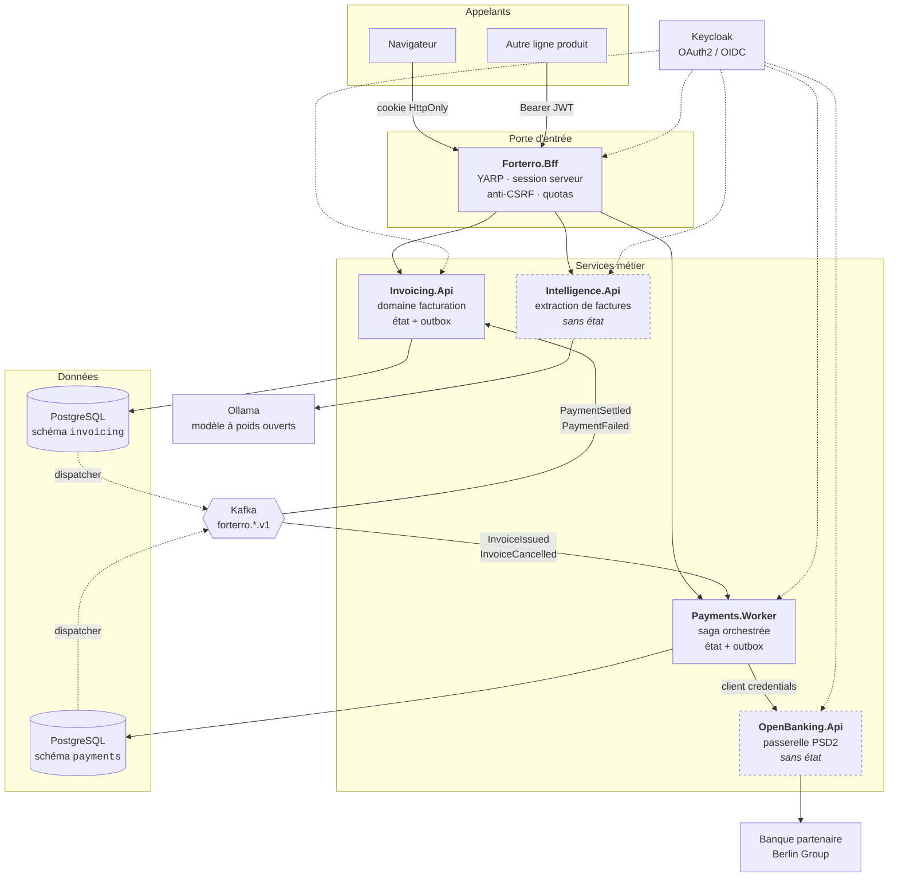
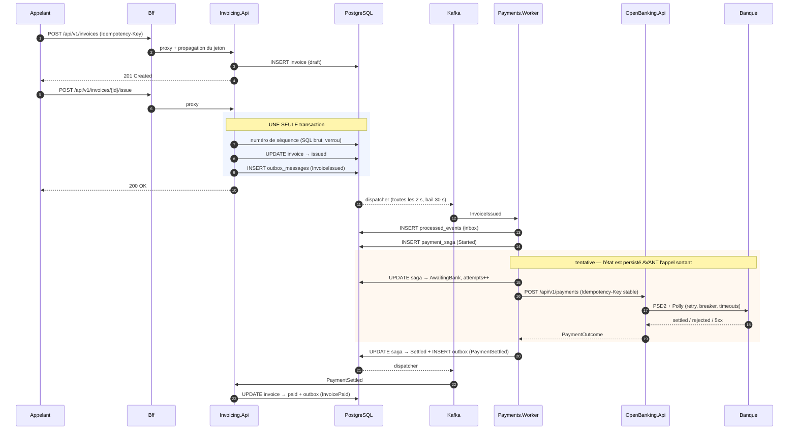
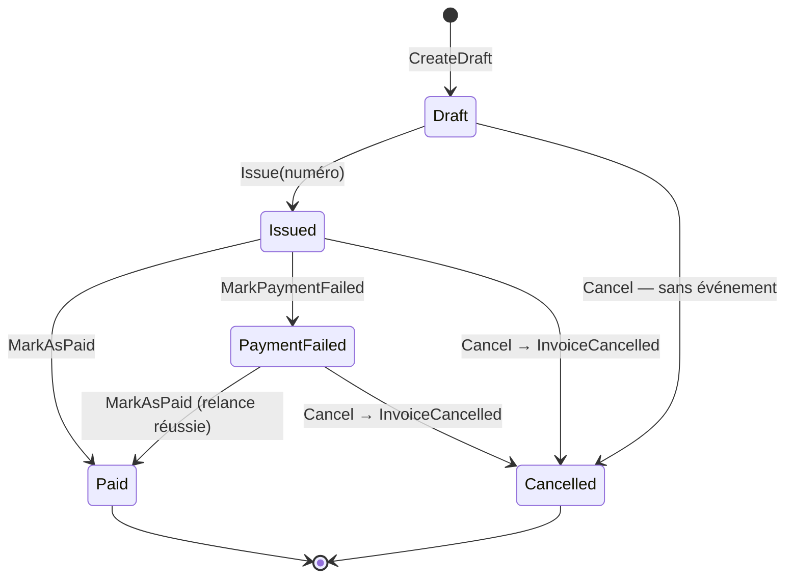
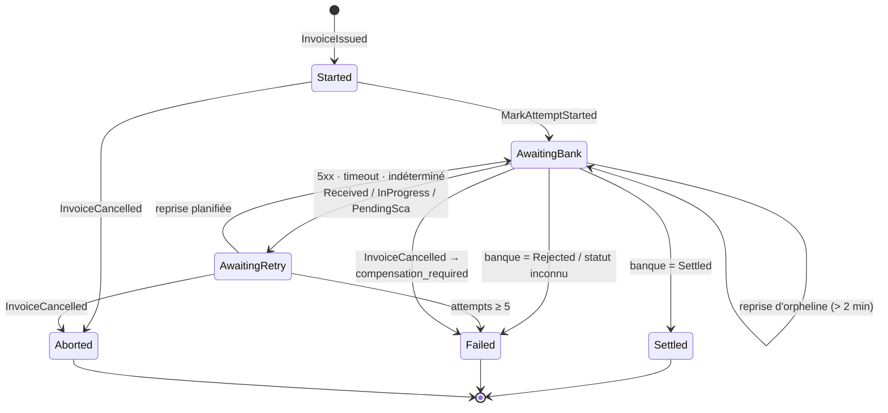
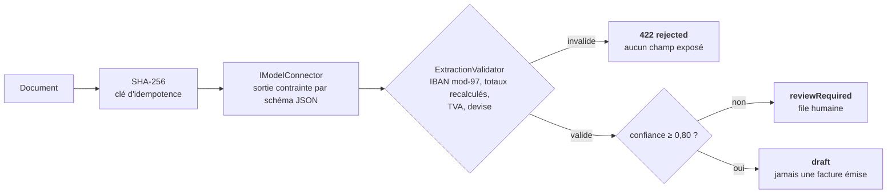

# Le système, en entier

**Portée** : ce document décrit la plateforme telle qu'elle est dans le dépôt — composants, flux, données, garanties, modes de défaillance. Il ne remplace pas les [ADR](adr/), qui expliquent *pourquoi* chaque choix a été fait ; il décrit *ce qui tourne*.

Quand une intention documentée n'est pas encore implémentée, c'est écrit noir sur blanc dans la section [Écarts assumés](#écarts-assumés).

---

## 1. Le processus métier

Un seul processus traverse tout le système, et toute l'architecture existe pour le rendre sûr :

> Une facture est émise → un virement est ordonné à la banque → la facture est mise à jour selon l'issue.

Trois choses peuvent mal tourner, et ce sont elles qui dictent la conception :

| Risque | Conséquence réelle | Ce qui le neutralise |
|---|---|---|
| L'événement est publié sans que la facture soit émise (ou l'inverse) | Un virement pour une facture qui n'existe pas | **Outbox transactionnelle** ([ADR 0001](adr/0001-pattern-outbox.md)) |
| Le même ordre part deux fois | **Double débit** — argent réellement perdu | Clé d'idempotence **stable**, unicité `invoice_id`, `xmin` |
| Un trou dans la numérotation des factures | Non-conformité légale | Séquence en SQL brut, verrou par `(vendeur, année)` |

Aucun de ces trois risques n'est cosmétique. C'est ce qui justifie le coût de l'architecture ci-dessous.

---

## 2. Carte du système



**Quatre services, deux bases.** `OpenBanking` et `Intelligence` sont **sans état** : ce sont des couches anti-corruption devant un tiers (une banque, un fournisseur de modèle). Ils ne possèdent aucune donnée, donc aucune base — voir [ADR 0003](adr/0003-base-par-service.md).

**Une seule instance PostgreSQL en local, deux schémas isolés.** L'isolation est logique, pas physique : aucun service ne lit le schéma d'un autre, aucune jointure ne traverse la frontière. C'est ce qui rend la séparation physique possible plus tard sans réécrire de code.

---

## 3. Le flux nominal, pas à pas



**Le point à retenir de ce diagramme** : entre l'étape 7 (écriture en base) et l'étape 10 (publication Kafka), il n'y a **aucune transaction distribuée**. La transaction SQL couvre l'état *et* l'intention de publier. Le dispatcher publie ensuite, en rejouant s'il le faut. On ne peut donc jamais annoncer un événement qui n'a pas eu lieu, ni perdre un événement qui a eu lieu.

---

## 4. Les garanties, et où elles vivent dans le code

### 4.1 Outbox — atomicité état ↔ événement

L'événement est écrit dans `outbox_messages` **dans la transaction métier**. Un dispatcher de fond le relaie vers Kafka.

| Réglage | Valeur | Fichier |
|---|---|---|
| Intervalle de scrutation | 2 s | [OutboxDispatcher.cs:14](../src/BuildingBlocks/Forterro.Outbox.EntityFrameworkCore/Outbox/OutboxDispatcher.cs#L14) |
| Taille de lot | 50 | idem |
| Durée du bail | 30 s | idem |
| Tentatives max | 10 | idem |
| Rétention après publication | 7 jours | idem |

**Concurrence entre réplicas** : un bail (`leased_until` + `leased_by`) protégé par un jeton `version`. Deux réplicas qui visent le même lot → l'un prend un `DbUpdateConcurrencyException` et repasse au tour suivant. Pas d'élection de leader à maintenir.

**Le `trace_parent` est capturé à l'écriture**, pas dans la boucle de fond ([OutboxDispatcher.cs:123-125](../src/BuildingBlocks/Forterro.Outbox.EntityFrameworkCore/Outbox/OutboxDispatcher.cs#L123-L125)). C'est ce qui relie la saga à l'appel HTTP d'origine dans Jaeger.

### 4.2 Inbox — déduplication à la consommation

Kafka garantit *au moins une fois*. Chaque consommateur enregistre `event_id` dans `processed_events` avant de traiter. Un événement relivré est ignoré.

**Cette protection a une durée de vie.** Au-delà de la rétention de l'inbox, la déduplication ne repose plus que sur les invariants métier — d'où l'index unique sur `invoice_id`.

### 4.3 Idempotence à trois niveaux

| Niveau | Clé | Portée |
|---|---|---|
| API entrante | En-tête `Idempotency-Key` + empreinte du corps → `idempotency_records` | Rejeu client |
| Message Kafka | `event_id` → `processed_events` | Relivraison broker |
| Appel bancaire | `payment-{sagaId:N}`, **dérivée du seul identifiant de saga** | Rejeu de tentative |

Le troisième est le plus important, et le plus contre-intuitif — voir [§6.2](#62-saga-de-paiement).

### 4.4 Concurrence optimiste par `xmin`

`invoices` et `payment_sagas` utilisent la colonne système PostgreSQL `xmin` comme jeton de concurrence. Aucune colonne applicative à maintenir, aucun trigger. C'est ce qui empêche deux réplicas du worker de faire avancer la même saga simultanément.

### 4.5 Numérotation sans trou

Table `invoice_sequences`, clé `(seller_vat_id, year)`, incrémentée en SQL brut sous verrou dans la transaction d'émission. Un `IDENTITY` PostgreSQL ne convient pas : il laisse des trous en cas de rollback, et la loi n'accepte pas les trous.

---

## 5. Modèle de données

### Schéma `invoicing`

| Table | Rôle | Points notables |
|---|---|---|
| `invoices` | Racine d'agrégat | `number` **nullable** (attribué à l'émission uniquement), `xmin`, index unique `ux_invoices_number`, `Party` vendeur/acheteur aplatis en colonnes |
| `invoice_lines` | Lignes | FK cascade, `quantity`/`unit_price` en `numeric(18,4)`, `vat_rate` en `numeric(5,4)` |
| `invoice_sequences` | Compteur légal | PK `(seller_vat_id, year)` |
| `idempotency_records` | Rejeu d'API | `request_fingerprint` — même clé + corps différent = refus |
| `outbox_messages` | Événements sortants | Index **partiel** `ix_outbox_pending … WHERE processed_at IS NULL` |
| `processed_events` | Inbox | PK `event_id` |

### Schéma `payments`

| Table | Rôle |
|---|---|
| `payment_sagas` | État de la saga — [détail ci-dessous](#62-saga-de-paiement) |
| `outbox_messages` | Identique à `invoicing` |
| `processed_events` | Identique à `invoicing` |

**Détail de `payments.payment_sagas`** ([mapping](../src/Services/Payments/Forterro.Payments.Worker/Infrastructure/PaymentsDbContext.cs#L29-L67)) :

```
identité      id (PK) · invoice_id (UNIQUE)
métier        invoice_number · amount(18,2) · currency · debtor_iban · payment_reference
état          state (texte) · attempts · next_attempt_at
résultat      bank_payment_id · bank_reference · failure_code · failure_reason
temps         created_at · updated_at · completed_at
concurrence   xmin (xid)

index         ux_payment_sagas_invoice  (invoice_id) UNIQUE
              ix_payment_sagas_due      (state, next_attempt_at)
```

L'index unique sur `invoice_id` **est** l'invariant anti-double-paiement : même si `InvoiceIssued` est relivré après expiration de la rétention de l'inbox, la seconde saga ne peut pas naître.

---

## 6. Les deux machines à états

### 6.1 Facture



Trois règles métier portées par le code, pas par la base :

- **`Issue` est irréversible** — on n'annule pas par retour en brouillon, on émet un avoir.
- **Une facture payée ne s'annule pas** : `Cancel` lève `InvalidStateTransitionException`.
- **`PaymentFailed` n'est pas un état terminal.** La facture reste due et peut être relancée. C'est une décision métier : un échec de paiement n'efface pas la créance.
- `MarkAsPaid` **refuse un montant différent du total** (`amount_mismatch`) — un encaissement partiel n'est pas un encaissement.

Source : [Invoice.cs](../src/Services/Invoicing/Forterro.Invoicing.Api/Domain/Invoice.cs)

### 6.2 Saga de paiement



**Quatre décisions non évidentes, et leurs raisons :**

**a) La clé d'idempotence est dérivée du *seul* identifiant de saga**, pas de la tentative. `payment-{sagaId:N}` est identique sur toutes les tentatives. Une clé par tentative paraît plus fine mais elle est dangereuse : si la première tentative a atteint la banque et que seule la *réponse* s'est perdue, la tentative suivante présenterait une clé inconnue — et la banque exécuterait un **second** virement. Une clé d'idempotence identifie l'opération voulue, pas l'essai en cours.

**b) `AwaitingBank` est un état de *départ* valide.** C'est ce qui permet de reprendre une saga dont le worker est mort pendant l'appel sortant. Sûr uniquement grâce à (a).

**c) Un statut bancaire intermédiaire consomme une tentative.** `Received`, `InProgress` et `PendingSca` ne sont pas des échecs, mais ils passent par `MarkRetryableFailure`. Conséquence : une saga bloquée en `PendingSca` finit en `Failed` après 5 passages, sans que la banque ait rien rejeté. C'est délibéré — une saga qui rejoue indéfiniment masque un incident au lieu de le signaler — mais c'est un comportement à connaître.

**d) L'annulation après transmission de l'ordre n'est pas automatisable.** Un virement SEPA exécuté ne s'annule pas unilatéralement. `TryAbort` bascule alors en `Failed` avec le code `compensation_required` et exige une intervention humaine. C'est la limite réelle du domaine, pas une lacune du code.

**Réglages** ([SagaOptions](../src/Services/Payments/Forterro.Payments.Worker/Application/PaymentSagaOrchestrator.cs#L13-L26), [SagaRetryService](../src/Services/Payments/Forterro.Payments.Worker/Application/SagaRetryService.cs)) :

| Paramètre | Valeur |
|---|---|
| Tentatives max | 5 |
| Délai de base | 30 s |
| Backoff | `base × 2^(n-1)`, plafonné à 30 min |
| Scrutation du planificateur | 10 s, par lots de 20 |
| Seuil « saga orpheline » | 2 min sans mise à jour en `AwaitingBank` |

**Pourquoi un planificateur est indispensable** : Kafka a déjà commité l'offset quand la saga échoue. L'événement ne reviendra **jamais**. Sans `SagaRetryService`, une saga tombée sur une banque indisponible resterait bloquée pour toujours. C'est le point le plus souvent oublié en passant à l'asynchrone — le broker ne rejoue pas la logique métier, il livre des messages.

---

## 7. Contrats d'intégration

**Topics** — la version est dans le nom. Une rupture de contrat crée un `.v2` que les consommateurs adoptent à leur rythme ; on ne modifie jamais un topic en production.

| Topic | Producteur |
|---|---|
| `forterro.invoicing.v1` | Invoicing.Api |
| `forterro.payments.v1` | Payments.Worker |
| `forterro.openbanking.v1` | *(déclaré, non utilisé)* |

**Événements** — le nom logique voyage dans l'en-tête `x-contract-name`, découplé du nom de classe .NET pour permettre le refactoring sans casser les consommateurs déployés.

| Contrat | Charge utile | Consommé par |
|---|---|---|
| `invoicing.invoice-issued.v1` | `InvoiceId`, `InvoiceNumber`, TVA vendeur/acheteur, `DebtorIban`, `TotalInclTax`, `Currency`, `DueDate`, `PaymentReference` | Payments.Worker |
| `invoicing.invoice-cancelled.v1` | `InvoiceId`, `InvoiceNumber`, `Reason` | Payments.Worker |
| `invoicing.invoice-paid.v1` | `InvoiceId`, `AmountPaid`, `PaidAt` | *(aucun — disponible pour la comptabilité)* |
| `payments.payment-settled.v1` | `PaymentId`, `InvoiceId`, `Amount`, `BankReference`, `SettledAt` | Invoicing.Api |
| `payments.payment-failed.v1` | `PaymentId`, `InvoiceId`, `FailureCode`, `Reason`, `IsRetryable` | Invoicing.Api |

**Tous les événements sont partitionnés sur `InvoiceId`**, y compris ceux de paiement. Conséquence : tous les événements d'une même facture arrivent dans l'ordre, sur la même partition. Partitionner `PaymentSettled` sur `PaymentId` aurait cassé cet ordre.

**Codes d'échec stables** — `insufficient_funds`, `invalid_iban`, `bank_unavailable`, `rejected_by_bank`, `timeout`, plus `compensation_required` et `indeterminate` produits par la saga. Les codes de rejet ISO 20022 (`AM04`, `AC01`, `AC04`, `MS03`) sont traduits vers cet ensemble par une table de correspondance — un ensemble fini et normalisé n'a pas besoin d'un modèle pour être trié.

---

## 8. Sécurité

### Deux publics, deux schémas d'authentification

| Public | Schéma | Menace traitée |
|---|---|---|
| Navigateur | Cookie `HttpOnly` + session serveur, Authorization Code + PKCE | Vol de jeton par XSS — aucun jeton n'atteint le JavaScript |
| Machine (ligne produit) | Bearer JWT propagé tel quel | — |

Le BFF sélectionne le schéma par requête. Une écriture par cookie exige l'en-tête `X-Forterro-Csrf` ; un appel machine par jeton porteur n'a pas à en fournir — un jeton porteur n'est pas envoyé automatiquement par le navigateur, l'exigence serait du bruit.

### Scopes

Un scope par couple ressource/verbe, jamais par cas d'usage ([ADR 0005](adr/0005-autorisation-par-scopes.md)) :

| Scope | Protège |
|---|---|
| `invoicing:read` / `invoicing:write` | `/api/v1/invoices` |
| `payments:read` | `/api/v1/payment-sagas` |
| `payments:write` | `/api/v1/payments` (Open Banking) |
| `accounts:read` | `/api/v1/accounts/{iban}/balance` |
| `documents:extract` | `/api/v1/extractions` |

Le cloisonnement est réel et vérifiable : un jeton `payments-worker` reçoit un **403** sur les factures. L'agrégation `/bff/invoices/{id}/overview` le dit explicitement (`paymentAvailability: forbidden`) au lieu d'échouer.

### Surface exposée

En production, **seul le BFF est exposé**. Les ports 5001-5004 du `docker-compose` n'existent que pour observer les services individuellement.

---

## 9. Résilience et modes de défaillance

### Pipeline sortant vers la banque

Ordre voulu, du plus externe au plus interne ([ResilienceExtensions.cs](../src/BuildingBlocks/Forterro.BuildingBlocks/Resilience/ResilienceExtensions.cs)) :

```
timeout global 30 s → retry ×3 (exponentiel + jitter, base 300 ms)
                    → circuit breaker (50 % sur 30 s, min. 10 appels, ouvert 15 s)
                    → timeout par tentative 8 s
```

Le retry est **à l'intérieur** du breaker. Placé à l'extérieur, il rejouerait sur un circuit ouvert : on ferait tomber le partenaire au lieu de le laisser respirer.

Le retry ne cible que les erreurs de transport et les 5xx — et **uniquement** parce que le client envoie systématiquement une clé d'idempotence. Sans elle, rejouer un POST d'initiation de paiement serait un double débit.

### Que se passe-t-il si…

| Panne | Comportement observé | Perte de données ? |
|---|---|---|
| Kafka tombe | Les événements s'accumulent dans l'outbox, le dispatcher rejoue | Non |
| Le worker meurt pendant l'appel bancaire | Saga figée en `AwaitingBank` ; reprise après 2 min par le planificateur, clé d'idempotence inchangée | Non |
| La banque renvoie 503 | `AwaitingRetry` + backoff, jusqu'à 5 tentatives puis `Failed` visible | Non |
| Réponse bancaire perdue (timeout, coupure) | Traité comme `indeterminate` → rejouable, la banque rejouera sa réponse | Non — **grâce à la clé stable** |
| Deux réplicas visent la même saga | `DbUpdateConcurrencyException` sur `xmin`, l'un des deux passe son tour | Non |
| PostgreSQL tombe | Refus en écriture, aucune publication | Non |
| Payments.Worker est arrêté longtemps | Kafka conserve, la consommation reprend à l'offset | Non |
| La facture est annulée après envoi de l'ordre | `Failed` / `compensation_required` — **intervention humaine requise** | Non, mais action manuelle |
| Le dispatcher échoue 10 fois sur un message | Le message reste en base avec `last_error`, plus rejoué | Non, mais **traitement manuel** |

Le dernier cas est le seul angle mort opérationnel : rien n'alerte automatiquement sur un message d'outbox épuisé.

---

## 10. Observabilité

- **Traces** — OpenTelemetry → Jaeger. Un seul `traceId` couvre l'appel HTTP, l'écriture outbox, la publication Kafka, la saga et l'appel bancaire, grâce au `trace_parent` persisté avec le message.
- **Logs** — structurés, expédiés par Filebeat vers Elasticsearch, consultables dans Kibana, **corrélés par `trace.id`** ([ADR 0007](adr/0007-logs-centralises-elk.md)).
- **Métriques** — `Telemetry.BusinessEvents` (compteur par contrat et par issue) et `Telemetry.ExternalCallDuration` (par cible).
- **Conventions GenAI** — le service Intelligence émet `gen_ai.request.model` et `gen_ai.response.confidence` sur les mêmes canaux. Aucune infrastructure supplémentaire.

Les données sensibles ne sortent pas : les IBAN sont masqués (`Iban.Mask`) dans les logs comme dans les réponses de suivi.

---

## 11. Le service Intelligence

Quatrième service, sans état, **couche anti-corruption devant les fournisseurs de modèles** — exactement le rôle qu'`OpenBanking.Api` tient devant les banques. Voir [ADR 0008](adr/0008-extraction-de-factures-par-modele.md).

```
POST /api/v1/extractions/invoices     scope documents:extract
  multipart/form-data → 200 draft | 200 reviewRequired | 422 rejected
```

**La chaîne de décision, dans cet ordre — et l'ordre est le sujet :**



1. **Le modèle propose, le domaine dispose.** La sortie est traitée comme une entrée non fiable, au même titre qu'un formulaire : IBAN revalidé au modulo 97, totaux **recalculés** depuis les lignes, jamais repris du modèle.
2. **La validation peut rejeter une extraction annoncée à 0,95.** C'est le cas central du service.
3. **La confiance ne sert qu'à router, jamais à autoriser.** Le seuil de 0,80 est un point de départ prudent, pas une valeur mesurée — il se calibre sur un corpus annoté qui n'existe pas encore.
4. **Le service ne produit jamais qu'un brouillon.** L'émission reste un acte humain, comme la compensation d'un virement exécuté.
5. **Un rejet est un 422, pas un 500.** Le service a parfaitement fonctionné ; c'est la proposition qui est mauvaise. Un 500 déclencherait des reprises inutiles sur un document qui échouera toujours.

**Connecteurs** : `SimulatedModelConnector` (déterministe, par défaut, **la CI n'appelle jamais un vrai modèle**) et `OllamaModelConnector` (modèle à poids ouverts auto-hébergé, inactif tant qu'aucun modèle n'est configuré). Le choix de l'auto-hébergement supprime la sortie de données — une facture porte une raison sociale, un IBAN et des montants — au prix d'un GPU.

---

## 12. Déploiement

### Local — `docker compose -f deploy/docker-compose.yml up --build`

| Composant | URL |
|---|---|
| **BFF — porte d'entrée** | http://localhost:5000 |
| Invoicing API | http://localhost:5001/swagger |
| Open Banking API | http://localhost:5002/swagger |
| Payments Worker | http://localhost:5003/health/ready |
| Intelligence API | http://localhost:5004/swagger |
| Keycloak | http://localhost:8080 — `admin` / `admin` |
| Jaeger | http://localhost:16686 |
| Kibana | http://localhost:5601 |
| Elasticsearch | http://localhost:9200 |
| Ollama | http://localhost:11434 |
| PostgreSQL / Kafka | `5432` / `9092` |

### Kubernetes — Kustomize + ArgoCD

`deploy/k8s/base/` porte les 5 déploiements, l'Ingress (cert-manager), le Job de migration, probes, PDB, HPA et NetworkPolicy. Deux overlays : `local` (embarque l'infra) et `production`.

**Les secrets ne sont pas dans Git** — External Secrets Operator ou Sealed Secrets. La ConfigMap générée laisse `ollama-model` **vide** volontairement : sans modèle provisionné, le service sert le simulateur au lieu d'échouer au démarrage.

### Simulateur bancaire — scénarios reproductibles

Tous ces IBAN sont valides au modulo 97 : ils testent les chemins d'échec **métier**, pas la validation de format.

| IBAN débiteur | Comportement |
|---|---|
| `FR7630006000011234567890189` | Virement exécuté → facture `paid` |
| `FR7630004000031234567890143` | Provision insuffisante (`AM04`) → rejet définitif, facture `paymentFailed` |
| `FR1420041010050500013M02606` | Banque indisponible (503) → la saga replanifie avec backoff |

---

## 13. Tests

Cinq projets. `dotnet test` à la racine.

| Projet | Couvre |
|---|---|
| `Forterro.Invoicing.Tests` | Domaine facture + intégration API sur un **vrai PostgreSQL** (Testcontainers) |
| `Forterro.Payments.Tests` | Machine à états de la saga + orchestrateur |
| `Forterro.Bff.Tests` | Anti-CSRF, sélection de schéma, quotas, agrégation dégradée |
| `Forterro.BuildingBlocks.Tests` | IBAN mod-97, sécurité |
| `Forterro.Intelligence.Tests` | Validation métier de l'extraction, routage par confiance |

**Pas de provider InMemory** pour les tests d'intégration : il ne connaît ni les transactions, ni les contraintes d'unicité, ni `xmin` — c'est-à-dire précisément ce que ce système fait reposer sur la base.

Ce que les tests verrouillent réellement :

- `InvoiceIssued` atterrit dans l'outbox **dans la même transaction** que le changement d'état ;
- une clé d'idempotence rejouée renvoie la première réponse ; réutilisée avec un corps différent, elle est refusée ;
- la numérotation est **continue, sans trou** ;
- une tentative rejouée **conserve** sa clé d'idempotence bancaire ;
- une saga ne rejoue pas indéfiniment : au-delà du plafond, elle échoue visiblement ;
- une annulation après transmission de l'ordre exige une intervention — et le dit ;
- une écriture par cookie sans en-tête anti-CSRF est refusée, alors qu'un appel machine par jeton n'a pas à en fournir ;
- un `returnUrl` hors du site est ignoré ;
- l'agrégation reste exploitable quand le service de paiement est en panne ou hors des droits de l'appelant ;
- le validateur d'extraction rejette une proposition invalide **quelle que soit** la confiance annoncée.

---

## 14. Écarts assumés

Ce qui est documenté mais **pas** dans le code :

- **L'extraction est synchrone.** L'[ADR 0008](adr/0008-extraction-de-factures-par-modele.md) décrit un `202` avec traitement en tâche de fond et publication du résultat via l'outbox ; l'endpoint implémenté répond `200` en ligne ([ExtractionEndpoints.cs:29-35](../src/Services/Intelligence/Forterro.Intelligence.Api/Endpoints/ExtractionEndpoints.cs#L29-L35)). Acceptable avec le simulateur, intenable avec une inférence réelle.
- **Le pipeline de résilience de l'Intelligence n'existe pas.** `AddBankingResilience` impose 8 s par tentative : calibré pour une API bancaire, fatal pour une inférence. Le réutiliser tuerait chaque appel avec un symptôme ressemblant à une panne de modèle.
- **L'idempotence par empreinte de document n'est pas persistée.** Le hash SHA-256 est calculé et journalisé, mais aucun cache ne l'exploite : le même PDF soumis deux fois déclenche deux inférences.
- **Aucune alerte sur un message d'outbox épuisé** après 10 tentatives.

Ce qui est hors périmètre par décision :

- **Pas de schema registry** (Avro/Protobuf). Contrats JSON à nom logique versionné.
- **La compensation d'un virement exécuté n'est pas automatique** — réalité du domaine, pas lacune du code.
- **La banque est simulée.** Le connecteur HTTP suit le dialecte Berlin Group, mais rien de réel n'est branché.
- **Facturation électronique** : modèle aligné EN 16931, mais ni Factur-X ni Peppol.
- **Aucun frontal.** Le chemin navigateur du BFF est complet et testé, mais rien ne le consomme.
- **Le BFF exige Redis en production** (sessions + clés de protection des données). En développement il se rabat sur la mémoire, ce qui ne tient pas au-delà d'un process.
- **Pas de back-channel logout**, et **rafraîchissement concurrent non verrouillé** (sans risque au réglage Keycloak par défaut ; la rotation des refresh tokens exigerait un verrou distribué).

---

## 15. Index des décisions

| ADR | Décision |
|---|---|
| [0001](adr/0001-pattern-outbox.md) | Pattern Outbox plutôt que publication directe |
| [0002](adr/0002-saga-orchestree.md) | Saga orchestrée plutôt que chorégraphiée |
| [0003](adr/0003-base-par-service.md) | Une base de données par service |
| [0004](adr/0004-contrats-partages.md) | Contrats partagés dans un paquet versionné |
| [0005](adr/0005-autorisation-par-scopes.md) | Autorisation par scopes OAuth 2.0 |
| [0006](adr/0006-bff-porte-d-entree.md) | Un BFF comme porte d'entrée, deux schémas d'authentification |
| [0007](adr/0007-logs-centralises-elk.md) | Logs centralisés dans Elastic, corrélés par trace |
| [0008](adr/0008-extraction-de-factures-par-modele.md) | Extraction de factures par modèle, derrière une couche anti-corruption |
